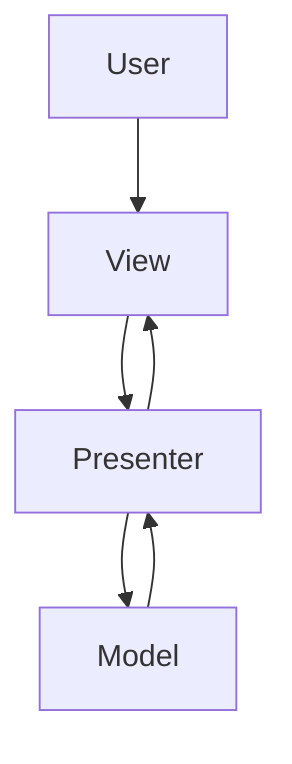

## 12.5 Model-View-Presenter (MVP) in Clojure

The Model-View-Presenter (MVP) pattern is a derivative of the Model-View-Controller (MVC) pattern, designed to separate concerns in a way that enhances testability and maintainability. In MVP, the **Presenter** acts as an intermediary between the **View** and the **Model**, handling all the presentation logic. This separation allows the View to remain passive, focusing solely on rendering the UI and delegating user interactions to the Presenter.

### Introduction to MVP

In the MVP pattern, the View is responsible for displaying data and capturing user input, but it does not contain any logic for processing this input. Instead, the Presenter takes on this responsibility, interacting with the Model to fetch or update data and then updating the View accordingly. This clear separation of concerns makes the MVP pattern particularly suitable for applications where testability and maintainability are priorities.

### Detailed Explanation

#### Components of MVP

1. **Model**: Represents the data and business logic of the application. It is responsible for retrieving, storing, and manipulating data.
2. **View**: Displays data to the user and captures user input. It is passive and does not contain any business logic.
3. **Presenter**: Acts as a mediator between the View and the Model. It retrieves data from the Model and formats it for display in the View. It also handles user input and updates the Model accordingly.

#### Workflow

The workflow in an MVP architecture can be summarized as follows:

- The View captures user input and delegates it to the Presenter.
- The Presenter processes the input, interacts with the Model, and updates the View with the results.
- The Model performs data operations and notifies the Presenter of any changes.

### Visual Representation

Below is a conceptual diagram illustrating the interaction between the components in the MVP pattern:



### Implementing MVP in Clojure

Let's walk through a practical implementation of the MVP pattern in Clojure, focusing on a simple item management application.

#### Define the View Interface

First, we define a protocol for the View, specifying the methods that any concrete View implementation must provide.

```clojure
;; src/myapp/view.clj
(ns myapp.view)

(defprotocol ItemView
  (display-items [this items])
  (on-add-item [this handler]))
```

#### Implement the View

Next, we implement the View using a record. This View will handle displaying items and setting up an event listener for adding new items.

```clojure
;; src/myapp/views/item_view.clj
(ns myapp.views.item-view
  (:require [myapp.view :refer [ItemView]]
            [ring.util.response :refer [response]]))

(defrecord ItemViewImpl [request]
  ItemView
  (display-items [this items]
    ;; Generate HTML or API response
    )
  (on-add-item [this handler]
    ;; Setup event listener for adding items
    ))
```

#### Create the Presenter

The Presenter is responsible for fetching items from the Model and updating the View. It also handles user actions such as adding new items.

```clojure
;; src/myapp/presenter.clj
(ns myapp.presenter
  (:require [myapp.model :as model]
            [myapp.view :refer [ItemView]]))

(defn item-presenter [view]
  (let [items (model/get-items)]
    (display-items view items)
    (on-add-item view (fn [item]
                        (model/add-item item)
                        (display-items view (model/get-items))))))
```

#### Compose the Components

We then compose the components in a controller function, which initializes the View and Presenter.

```clojure
;; src/myapp/controller.clj
(ns myapp.controller
  (:require [myapp.views.item-view :refer [->ItemViewImpl]]
            [myapp.presenter :refer [item-presenter]]))

(defn show-items [request]
  (let [view (->ItemViewImpl request)]
    (item-presenter view)))
```

#### Set Up Routes for the Presenter

Finally, we define routes to handle HTTP requests, using the Compojure library to map requests to the appropriate controller functions.

```clojure
;; src/myapp/routes.clj
(ns myapp.routes
  (:require [compojure.core :refer [defroutes GET]]
            [myapp.controller :refer [show-items]]))

(defroutes app-routes
  (GET "/items" request (show-items request)))
```

### Use Cases

The MVP pattern is particularly beneficial in scenarios where:

- **Testability**: The separation of concerns allows for easier unit testing of the Presenter and Model.
- **Complex UI Logic**: The Presenter can handle complex UI logic without cluttering the View.
- **Multiple Views**: The same Presenter logic can be reused across different Views, promoting code reuse.

### Advantages and Disadvantages

#### Advantages

- **Separation of Concerns**: Clearly separates UI logic from business logic.
- **Testability**: Facilitates unit testing of the Presenter and Model.
- **Reusability**: Presenter logic can be reused across different Views.

#### Disadvantages

- **Complexity**: Introduces additional layers, which may increase complexity for simple applications.
- **Overhead**: May require more boilerplate code compared to simpler patterns.

### Best Practices

- **Keep Views Passive**: Ensure that Views do not contain any business logic.
- **Use Dependency Injection**: Inject dependencies into the Presenter to enhance testability.
- **Leverage Protocols**: Use Clojure protocols to define interfaces for Views and Models.

### Comparisons

Compared to MVC, MVP offers a more testable and maintainable architecture by decoupling the View from the Controller (Presenter in MVP). This makes it easier to test UI logic independently of the View.

### Conclusion

The Model-View-Presenter pattern provides a robust framework for building maintainable and testable applications in Clojure. By separating concerns and delegating responsibilities appropriately, MVP enhances the scalability and flexibility of your codebase. As you explore MVP, consider how its principles can be applied to improve the architecture of your own projects.

## Quiz Time!



### What is the primary role of the Presenter in the MVP pattern?

- [x] To mediate between the View and the Model
- [ ] To handle data storage and retrieval
- [ ] To render the user interface
- [ ] To capture user input directly

> **Explanation:** The Presenter acts as a mediator between the View and the Model, handling UI logic and updating the View.

### In MVP, what is the responsibility of the View?

- [ ] To contain business logic
- [x] To display data and capture user input
- [ ] To manage data persistence
- [ ] To update the Model directly

> **Explanation:** The View is responsible for displaying data and capturing user input, delegating logic to the Presenter.

### How does MVP improve testability?

- [x] By separating UI logic from business logic
- [ ] By combining the View and Model
- [ ] By using a single class for all logic
- [ ] By eliminating the need for a Model

> **Explanation:** MVP separates concerns, allowing for independent testing of UI logic and business logic.

### Which component in MVP handles user actions?

- [ ] Model
- [x] Presenter
- [ ] View
- [ ] Controller

> **Explanation:** The Presenter handles user actions, processes them, and updates the View accordingly.

### What is a disadvantage of the MVP pattern?

- [ ] It simplifies code structure
- [x] It can introduce additional complexity
- [ ] It eliminates the need for a Model
- [ ] It reduces testability

> **Explanation:** MVP can introduce additional complexity due to the separation of concerns and additional layers.

### In Clojure, how can you define a View interface?

- [ ] Using a class
- [x] Using a protocol
- [ ] Using a macro
- [ ] Using a function

> **Explanation:** In Clojure, protocols are used to define interfaces for components like Views.

### What is a key benefit of using MVP over MVC?

- [x] Enhanced testability
- [ ] Simpler architecture
- [ ] Fewer components
- [ ] Direct interaction between View and Model

> **Explanation:** MVP enhances testability by decoupling the View from the Presenter, unlike MVC where the Controller can be tightly coupled with the View.

### How does the Presenter update the View?

- [ ] By directly modifying the View's state
- [x] By calling methods on the View interface
- [ ] By sending events to the Model
- [ ] By rendering HTML directly

> **Explanation:** The Presenter updates the View by calling methods defined in the View interface.

### What is the role of the Model in MVP?

- [ ] To render the UI
- [ ] To capture user input
- [x] To manage data and business logic
- [ ] To mediate between View and Presenter

> **Explanation:** The Model manages data and business logic, providing data to the Presenter as needed.

### True or False: In MVP, the View should contain business logic.

- [ ] True
- [x] False

> **Explanation:** False. In MVP, the View should remain passive and not contain any business logic.


