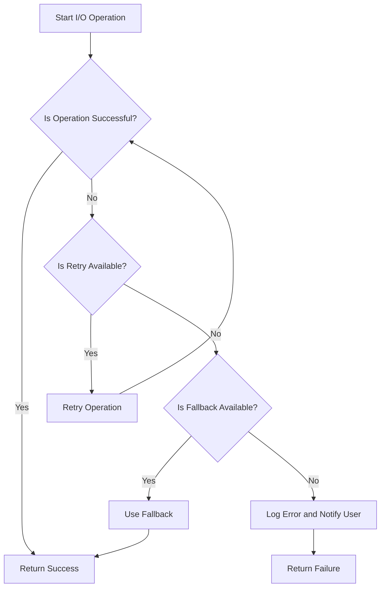

## 12.5. Patterns for Handling I/O Errors

In the realm of software development, handling I/O (Input/Output) errors is crucial for building robust and resilient applications. This section delves into the patterns and best practices for managing I/O errors in Clojure, ensuring that your applications can gracefully handle unexpected situations and provide a seamless user experience.

### Understanding Common I/O Errors

I/O operations are inherently prone to errors due to their dependence on external systems and resources. Common I/O errors include:

- **Network Failures**: These occur due to connectivity issues, such as server downtime or network congestion.
- **File System Errors**: These arise from issues like missing files, permission errors, or disk space limitations.
- **Timeouts**: These happen when an operation takes longer than expected, often due to slow network responses or overloaded servers.
- **Data Corruption**: This can occur during data transfer or storage, leading to incomplete or incorrect data.

Understanding these errors is the first step in developing strategies to handle them effectively.

### Techniques for Detecting and Handling I/O Errors

Detecting and handling I/O errors involves several strategies that can be implemented in Clojure to ensure robustness:

#### 1. Exception Handling

Clojure provides mechanisms for handling exceptions, which are essential for managing I/O errors. Use `try`, `catch`, and `finally` blocks to handle exceptions gracefully.

```clojure
(try
  ;; Attempt to perform an I/O operation
  (perform-io-operation)
  (catch Exception e
    ;; Handle the exception
    (println "An error occurred:" (.getMessage e)))
  (finally
    ;; Cleanup resources
    (println "Operation completed")))
```

#### 2. Validating Inputs and Outputs

Before performing I/O operations, validate inputs to ensure they meet expected criteria. Similarly, validate outputs to confirm they are as expected.

```clojure
(defn validate-input [input]
  (when-not (valid? input)
    (throw (ex-info "Invalid input" {:input input}))))

(defn validate-output [output]
  (when-not (valid? output)
    (throw (ex-info "Invalid output" {:output output}))))
```

#### 3. Implementing Retries

Retries are a common pattern for handling transient I/O errors. Use a retry mechanism to attempt the operation multiple times before failing.

```clojure
(defn retry [n f]
  (loop [attempts n]
    (try
      (f)
      (catch Exception e
        (if (pos? attempts)
          (do
            (println "Retrying due to error:" (.getMessage e))
            (recur (dec attempts)))
          (throw e))))))

(retry 3 perform-io-operation)
```

#### 4. Setting Timeouts

Timeouts prevent operations from hanging indefinitely. Use Clojure's `future` and `deref` with a timeout to manage long-running operations.

```clojure
(defn perform-with-timeout [f timeout-ms]
  (let [result (future (f))]
    (deref result timeout-ms :timeout)))

(let [result (perform-with-timeout perform-io-operation 5000)]
  (if (= result :timeout)
    (println "Operation timed out")
    (println "Operation succeeded with result:" result)))
```

#### 5. Fallback Strategies

Implement fallback strategies to provide alternative solutions when an I/O operation fails. This could involve using cached data or a backup service.

```clojure
(defn perform-with-fallback [primary secondary]
  (try
    (primary)
    (catch Exception e
      (println "Primary operation failed, using fallback")
      (secondary))))

(perform-with-fallback perform-io-operation fallback-operation)
```

### Importance of Logging and Monitoring

Logging and monitoring are critical for diagnosing and resolving I/O errors. They provide insights into the application's behavior and help identify patterns or recurring issues.

#### Logging

Use logging to record error details, including timestamps, error messages, and stack traces. Clojure's `clojure.tools.logging` library is a useful tool for this purpose.

```clojure
(require '[clojure.tools.logging :as log])

(log/info "Starting I/O operation")
(log/error e "I/O operation failed")
```

#### Monitoring

Implement monitoring to track application performance and detect anomalies. Tools like Prometheus and Grafana can be integrated with Clojure applications for real-time monitoring.

### User Experience Considerations

Handling I/O errors gracefully is essential for maintaining a positive user experience. Consider the following:

- **User Feedback**: Provide clear and informative messages to users when errors occur.
- **Retry Notifications**: Inform users when an operation is being retried.
- **Fallback Transparency**: Let users know when a fallback solution is being used.

### Visualizing I/O Error Handling Patterns

To better understand the flow of handling I/O errors, let's visualize the process using a flowchart.



This flowchart illustrates the decision-making process involved in handling I/O errors, including retries and fallbacks.

### Try It Yourself

Experiment with the provided code examples by modifying the number of retries, changing timeout durations, or implementing custom fallback strategies. This hands-on approach will deepen your understanding of I/O error handling in Clojure.

### References and Further Reading

- [Clojure Exception Handling](https://clojure.org/reference/reader#_exception_handling)
- [Clojure Tools Logging](https://github.com/clojure/tools.logging)
- [Prometheus Monitoring](https://prometheus.io/)
- [Grafana Visualization](https://grafana.com/)

### Knowledge Check

To reinforce your understanding, consider the following questions:

1. What are common causes of I/O errors in software applications?
2. How can retries help in handling transient I/O errors?
3. Why is logging important in error handling?
4. What role does user feedback play in managing I/O errors?
5. How can timeouts prevent operations from hanging indefinitely?

### Embrace the Journey

Remember, mastering I/O error handling is a journey. As you continue to develop your skills, you'll build more resilient and user-friendly applications. Keep experimenting, stay curious, and enjoy the process!

## **Ready to Test Your Knowledge?**



### What is a common cause of I/O errors?

- [x] Network Failures
- [ ] Syntax Errors
- [ ] Compilation Errors
- [ ] Logic Errors

> **Explanation:** Network failures are a common cause of I/O errors due to connectivity issues.

### How can retries help in handling I/O errors?

- [x] By attempting the operation multiple times
- [ ] By logging the error
- [ ] By ignoring the error
- [ ] By terminating the program

> **Explanation:** Retries attempt the operation multiple times, which can help overcome transient errors.

### Why is logging important in error handling?

- [x] It provides insights into application behavior
- [ ] It increases application speed
- [ ] It reduces memory usage
- [ ] It simplifies code

> **Explanation:** Logging provides insights into application behavior and helps diagnose issues.

### What role does user feedback play in managing I/O errors?

- [x] It informs users about the error and actions taken
- [ ] It speeds up error resolution
- [ ] It prevents errors from occurring
- [ ] It reduces code complexity

> **Explanation:** User feedback informs users about the error and any actions taken, improving user experience.

### How can timeouts prevent operations from hanging indefinitely?

- [x] By setting a maximum duration for operations
- [ ] By logging errors
- [ ] By retrying operations
- [ ] By ignoring errors

> **Explanation:** Timeouts set a maximum duration for operations, preventing them from hanging indefinitely.

### What is a fallback strategy?

- [x] An alternative solution when an operation fails
- [ ] A method to increase retries
- [ ] A way to log errors
- [ ] A technique to speed up operations

> **Explanation:** A fallback strategy provides an alternative solution when an operation fails.

### Which library is useful for logging in Clojure?

- [x] clojure.tools.logging
- [ ] clojure.core.async
- [ ] clojure.spec
- [ ] clojure.java.io

> **Explanation:** `clojure.tools.logging` is a library used for logging in Clojure.

### What is the purpose of monitoring in error handling?

- [x] To track application performance and detect anomalies
- [ ] To increase application speed
- [ ] To reduce memory usage
- [ ] To simplify code

> **Explanation:** Monitoring tracks application performance and detects anomalies, aiding in error handling.

### What is an example of a user experience consideration in error handling?

- [x] Providing clear error messages
- [ ] Increasing application speed
- [ ] Reducing memory usage
- [ ] Simplifying code

> **Explanation:** Providing clear error messages is a user experience consideration in error handling.

### True or False: Fallback strategies should be transparent to users.

- [x] True
- [ ] False

> **Explanation:** Fallback strategies should be transparent to users to maintain trust and clarity.




