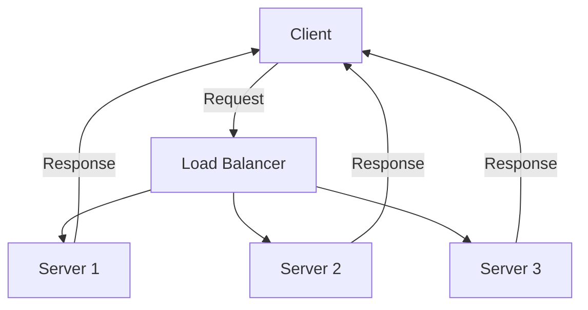

## 12.6. High-Performance Networking

In the realm of modern software development, high-performance networking is crucial for building applications that can efficiently handle numerous concurrent connections. Clojure, with its functional programming paradigm and seamless Java interoperability, offers powerful tools and libraries to achieve this. In this section, we will delve into the techniques and patterns for building high-performance networking applications in Clojure, focusing on non-blocking I/O, event-driven architectures, and scalability strategies.

### Understanding Non-Blocking I/O

Non-blocking I/O is a paradigm that allows a program to initiate an I/O operation and continue executing other tasks while waiting for the operation to complete. This is particularly useful in networking applications where waiting for data from a network socket can lead to inefficiencies and bottlenecks.

#### Key Concepts of Non-Blocking I/O

- **Asynchronous Operations**: Operations that do not block the execution thread. Instead, they use callbacks or promises to handle the completion of tasks.
- **Event Loop**: A programming construct that waits for and dispatches events or messages in a program.
- **Reactor Pattern**: A design pattern used to handle service requests delivered concurrently to a service handler by one or more inputs.

### Event-Driven Architectures

Event-driven architectures are a natural fit for non-blocking I/O. They allow applications to respond to events or messages as they occur, rather than polling for changes or updates.

#### Benefits of Event-Driven Architectures

- **Scalability**: Easily handle a large number of concurrent connections.
- **Responsiveness**: Improve application responsiveness by processing events as they arrive.
- **Resource Efficiency**: Reduce resource consumption by avoiding idle waiting.

### Using Netty via Aleph

Netty is a popular Java-based framework for building high-performance networking applications. Aleph is a Clojure library that provides a simple, idiomatic interface to Netty, making it easier to build non-blocking, event-driven applications.

#### Setting Up Aleph

To use Aleph in your Clojure project, add the following dependency to your `project.clj` or `deps.edn` file:

```clojure
;; Leiningen
[aleph "0.4.7"]

;; Deps.edn
{:deps {aleph {:mvn/version "0.4.7"}}}
```

#### Building a Simple HTTP Server with Aleph

Let's build a simple HTTP server using Aleph to demonstrate non-blocking I/O and event-driven architecture.

```clojure
(ns myapp.core
  (:require [aleph.http :as http]
            [manifold.stream :as s]
            [clojure.core.async :as async]))

(defn handler [request]
  ;; Respond with a simple "Hello, World!" message
  {:status 200
   :headers {"Content-Type" "text/plain"}
   :body "Hello, World!"})

(defn start-server []
  (http/start-server handler {:port 8080}))

;; Start the server
(defonce server (start-server))
```

In this example, we define a simple HTTP server that responds with "Hello, World!" to any request. The server is non-blocking and can handle multiple connections concurrently.

### Efficient Data Handling

Efficient data handling is critical in high-performance networking applications. This involves minimizing data copying, using efficient data structures, and optimizing serialization and deserialization processes.

#### Tips for Efficient Data Handling

- **Use Byte Buffers**: Minimize data copying by using direct byte buffers.
- **Optimize Serialization**: Use efficient serialization libraries like Fressian or MessagePack.
- **Batch Processing**: Process data in batches to reduce overhead.

### Scalability Strategies

Scalability is the ability of a system to handle increased load by adding resources. In networking applications, this often involves distributing load across multiple servers or processes.

#### Load Balancing

Load balancing is a technique used to distribute incoming network traffic across multiple servers. This ensures that no single server becomes a bottleneck, improving performance and reliability.

##### Types of Load Balancing

- **Round Robin**: Distributes requests evenly across all servers.
- **Least Connections**: Directs traffic to the server with the fewest active connections.
- **IP Hash**: Routes requests based on the client's IP address.

#### Horizontal Scaling

Horizontal scaling involves adding more servers to handle increased load. This is often more cost-effective than vertical scaling, which involves upgrading existing servers.

### Performance Testing and Optimization

Performance testing is essential to ensure that your networking application can handle the expected load. This involves simulating real-world usage scenarios and measuring key performance metrics.

#### Key Performance Metrics

- **Throughput**: The number of requests processed per second.
- **Latency**: The time taken to process a request.
- **Resource Utilization**: CPU, memory, and network usage.

#### Tools for Performance Testing

- **Apache JMeter**: A popular tool for load testing and measuring performance.
- **Gatling**: A powerful tool for simulating high loads and analyzing performance.

### Try It Yourself

Experiment with the provided code examples by modifying the server response or adding new routes. Try implementing a simple load balancer using Aleph and measure its performance under different loads.

### Visualizing High-Performance Networking

To better understand the flow of data and events in a high-performance networking application, let's visualize the architecture using a Mermaid.js diagram.



This diagram illustrates a simple load-balanced architecture where incoming requests are distributed across multiple servers.

### References and Further Reading

- [Netty Documentation](https://netty.io/wiki/)
- [Aleph GitHub Repository](https://github.com/clj-commons/aleph)
- [Apache JMeter](https://jmeter.apache.org/)
- [Gatling](https://gatling.io/)

### Knowledge Check

To reinforce your understanding of high-performance networking in Clojure, try answering the following questions.

## **Ready to Test Your Knowledge?**



### What is non-blocking I/O?

- [x] A paradigm that allows a program to initiate an I/O operation and continue executing other tasks while waiting for the operation to complete.
- [ ] A method of blocking all I/O operations until they are completed.
- [ ] A technique for optimizing CPU usage.
- [ ] A way to prioritize network traffic.

> **Explanation:** Non-blocking I/O allows a program to perform other tasks while waiting for I/O operations to complete, improving efficiency and responsiveness.

### Which library provides a simple interface to Netty in Clojure?

- [x] Aleph
- [ ] Ring
- [ ] Compojure
- [ ] Pedestal

> **Explanation:** Aleph is a Clojure library that provides a simple, idiomatic interface to Netty for building high-performance networking applications.

### What is the primary benefit of event-driven architectures?

- [x] Scalability and responsiveness
- [ ] Increased memory usage
- [ ] Simplified code structure
- [ ] Reduced CPU usage

> **Explanation:** Event-driven architectures improve scalability and responsiveness by processing events as they occur.

### Which load balancing technique distributes requests evenly across all servers?

- [x] Round Robin
- [ ] Least Connections
- [ ] IP Hash
- [ ] Random

> **Explanation:** Round Robin distributes requests evenly across all servers, ensuring balanced load distribution.

### What is the purpose of performance testing?

- [x] To ensure that the application can handle the expected load
- [ ] To reduce the number of servers needed
- [ ] To increase memory usage
- [ ] To simplify code structure

> **Explanation:** Performance testing ensures that the application can handle the expected load by simulating real-world usage scenarios.

### Which tool is commonly used for load testing and measuring performance?

- [x] Apache JMeter
- [ ] Git
- [ ] Docker
- [ ] Kubernetes

> **Explanation:** Apache JMeter is a popular tool for load testing and measuring the performance of applications.

### What is horizontal scaling?

- [x] Adding more servers to handle increased load
- [ ] Upgrading existing servers
- [ ] Reducing the number of servers
- [ ] Decreasing memory usage

> **Explanation:** Horizontal scaling involves adding more servers to handle increased load, improving scalability.

### What is the role of a load balancer in a networking application?

- [x] To distribute incoming network traffic across multiple servers
- [ ] To increase memory usage
- [ ] To simplify code structure
- [ ] To reduce CPU usage

> **Explanation:** A load balancer distributes incoming network traffic across multiple servers, ensuring balanced load distribution.

### Which serialization library is known for its efficiency in Clojure?

- [x] Fressian
- [ ] Cheshire
- [ ] Jackson
- [ ] Gson

> **Explanation:** Fressian is known for its efficiency in serialization and deserialization processes in Clojure.

### True or False: Non-blocking I/O can lead to bottlenecks in networking applications.

- [ ] True
- [x] False

> **Explanation:** Non-blocking I/O is designed to prevent bottlenecks by allowing a program to continue executing other tasks while waiting for I/O operations to complete.



Remember, mastering high-performance networking in Clojure is an ongoing journey. Keep experimenting, stay curious, and enjoy the process of building efficient and scalable applications!


