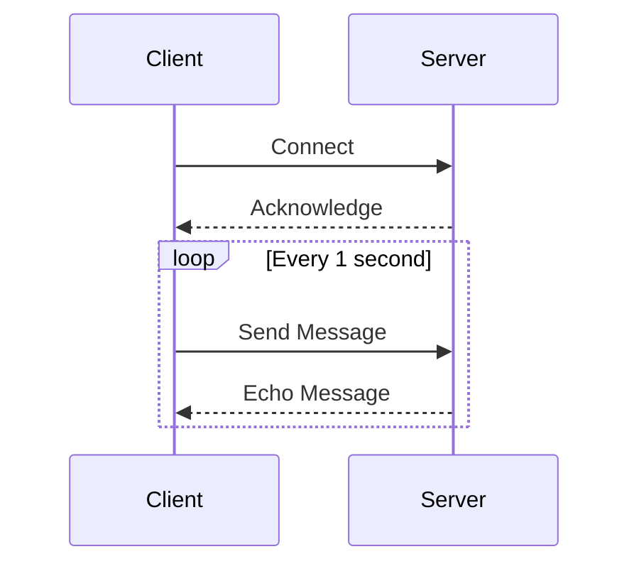

## 12.7. Reactive Networking Applications

In the realm of modern software development, the demand for applications that are both responsive and scalable has never been higher. Reactive programming offers a paradigm that addresses these needs by focusing on asynchronous data streams and the propagation of change. In this section, we will delve into the principles of reactive programming, explore the use of Clojure frameworks like Manifold for building reactive network services, and highlight the benefits of this approach, including effective backpressure handling and seamless integration with client applications.

### Understanding Reactive Programming Principles

Reactive programming is a paradigm that revolves around data streams and the propagation of change. It is particularly well-suited for applications that require high responsiveness and scalability, such as real-time data processing systems, interactive user interfaces, and networked applications.

#### Key Concepts of Reactive Programming

- **Asynchronous Data Streams**: Reactive programming treats data as a continuous stream that can be observed and manipulated asynchronously. This allows applications to react to changes in data in real-time.

- **Propagation of Change**: When a change occurs in the data stream, it automatically propagates through the system, triggering updates and actions without the need for explicit control flow management.

- **Backpressure**: This is a mechanism to handle situations where the data producer is faster than the consumer. It ensures that the system remains stable and responsive by controlling the flow of data.

- **Declarative Style**: Reactive programming often employs a declarative style, where the focus is on what to do with the data rather than how to do it. This leads to more concise and readable code.

### Introducing Manifold for Reactive Streams

[Manifold](https://github.com/clj-commons/manifold) is a Clojure library that provides abstractions for asynchronous programming, including support for reactive streams. It is designed to work seamlessly with Clojure's concurrency primitives and offers a powerful toolkit for building reactive network applications.

#### Features of Manifold

- **Deferreds**: Manifold's core abstraction for asynchronous computation, similar to promises or futures in other languages. Deferreds allow you to compose asynchronous operations in a straightforward manner.

- **Streams**: Manifold provides a rich API for working with streams of data, including operations for transformation, filtering, and combination.

- **Backpressure Support**: Manifold includes built-in mechanisms for handling backpressure, ensuring that your applications remain responsive under load.

- **Integration with Core.Async**: Manifold can interoperate with Clojure's core.async library, allowing you to leverage both libraries' strengths in your applications.

### Building Reactive Network Services with Manifold

Let's explore how to build a simple reactive network service using Manifold. We'll create a basic TCP server that echoes messages back to the client, demonstrating the use of streams and deferreds.

```clojure
(require '[manifold.stream :as s])
(require '[aleph.tcp :as tcp])

(defn echo-handler [s]
  (s/connect s s))

(defn start-echo-server []
  (tcp/start-server echo-handler {:port 8080}))

;; Start the server
(def server (start-echo-server))
```

In this example, we define an `echo-handler` function that connects the input stream to the output stream, effectively echoing any received messages back to the sender. The `start-echo-server` function initializes a TCP server on port 8080 using Aleph, a networking library that integrates with Manifold.

#### Handling Backpressure

One of the key benefits of using Manifold is its support for backpressure. In a reactive system, it's crucial to manage the flow of data to prevent overwhelming the consumer. Manifold's streams automatically handle backpressure by pausing the producer when the consumer cannot keep up.

```clojure
(defn throttled-echo-handler [s]
  (let [throttled-stream (s/throttle s 10)] ; Limit to 10 messages per second
    (s/connect throttled-stream s)))

(defn start-throttled-echo-server []
  (tcp/start-server throttled-echo-handler {:port 8081}))

;; Start the throttled server
(def throttled-server (start-throttled-echo-server))
```

In this modified example, we use the `s/throttle` function to limit the rate of messages to 10 per second, demonstrating how to implement backpressure control in a reactive network service.

### Integrating Reactive Network Services with Client Applications

Reactive network services are not only about server-side implementations; they also involve seamless integration with client applications. By leveraging reactive programming principles, you can build client applications that are responsive and capable of handling real-time data streams.

#### Example: Building a Reactive Client

Let's create a simple client that connects to our echo server and sends messages asynchronously.

```clojure
(require '[manifold.deferred :as d])
(require '[aleph.tcp :as tcp])

(defn send-message [client message]
  (d/chain
    (tcp/write client message)
    (fn [response]
      (println "Received response:" response))))

(defn start-client []
  (d/chain
    (tcp/client {:host "localhost" :port 8080})
    (fn [client]
      (send-message client "Hello, World!")
      client)))

;; Start the client
(def client (start-client))
```

In this client example, we use Manifold's deferreds to handle asynchronous operations. The `send-message` function sends a message to the server and prints the response once received. The `start-client` function establishes a connection to the server and sends a test message.

### Benefits of Reactive Networking Applications

Reactive networking applications offer several advantages over traditional approaches, making them ideal for modern software development:

- **Scalability**: By leveraging asynchronous data streams and backpressure, reactive applications can scale efficiently to handle large volumes of data and users.

- **Responsiveness**: Reactive programming enables applications to respond to changes in real-time, providing a seamless user experience.

- **Resource Efficiency**: By managing data flow and resource allocation dynamically, reactive applications make efficient use of system resources.

- **Simplified Codebase**: The declarative nature of reactive programming leads to more concise and maintainable code, reducing the complexity of managing asynchronous operations.

### Visualizing Reactive Networking with Manifold

To better understand how reactive networking applications work, let's visualize the flow of data in a reactive system using a sequence diagram.



This diagram illustrates the interaction between a client and a server in a reactive networking application. The client connects to the server, and they exchange messages in a continuous loop, demonstrating the real-time nature of reactive systems.

### Try It Yourself

Now that we've covered the basics of reactive networking applications with Clojure and Manifold, it's time to experiment with the code examples provided. Try modifying the server to handle different types of messages or implement additional features such as logging or authentication. Explore the Manifold documentation to discover more advanced features and capabilities.

### Knowledge Check

Before we wrap up, let's reinforce what we've learned with a few questions:

- What are the key principles of reactive programming?
- How does Manifold support backpressure in reactive applications?
- What are the benefits of using reactive programming for networking applications?

### Conclusion

Reactive networking applications represent a powerful approach to building scalable and responsive systems. By leveraging Clojure's functional programming capabilities and libraries like Manifold, you can create applications that efficiently handle real-time data streams and provide a seamless user experience. Remember, this is just the beginning. As you continue to explore reactive programming, you'll discover new ways to harness its power for your projects. Keep experimenting, stay curious, and enjoy the journey!

### External Links

- [Manifold](https://github.com/clj-commons/manifold)

## **Ready to Test Your Knowledge?**



### What is a key principle of reactive programming?

- [x] Asynchronous data streams
- [ ] Synchronous processing
- [ ] Static typing
- [ ] Object-oriented design

> **Explanation:** Reactive programming focuses on asynchronous data streams and the propagation of change.

### Which Clojure library provides abstractions for reactive streams?

- [x] Manifold
- [ ] Aleph
- [ ] Core.Async
- [ ] Ring

> **Explanation:** Manifold is a Clojure library that provides abstractions for asynchronous programming and reactive streams.

### How does Manifold handle backpressure?

- [x] By controlling the flow of data
- [ ] By increasing buffer sizes
- [ ] By using synchronous processing
- [ ] By ignoring it

> **Explanation:** Manifold handles backpressure by controlling the flow of data to ensure system stability.

### What is the benefit of using reactive programming for networking applications?

- [x] Scalability and responsiveness
- [ ] Increased complexity
- [ ] Higher memory usage
- [ ] Slower performance

> **Explanation:** Reactive programming enables scalability and responsiveness, making it ideal for networking applications.

### What is a deferred in Manifold?

- [x] An abstraction for asynchronous computation
- [ ] A synchronous function
- [ ] A data structure
- [ ] A type of stream

> **Explanation:** A deferred in Manifold is an abstraction for handling asynchronous computations.

### What does the `s/throttle` function do in Manifold?

- [x] Limits the rate of messages
- [ ] Increases the rate of messages
- [ ] Stops message flow
- [ ] Buffers messages indefinitely

> **Explanation:** The `s/throttle` function limits the rate of messages to control data flow.

### How can you integrate reactive network services with client applications?

- [x] By using asynchronous operations
- [ ] By using synchronous operations
- [ ] By ignoring client-side integration
- [ ] By using blocking I/O

> **Explanation:** Integrating reactive network services with client applications involves using asynchronous operations.

### What is a benefit of the declarative style in reactive programming?

- [x] More concise and readable code
- [ ] Increased complexity
- [ ] Less maintainable code
- [ ] More verbose code

> **Explanation:** The declarative style in reactive programming leads to more concise and readable code.

### What is the role of backpressure in reactive systems?

- [x] To prevent overwhelming the consumer
- [ ] To increase data flow
- [ ] To ignore data flow
- [ ] To decrease system stability

> **Explanation:** Backpressure prevents overwhelming the consumer by controlling data flow.

### True or False: Reactive programming is only suitable for server-side applications.

- [ ] True
- [x] False

> **Explanation:** Reactive programming is suitable for both server-side and client-side applications, providing responsiveness and scalability.


