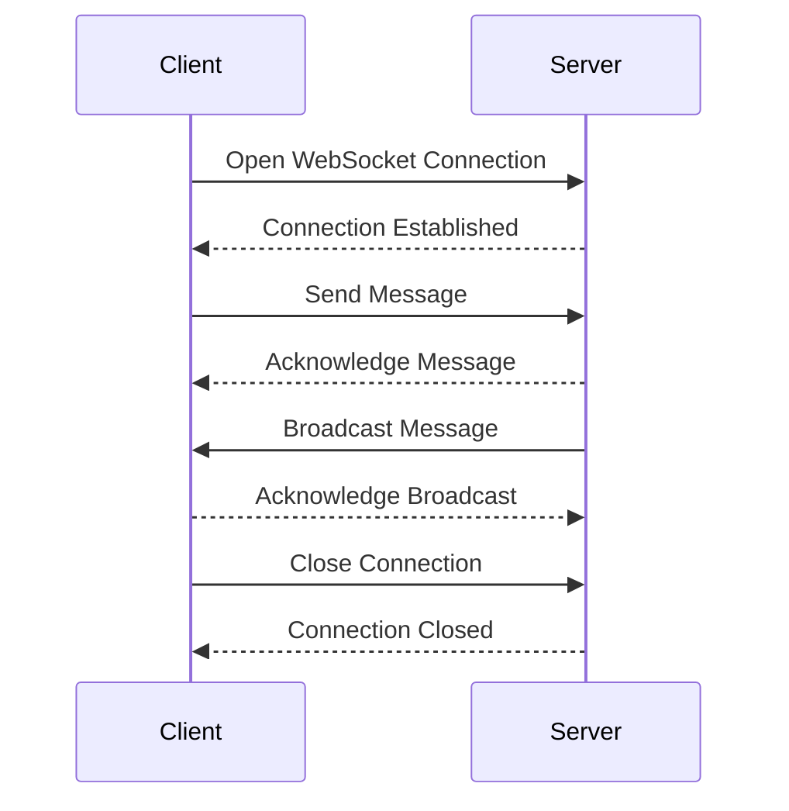

## 12.8. WebSockets and Real-Time Communication

In today's digital landscape, real-time communication is a cornerstone of interactive and dynamic applications. WebSockets provide a robust solution for enabling real-time data exchange between clients and servers. In this section, we will delve into the world of WebSockets, explore their use cases, and demonstrate how to implement them in Clojure using the Sente library. We will also discuss the connection lifecycle, messaging, scaling, and security considerations, and highlight best practices for building responsive applications.

### Understanding WebSockets

WebSockets are a protocol that enables two-way communication between a client and a server over a single, long-lived connection. Unlike traditional HTTP requests, which are stateless and require a new connection for each request/response cycle, WebSockets maintain an open connection, allowing for real-time data exchange with minimal latency.

#### Key Features of WebSockets

- **Full-Duplex Communication**: WebSockets allow for simultaneous two-way communication, enabling both the client and server to send messages independently.
- **Low Latency**: By maintaining an open connection, WebSockets reduce the overhead of establishing new connections, resulting in faster data transmission.
- **Efficient Resource Usage**: WebSockets use a single TCP connection, reducing the load on servers and networks compared to multiple HTTP requests.

#### Use Cases for WebSockets

WebSockets are ideal for applications that require real-time updates and interactions, such as:

- **Chat Applications**: Enable instant messaging and notifications.
- **Live Feeds**: Stream real-time data, such as stock prices or sports scores.
- **Collaborative Tools**: Facilitate real-time collaboration in applications like document editors or whiteboards.
- **Online Gaming**: Support real-time interactions and updates in multiplayer games.

### Implementing WebSockets in Clojure with Sente

Sente is a popular Clojure library that simplifies the implementation of WebSockets and real-time communication. It provides a unified API for WebSockets and HTTP long-polling, making it easy to build responsive applications.

#### Setting Up Sente

To get started with Sente, add the following dependency to your `project.clj` or `deps.edn` file:

```clojure
;; Leiningen
[com.taoensso/sente "1.16.0"]

;; deps.edn
{:deps {com.taoensso/sente {:mvn/version "1.16.0"}}}
```

#### Creating a WebSocket Server

Let's create a simple WebSocket server using Sente. We'll start by setting up a basic Ring server and integrating Sente for WebSocket communication.

```clojure
(ns myapp.core
  (:require [ring.adapter.jetty :refer [run-jetty]]
            [taoensso.sente :as sente]
            [taoensso.sente.server-adapters.http-kit :refer [get-sch-adapter]]))

(defn event-msg-handler [ev-msg]
  (println "Received event:" ev-msg))

(let [{:keys [ch-recv send-fn connected-uids] :as chsk}
      (sente/make-channel-socket! (get-sch-adapter) {})]
  (def chsk-send! send-fn)
  (def connected-uids connected-uids)
  (defn start-server []
    (run-jetty (fn [req] {:status 200 :body "WebSocket server running"})
               {:port 3000})))

(start-server)
```

In this example, we use Sente's `make-channel-socket!` function to create a WebSocket channel. The `event-msg-handler` function handles incoming messages, and `chsk-send!` is used to send messages to clients.

#### Creating a WebSocket Client

Next, let's create a simple WebSocket client using Sente. The client will connect to the server and send messages.

```clojure
(ns myapp.client
  (:require [taoensso.sente :as sente]
            [taoensso.sente.packers.transit :as sente-transit]))

(let [{:keys [chsk ch-recv send-fn state] :as chsk-client}
      (sente/make-channel-socket-client! "/chsk" {:type :auto
                                                  :packer (sente-transit/get-transit-packer)})]
  (def chsk-send! send-fn)
  (defn start-client []
    (println "WebSocket client started")))

(start-client)
```

The client uses `make-channel-socket-client!` to establish a connection with the server. The `chsk-send!` function is used to send messages to the server.

### Handling Connection Lifecycle and Messaging

Managing the connection lifecycle and messaging is crucial for building robust WebSocket applications. Let's explore how to handle these aspects effectively.

#### Connection Lifecycle

- **Connection Establishment**: Use Sente's `chsk` to establish a connection and handle events like `:chsk/handshake` to confirm successful connections.
- **Reconnection**: Implement reconnection logic to handle network interruptions and ensure continuous communication.
- **Disconnection**: Handle disconnection events to clean up resources and notify users.

#### Messaging

- **Message Handling**: Use Sente's `ch-recv` to receive messages and process them using an event handler function.
- **Broadcasting**: Use `chsk-send!` to broadcast messages to all connected clients or specific users.
- **Error Handling**: Implement error handling to manage message delivery failures and connection issues.

### Scaling and Security Considerations

As your application grows, scaling and security become critical considerations. Let's discuss strategies for addressing these challenges.

#### Scaling WebSocket Applications

- **Load Balancing**: Use load balancers to distribute WebSocket connections across multiple servers, ensuring high availability and performance.
- **Horizontal Scaling**: Scale your application horizontally by adding more servers to handle increased traffic.
- **State Management**: Use distributed data stores or message brokers to manage state across multiple servers.

#### Security Considerations

- **Authentication**: Implement authentication mechanisms to verify user identities and protect sensitive data.
- **Encryption**: Use TLS/SSL to encrypt WebSocket connections and ensure data privacy.
- **Rate Limiting**: Implement rate limiting to prevent abuse and protect against denial-of-service attacks.

### Best Practices for Building Responsive Applications

Building responsive applications with WebSockets requires careful planning and implementation. Here are some best practices to consider:

- **Optimize Data Transmission**: Minimize the amount of data sent over WebSockets to reduce latency and improve performance.
- **Use Compression**: Enable compression to reduce the size of messages and improve network efficiency.
- **Monitor Performance**: Use monitoring tools to track WebSocket performance and identify bottlenecks.
- **Test for Scalability**: Conduct load testing to ensure your application can handle increased traffic and user demand.

### Try It Yourself

Now that we've covered the basics of WebSockets and real-time communication in Clojure, it's time to experiment with the code examples provided. Try modifying the server and client code to add new features, such as broadcasting messages to all clients or implementing a chat application. Experiment with different configurations and observe how they affect performance and scalability.

### Visualizing WebSocket Communication

To better understand the flow of WebSocket communication, let's visualize the interaction between a client and server using a sequence diagram.



This diagram illustrates the typical sequence of events in a WebSocket communication session, from connection establishment to message exchange and connection closure.

### References and Links

For further reading and exploration, check out the following resources:

- [Sente GitHub Repository](https://github.com/ptaoussanis/sente)
- [WebSockets on MDN Web Docs](https://developer.mozilla.org/en-US/docs/Web/API/WebSockets_API)
- [Ring GitHub Repository](https://github.com/ring-clojure/ring)

### Knowledge Check

Before we wrap up, let's test your understanding of WebSockets and real-time communication in Clojure with a few quiz questions.

## **Ready to Test Your Knowledge?**



### What is the primary advantage of using WebSockets over traditional HTTP requests?

- [x] Full-duplex communication
- [ ] Stateless communication
- [ ] Higher latency
- [ ] Single-direction communication

> **Explanation:** WebSockets provide full-duplex communication, allowing simultaneous two-way data exchange between client and server.

### Which Clojure library is commonly used for implementing WebSockets?

- [x] Sente
- [ ] Ring
- [ ] Compojure
- [ ] Aleph

> **Explanation:** Sente is a popular Clojure library for implementing WebSockets and real-time communication.

### What is the purpose of the `chsk-send!` function in Sente?

- [x] To send messages to clients
- [ ] To receive messages from clients
- [ ] To establish a WebSocket connection
- [ ] To close a WebSocket connection

> **Explanation:** The `chsk-send!` function is used to send messages to clients in a Sente WebSocket application.

### What is a common use case for WebSockets?

- [x] Real-time chat applications
- [ ] Static web pages
- [ ] Batch processing
- [ ] File storage

> **Explanation:** WebSockets are commonly used for real-time chat applications due to their low latency and full-duplex communication capabilities.

### Which of the following is a security consideration for WebSocket applications?

- [x] Encryption with TLS/SSL
- [ ] Using plain text communication
- [ ] Disabling authentication
- [ ] Ignoring rate limiting

> **Explanation:** Encryption with TLS/SSL is a crucial security measure to protect data transmitted over WebSockets.

### How can you scale a WebSocket application?

- [x] Use load balancers
- [ ] Use a single server
- [ ] Disable WebSocket connections
- [ ] Increase message size

> **Explanation:** Load balancers can distribute WebSocket connections across multiple servers, improving scalability and performance.

### What is the role of the `event-msg-handler` function in a Sente WebSocket server?

- [x] To handle incoming messages
- [ ] To send messages to clients
- [ ] To establish a WebSocket connection
- [ ] To close a WebSocket connection

> **Explanation:** The `event-msg-handler` function processes incoming messages in a Sente WebSocket server.

### Which of the following is a best practice for building responsive WebSocket applications?

- [x] Optimize data transmission
- [ ] Send large messages
- [ ] Ignore performance monitoring
- [ ] Disable compression

> **Explanation:** Optimizing data transmission reduces latency and improves the performance of WebSocket applications.

### What is the purpose of the `ch-recv` function in Sente?

- [x] To receive messages from clients
- [ ] To send messages to clients
- [ ] To establish a WebSocket connection
- [ ] To close a WebSocket connection

> **Explanation:** The `ch-recv` function is used to receive messages from clients in a Sente WebSocket application.

### True or False: WebSockets use multiple TCP connections for communication.

- [ ] True
- [x] False

> **Explanation:** WebSockets use a single TCP connection for communication, which reduces overhead and improves efficiency.



Remember, this is just the beginning. As you progress, you'll build more complex and interactive applications using WebSockets. Keep experimenting, stay curious, and enjoy the journey!
