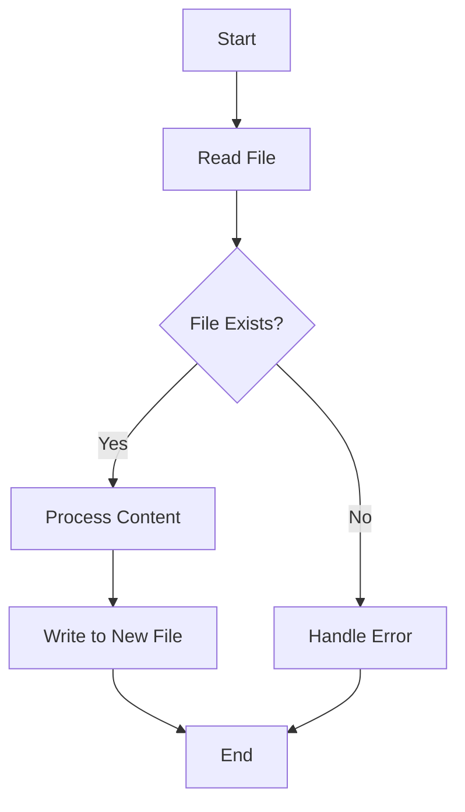

## 12.9. File System Operations and Patterns

File system operations are a fundamental aspect of many applications, enabling them to read from and write to files, monitor changes, and manage resources efficiently. In Clojure, these operations are often performed using Java interoperability, given Clojure's seamless integration with the Java Virtual Machine (JVM). This section will guide you through the essential file system operations in Clojure, providing examples, patterns, and best practices for handling files effectively.

### Introduction to File System Operations in Clojure

File system operations in Clojure leverage the rich set of classes and methods provided by Java's `java.nio.file` and `java.io` packages. These operations include reading and writing files, handling directories, and monitoring file changes. Understanding these operations is crucial for building robust applications that interact with the file system.

### Interacting with the File System Using Clojure and Java Interop

Clojure's interoperability with Java allows developers to utilize Java's file handling capabilities directly. Let's explore some common file operations using Clojure.

#### Reading Files

Reading files is a common requirement in many applications. In Clojure, you can read files using Java's `BufferedReader` or `Files` utility class.

```clojure
(ns file-operations.core
  (:import [java.nio.file Files Paths]
           [java.nio.charset StandardCharsets]))

(defn read-file [file-path]
  "Reads the content of a file and returns it as a string."
  (let [path (Paths/get file-path)]
    (String. (Files/readAllBytes path) StandardCharsets/UTF_8)))

;; Usage
(println (read-file "example.txt"))
```

In this example, we use `Files/readAllBytes` to read the entire content of a file into a byte array, which is then converted to a string using UTF-8 encoding.

#### Writing Files

Writing to files is equally straightforward. You can use `Files/write` to write data to a file.

```clojure
(defn write-file [file-path content]
  "Writes the given content to a file."
  (let [path (Paths/get file-path)]
    (Files/write path (.getBytes content StandardCharsets/UTF_8))))

;; Usage
(write-file "output.txt" "Hello, Clojure!")
```

This function writes a string to a specified file, creating the file if it does not exist.

### Patterns for Handling Large Files and Streaming

Handling large files efficiently requires careful consideration of memory usage and performance. Streaming is a common pattern used to process large files without loading them entirely into memory.

#### Streaming File Content

Java's `BufferedReader` can be used to read files line by line, which is useful for processing large files.

```clojure
(ns file-operations.stream
  (:import [java.io BufferedReader FileReader]))

(defn process-file-line-by-line [file-path]
  "Processes a file line by line."
  (with-open [reader (BufferedReader. (FileReader. file-path))]
    (doseq [line (line-seq reader)]
      (println line))))

;; Usage
(process-file-line-by-line "large-file.txt")
```

The `with-open` macro ensures that the file is closed automatically after processing, preventing resource leaks.

#### Writing Large Files

When writing large files, consider using buffered output streams to improve performance.

```clojure
(ns file-operations.write
  (:import [java.io BufferedWriter FileWriter]))

(defn write-large-file [file-path lines]
  "Writes multiple lines to a file efficiently."
  (with-open [writer (BufferedWriter. (FileWriter. file-path))]
    (doseq [line lines]
      (.write writer line)
      (.newLine writer))))

;; Usage
(write-large-file "large-output.txt" ["Line 1" "Line 2" "Line 3"])
```

### Cross-Platform Compatibility Considerations

When working with file systems, it's important to consider cross-platform compatibility. File paths and line endings can vary between operating systems.

#### Handling File Paths

Use `java.nio.file.Paths` to construct file paths in a platform-independent manner.

```clojure
(defn construct-path [& parts]
  "Constructs a file path from parts in a platform-independent way."
  (str (Paths/get (first parts) (into-array String (rest parts)))))

;; Usage
(println (construct-path "dir" "subdir" "file.txt"))
```

#### Line Endings

Be mindful of line endings, especially when reading or writing text files. Use `System/lineSeparator` to get the appropriate line separator for the current platform.

### Error Handling and Resource Management

Error handling is crucial when performing file system operations, as many things can go wrong, such as missing files or permission issues.

#### Handling Exceptions

Use `try-catch` blocks to handle exceptions gracefully.

```clojure
(defn safe-read-file [file-path]
  "Reads a file safely, handling exceptions."
  (try
    (read-file file-path)
    (catch Exception e
      (str "Error reading file: " (.getMessage e)))))

;; Usage
(println (safe-read-file "nonexistent.txt"))
```

#### Resource Management

Always ensure that resources like file handles are closed after use. The `with-open` macro is a convenient way to manage resources in Clojure.

### Monitoring File Changes

Monitoring file changes can be useful for applications that need to react to file system events. Java's `WatchService` API can be used for this purpose.

```clojure
(ns file-operations.monitor
  (:import [java.nio.file FileSystems Paths StandardWatchEventKinds]))

(defn monitor-directory [dir-path]
  "Monitors a directory for changes."
  (let [watch-service (.newWatchService (FileSystems/getDefault))
        path (Paths/get dir-path)]
    (.register path watch-service
               (into-array [StandardWatchEventKinds/ENTRY_CREATE
                            StandardWatchEventKinds/ENTRY_DELETE
                            StandardWatchEventKinds/ENTRY_MODIFY]))
    (println "Monitoring directory:" dir-path)
    (while true
      (let [key (.take watch-service)]
        (doseq [event (.pollEvents key)]
          (println "Event kind:" (.kind event) "File:" (.context event)))
        (.reset key)))))

;; Usage
(monitor-directory "/path/to/directory")
```

This example sets up a watch service to monitor a directory for file creation, deletion, and modification events.

### Best Practices for File System Operations

- **Use Buffered Streams**: For large files, use buffered streams to improve read/write performance.
- **Handle Exceptions**: Always handle exceptions to prevent application crashes due to file system errors.
- **Close Resources**: Ensure that file handles and other resources are closed after use to prevent leaks.
- **Consider Cross-Platform Issues**: Use platform-independent methods for file paths and line endings.
- **Monitor Changes**: Use file monitoring for applications that need to respond to file system events.

### Try It Yourself

Experiment with the provided code examples by modifying file paths, content, and observing how the application behaves. Try implementing additional features like file copying or directory traversal.

### Visualizing File System Operations

To better understand the flow of file system operations, let's visualize a simple file reading and writing process using a flowchart.



**Figure 1**: A flowchart illustrating the process of reading a file, processing its content, and writing to a new file.

### References and Further Reading

- [Java NIO File API](https://docs.oracle.com/javase/8/docs/api/java/nio/file/package-summary.html)
- [Clojure Java Interop Documentation](https://clojure.org/reference/java_interop)
- [Handling Large Files in Java](https://www.baeldung.com/java-read-large-file)

### Knowledge Check

Let's reinforce your understanding of file system operations in Clojure with a quiz.

## **Ready to Test Your Knowledge?**



### What is the primary Java package used for file system operations in Clojure?

- [x] java.nio.file
- [ ] java.util
- [ ] java.lang
- [ ] java.net

> **Explanation:** The `java.nio.file` package provides the classes and methods necessary for file system operations in Java, which Clojure can utilize through interop.

### How can you read a file line by line in Clojure?

- [x] Using BufferedReader and line-seq
- [ ] Using Files/readAllBytes
- [ ] Using FileInputStream
- [ ] Using Scanner

> **Explanation:** `BufferedReader` combined with `line-seq` allows reading a file line by line, which is efficient for processing large files.

### What is the purpose of the `with-open` macro in Clojure?

- [x] To ensure resources are closed after use
- [ ] To open files for reading
- [ ] To write data to a file
- [ ] To handle exceptions

> **Explanation:** The `with-open` macro in Clojure ensures that resources such as file handles are closed automatically after use, preventing resource leaks.

### Which method is used to write a string to a file in Clojure?

- [x] Files/write
- [ ] Files/readAllBytes
- [ ] BufferedReader/write
- [ ] FileWriter/read

> **Explanation:** `Files/write` is used to write data to a file in Clojure, leveraging Java's file handling capabilities.

### How can you construct a platform-independent file path in Clojure?

- [x] Using java.nio.file.Paths
- [ ] Using string concatenation
- [ ] Using java.io.File
- [ ] Using System/getProperty

> **Explanation:** `java.nio.file.Paths` provides a way to construct file paths that are platform-independent, ensuring compatibility across different operating systems.

### What is a common pattern for handling large files in Clojure?

- [x] Streaming
- [ ] Loading entire file into memory
- [ ] Using arrays
- [ ] Using lists

> **Explanation:** Streaming is a common pattern for handling large files, as it allows processing data without loading the entire file into memory.

### How can you monitor a directory for file changes in Clojure?

- [x] Using WatchService
- [ ] Using FileObserver
- [ ] Using FileMonitor
- [ ] Using FileWatcher

> **Explanation:** Java's `WatchService` API can be used to monitor directories for file changes, which Clojure can access through interop.

### What should you consider when performing file operations across different platforms?

- [x] File paths and line endings
- [ ] File permissions
- [ ] File size
- [ ] File encoding

> **Explanation:** File paths and line endings can vary between platforms, so it's important to handle them in a platform-independent manner.

### True or False: The `try-catch` block is used for error handling in Clojure file operations.

- [x] True
- [ ] False

> **Explanation:** The `try-catch` block is used in Clojure to handle exceptions, including those that may occur during file operations.

### What is the benefit of using buffered streams for file operations?

- [x] Improved performance
- [ ] Simplified code
- [ ] Reduced file size
- [ ] Increased security

> **Explanation:** Buffered streams improve the performance of file operations by reducing the number of I/O operations needed, which is especially beneficial for large files.



Remember, mastering file system operations in Clojure is just the beginning. As you continue to explore, you'll discover more advanced techniques and patterns that will enhance your ability to build efficient and robust applications. Keep experimenting, stay curious, and enjoy the journey!
