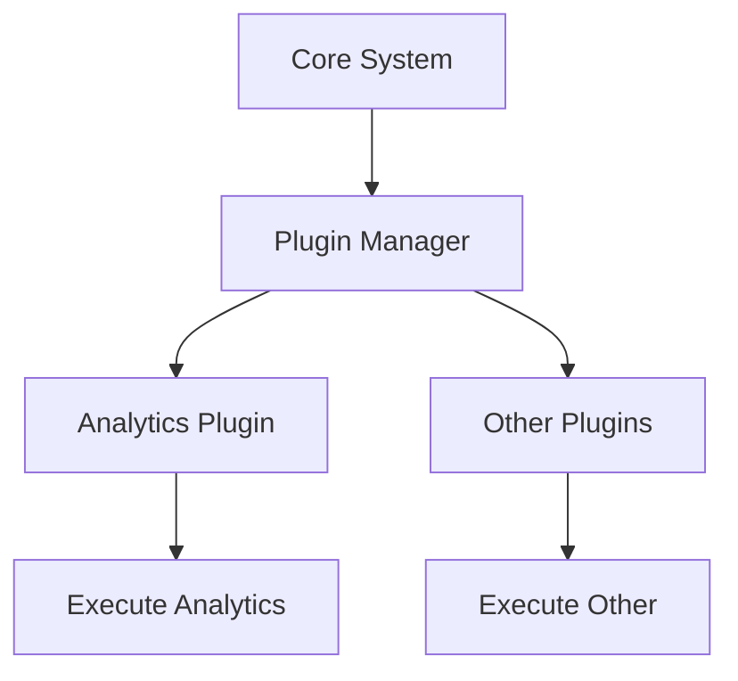

## 12.9 Microkernel Architecture in Clojure

The Microkernel Architecture is a powerful design pattern that structures an application around a minimal core system (the microkernel) and a set of plug-in modules. This architecture is particularly beneficial for systems that require a high degree of customization and extensibility, allowing new features to be added without altering the core system. In this article, we will explore how to implement the Microkernel Architecture in Clojure, leveraging its functional programming paradigms and dynamic capabilities.

### Introduction

The Microkernel Architecture is designed to separate the minimal core functionalities of an application from additional features that can be implemented as plug-ins. This separation allows for a flexible and scalable system where new capabilities can be integrated seamlessly. The core system provides essential services and defines interfaces or protocols for extensions, while plug-in modules implement these interfaces to extend the system's functionality.

### Detailed Explanation

#### Core System Design

The core system in a Microkernel Architecture is responsible for providing the essential services and defining the interfaces for plug-ins. In Clojure, we can use protocols to define these interfaces, allowing for polymorphic behavior and easy extension.

```clojure
(ns myapp.core)

(defprotocol Plugin
  (initialize [this])
  (execute [this data]))
```

In this example, the `Plugin` protocol defines two methods: `initialize`, which sets up the plug-in, and `execute`, which performs the plug-in's main functionality.

#### Implementing a Plugin Manager

The plugin manager is responsible for managing the lifecycle of plug-ins, including registration, initialization, and execution. We can use Clojure's `atom` to maintain a stateful map of registered plugins.

```clojure
(def plugins (atom {}))

(defn register-plugin [name plugin]
  (swap! plugins assoc name plugin))

(defn initialize-plugins []
  (doseq [plugin (vals @plugins)]
    (initialize plugin)))

(defn execute-plugin [name data]
  (when-let [plugin (get @plugins name)]
    (execute plugin data)))
```

This code snippet demonstrates how to register plugins, initialize them, and execute a specific plugin by name.

#### Developing Plug-in Modules

Plug-in modules implement the core system's protocols to extend its functionality. Each plug-in can be developed independently and registered with the core system.

```clojure
(ns myapp.plugins.analytics
  (:require [myapp.core :refer [Plugin]]))

(defrecord AnalyticsPlugin []
  Plugin
  (initialize [this]
    (println "Initializing Analytics Plugin"))
  (execute [this data]
    (println "Analyzing data:" data)))

(register-plugin :analytics (->AnalyticsPlugin))
```

Here, the `AnalyticsPlugin` implements the `Plugin` protocol, providing specific behavior for initialization and execution.

#### Using Plugins in the Application

To utilize the plugins, the application initializes them and executes the desired functionality.

```clojure
(ns myapp.app
  (:require [myapp.core :refer [initialize-plugins execute-plugin]]))

(defn -main []
  (initialize-plugins)
  (execute-plugin :analytics {:user-data "Sample Data"}))
```

This example shows how to initialize all registered plugins and execute the `analytics` plugin with sample data.

### Visual Aids

#### Architectural Diagram

Below is a conceptual diagram illustrating the Microkernel Architecture with a core system and plug-in modules.



### Advantages and Disadvantages

#### Advantages

- **Extensibility:** New features can be added as plug-ins without modifying the core system.
- **Scalability:** The architecture supports scaling by adding more plug-ins.
- **Customization:** Systems can be tailored to specific needs by selecting appropriate plug-ins.

#### Disadvantages

- **Complexity:** Managing plug-in dependencies and lifecycle can become complex.
- **Performance Overhead:** The abstraction layers may introduce performance overhead.

### Best Practices

- **Define Clear Interfaces:** Use protocols to define clear interfaces for plug-ins.
- **Manage Dependencies:** Use configuration files or dependency injection to handle plug-in dependencies.
- **Lifecycle Management:** Provide functions for loading, unloading, and updating plugins at runtime.

### Comparisons

The Microkernel Architecture can be compared to other architectural patterns like the Layered Architecture, which separates concerns into layers but does not inherently support plug-in extensibility. The Microkernel Architecture is more suitable for applications requiring modularity and flexibility.

### Conclusion

The Microkernel Architecture in Clojure offers a robust framework for building extensible and customizable applications. By separating the core system from plug-in modules, developers can create scalable systems that adapt to changing requirements. Leveraging Clojure's dynamic capabilities and functional programming paradigms enhances the implementation of this architecture, making it a valuable pattern for modern software development.

## Quiz Time!



### What is the primary purpose of the Microkernel Architecture?

- [x] To separate core functionalities from extensible plug-in modules
- [ ] To enforce strict layer separation
- [ ] To optimize for performance
- [ ] To simplify database interactions

> **Explanation:** The Microkernel Architecture is designed to separate the core system from plug-in modules, allowing for extensibility and customization.

### Which Clojure feature is used to define interfaces for plug-ins?

- [x] Protocols
- [ ] Macros
- [ ] Atoms
- [ ] Multimethods

> **Explanation:** Protocols in Clojure are used to define interfaces that plug-ins can implement, providing polymorphic behavior.

### How are plug-ins registered in the core system?

- [x] Using an atom to maintain a map of plugins
- [ ] By hardcoding them into the core system
- [ ] Through a configuration file
- [ ] Using a database

> **Explanation:** An atom is used to maintain a stateful map of registered plugins, allowing dynamic registration and management.

### What is a potential disadvantage of the Microkernel Architecture?

- [x] Complexity in managing plug-in dependencies
- [ ] Lack of scalability
- [ ] Difficulty in defining core functionalities
- [ ] Inflexibility in customization

> **Explanation:** Managing plug-in dependencies and lifecycle can become complex, which is a potential disadvantage of the Microkernel Architecture.

### Which method is used to execute a specific plugin by name?

- [x] execute-plugin
- [ ] run-plugin
- [ ] start-plugin
- [ ] invoke-plugin

> **Explanation:** The `execute-plugin` function is used to execute a specific plugin by name, as demonstrated in the code examples.

### What is the role of the Plugin Manager in the Microkernel Architecture?

- [x] To manage the lifecycle of plug-ins
- [ ] To define core functionalities
- [ ] To optimize performance
- [ ] To handle database interactions

> **Explanation:** The Plugin Manager is responsible for managing the lifecycle of plug-ins, including registration, initialization, and execution.

### How does the Microkernel Architecture promote scalability?

- [x] By allowing new plug-ins to be added without modifying the core
- [ ] By enforcing strict layer separation
- [ ] By optimizing database queries
- [ ] By reducing code duplication

> **Explanation:** The architecture supports scalability by allowing new plug-ins to be added without modifying the core system.

### Which of the following is a best practice for implementing the Microkernel Architecture?

- [x] Define clear interfaces using protocols
- [ ] Hardcode all plug-ins into the core system
- [ ] Avoid using configuration files
- [ ] Minimize the use of protocols

> **Explanation:** Defining clear interfaces using protocols is a best practice for implementing the Microkernel Architecture, ensuring extensibility and flexibility.

### What is the main advantage of using plug-in modules?

- [x] Extensibility and customization
- [ ] Simplified database interactions
- [ ] Improved performance
- [ ] Reduced code complexity

> **Explanation:** Plug-in modules provide extensibility and customization, allowing systems to be tailored to specific needs.

### True or False: The Microkernel Architecture is suitable for systems requiring a high degree of customization.

- [x] True
- [ ] False

> **Explanation:** True. The Microkernel Architecture is particularly suitable for systems that require a high degree of customization and extensibility.


