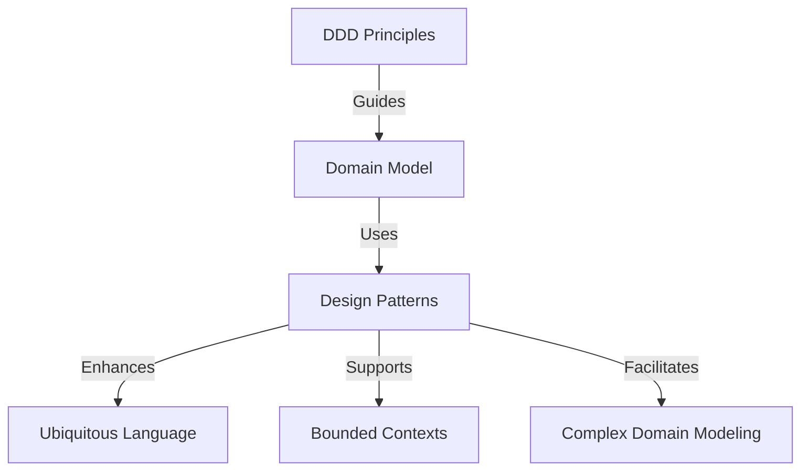

## 13.1 Integration: How Design Patterns Fit within the DDD Framework

Domain-Driven Design (DDD) is a strategic approach to software development that emphasizes collaboration between technical and domain experts to create a shared understanding of the domain. Design patterns, on the other hand, provide reusable solutions to common software design problems. When integrated, these two concepts can significantly enhance the modeling of complex domains, especially in a language like Clojure that supports functional programming paradigms.

### Understanding the Relationship between Design Patterns and DDD

Design patterns and DDD share a common goal: to create software that is both robust and adaptable to change. While DDD focuses on capturing the core domain logic and ensuring that the software reflects the business processes accurately, design patterns offer proven solutions to recurring design challenges. By leveraging design patterns within the DDD framework, developers can achieve a more structured and maintainable codebase.

#### Supporting DDD Principles with Design Patterns

1. **Ubiquitous Language:** Design patterns help in establishing a common vocabulary between developers and domain experts. For instance, patterns like Aggregates and Repositories align with DDD's emphasis on using a ubiquitous language to ensure that the code reflects the domain model accurately.

2. **Bounded Contexts:** Patterns such as Anti-Corruption Layer and Facade can be used to manage interactions between different bounded contexts, ensuring that each context remains independent and cohesive.

3. **Modeling Complex Domains:** Patterns like Strategy, State, and Visitor can be employed to model complex domain behaviors and state transitions, making the domain logic more expressive and easier to understand.

### Illustrating Design Patterns in DDD with Clojure

Clojure, with its emphasis on immutability and functional programming, provides a unique platform for implementing DDD principles using design patterns. Let's explore some examples:

#### Example 1: Using the Repository Pattern

The Repository pattern is a natural fit for DDD as it abstracts the data access layer, allowing the domain model to remain independent of the underlying data storage. In Clojure, this can be implemented using protocols and records.

```clojure
(defprotocol Repository
  (find-by-id [this id])
  (save [this entity]))

(defrecord InMemoryRepository [storage]
  Repository
  (find-by-id [this id]
    (get @storage id))
  (save [this entity]
    (swap! storage assoc (:id entity) entity)))
```

In this example, the `InMemoryRepository` provides a simple in-memory storage mechanism, adhering to the `Repository` protocol. This abstraction allows the domain logic to interact with the repository without concerning itself with the details of data persistence.

#### Example 2: Implementing the Strategy Pattern

The Strategy pattern can be used to encapsulate different algorithms or business rules, allowing them to be interchangeable. This is particularly useful in DDD when modeling complex domain logic.

```clojure
(defprotocol PricingStrategy
  (calculate-price [this order]))

(defrecord StandardPricing []
  PricingStrategy
  (calculate-price [this order]
    (* (:quantity order) (:unit-price order))))

(defrecord DiscountPricing [discount]
  PricingStrategy
  (calculate-price [this order]
    (* (:quantity order) (:unit-price order) (- 1 discount))))

(defn apply-pricing-strategy [strategy order]
  (calculate-price strategy order))
```

Here, `StandardPricing` and `DiscountPricing` are two different strategies for calculating the price of an order. By using the Strategy pattern, we can easily switch between different pricing strategies without altering the domain logic.

### Integrating Design Patterns within the DDD Framework

Integrating design patterns within the DDD framework involves understanding the domain's requirements and selecting patterns that best address those needs. This integration enhances the domain model's expressiveness and maintainability.

#### Addressing Domain-Specific Problems with Patterns

1. **Complex State Management:** Use the State pattern to manage complex state transitions within an entity, ensuring that the domain logic remains clear and consistent.

2. **Behavioral Variability:** Employ the Strategy pattern to encapsulate varying business rules, allowing the domain model to adapt to changing requirements.

3. **Cross-Cutting Concerns:** Utilize the Decorator or Middleware patterns to address cross-cutting concerns such as logging or transaction management without cluttering the domain logic.

### Visualizing the Integration of Design Patterns in DDD

To better understand how design patterns fit within the DDD framework, consider the following conceptual diagram:



This diagram illustrates how design patterns enhance various aspects of the DDD framework, from supporting a ubiquitous language to facilitating complex domain modeling.

### Best Practices for Using Design Patterns in DDD

1. **Align Patterns with Domain Concepts:** Ensure that the chosen design patterns align with the core domain concepts and enhance the domain model's expressiveness.

2. **Maintain Separation of Concerns:** Use patterns to separate domain logic from infrastructure concerns, promoting a clean and maintainable architecture.

3. **Iterate and Evolve:** Continuously refine the domain model and the use of design patterns as the understanding of the domain evolves.

### Conclusion

Design patterns play a crucial role in supporting and enhancing the principles of Domain-Driven Design. By integrating these patterns within the DDD framework, developers can create more robust, maintainable, and expressive domain models. Clojure, with its functional programming capabilities, provides a powerful platform for implementing these patterns effectively, allowing for the modeling of complex domains with clarity and precision.

## Quiz Time!



### How do design patterns support the principles of DDD?

- [x] By providing a common vocabulary and reusable solutions
- [ ] By enforcing strict coding standards
- [ ] By eliminating the need for domain experts
- [ ] By simplifying all domain logic

> **Explanation:** Design patterns support DDD by offering a common vocabulary and reusable solutions that align with domain concepts.

### Which design pattern is commonly used to abstract the data access layer in DDD?

- [x] Repository
- [ ] Singleton
- [ ] Observer
- [ ] Adapter

> **Explanation:** The Repository pattern abstracts the data access layer, allowing the domain model to remain independent of data storage details.

### What is the primary benefit of using the Strategy pattern in DDD?

- [x] Encapsulating varying business rules
- [ ] Simplifying data access
- [ ] Enforcing a single algorithm
- [ ] Reducing code duplication

> **Explanation:** The Strategy pattern encapsulates varying business rules, allowing for flexibility and adaptability in the domain model.

### How does the Anti-Corruption Layer pattern support bounded contexts in DDD?

- [x] By managing interactions between different contexts
- [ ] By merging all contexts into one
- [ ] By eliminating the need for context boundaries
- [ ] By simplifying domain logic

> **Explanation:** The Anti-Corruption Layer pattern manages interactions between different bounded contexts, ensuring independence and cohesion.

### Which Clojure feature is commonly used to implement the Repository pattern?

- [x] Protocols and Records
- [ ] Atoms and Refs
- [ ] Macros
- [ ] Sequences

> **Explanation:** Protocols and Records in Clojure are commonly used to implement the Repository pattern, providing abstraction and flexibility.

### What is the role of design patterns in addressing domain-specific problems?

- [x] Providing structured solutions
- [ ] Eliminating all domain complexities
- [ ] Enforcing a single approach
- [ ] Simplifying all domain logic

> **Explanation:** Design patterns provide structured solutions to domain-specific problems, enhancing the domain model's expressiveness.

### How can the State pattern be used in DDD?

- [x] To manage complex state transitions
- [ ] To simplify data access
- [ ] To enforce a single state
- [ ] To eliminate state management

> **Explanation:** The State pattern is used to manage complex state transitions within an entity, ensuring clear and consistent domain logic.

### What is the benefit of using design patterns to support a ubiquitous language in DDD?

- [x] Enhancing communication between developers and domain experts
- [ ] Simplifying all domain logic
- [ ] Eliminating the need for domain experts
- [ ] Enforcing strict coding standards

> **Explanation:** Design patterns enhance communication between developers and domain experts by supporting a ubiquitous language.

### How does Clojure's functional programming paradigm support DDD?

- [x] By promoting immutability and clear domain logic
- [ ] By enforcing strict object-oriented principles
- [ ] By simplifying all domain logic
- [ ] By eliminating the need for domain modeling

> **Explanation:** Clojure's functional programming paradigm supports DDD by promoting immutability and clear domain logic.

### True or False: Design patterns eliminate the need for domain experts in DDD.

- [ ] True
- [x] False

> **Explanation:** False. Design patterns do not eliminate the need for domain experts; they enhance the modeling of domain logic by providing reusable solutions.


