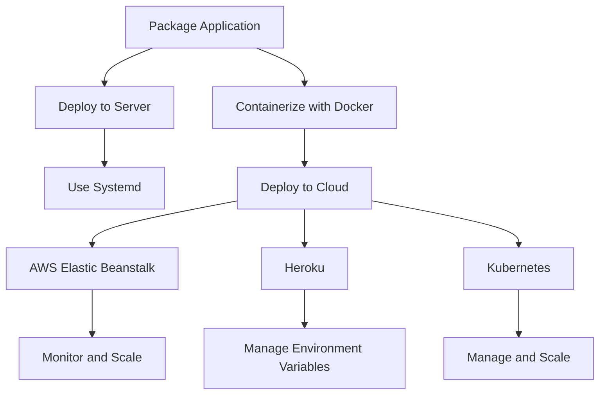

## 13.10. Deployment Strategies for Web Services

Deploying Clojure web applications efficiently and reliably is crucial for ensuring that your software reaches users in a performant and scalable manner. In this section, we will explore various deployment strategies, including traditional server setups, containerization, and cloud platforms. We will also delve into packaging applications, configuration management, and automation tools to streamline your deployment pipeline.

### Packaging Clojure Applications

Before deploying a Clojure application, it is essential to package it appropriately. Clojure applications are typically packaged as JARs or uberjars, which are executable Java archives containing all necessary dependencies.

#### Creating a JAR or Uberjar

To package your Clojure application, you can use tools like Leiningen or the Clojure CLI with `tools.deps`. Here's how you can create an uberjar using Leiningen:

```clojure
;; project.clj
(defproject my-clojure-app "0.1.0-SNAPSHOT"
  :description "A sample Clojure web application"
  :dependencies [[org.clojure/clojure "1.10.3"]
                 [ring/ring-core "1.9.0"]
                 [compojure "1.6.2"]]
  :main my-clojure-app.core
  :uberjar-name "my-clojure-app-standalone.jar"
  :profiles {:uberjar {:aot :all}})
```

To build the uberjar, run:

```bash
lein uberjar
```

This command compiles your application and its dependencies into a single JAR file, making it easy to deploy.

### Deploying to Traditional Servers

Deploying to traditional servers involves setting up a server environment where your application can run. This can be done using system services like Systemd or by manually managing the server.

#### Using Systemd for Deployment

Systemd is a system and service manager for Linux operating systems. It can be used to manage your Clojure application as a service. Here's an example of a Systemd service file:

```ini
# /etc/systemd/system/my-clojure-app.service
[Unit]
Description=My Clojure App
After=network.target

[Service]
Type=simple
User=appuser
ExecStart=/usr/bin/java -jar /path/to/my-clojure-app-standalone.jar
Restart=on-failure

[Install]
WantedBy=multi-user.target
```

To enable and start the service, use:

```bash
sudo systemctl enable my-clojure-app
sudo systemctl start my-clojure-app
```

This setup ensures that your application starts on boot and restarts automatically if it crashes.

### Containerization with Docker

Docker allows you to package your application and its dependencies into a container, ensuring consistency across different environments.

#### Creating a Docker Image

To containerize your Clojure application, you need a Dockerfile. Here's an example:

```dockerfile
# Use an official OpenJDK runtime as a parent image
FROM openjdk:11-jre-slim

# Set the working directory
WORKDIR /usr/src/app

# Copy the uberjar to the container
COPY target/my-clojure-app-standalone.jar .

# Run the application
CMD ["java", "-jar", "my-clojure-app-standalone.jar"]
```

Build the Docker image with:

```bash
docker build -t my-clojure-app .
```

Run the container using:

```bash
docker run -d -p 8080:8080 my-clojure-app
```

This command runs your application in a container, exposing it on port 8080.

### Cloud Deployment Options

Cloud platforms offer scalable and flexible deployment options for Clojure applications. Let's explore some popular choices.

#### AWS Elastic Beanstalk

AWS Elastic Beanstalk is a Platform as a Service (PaaS) that simplifies application deployment. You can deploy your Clojure application by uploading the uberjar to Elastic Beanstalk.

1. **Create an Application**: Use the AWS Management Console to create a new Elastic Beanstalk application.
2. **Upload and Deploy**: Upload your uberjar and deploy it using the Elastic Beanstalk environment.
3. **Monitor and Scale**: Use Elastic Beanstalk's monitoring and scaling features to manage your application.

#### Heroku

Heroku is another PaaS that supports Clojure applications. Deploying to Heroku involves using Git and the Heroku CLI.

1. **Create a Heroku App**: Use the Heroku CLI to create a new app.

   ```bash
   heroku create my-clojure-app
   ```

2. **Deploy with Git**: Push your code to Heroku using Git.

   ```bash
   git push heroku main
   ```

3. **Manage Environment Variables**: Use the Heroku dashboard or CLI to manage environment variables.

#### Kubernetes

Kubernetes is an open-source container orchestration platform that automates deployment, scaling, and management of containerized applications.

1. **Create a Kubernetes Cluster**: Use a cloud provider like Google Kubernetes Engine (GKE) or Amazon EKS to create a cluster.
2. **Deploy Your Application**: Use Kubernetes manifests to define your application deployment.

   ```yaml
   apiVersion: apps/v1
   kind: Deployment
   metadata:
     name: my-clojure-app
   spec:
     replicas: 3
     selector:
       matchLabels:
         app: my-clojure-app
     template:
       metadata:
         labels:
           app: my-clojure-app
       spec:
         containers:
         - name: my-clojure-app
           image: my-clojure-app:latest
           ports:
           - containerPort: 8080
   ```

3. **Manage and Scale**: Use Kubernetes commands to manage and scale your application.

### Configuration Management and Environment Variables

Managing configuration and environment variables is crucial for deploying applications across different environments.

#### Using Environment Variables

Environment variables allow you to configure your application without changing the code. In Clojure, you can use libraries like `environ` to manage environment variables.

```clojure
(ns my-clojure-app.core
  (:require [environ.core :refer [env]]))

(defn -main []
  (let [port (Integer. (env :port "8080"))]
    (println (str "Starting server on port " port))))
```

#### Configuration Management Tools

Tools like Ansible, Chef, and Puppet can automate configuration management, ensuring consistency across environments.

### Automation Tools for Deployment Pipelines

Automating your deployment pipeline can save time and reduce errors. Continuous Integration/Continuous Deployment (CI/CD) tools like Jenkins, GitLab CI, and GitHub Actions can automate the build, test, and deployment process.

#### Setting Up a CI/CD Pipeline

1. **Define Pipeline Stages**: Define stages for building, testing, and deploying your application.
2. **Automate Builds**: Use CI/CD tools to automate the build process.
3. **Deploy Automatically**: Configure your pipeline to deploy automatically to your chosen environment.

### Visualizing Deployment Strategies

To better understand the deployment strategies discussed, let's visualize the process using a flowchart.



This diagram illustrates the different paths you can take when deploying a Clojure web application, from packaging to deploying on various platforms.

### Conclusion

Deploying Clojure web applications requires careful consideration of packaging, server environments, containerization, and cloud platforms. By understanding and implementing these strategies, you can ensure that your application is deployed efficiently and reliably. Remember to manage configuration and automate your deployment pipeline to streamline the process.

## **Ready to Test Your Knowledge?**



### What is the primary purpose of creating an uberjar for a Clojure application?

- [x] To package the application and its dependencies into a single executable JAR file.
- [ ] To compile the application into a native binary.
- [ ] To create a Docker image for the application.
- [ ] To deploy the application to a cloud platform.

> **Explanation:** An uberjar packages the application and all its dependencies into a single JAR file, making it easy to deploy.

### Which tool is commonly used to manage Clojure applications as a service on Linux?

- [ ] Docker
- [x] Systemd
- [ ] Kubernetes
- [ ] Heroku

> **Explanation:** Systemd is a system and service manager for Linux that can manage Clojure applications as services.

### What is the main advantage of using Docker for deploying Clojure applications?

- [ ] It compiles the application into a native binary.
- [x] It ensures consistency across different environments.
- [ ] It automatically scales the application.
- [ ] It provides a graphical user interface for deployment.

> **Explanation:** Docker containers ensure that the application runs consistently across different environments by packaging it with its dependencies.

### Which cloud platform is known for simplifying application deployment with minimal configuration?

- [ ] Kubernetes
- [ ] Docker
- [x] Heroku
- [ ] Systemd

> **Explanation:** Heroku is a Platform as a Service (PaaS) that simplifies application deployment with minimal configuration.

### What is the role of environment variables in application deployment?

- [x] To configure the application without changing the code.
- [ ] To compile the application into a binary.
- [ ] To deploy the application to a server.
- [ ] To create a Docker image for the application.

> **Explanation:** Environment variables allow you to configure the application without modifying the code, making it adaptable to different environments.

### Which tool can automate the build, test, and deployment process in a CI/CD pipeline?

- [ ] Docker
- [ ] Systemd
- [x] Jenkins
- [ ] Kubernetes

> **Explanation:** Jenkins is a popular CI/CD tool that automates the build, test, and deployment process.

### What is the primary benefit of using Kubernetes for deploying Clojure applications?

- [ ] It packages the application into a single JAR file.
- [ ] It provides a graphical user interface for deployment.
- [x] It automates deployment, scaling, and management of containerized applications.
- [ ] It compiles the application into a native binary.

> **Explanation:** Kubernetes automates the deployment, scaling, and management of containerized applications, making it ideal for complex deployments.

### Which configuration management tool is mentioned for ensuring consistency across environments?

- [ ] Docker
- [ ] Heroku
- [x] Ansible
- [ ] Systemd

> **Explanation:** Ansible is a configuration management tool that automates the setup and maintenance of environments, ensuring consistency.

### What is the purpose of using a flowchart in the context of deployment strategies?

- [ ] To compile the application into a binary.
- [ ] To create a Docker image for the application.
- [x] To visually represent the deployment process and options.
- [ ] To deploy the application to a cloud platform.

> **Explanation:** A flowchart visually represents the deployment process and options, helping to understand the different paths and strategies.

### True or False: AWS Elastic Beanstalk is a container orchestration platform.

- [ ] True
- [x] False

> **Explanation:** AWS Elastic Beanstalk is a Platform as a Service (PaaS) that simplifies application deployment, not a container orchestration platform like Kubernetes.



Remember, this is just the beginning. As you progress, you'll build more complex and interactive deployment pipelines. Keep experimenting, stay curious, and enjoy the journey!
