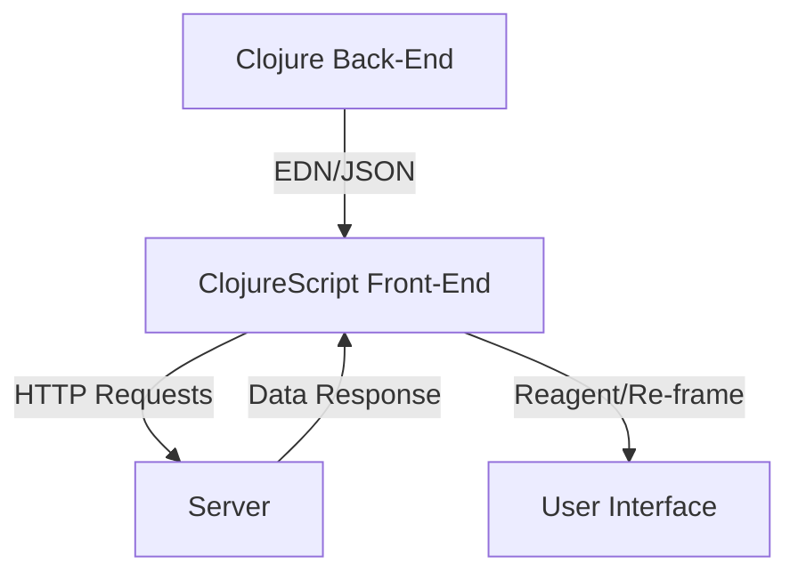

## 13.12. Front-End Integration with ClojureScript

### Introduction to ClojureScript

ClojureScript is a powerful variant of Clojure that compiles to JavaScript, enabling developers to leverage the expressive syntax and functional programming paradigms of Clojure in the browser. This allows for the creation of rich, interactive web applications while maintaining a consistent language and development experience across both the front-end and back-end.

#### Advantages of ClojureScript

- **Functional Programming**: ClojureScript brings the benefits of functional programming to the front-end, such as immutability, first-class functions, and concise syntax.
- **Code Sharing**: By using ClojureScript, developers can share code between the client and server, reducing duplication and improving maintainability.
- **Rich Ecosystem**: ClojureScript integrates seamlessly with the JavaScript ecosystem, allowing access to a vast array of libraries and tools.
- **Reactive UIs**: With libraries like Reagent and Re-frame, ClojureScript excels at building reactive user interfaces.

### Building User Interfaces with Reagent and Re-frame

Reagent and Re-frame are two popular libraries in the ClojureScript ecosystem for building user interfaces. They provide a declarative and reactive approach to UI development, making it easier to manage state and side effects.

#### Reagent

Reagent is a minimalistic interface to React, allowing developers to build React components using ClojureScript. It leverages ClojureScript's immutable data structures and functional programming paradigms to create efficient and maintainable UIs.

```clojure
(ns my-app.core
  (:require [reagent.core :as r]))

(defn hello-world []
  [:div
   [:h1 "Hello, ClojureScript!"]
   [:p "Welcome to the world of functional front-end development."]])

(defn mount-root []
  (r/render [hello-world]
            (.getElementById js/document "app")))

(defn init []
  (mount-root))
```

#### Re-frame

Re-frame builds on top of Reagent, providing a more structured approach to managing application state and side effects. It follows a unidirectional data flow pattern, similar to Redux in the JavaScript world.

```clojure
(ns my-app.core
  (:require [re-frame.core :as rf]
            [reagent.core :as r]))

;; Define an event handler
(rf/reg-event-db
 :initialize
 (fn [_ _]
   {:message "Hello, Re-frame!"}))

;; Define a subscription
(rf/reg-sub
 :message
 (fn [db _]
   (:message db)))

;; Define a view component
(defn main-panel []
  (let [message (rf/subscribe [:message])]
    (fn []
      [:div
       [:h1 @message]])))

(defn mount-root []
  (rf/dispatch-sync [:initialize])
  (r/render [main-panel]
            (.getElementById js/document "app")))

(defn init []
  (mount-root))
```

### Sharing Code Between Front-End and Back-End

One of the significant advantages of using ClojureScript is the ability to share code between the front-end and back-end. This can be particularly useful for validation logic, data transformation functions, or any other logic that is common to both environments.

#### Example: Shared Validation Logic

```clojure
;; src/shared/validation.cljc
(ns shared.validation)

(defn valid-email? [email]
  (re-matches #".+@.+\..+" email))
```

By placing shared code in a `.cljc` file, it can be used in both Clojure and ClojureScript environments.

### Tooling with Shadow CLJS

Shadow CLJS is a build tool that simplifies the process of compiling ClojureScript to JavaScript. It provides features like hot-reloading, module bundling, and integration with npm, making it an excellent choice for modern web development.

#### Setting Up Shadow CLJS

1. **Install Shadow CLJS**: You can install Shadow CLJS globally using npm:

   ```bash
   npm install -g shadow-cljs
   ```

2. **Configure `shadow-cljs.edn`**: Create a `shadow-cljs.edn` file to define your build configuration.

   ```clojure
   {:source-paths ["src"]
    :dependencies [[reagent "1.0.0"]
                   [re-frame "1.2.0"]]
    :builds {:app {:target :browser
                   :output-dir "public/js"
                   :asset-path "/js"
                   :modules {:main {:init-fn my-app.core/init}}}}}
   ```

3. **Start the Development Server**: Use the following command to start the Shadow CLJS development server:

   ```bash
   shadow-cljs watch app
   ```

### Communication Between Client and Server

Communication between the client and server is a crucial aspect of any web application. In ClojureScript, this is often done using JSON or EDN (Extensible Data Notation) for data interchange.

#### Using JSON for Communication

JSON is a widely-used format for data interchange between client and server. ClojureScript provides libraries like `cljs-ajax` for making HTTP requests and handling JSON data.

```clojure
(ns my-app.ajax
  (:require [ajax.core :refer [GET POST]]))

(defn fetch-data []
  (GET "/api/data"
       {:handler (fn [response]
                   (println "Data received:" response))
        :error-handler (fn [error]
                         (println "Error fetching data:" error))}))
```

#### Using EDN for Communication

EDN is a more expressive format than JSON and is native to Clojure. It can be used for communication between Clojure and ClojureScript applications, providing a seamless data interchange format.

```clojure
(ns my-app.edn
  (:require [cljs-http.client :as http]
            [cljs.core.async :refer [<!]]
            [cljs.reader :as reader]))

(defn fetch-edn-data []
  (go
    (let [response (<! (http/get "/api/data" {:with-credentials? false
                                              :headers {"Accept" "application/edn"}}))]
      (println "EDN Data received:" (reader/read-string (:body response))))))
```

### Visualizing ClojureScript Integration

To better understand how ClojureScript integrates with the front-end and back-end, let's visualize the architecture using a Mermaid.js diagram.



**Diagram Description**: This diagram illustrates the flow of data between the Clojure back-end and the ClojureScript front-end. The front-end communicates with the server using HTTP requests, exchanging data in EDN or JSON format. The user interface is built using Reagent and Re-frame, providing a reactive and interactive experience.

### Best Practices for Front-End Integration

- **Consistent Data Formats**: Use a consistent data format (JSON or EDN) across your application to simplify data interchange.
- **Code Reusability**: Leverage `.cljc` files to share code between the front-end and back-end, reducing duplication.
- **Tooling**: Utilize Shadow CLJS for efficient builds and hot-reloading during development.
- **State Management**: Use Re-frame for managing application state and side effects in a predictable manner.

### Try It Yourself

Experiment with the provided code examples by modifying the UI components or changing the data interchange format. Try adding new features or integrating additional libraries to enhance your application.

### External Resources

- [ClojureScript Official Site](https://clojurescript.org/)
- [Reagent Documentation](https://reagent-project.github.io/)
- [Re-frame GitHub Repository](https://github.com/day8/re-frame)
- [Shadow CLJS User Guide](https://shadow-cljs.github.io/docs/UsersGuide.html)

### Summary

In this section, we've explored the power of ClojureScript for front-end development and how it can be integrated with Clojure back-end applications to create a full-stack solution. By leveraging tools like Reagent, Re-frame, and Shadow CLJS, developers can build reactive, maintainable, and efficient web applications. Remember, this is just the beginning. As you progress, you'll build more complex and interactive web pages. Keep experimenting, stay curious, and enjoy the journey!

## **Ready to Test Your Knowledge?**



### What is ClojureScript?

- [x] A variant of Clojure that compiles to JavaScript
- [ ] A JavaScript library for building UIs
- [ ] A back-end framework for Clojure
- [ ] A database management system

> **Explanation:** ClojureScript is a variant of Clojure that compiles to JavaScript, enabling developers to use Clojure's syntax and functional programming paradigms in the browser.

### Which library is used for building reactive UIs in ClojureScript?

- [ ] Angular
- [ ] Vue.js
- [x] Reagent
- [ ] Express.js

> **Explanation:** Reagent is a popular library in the ClojureScript ecosystem for building reactive user interfaces, leveraging React.

### What is the purpose of Re-frame in ClojureScript applications?

- [ ] To manage database connections
- [x] To provide a structured approach to managing application state and side effects
- [ ] To compile ClojureScript to JavaScript
- [ ] To handle HTTP requests

> **Explanation:** Re-frame provides a structured approach to managing application state and side effects in ClojureScript applications, following a unidirectional data flow pattern.

### How can code be shared between Clojure and ClojureScript?

- [ ] By using `.java` files
- [x] By using `.cljc` files
- [ ] By using `.js` files
- [ ] By using `.html` files

> **Explanation:** Code can be shared between Clojure and ClojureScript by placing it in `.cljc` files, which can be used in both environments.

### What tool is recommended for building and bundling ClojureScript applications?

- [ ] Webpack
- [x] Shadow CLJS
- [ ] Gulp
- [ ] Grunt

> **Explanation:** Shadow CLJS is a build tool that simplifies the process of compiling ClojureScript to JavaScript, providing features like hot-reloading and module bundling.

### Which data format is native to Clojure and can be used for communication between Clojure and ClojureScript?

- [ ] XML
- [ ] CSV
- [ ] YAML
- [x] EDN

> **Explanation:** EDN (Extensible Data Notation) is a native data format to Clojure and can be used for seamless communication between Clojure and ClojureScript applications.

### What is the main advantage of using Reagent for UI development?

- [ ] It provides server-side rendering
- [x] It allows building React components using ClojureScript
- [ ] It is a database management tool
- [ ] It compiles JavaScript to Clojure

> **Explanation:** Reagent allows developers to build React components using ClojureScript, leveraging ClojureScript's immutable data structures and functional programming paradigms.

### What is the role of Shadow CLJS in ClojureScript development?

- [ ] To manage application state
- [ ] To provide UI components
- [x] To compile ClojureScript to JavaScript and manage dependencies
- [ ] To handle HTTP requests

> **Explanation:** Shadow CLJS is used to compile ClojureScript to JavaScript and manage dependencies, providing an efficient build process for ClojureScript applications.

### True or False: Re-frame is similar to Redux in the JavaScript ecosystem.

- [x] True
- [ ] False

> **Explanation:** Re-frame follows a unidirectional data flow pattern similar to Redux, providing a structured approach to managing application state and side effects.

### Which of the following is a benefit of using ClojureScript for front-end development?

- [x] Code sharing between front-end and back-end
- [ ] Limited access to JavaScript libraries
- [ ] Lack of tooling support
- [ ] Incompatibility with modern browsers

> **Explanation:** One of the benefits of using ClojureScript for front-end development is the ability to share code between the front-end and back-end, reducing duplication and improving maintainability.


