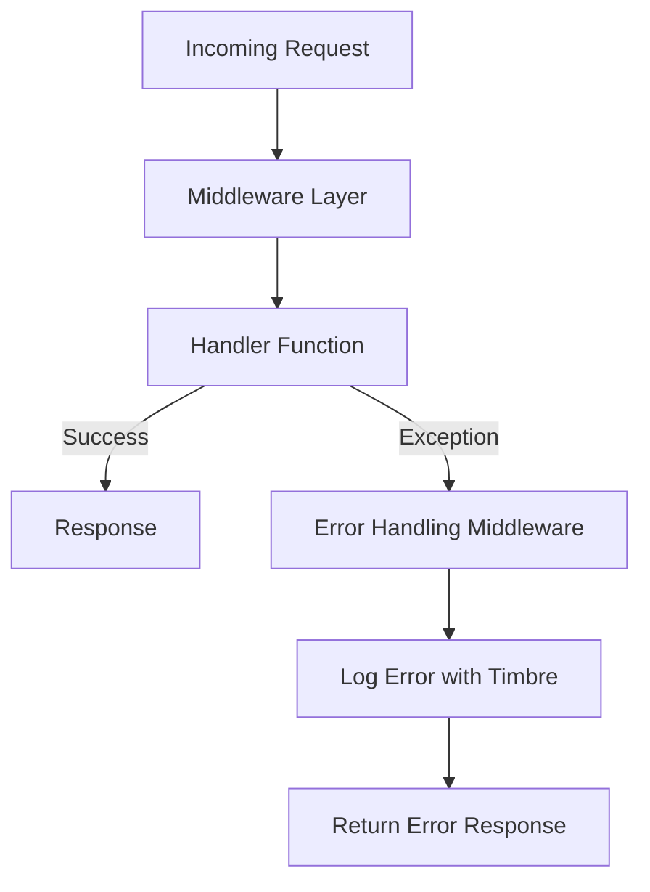

## 13.14. Error Handling and Logging in Web Contexts

In the realm of web development, error handling and logging are crucial components that significantly impact user experience and the maintainability of applications. In this section, we will delve into the strategies for handling errors gracefully in Clojure web applications and implementing effective logging mechanisms. We will explore patterns for catching exceptions, returning meaningful responses, and discuss the role of middleware in error handling. Additionally, we will highlight best practices for monitoring and alerting, ensuring your application remains robust and reliable.

### Importance of Error Handling

Error handling is a critical aspect of web development that directly affects user experience and application reliability. Proper error handling ensures that users receive informative feedback when something goes wrong, rather than cryptic error messages or, worse, a blank screen. It also aids developers in debugging and maintaining the application by providing insights into what went wrong and where.

#### Key Considerations for Error Handling

- **User Experience**: Ensure that error messages are user-friendly and provide guidance on how to proceed.
- **Security**: Avoid exposing sensitive information in error messages.
- **Debugging**: Capture detailed error information for developers to diagnose issues effectively.
- **Resilience**: Implement mechanisms to recover from errors gracefully, maintaining application stability.

### Patterns for Catching Exceptions

In Clojure, exceptions can be caught using the `try` and `catch` constructs. This allows you to handle errors at specific points in your code and provide appropriate responses.

```clojure
(defn divide [numerator denominator]
  (try
    (/ numerator denominator)
    (catch ArithmeticException e
      (str "Error: Division by zero - " (.getMessage e)))
    (catch Exception e
      (str "An unexpected error occurred: " (.getMessage e)))))
```

In this example, we handle division by zero specifically, while also providing a generic catch-all for other exceptions. This pattern ensures that errors are caught and handled gracefully, preventing the application from crashing.

#### Providing Meaningful Responses

When an error occurs, it's important to return a response that is meaningful to the user. This might involve returning a custom error message or redirecting the user to a different page.

```clojure
(defn handle-request [request]
  (try
    ;; Process the request
    {:status 200 :body "Success"}
    (catch Exception e
      {:status 500 :body "Internal Server Error"})))
```

In a web context, you can use HTTP status codes to indicate the nature of the error, such as `404` for not found or `500` for internal server errors.

### Logging Frameworks in Clojure

Logging is an essential part of any application, providing insights into the application's behavior and aiding in debugging. In Clojure, the [Timbre](https://github.com/ptaoussanis/timbre) library is a popular choice for logging.

#### Setting Up Timbre

To use Timbre, add it to your project dependencies:

```clojure
:dependencies [[com.taoensso/timbre "5.1.2"]]
```

Then, configure Timbre in your application:

```clojure
(ns my-app.core
  (:require [taoensso.timbre :as timbre]))

(timbre/set-config! {:level :info})

(timbre/info "Application started")
```

Timbre provides various logging levels, such as `:debug`, `:info`, `:warn`, `:error`, allowing you to control the verbosity of your logs.

#### Logging Best Practices

- **Log Levels**: Use appropriate log levels to differentiate between informational messages, warnings, and errors.
- **Structured Logging**: Include contextual information in your logs to make them more informative.
- **Log Rotation**: Implement log rotation to manage log file sizes and prevent disk space issues.
- **Centralized Logging**: Consider using a centralized logging system for aggregating and analyzing logs from multiple sources.

### Role of Middleware in Error Handling

Middleware in Clojure web applications, typically built with Ring, plays a crucial role in error handling. Middleware can intercept requests and responses, allowing you to implement cross-cutting concerns such as error handling and logging.

#### Implementing Error Handling Middleware

Here's an example of a simple error handling middleware:

```clojure
(defn wrap-error-handling [handler]
  (fn [request]
    (try
      (handler request)
      (catch Exception e
        {:status 500
         :headers {"Content-Type" "text/plain"}
         :body "Internal Server Error"}))))
```

This middleware wraps a handler function, catching any exceptions that occur during request processing and returning a generic error response.

### Monitoring and Alerting

Effective monitoring and alerting are essential for maintaining the health of your web application. By monitoring key metrics and setting up alerts, you can proactively address issues before they impact users.

#### Best Practices for Monitoring

- **Metrics Collection**: Collect metrics such as request counts, response times, and error rates.
- **Alerting**: Set up alerts for critical issues, such as high error rates or slow response times.
- **Dashboards**: Use dashboards to visualize metrics and gain insights into application performance.
- **Log Analysis**: Analyze logs to identify patterns and diagnose issues.

### Conclusion

Error handling and logging are vital components of web development in Clojure, ensuring a robust and user-friendly application. By implementing effective error handling patterns, utilizing logging frameworks like Timbre, and leveraging middleware, you can enhance the reliability and maintainability of your application. Additionally, by adopting best practices for monitoring and alerting, you can proactively address issues and maintain a high level of service quality.

### Try It Yourself

Experiment with the code examples provided in this section. Try modifying the error handling logic to return different responses based on the type of exception. Additionally, explore the Timbre logging library by configuring different log levels and adding contextual information to your logs.

### Visualizing Error Handling and Logging Flow

Below is a diagram illustrating the flow of error handling and logging in a Clojure web application:



This diagram shows how an incoming request is processed through the middleware layer, with errors being caught and logged before returning an error response.

### External Links

- [Timbre Logging Library](https://github.com/ptaoussanis/timbre)

## **Ready to Test Your Knowledge?**



### What is the primary purpose of error handling in web applications?

- [x] To provide informative feedback to users and aid in debugging
- [ ] To increase application performance
- [ ] To reduce code complexity
- [ ] To enhance user interface design

> **Explanation:** Error handling ensures users receive informative feedback and helps developers diagnose issues effectively.

### Which Clojure construct is used to catch exceptions?

- [x] `try` and `catch`
- [ ] `if` and `else`
- [ ] `loop` and `recur`
- [ ] `let` and `def`

> **Explanation:** The `try` and `catch` constructs are used in Clojure to handle exceptions.

### What is the role of middleware in error handling?

- [x] To intercept requests and responses, allowing implementation of cross-cutting concerns
- [ ] To manage database connections
- [ ] To handle user authentication
- [ ] To optimize application performance

> **Explanation:** Middleware can intercept requests and responses, enabling error handling and logging.

### Which library is commonly used for logging in Clojure?

- [x] Timbre
- [ ] Log4j
- [ ] SLF4J
- [ ] Logback

> **Explanation:** Timbre is a popular logging library in the Clojure ecosystem.

### What is a best practice for logging?

- [x] Use appropriate log levels to differentiate message types
- [ ] Log every function call
- [ ] Avoid logging errors
- [ ] Use only one log level for simplicity

> **Explanation:** Using appropriate log levels helps differentiate between informational messages, warnings, and errors.

### How can you ensure that error messages do not expose sensitive information?

- [x] By sanitizing error messages before displaying them to users
- [ ] By logging all errors
- [ ] By using verbose error messages
- [ ] By ignoring errors

> **Explanation:** Sanitizing error messages prevents exposure of sensitive information.

### What should you do to manage log file sizes?

- [x] Implement log rotation
- [ ] Increase disk space
- [ ] Reduce logging frequency
- [ ] Use smaller log files

> **Explanation:** Log rotation helps manage log file sizes and prevents disk space issues.

### What is a key benefit of centralized logging?

- [x] Aggregating and analyzing logs from multiple sources
- [ ] Reducing application complexity
- [ ] Improving user interface design
- [ ] Enhancing database performance

> **Explanation:** Centralized logging allows for aggregation and analysis of logs from various sources.

### What HTTP status code is typically used for internal server errors?

- [x] 500
- [ ] 404
- [ ] 200
- [ ] 403

> **Explanation:** The HTTP status code `500` indicates an internal server error.

### True or False: Middleware can only be used for error handling.

- [ ] True
- [x] False

> **Explanation:** Middleware can be used for various cross-cutting concerns, not just error handling.


