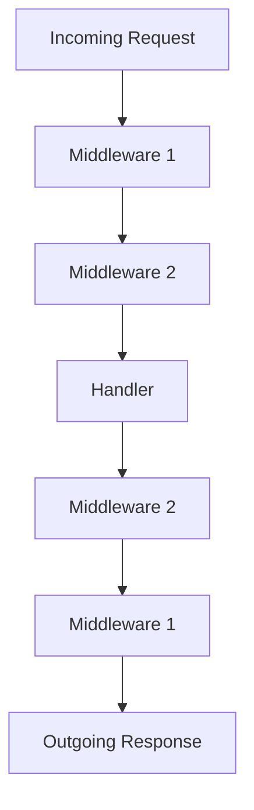

## 13.15. The Ring Request-Response Pipeline

Web development in Clojure is a unique experience, thanks to its functional programming paradigm and the powerful Ring library. Ring is a Clojure web application library that provides a simple and elegant way to handle HTTP requests and responses. In this section, we will delve into the Ring architecture, explaining the flow of requests and responses through handlers and middleware. We will also explore the structure of Ring request and response maps, and provide examples of custom handlers and middleware components.

### Understanding the Ring Specification

The Ring specification is a set of conventions for handling HTTP requests and responses in Clojure web applications. It is inspired by the WSGI (Web Server Gateway Interface) specification in Python and the Rack specification in Ruby. The core idea is to represent HTTP requests and responses as Clojure maps, allowing developers to manipulate them using Clojure's powerful data manipulation functions.

#### The Ring Request Map

A Ring request is represented as a Clojure map with specific keys that correspond to various aspects of the HTTP request. Here are some of the most common keys you will encounter in a Ring request map:

- `:server-port`: The port on which the server is running.
- `:server-name`: The server's hostname.
- `:remote-addr`: The IP address of the client making the request.
- `:uri`: The URI of the request.
- `:query-string`: The query string of the request.
- `:scheme`: The scheme of the request (`:http` or `:https`).
- `:request-method`: The HTTP method of the request (`:get`, `:post`, etc.).
- `:headers`: A map of the request headers.
- `:body`: The body of the request, typically an InputStream.

#### The Ring Response Map

A Ring response is also represented as a Clojure map, with the following keys:

- `:status`: The HTTP status code of the response.
- `:headers`: A map of the response headers.
- `:body`: The body of the response, which can be a string, a byte array, or an InputStream.

### The Flow of Requests and Responses

In a Ring-based application, requests flow through a series of handlers and middleware components before a response is generated. This flow can be visualized as a pipeline, where each component has the opportunity to inspect, modify, or terminate the request-response cycle.

#### Handlers

A handler is a Clojure function that takes a Ring request map as its argument and returns a Ring response map. Handlers are the core of a Ring application, responsible for generating responses based on the incoming requests.

```clojure
(defn my-handler [request]
  {:status 200
   :headers {"Content-Type" "text/plain"}
   :body "Hello, World!"})
```

In this example, `my-handler` is a simple handler that responds with a plain text message "Hello, World!" for any incoming request.

#### Middleware

Middleware in Ring is a higher-order function that wraps a handler, adding additional functionality to the request-response cycle. Middleware can be used for tasks such as logging, authentication, and content negotiation.

```clojure
(defn wrap-logger [handler]
  (fn [request]
    (println "Received request:" request)
    (let [response (handler request)]
      (println "Sending response:" response)
      response)))
```

In this example, `wrap-logger` is a middleware function that logs the incoming request and outgoing response.

### Building a Simple Ring Application

Let's build a simple Ring application to demonstrate how handlers and middleware work together. We'll create a basic web server that responds with a greeting message and logs each request.

```clojure
(ns my-app.core
  (:require [ring.adapter.jetty :refer [run-jetty]]
            [ring.middleware.params :refer [wrap-params]]))

(defn greeting-handler [request]
  (let [name (get-in request [:params :name] "World")]
    {:status 200
     :headers {"Content-Type" "text/plain"}
     :body (str "Hello, " name "!")}))

(defn wrap-logger [handler]
  (fn [request]
    (println "Received request:" request)
    (let [response (handler request)]
      (println "Sending response:" response)
      response)))

(def app
  (-> greeting-handler
      wrap-logger
      wrap-params))

(defn -main []
  (run-jetty app {:port 3000}))
```

In this application, `greeting-handler` is a handler that responds with a personalized greeting message. We use the `wrap-params` middleware to parse query parameters, and `wrap-logger` to log each request and response. The `app` is a composition of the handler and middleware, which is then passed to `run-jetty` to start the server.

### The Role of Middleware

Middleware plays a crucial role in the Ring request-response pipeline. It allows developers to add cross-cutting concerns to their applications without modifying the core logic of their handlers. Here are some common use cases for middleware:

- **Logging**: Middleware can log incoming requests and outgoing responses for debugging and monitoring purposes.
- **Authentication**: Middleware can check for authentication tokens or credentials and reject unauthorized requests.
- **Content Negotiation**: Middleware can inspect the `Accept` header of a request and select the appropriate content type for the response.
- **Compression**: Middleware can compress response bodies to reduce bandwidth usage.

### Creating Custom Middleware

Creating custom middleware in Ring is straightforward. A middleware function takes a handler as its argument and returns a new handler that wraps the original one. Here's an example of custom middleware that adds a custom header to each response:

```clojure
(defn wrap-custom-header [handler]
  (fn [request]
    (let [response (handler request)]
      (assoc-in response [:headers "X-Custom-Header"] "MyValue"))))
```

In this example, `wrap-custom-header` adds an `X-Custom-Header` to each response with the value "MyValue".

### Visualizing the Ring Request-Response Pipeline

To better understand the flow of requests and responses in a Ring application, let's visualize the pipeline using a diagram.



In this diagram, the request flows through two middleware components before reaching the handler. The response then flows back through the middleware components in reverse order before being sent to the client.

### Best Practices for Using Ring

When working with Ring, there are several best practices to keep in mind:

- **Keep Handlers Simple**: Handlers should focus on generating responses based on requests. Use middleware for cross-cutting concerns.
- **Use Middleware for Reusable Logic**: Middleware is ideal for logic that can be reused across multiple handlers, such as authentication and logging.
- **Chain Middleware Effectively**: The order in which middleware is applied can affect the behavior of your application. Be mindful of the order when composing middleware.
- **Test Handlers and Middleware Separately**: Test handlers and middleware independently to ensure they work as expected.

### Try It Yourself

Now that we've covered the basics of the Ring request-response pipeline, it's time to experiment with your own Ring application. Try modifying the `greeting-handler` to respond with different messages based on the request method or headers. You can also create your own middleware to add custom functionality to the request-response cycle.

### Knowledge Check

Before we wrap up, let's test your understanding of the Ring request-response pipeline with a few questions.

## **Ready to Test Your Knowledge?**



### What is the primary purpose of the Ring specification in Clojure?

- [x] To provide a standard way to handle HTTP requests and responses
- [ ] To define a new programming language
- [ ] To replace the JVM
- [ ] To create a new web browser

> **Explanation:** The Ring specification provides a standard way to handle HTTP requests and responses in Clojure web applications.

### What is a Ring request represented as?

- [x] A Clojure map
- [ ] A Java object
- [ ] A JSON string
- [ ] An XML document

> **Explanation:** A Ring request is represented as a Clojure map with specific keys corresponding to various aspects of the HTTP request.

### Which key is NOT part of a Ring request map?

- [ ] `:server-port`
- [ ] `:uri`
- [x] `:response-time`
- [ ] `:headers`

> **Explanation:** `:response-time` is not a standard key in a Ring request map.

### What does middleware in Ring do?

- [x] Wraps a handler to add additional functionality
- [ ] Compiles Clojure code
- [ ] Manages database connections
- [ ] Handles file uploads

> **Explanation:** Middleware in Ring wraps a handler to add additional functionality to the request-response cycle.

### How is a Ring response represented?

- [x] As a Clojure map
- [ ] As a Java object
- [ ] As a JSON string
- [ ] As an XML document

> **Explanation:** A Ring response is represented as a Clojure map with keys for status, headers, and body.

### What is the role of the `wrap-params` middleware?

- [x] To parse query parameters from the request
- [ ] To log requests and responses
- [ ] To compress response bodies
- [ ] To authenticate users

> **Explanation:** The `wrap-params` middleware parses query parameters from the request and adds them to the request map.

### Which of the following is a common use case for middleware?

- [x] Logging
- [x] Authentication
- [ ] Compiling code
- [ ] Sending emails

> **Explanation:** Middleware is commonly used for tasks like logging and authentication.

### What is the purpose of the `assoc-in` function in custom middleware?

- [x] To add or update a value in a nested map
- [ ] To remove a key from a map
- [ ] To convert a map to a list
- [ ] To sort a map

> **Explanation:** The `assoc-in` function is used to add or update a value in a nested map, such as adding a custom header to a response.

### True or False: Middleware can modify both requests and responses.

- [x] True
- [ ] False

> **Explanation:** Middleware can modify both requests and responses as they pass through the pipeline.

### Which of the following is a best practice when using Ring?

- [x] Keep handlers simple
- [x] Use middleware for reusable logic
- [ ] Chain middleware in random order
- [ ] Test handlers and middleware together only

> **Explanation:** It's best to keep handlers simple, use middleware for reusable logic, and test handlers and middleware separately.



Remember, this is just the beginning. As you progress, you'll build more complex and interactive web applications with Clojure. Keep experimenting, stay curious, and enjoy the journey!
