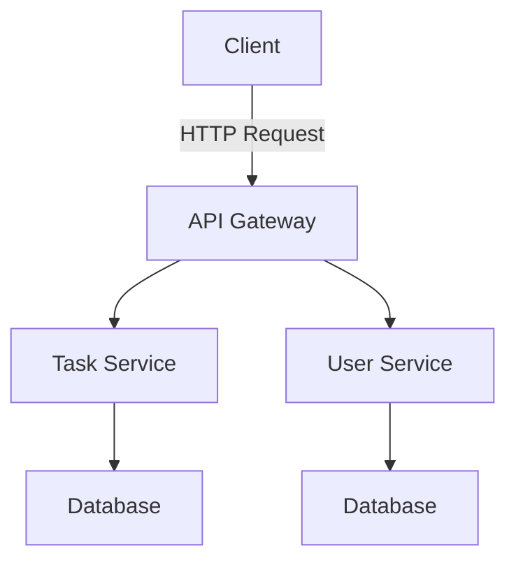

## 13.16. Microservice Architecture with Clojure

Microservice architecture is a modern approach to building software systems that emphasizes modularity, scalability, and resilience. In this section, we will explore how Clojure, with its functional programming paradigm and robust ecosystem, can be leveraged to design and implement microservices. We will cover the principles of microservice architecture, discuss Clojure's strengths in this context, provide examples of microservice design and implementation, and highlight strategies for inter-service communication, data consistency, deployment, scaling, and monitoring.

### Principles of Microservice Architecture

Microservice architecture is characterized by the decomposition of a software application into a set of small, independent services that communicate over a network. Each service is designed to perform a specific business function and can be developed, deployed, and scaled independently. The key principles of microservice architecture include:

- **Decentralization**: Services are autonomous and decentralized, allowing for independent development and deployment.
- **Resilience**: Services are designed to handle failures gracefully, ensuring the overall system remains operational.
- **Scalability**: Services can be scaled independently based on demand, optimizing resource utilization.
- **Flexibility**: Services can be developed using different technologies and programming languages, allowing teams to choose the best tools for the job.
- **Continuous Delivery**: Microservices enable rapid and frequent deployment of new features and updates.

### Clojure's Strengths in Microservices

Clojure is well-suited for building microservices due to its functional programming paradigm, immutable data structures, and seamless Java interoperability. Here are some of the reasons why Clojure is a great choice for microservice architecture:

- **Immutable Data Structures**: Clojure's emphasis on immutability reduces the risk of shared state and concurrency issues, making it easier to build reliable and scalable services.
- **Functional Programming**: Clojure's functional programming model encourages the use of pure functions, which are easier to test and reason about, leading to more maintainable code.
- **Concurrency Support**: Clojure provides powerful concurrency primitives, such as atoms, refs, and agents, which facilitate the development of concurrent and parallel systems.
- **JVM Interoperability**: Clojure runs on the Java Virtual Machine (JVM), allowing easy integration with existing Java libraries and tools, which is beneficial for building microservices that need to interact with other systems.
- **Rich Ecosystem**: Clojure has a vibrant ecosystem with libraries and frameworks for web development, data processing, and more, making it easier to build and deploy microservices.

### Designing and Implementing Microservices with Clojure

When designing microservices with Clojure, it's important to follow best practices to ensure that your services are modular, scalable, and maintainable. Here are some key considerations:

#### Service Boundaries

Define clear boundaries for each service based on business capabilities. Each service should encapsulate a specific business function and have a well-defined API for interaction with other services.

#### Statelessness

Design services to be stateless whenever possible. Stateless services are easier to scale and manage because they do not rely on shared state or session data.

#### API Design

Use RESTful APIs or gRPC for inter-service communication. RESTful APIs are widely used and easy to implement, while gRPC offers performance benefits and supports multiple programming languages.

#### Data Management

Consider how data will be managed across services. Use a database per service pattern to ensure that each service has its own data store, reducing coupling between services.

#### Example: Implementing a Simple Microservice

Let's implement a simple microservice in Clojure using the Ring and Compojure libraries. This service will provide a RESTful API for managing a list of tasks.

```clojure
(ns task-service.core
  (:require [compojure.core :refer :all]
            [compojure.route :as route]
            [ring.adapter.jetty :refer [run-jetty]]
            [ring.middleware.json :refer [wrap-json-body wrap-json-response]]))

(def tasks (atom []))

(defn add-task [task]
  (swap! tasks conj task))

(defn get-tasks []
  @tasks)

(defroutes app-routes
  (POST "/tasks" request
    (let [task (get-in request [:body :task])]
      (add-task task)
      {:status 201 :body {:message "Task added"}}))
  (GET "/tasks" []
    {:status 200 :body (get-tasks)})
  (route/not-found "Not Found"))

(def app
  (-> app-routes
      (wrap-json-body)
      (wrap-json-response)))

(defn -main []
  (run-jetty app {:port 3000 :join? false}))
```

In this example, we define a simple task service with two endpoints: one for adding tasks and another for retrieving the list of tasks. The service uses an atom to store tasks in memory, demonstrating Clojure's concurrency support.

### Inter-Service Communication and Data Consistency

Inter-service communication is a critical aspect of microservice architecture. Clojure provides several options for communication between services:

#### RESTful APIs

RESTful APIs are a common choice for inter-service communication due to their simplicity and ease of use. Clojure libraries like Ring and Compojure make it easy to build and consume RESTful APIs.

#### Messaging Systems

For more complex communication patterns, consider using messaging systems like RabbitMQ or Apache Kafka. These systems enable asynchronous communication and can help decouple services.

#### Data Consistency

Maintaining data consistency across services can be challenging. Consider using eventual consistency models and implementing patterns like the Saga pattern to manage distributed transactions.

### Deployment, Scaling, and Monitoring

Deploying and scaling microservices requires careful planning and consideration of various factors. Here are some strategies to consider:

#### Containerization

Use containerization technologies like Docker to package and deploy your services. Containers provide a consistent runtime environment and make it easier to manage dependencies.

#### Orchestration

Use orchestration tools like Kubernetes to manage the deployment, scaling, and operation of your services. Kubernetes provides features like service discovery, load balancing, and automated scaling.

#### Monitoring and Logging

Implement monitoring and logging solutions to gain visibility into the performance and health of your services. Tools like Prometheus and Grafana can help you monitor metrics, while ELK Stack (Elasticsearch, Logstash, Kibana) can be used for centralized logging.

### Conclusion

Microservice architecture offers numerous benefits, including improved scalability, resilience, and flexibility. Clojure's functional programming paradigm, immutable data structures, and robust ecosystem make it an excellent choice for building microservices. By following best practices for service design, inter-service communication, and deployment, you can build scalable and resilient systems that meet the demands of modern software development.

### Try It Yourself

Experiment with the provided code example by adding new endpoints or modifying the existing ones. Consider implementing additional features, such as task deletion or updating, to further explore Clojure's capabilities in building microservices.

### Visualizing Microservice Architecture with Clojure

Below is a diagram illustrating the architecture of a simple microservice system using Clojure:



This diagram shows a client interacting with an API Gateway, which routes requests to different services. Each service has its own database, following the database per service pattern.

### References and Links

- [Clojure Official Website](https://clojure.org/)
- [Ring - Clojure Web Applications](https://github.com/ring-clojure/ring)
- [Compojure - Routing Library for Ring](https://github.com/weavejester/compojure)
- [Docker](https://www.docker.com/)
- [Kubernetes](https://kubernetes.io/)
- [Prometheus](https://prometheus.io/)
- [Grafana](https://grafana.com/)
- [ELK Stack](https://www.elastic.co/what-is/elk-stack)

## **Ready to Test Your Knowledge?**



### What is a key principle of microservice architecture?

- [x] Decentralization
- [ ] Centralization
- [ ] Monolithic design
- [ ] Single point of failure

> **Explanation:** Decentralization is a key principle of microservice architecture, allowing services to be developed and deployed independently.

### Which Clojure feature helps reduce concurrency issues in microservices?

- [x] Immutable data structures
- [ ] Mutable state
- [ ] Global variables
- [ ] Dynamic typing

> **Explanation:** Immutable data structures in Clojure help reduce concurrency issues by preventing shared state modifications.

### What is a common choice for inter-service communication in microservices?

- [x] RESTful APIs
- [ ] FTP
- [ ] SMTP
- [ ] Telnet

> **Explanation:** RESTful APIs are commonly used for inter-service communication due to their simplicity and ease of use.

### Which tool is used for container orchestration in microservices?

- [x] Kubernetes
- [ ] Docker Compose
- [ ] Ansible
- [ ] Jenkins

> **Explanation:** Kubernetes is a popular tool for container orchestration, managing deployment, scaling, and operation of services.

### What pattern can be used to manage distributed transactions in microservices?

- [x] Saga pattern
- [ ] Singleton pattern
- [ ] Factory pattern
- [ ] Observer pattern

> **Explanation:** The Saga pattern is used to manage distributed transactions by coordinating a series of local transactions.

### Which Clojure library is used for building RESTful APIs?

- [x] Compojure
- [ ] Leiningen
- [ ] Eastwood
- [ ] Criterium

> **Explanation:** Compojure is a Clojure library used for building RESTful APIs by providing routing capabilities.

### What is a benefit of using Docker for microservices?

- [x] Consistent runtime environment
- [ ] Increased memory usage
- [ ] Slower deployment
- [ ] Complex configuration

> **Explanation:** Docker provides a consistent runtime environment, making it easier to manage dependencies and deploy services.

### Which tool can be used for monitoring microservices?

- [x] Prometheus
- [ ] Git
- [ ] Maven
- [ ] Gradle

> **Explanation:** Prometheus is a tool used for monitoring microservices by collecting and querying metrics.

### What is the advantage of using immutable data structures in Clojure?

- [x] Easier to reason about code
- [ ] Increased complexity
- [ ] Slower performance
- [ ] More memory usage

> **Explanation:** Immutable data structures make it easier to reason about code, as they prevent shared state modifications.

### True or False: Microservices should always share a single database.

- [ ] True
- [x] False

> **Explanation:** Microservices should not share a single database; instead, each service should have its own data store to reduce coupling.



Remember, this is just the beginning. As you progress, you'll build more complex and interactive microservices. Keep experimenting, stay curious, and enjoy the journey!
