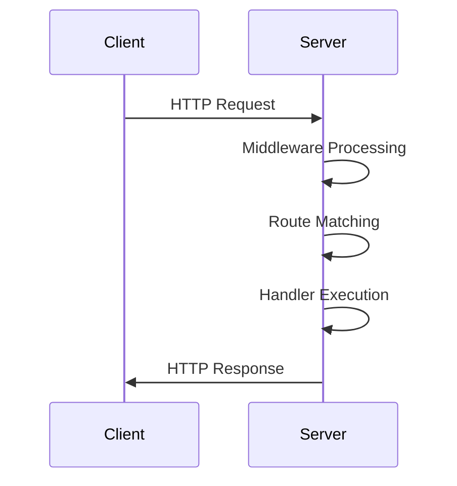

## 13.2. Building APIs with Ring and Compojure

Building APIs in Clojure is a rewarding endeavor, thanks to the powerful libraries Ring and Compojure. These libraries provide a robust foundation for creating RESTful services, offering flexibility and simplicity. In this section, we'll explore the architecture of Ring, introduce Compojure for routing, and guide you through setting up a simple API. We'll also discuss handling HTTP methods, parameters, and responses, and highlight best practices for structuring your API code. Additionally, we'll delve into middleware usage for cross-cutting concerns like logging and authentication.

### Understanding Ring: The Minimalistic Web Server Interface

Ring is a Clojure library that provides a minimalistic interface for web servers. It abstracts the HTTP protocol into a simple and consistent API, allowing developers to focus on building web applications without worrying about the underlying server details.

#### Architecture of Ring

Ring's architecture is based on a simple concept: a web application is a function that takes a request map and returns a response map. This functional approach aligns perfectly with Clojure's functional programming paradigm.

```clojure
;; A basic Ring handler function
(defn handler [request]
  {:status 200
   :headers {"Content-Type" "text/plain"}
   :body "Hello, World!"})
```

- **Request Map**: Contains information about the HTTP request, such as the method, URI, headers, and body.
- **Response Map**: Contains the HTTP status code, headers, and body of the response.

#### Key Components of Ring

- **Handlers**: Functions that process requests and return responses.
- **Middleware**: Functions that wrap handlers to modify requests or responses.
- **Adapters**: Connect Ring applications to web servers like Jetty or HTTP Kit.

### Introducing Compojure: Routing and Request Handling

Compojure is a routing library for Ring that simplifies the process of defining routes and handling requests. It allows you to map HTTP methods and paths to handler functions, making it easy to build RESTful APIs.

#### Setting Up Compojure

To get started with Compojure, you'll need to add it to your project dependencies. Here's how you can set up a basic Compojure application:

1. **Add Dependencies**: Include Ring and Compojure in your `project.clj` file.

```clojure
(defproject my-api "0.1.0-SNAPSHOT"
  :dependencies [[org.clojure/clojure "1.10.3"]
                 [ring/ring-core "1.9.0"]
                 [ring/ring-jetty-adapter "1.9.0"]
                 [compojure "1.6.2"]])
```

2. **Define Routes**: Use Compojure's routing DSL to define your API endpoints.

```clojure
(ns my-api.core
  (:require [compojure.core :refer :all]
            [compojure.route :as route]
            [ring.adapter.jetty :refer [run-jetty]]))

(defroutes app-routes
  (GET "/" [] "Welcome to my API!")
  (GET "/hello/:name" [name] (str "Hello, " name "!"))
  (route/not-found "Not Found"))

(defn -main []
  (run-jetty app-routes {:port 3000}))
```

- **GET "/"**: A simple route that returns a welcome message.
- **GET "/hello/:name"**: A dynamic route that greets the user by name.
- **route/not-found**: A catch-all route for handling 404 errors.

### Handling HTTP Methods, Parameters, and Responses

In a RESTful API, different HTTP methods (GET, POST, PUT, DELETE) are used to perform CRUD operations. Compojure makes it easy to handle these methods and extract parameters from requests.

#### Handling Different HTTP Methods

```clojure
(defroutes app-routes
  (GET "/items" [] (get-items))
  (POST "/items" [item] (create-item item))
  (PUT "/items/:id" [id item] (update-item id item))
  (DELETE "/items/:id" [id] (delete-item id)))
```

- **GET**: Retrieve a list of items.
- **POST**: Create a new item.
- **PUT**: Update an existing item.
- **DELETE**: Remove an item.

#### Extracting Parameters

Compojure allows you to extract parameters from the URL, query string, and request body.

```clojure
(GET "/search" [query] (search-items query))
(POST "/submit" {params :params} (process-form params))
```

- **URL Parameters**: Extracted using square brackets in the route definition.
- **Query String and Form Parameters**: Accessed via the `:params` key in the request map.

### Best Practices for Structuring API Code

When building APIs with Ring and Compojure, it's important to follow best practices for code organization and maintainability.

#### Organizing Routes

- **Separate Routes by Resource**: Group related routes into separate namespaces or files.
- **Use Compojure's `context`**: Define common path prefixes to avoid repetition.

```clojure
(context "/api" []
  (GET "/users" [] (get-users))
  (POST "/users" [] (create-user)))
```

#### Middleware for Cross-Cutting Concerns

Middleware functions are a powerful feature of Ring that allow you to handle cross-cutting concerns like logging, authentication, and error handling.

```clojure
(defn wrap-logging [handler]
  (fn [request]
    (println "Request:" request)
    (handler request)))

(def app
  (-> app-routes
      (wrap-logging)
      (wrap-authentication)))
```

- **Logging**: Use middleware to log requests and responses.
- **Authentication**: Implement authentication checks in middleware.
- **Error Handling**: Catch and handle exceptions in middleware.

### Middleware Usage for Logging and Authentication

Middleware in Ring is a function that takes a handler and returns a new handler. It can modify the request, response, or both.

#### Example: Logging Middleware

```clojure
(defn wrap-logging [handler]
  (fn [request]
    (println "Request:" request)
    (let [response (handler request)]
      (println "Response:" response)
      response)))
```

#### Example: Authentication Middleware

```clojure
(defn wrap-authentication [handler]
  (fn [request]
    (if (authenticated? request)
      (handler request)
      {:status 401 :body "Unauthorized"})))
```

### Try It Yourself

Now that you've learned the basics of building APIs with Ring and Compojure, try modifying the code examples to add new features or endpoints. Experiment with different HTTP methods, parameters, and middleware to see how they work in practice.

### Visualizing the API Architecture

To better understand the flow of requests and responses in a Ring and Compojure application, let's visualize the architecture using a sequence diagram.



This diagram illustrates the sequence of events when a client sends an HTTP request to a Ring and Compojure application. The request is processed by middleware, matched to a route, executed by a handler, and finally, a response is sent back to the client.

### References and Links

For more information on Ring and Compojure, check out the following resources:

- [Ring GitHub Repository](https://github.com/ring-clojure/ring)
- [Compojure GitHub Repository](https://github.com/weavejester/compojure)

### Knowledge Check

Before we wrap up, let's test your understanding of building APIs with Ring and Compojure.

## **Ready to Test Your Knowledge?**



### What is the primary purpose of Ring in Clojure web development?

- [x] To provide a minimalistic web server interface
- [ ] To handle database interactions
- [ ] To manage user authentication
- [ ] To perform data serialization

> **Explanation:** Ring provides a minimalistic web server interface, abstracting HTTP requests and responses into a simple API.

### How does Compojure simplify routing in Clojure applications?

- [x] By providing a DSL for defining routes
- [ ] By managing database connections
- [ ] By handling user sessions
- [ ] By optimizing server performance

> **Explanation:** Compojure offers a DSL for defining routes, making it easy to map HTTP methods and paths to handler functions.

### Which HTTP method is typically used to update an existing resource?

- [ ] GET
- [ ] POST
- [x] PUT
- [ ] DELETE

> **Explanation:** The PUT method is used to update an existing resource in RESTful APIs.

### What is the role of middleware in a Ring application?

- [x] To modify requests and responses
- [ ] To define database schemas
- [ ] To compile Clojure code
- [ ] To manage user interfaces

> **Explanation:** Middleware functions wrap handlers to modify requests and responses, handling cross-cutting concerns.

### How can you extract URL parameters in a Compojure route?

- [x] Using square brackets in the route definition
- [ ] By accessing the request body
- [ ] By using a global variable
- [ ] By querying the database

> **Explanation:** URL parameters are extracted using square brackets in the route definition in Compojure.

### What is a common use case for the DELETE HTTP method?

- [ ] To create a new resource
- [ ] To retrieve a resource
- [ ] To update a resource
- [x] To remove a resource

> **Explanation:** The DELETE method is used to remove a resource in RESTful APIs.

### Which component of Ring connects applications to web servers?

- [ ] Handlers
- [ ] Middleware
- [x] Adapters
- [ ] Routes

> **Explanation:** Adapters connect Ring applications to web servers like Jetty or HTTP Kit.

### What is the purpose of the `route/not-found` function in Compojure?

- [ ] To handle database errors
- [ ] To log requests
- [x] To handle 404 errors
- [ ] To authenticate users

> **Explanation:** The `route/not-found` function is used to handle 404 errors in Compojure applications.

### True or False: Middleware can only modify the request, not the response.

- [ ] True
- [x] False

> **Explanation:** Middleware can modify both the request and the response in a Ring application.

### Which of the following is a best practice for structuring API code?

- [x] Group related routes into separate namespaces
- [ ] Use global variables for state management
- [ ] Avoid using middleware
- [ ] Hardcode database credentials

> **Explanation:** Grouping related routes into separate namespaces helps organize code and improve maintainability.



Remember, building APIs with Ring and Compojure is just the beginning. As you continue to explore Clojure's web development capabilities, you'll discover more advanced techniques and patterns. Keep experimenting, stay curious, and enjoy the journey!
