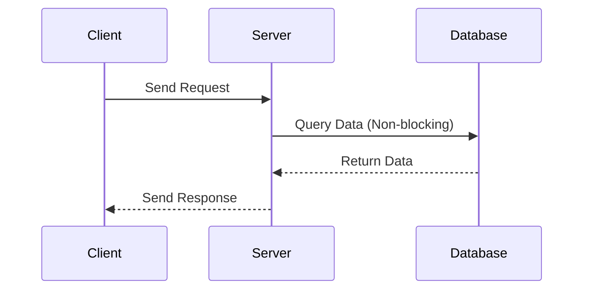

## 13.3. Asynchronous Web Applications with Async Servlet Support

In the realm of web development, handling multiple client requests efficiently is crucial for building scalable and responsive applications. Traditional synchronous request handling can become a bottleneck, especially when dealing with high traffic or long-running operations. This is where asynchronous web applications come into play, offering a way to handle concurrent requests more efficiently. In this section, we will explore how to build asynchronous web applications in Clojure using async servlets, and how libraries like [http-kit](http://www.http-kit.org/) and [Aleph](https://github.com/clj-commons/aleph) can facilitate this process.

### Understanding the Limitations of Synchronous Request Handling

Synchronous request handling follows a straightforward model: a client sends a request, the server processes it, and then sends back a response. This model is simple and easy to understand but has significant limitations:

- **Blocking Operations**: Each request is handled in a separate thread, which can block if it involves long-running operations like database queries or external API calls. This can lead to thread exhaustion under high load.
- **Resource Intensive**: Maintaining a thread per request can be resource-intensive, especially when dealing with thousands of concurrent connections.
- **Latency**: Users may experience increased latency as requests queue up, waiting for available threads to process them.

### Introducing Asynchronous Servlets

Asynchronous servlets provide a way to decouple request handling from the thread that processes it. Instead of blocking a thread while waiting for an operation to complete, the request can be suspended and resumed later, freeing up the thread to handle other tasks. This approach offers several advantages:

- **Improved Scalability**: By freeing up threads, servers can handle more concurrent connections without running out of resources.
- **Reduced Latency**: Requests can be processed as soon as resources become available, reducing wait times.
- **Efficient Resource Utilization**: Threads are used more efficiently, as they are not tied up waiting for I/O operations to complete.

### Using Libraries for Async Support

Clojure offers several libraries that provide support for building asynchronous web applications. Two popular choices are [http-kit](http://www.http-kit.org/) and [Aleph](https://github.com/clj-commons/aleph).

#### http-kit

[http-kit](http://www.http-kit.org/) is a lightweight, high-performance HTTP server and client library for Clojure. It supports asynchronous request handling out of the box, making it a great choice for building scalable web applications.

```clojure
(require '[org.httpkit.server :as http])

(defn async-handler [req]
  (http/with-channel req channel
    (http/on-receive channel
      (fn [data]
        ;; Process data asynchronously
        (http/send! channel {:status 200 :body "Hello, async world!"})))))

(http/run-server async-handler {:port 8080})
```

In this example, `http/with-channel` is used to handle requests asynchronously. The `on-receive` function processes incoming data without blocking the main thread.

#### Aleph

[Aleph](https://github.com/clj-commons/aleph) is another powerful library for building asynchronous web applications in Clojure. It is built on top of Netty, a high-performance network application framework.

```clojure
(require '[aleph.http :as http]
         '[manifold.stream :as s])

(defn async-handler [req]
  (let [response-stream (s/stream)]
    (s/put! response-stream {:status 200 :headers {"content-type" "text/plain"} :body "Hello, async world!"})
    response-stream))

(http/start-server async-handler {:port 8080})
```

Aleph uses Manifold streams to handle asynchronous data flow, allowing for efficient and non-blocking request processing.

### Handling Asynchronous Requests and Responses

When building asynchronous web applications, it's important to understand how to handle requests and responses efficiently. Here are some key considerations:

- **Non-blocking I/O**: Use non-blocking I/O operations to prevent threads from being tied up waiting for data.
- **Callbacks and Promises**: Utilize callbacks and promises to manage asynchronous operations and handle results when they become available.
- **Error Handling**: Implement robust error handling to manage exceptions and failures in asynchronous code.

### Use Cases for Asynchronous Handling

Asynchronous request handling is particularly beneficial in scenarios where:

- **High Concurrency**: Applications need to handle a large number of simultaneous connections, such as chat applications or real-time data feeds.
- **Long-running Operations**: Tasks that involve long-running operations, like file uploads or complex computations, can be processed without blocking other requests.
- **External API Calls**: When interacting with external services, asynchronous handling can prevent blocking while waiting for responses.

### Debugging and Error Handling in Asynchronous Applications

Debugging asynchronous applications can be challenging due to the non-linear flow of execution. Here are some tips to help:

- **Logging**: Use logging extensively to trace the flow of execution and identify where errors occur.
- **Error Propagation**: Ensure that errors are propagated correctly through callbacks and promises, and handle them appropriately.
- **Testing**: Write comprehensive tests to cover different scenarios and edge cases in your asynchronous code.

### Visualizing Asynchronous Request Handling

To better understand how asynchronous request handling works, let's visualize the process using a sequence diagram.



In this diagram, the server handles a request from the client and queries the database asynchronously. The server is free to handle other requests while waiting for the database to return data.

### Try It Yourself

To get hands-on experience with asynchronous web applications in Clojure, try modifying the code examples provided. Experiment with different scenarios, such as handling multiple concurrent requests or integrating with external APIs. This will help reinforce your understanding of asynchronous programming concepts.

### Key Takeaways

- Asynchronous web applications offer improved scalability and performance by decoupling request handling from processing threads.
- Libraries like [http-kit](http://www.http-kit.org/) and [Aleph](https://github.com/clj-commons/aleph) provide powerful tools for building asynchronous applications in Clojure.
- Effective error handling and debugging are crucial for managing the complexities of asynchronous code.

### External Resources

- [http-kit](http://www.http-kit.org/)
- [Aleph](https://github.com/clj-commons/aleph)

## **Ready to Test Your Knowledge?**



### What is a major limitation of synchronous request handling?

- [x] Blocking operations can lead to thread exhaustion.
- [ ] It is too complex to implement.
- [ ] It requires more memory than asynchronous handling.
- [ ] It cannot handle HTTP requests.

> **Explanation:** Synchronous request handling can lead to thread exhaustion because each request is handled in a separate thread, which can block if it involves long-running operations.

### What is an advantage of using asynchronous servlets?

- [x] Improved scalability by freeing up threads.
- [ ] They are easier to debug than synchronous servlets.
- [ ] They require less code to implement.
- [ ] They automatically handle all errors.

> **Explanation:** Asynchronous servlets improve scalability by freeing up threads, allowing the server to handle more concurrent connections.

### Which library is built on top of Netty for asynchronous web applications in Clojure?

- [x] Aleph
- [ ] http-kit
- [ ] Ring
- [ ] Compojure

> **Explanation:** Aleph is built on top of Netty, a high-performance network application framework, for asynchronous web applications in Clojure.

### What function does http-kit use to handle requests asynchronously?

- [x] http/with-channel
- [ ] http/on-receive
- [ ] http/send!
- [ ] http/run-server

> **Explanation:** The `http/with-channel` function is used in http-kit to handle requests asynchronously.

### What is a key consideration when handling asynchronous requests and responses?

- [x] Use non-blocking I/O operations.
- [ ] Use blocking I/O operations.
- [ ] Avoid using callbacks.
- [ ] Always use synchronous error handling.

> **Explanation:** Non-blocking I/O operations are crucial for preventing threads from being tied up waiting for data in asynchronous requests and responses.

### Which of the following is a use case for asynchronous handling?

- [x] High concurrency applications like chat apps.
- [ ] Simple static websites.
- [ ] Applications with no external API calls.
- [ ] Applications with minimal user interaction.

> **Explanation:** Asynchronous handling is beneficial for high concurrency applications like chat apps, where many simultaneous connections are common.

### What is a challenge in debugging asynchronous applications?

- [x] Non-linear flow of execution.
- [ ] Lack of available tools.
- [ ] Too much logging information.
- [ ] Simplicity of the code.

> **Explanation:** The non-linear flow of execution in asynchronous applications can make debugging challenging.

### How can errors be managed in asynchronous applications?

- [x] Propagate errors through callbacks and promises.
- [ ] Ignore errors and focus on performance.
- [ ] Use synchronous error handling.
- [ ] Avoid using error handling altogether.

> **Explanation:** Errors should be propagated through callbacks and promises to ensure they are handled appropriately in asynchronous applications.

### What is the role of Manifold streams in Aleph?

- [x] Handle asynchronous data flow.
- [ ] Provide synchronous request handling.
- [ ] Simplify error handling.
- [ ] Improve logging capabilities.

> **Explanation:** Manifold streams in Aleph handle asynchronous data flow, allowing for efficient and non-blocking request processing.

### Asynchronous web applications can reduce latency by processing requests as soon as resources become available.

- [x] True
- [ ] False

> **Explanation:** Asynchronous web applications reduce latency by processing requests as soon as resources become available, rather than waiting for threads to become free.



Remember, this is just the beginning. As you progress, you'll build more complex and interactive web applications. Keep experimenting, stay curious, and enjoy the journey!
