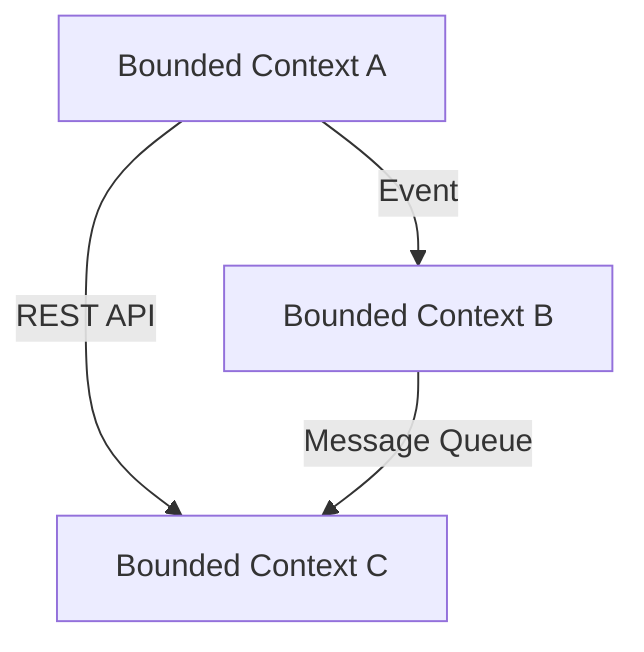

## 13.3 Bounded Contexts in Clojure

In the realm of Domain-Driven Design (DDD), bounded contexts play a pivotal role in managing complexity by defining clear boundaries within a domain. This article delves into the concept of bounded contexts, their significance in encapsulating models, and how they can be effectively implemented in Clojure applications.

### Introduction to Bounded Contexts

A bounded context is a central pattern in DDD that helps manage the complexity of large systems by dividing them into distinct areas, each with its own model. This separation ensures that models are consistent within their context, preventing ambiguity and conflicts that can arise from overlapping definitions.

#### Importance of Bounded Contexts

- **Encapsulation of Models:** Bounded contexts encapsulate models, ensuring that each context has its own language and rules, reducing the risk of misinterpretation.
- **Prevention of Ambiguity:** By clearly defining boundaries, bounded contexts prevent ambiguity and ensure that terms and concepts are understood consistently within each context.
- **Facilitation of Collaboration:** They enable teams to work independently on different contexts, fostering collaboration without stepping on each other's toes.

### Identifying and Defining Boundaries

Identifying and defining clear boundaries within a domain is crucial for the successful implementation of bounded contexts. Here are some strategies to achieve this:

1. **Domain Analysis:** Conduct a thorough analysis of the domain to understand the different subdomains and their interactions. This involves identifying core, supporting, and generic subdomains.

2. **Ubiquitous Language:** Develop a ubiquitous language for each context, ensuring that all stakeholders have a shared understanding of the terms and concepts used.

3. **Context Mapping:** Use context mapping to visualize the relationships and interactions between different bounded contexts. This helps in identifying dependencies and integration points.

4. **Team Structure Alignment:** Align team structures with bounded contexts to ensure that each team is responsible for a specific context, promoting ownership and accountability.

### Implementing Bounded Contexts in Clojure

Clojure, with its functional programming paradigm and emphasis on immutability, provides a robust platform for implementing bounded contexts. Here are some strategies to consider:

#### Code Organization

- **Namespaces:** Use Clojure's namespace feature to organize code within bounded contexts. Each context can have its own set of namespaces, encapsulating its models and logic.

- **Modules and Components:** Leverage libraries like Integrant or Component to manage dependencies and lifecycle of components within a context.

#### Data Encapsulation

- **Protocols and Records:** Define protocols and records to encapsulate data and behavior within a context. This ensures that each context has its own data structures and operations.

- **Spec and Schema Validation:** Use Clojure Spec or Schema to validate data within a context, ensuring that it adheres to the defined rules and constraints.

#### Integration Patterns

Communication between bounded contexts is essential for a cohesive system. Here are some integration patterns to facilitate this:

- **Event-Driven Architecture:** Use event-driven architecture to enable asynchronous communication between contexts. Libraries like core.async can be used to implement event streams.

- **RESTful APIs:** Expose RESTful APIs for synchronous communication between contexts. This allows contexts to interact while maintaining their independence.

- **Message Queues:** Implement message queues for reliable message delivery between contexts. Libraries like Apache Kafka or RabbitMQ can be integrated with Clojure for this purpose.

### Code Organization Practices

Aligning code organization with bounded contexts enhances maintainability and scalability. Here are some best practices:

- **Modular Design:** Design each context as a module with well-defined interfaces. This promotes reusability and reduces coupling between contexts.

- **Version Control:** Use version control systems to manage changes within each context independently. This allows teams to evolve their contexts without affecting others.

- **Testing Strategies:** Implement testing strategies that focus on the context level. This includes unit tests for individual components and integration tests for interactions between contexts.

### Advantages and Disadvantages

#### Advantages

- **Clear Boundaries:** Bounded contexts provide clear boundaries, reducing complexity and improving understanding.
- **Independent Development:** Teams can work independently on different contexts, enhancing productivity and reducing coordination overhead.
- **Scalability:** Systems can be scaled by adding or modifying contexts without affecting the entire system.

#### Disadvantages

- **Integration Complexity:** Managing communication between contexts can introduce complexity, especially in large systems.
- **Overhead:** Defining and maintaining bounded contexts requires effort and discipline, which can be challenging in dynamic environments.

### Conclusion

Bounded contexts are a powerful tool in Domain-Driven Design, enabling the encapsulation of models and prevention of ambiguity. By defining clear boundaries and leveraging Clojure's features, developers can create maintainable and scalable systems. As you explore bounded contexts in your projects, consider the strategies and best practices discussed here to maximize their benefits.

## Quiz Time!



### What is a bounded context in Domain-Driven Design?

- [x] A distinct area within a domain with its own model and language
- [ ] A shared model across multiple domains
- [ ] A database schema
- [ ] A user interface component

> **Explanation:** A bounded context is a distinct area within a domain that has its own model and language, ensuring consistency and preventing ambiguity.

### Which of the following is NOT a strategy for identifying bounded contexts?

- [ ] Domain Analysis
- [ ] Ubiquitous Language
- [x] Random Assignment
- [ ] Context Mapping

> **Explanation:** Random assignment is not a strategy for identifying bounded contexts. Domain analysis, ubiquitous language, and context mapping are effective strategies.

### How can Clojure's namespace feature be used in bounded contexts?

- [x] To organize code within bounded contexts
- [ ] To manage database connections
- [ ] To handle user authentication
- [ ] To perform data encryption

> **Explanation:** Clojure's namespace feature can be used to organize code within bounded contexts, encapsulating models and logic.

### What is the role of protocols and records in Clojure bounded contexts?

- [x] To encapsulate data and behavior within a context
- [ ] To manage network requests
- [ ] To handle file I/O operations
- [ ] To perform mathematical calculations

> **Explanation:** Protocols and records in Clojure are used to encapsulate data and behavior within a context, ensuring each context has its own data structures and operations.

### Which integration pattern is suitable for asynchronous communication between bounded contexts?

- [x] Event-Driven Architecture
- [ ] RESTful APIs
- [ ] Direct Database Access
- [ ] File Transfer

> **Explanation:** Event-driven architecture is suitable for asynchronous communication between bounded contexts, enabling decoupled interactions.

### What is a potential disadvantage of bounded contexts?

- [x] Integration Complexity
- [ ] Improved Scalability
- [ ] Clear Boundaries
- [ ] Independent Development

> **Explanation:** A potential disadvantage of bounded contexts is integration complexity, as managing communication between contexts can be challenging.

### Which library can be used in Clojure for managing component lifecycles within a bounded context?

- [x] Integrant
- [ ] Ring
- [ ] Compojure
- [ ] Leiningen

> **Explanation:** Integrant is a library that can be used in Clojure for managing component lifecycles within a bounded context.

### What is the benefit of using a ubiquitous language in bounded contexts?

- [x] Ensures a shared understanding of terms and concepts
- [ ] Increases code execution speed
- [ ] Reduces memory usage
- [ ] Simplifies database queries

> **Explanation:** A ubiquitous language ensures a shared understanding of terms and concepts within a bounded context, reducing ambiguity.

### How does modular design benefit bounded contexts?

- [x] Promotes reusability and reduces coupling
- [ ] Increases code complexity
- [ ] Slows down development
- [ ] Limits scalability

> **Explanation:** Modular design promotes reusability and reduces coupling between bounded contexts, enhancing maintainability.

### True or False: Bounded contexts eliminate the need for integration between different parts of a system.

- [ ] True
- [x] False

> **Explanation:** False. Bounded contexts do not eliminate the need for integration; they define clear boundaries, but integration is still necessary for communication between contexts.


