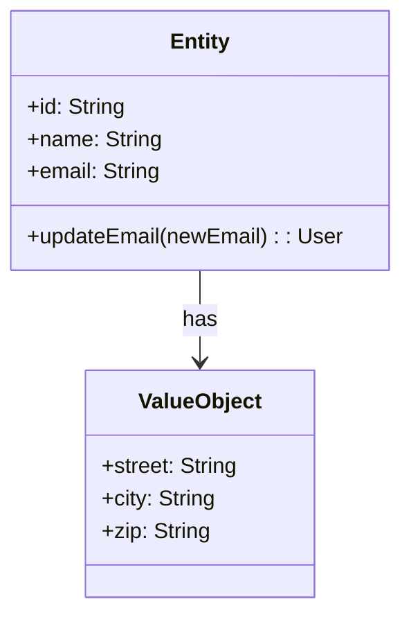

## 13.4 Entities and Value Objects in Clojure

In the realm of Domain-Driven Design (DDD), understanding the distinction between entities and value objects is crucial for effective domain modeling. Clojure, with its emphasis on immutability and functional programming, provides a unique perspective on implementing these concepts. This article delves into the characteristics of entities and value objects, how to model them in Clojure, and the benefits of leveraging immutability in your domain models.

### Introduction

Entities and value objects are fundamental building blocks in DDD. They help in structuring the domain model by clearly defining the roles and responsibilities of different objects. Let's explore these concepts in detail.

### Distinguishing Entities and Value Objects

#### Entities

Entities are objects that have a distinct identity that runs through time and different states. They are mutable in nature, meaning their state can change, but their identity remains constant. In a domain model, entities are often used to represent core business objects that have a lifecycle, such as a user, order, or product.

**Key Characteristics of Entities:**
- **Identity:** Each entity has a unique identifier that distinguishes it from other entities.
- **Lifecycle:** Entities have a lifecycle that involves creation, modification, and deletion.
- **State Changes:** The state of an entity can change over time, but its identity remains the same.

#### Value Objects

Value objects, on the other hand, are immutable and do not have an identity. They are defined by their attributes and are often used to describe aspects of the domain that do not require identity. Examples include a date, a monetary amount, or an address.

**Key Characteristics of Value Objects:**
- **Immutability:** Value objects are immutable, meaning their state cannot change after they are created.
- **Equality by Value:** Two value objects are considered equal if all their attributes are equal.
- **No Identity:** Value objects do not have a unique identifier.

### Modeling Entities in Clojure

In Clojure, entities can be modeled using maps or records, with a focus on maintaining a unique identifier for each entity. The identity can be managed using a unique key within the map or record.

```clojure
(defrecord User [id name email])

(defn create-user [id name email]
  (->User id name email))

(defn update-user-email [user new-email]
  (assoc user :email new-email))

;; Example usage
(def user (create-user 1 "Alice" "alice@example.com"))
(def updated-user (update-user-email user "alice@newdomain.com"))
```

In this example, `User` is an entity with a unique `id`. The `update-user-email` function demonstrates how the state of an entity can change while maintaining its identity.

### Creating Value Objects in Clojure

Value objects are naturally aligned with Clojure's immutable data structures. They can be represented using maps, records, or even simple data structures like vectors.

```clojure
(defrecord Address [street city zip])

(defn create-address [street city zip]
  (->Address street city zip))

;; Example usage
(def address1 (create-address "123 Main St" "Springfield" "12345"))
(def address2 (create-address "123 Main St" "Springfield" "12345"))

;; Checking equality
(= address1 address2) ;; true
```

Here, `Address` is a value object. Its equality is determined by its attributes, and it is immutable by nature.

### When to Use Entities vs. Value Objects

**Use Entities When:**
- The object has a unique identity that must be preserved across different states.
- The object has a lifecycle with state changes.
- The object represents a core business concept that requires tracking over time.

**Use Value Objects When:**
- The object is defined by its attributes rather than identity.
- Immutability is desired to ensure consistency and thread safety.
- The object represents a descriptive aspect of the domain without a lifecycle.

### Benefits of Immutability

Immutability is a cornerstone of Clojure's functional paradigm and offers several benefits:

- **Thread Safety:** Immutable objects can be shared across threads without synchronization, reducing complexity in concurrent applications.
- **Predictability:** Functions that operate on immutable data are easier to reason about, as they do not have side effects.
- **Ease of Testing:** Immutable objects simplify testing, as they do not change state unexpectedly.

### Visualizing Entities and Value Objects

To better understand the relationship between entities and value objects, consider the following diagram:



In this diagram, an `Entity` (e.g., `User`) has a relationship with a `ValueObject` (e.g., `Address`), illustrating how entities can contain value objects to describe their attributes.

### Best Practices

- **Leverage Immutability:** Use Clojure's immutable data structures for value objects to ensure consistency and thread safety.
- **Maintain Clear Boundaries:** Clearly distinguish between entities and value objects in your domain model to avoid confusion.
- **Use Records for Performance:** Consider using records for entities and value objects when performance is a concern, as they provide faster access to fields.

### Conclusion

Entities and value objects are essential concepts in Domain-Driven Design, and Clojure's functional paradigm offers powerful tools for modeling them effectively. By understanding the distinction between these two types of objects and leveraging immutability, you can create robust and maintainable domain models that align with DDD principles.

## Quiz Time!



### What is a key characteristic of an entity in Domain-Driven Design?

- [x] It has a unique identity.
- [ ] It is immutable.
- [ ] It is defined by its attributes.
- [ ] It has no lifecycle.

> **Explanation:** Entities have a unique identity that distinguishes them from other objects.

### How are value objects typically represented in Clojure?

- [x] As immutable data structures.
- [ ] As mutable data structures.
- [ ] With unique identifiers.
- [ ] With lifecycle management.

> **Explanation:** Value objects in Clojure are represented using immutable data structures like maps or records.

### Which of the following is true about value objects?

- [x] They are immutable.
- [ ] They have a unique identity.
- [ ] They have a lifecycle.
- [ ] They are mutable.

> **Explanation:** Value objects are immutable and do not have a unique identity.

### Why is immutability beneficial in Clojure?

- [x] It ensures thread safety.
- [ ] It allows for mutable state.
- [ ] It complicates testing.
- [ ] It requires synchronization.

> **Explanation:** Immutability ensures thread safety by allowing objects to be shared across threads without synchronization.

### When should you use an entity over a value object?

- [x] When the object has a unique identity.
- [ ] When the object is defined by its attributes.
- [ ] When immutability is required.
- [ ] When the object has no lifecycle.

> **Explanation:** Entities are used when an object has a unique identity that must be preserved.

### What is a common use case for value objects?

- [x] Representing descriptive aspects of the domain.
- [ ] Managing state changes over time.
- [ ] Tracking objects with unique identities.
- [ ] Handling lifecycle events.

> **Explanation:** Value objects are used to represent descriptive aspects of the domain without identity.

### How can entities be modeled in Clojure?

- [x] Using maps or records with unique identifiers.
- [ ] Using mutable data structures.
- [ ] Without any unique identifiers.
- [ ] As immutable data structures only.

> **Explanation:** Entities can be modeled using maps or records with unique identifiers to maintain identity.

### What is the primary focus of value objects?

- [x] Their attributes.
- [ ] Their unique identity.
- [ ] Their lifecycle.
- [ ] Their state changes.

> **Explanation:** Value objects are defined by their attributes rather than identity.

### Which of the following is NOT a characteristic of entities?

- [ ] They have a unique identity.
- [ ] They have a lifecycle.
- [x] They are immutable.
- [ ] They can change state.

> **Explanation:** Entities are mutable and can change state, unlike value objects.

### True or False: In Clojure, value objects are typically mutable.

- [ ] True
- [x] False

> **Explanation:** In Clojure, value objects are typically immutable, aligning with the language's functional paradigm.


