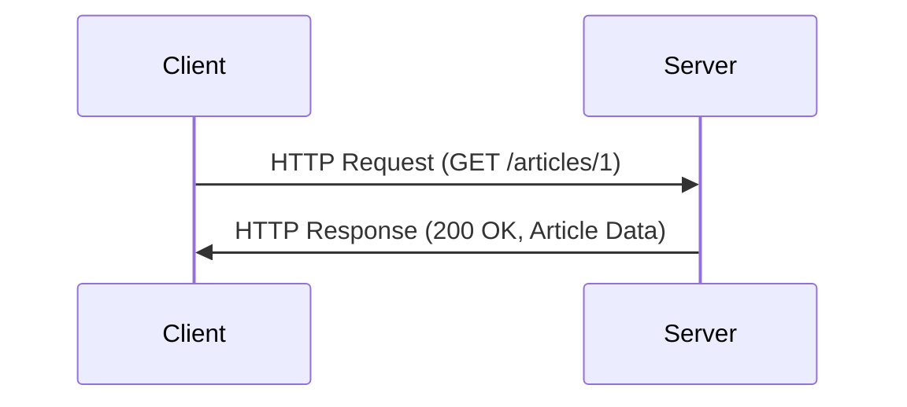

## 13.4. RESTful Services Design Patterns

RESTful services have become a cornerstone of modern web development, providing a standardized way to build scalable and maintainable APIs. In this section, we will explore the design patterns and best practices for creating robust RESTful services using Clojure. We'll cover the principles of RESTful architecture, resource-oriented design, statelessness, and more. Let's dive in!

### Principles of RESTful Architecture

REST (Representational State Transfer) is an architectural style that defines a set of constraints and principles for creating web services. Here are the key principles:

1. **Statelessness**: Each request from a client contains all the information needed to understand and process the request. The server does not store any session state about the client.

2. **Resource-Oriented Design**: Resources are the key abstraction in REST. They are identified by URIs (Uniform Resource Identifiers) and can be manipulated using standard HTTP methods.

3. **Uniform Interface**: RESTful services use a uniform interface, simplifying and decoupling the architecture. This includes using standard HTTP methods (GET, POST, PUT, DELETE) and status codes.

4. **Client-Server Architecture**: The client and server are separate entities, allowing them to evolve independently.

5. **Cacheability**: Responses must define themselves as cacheable or not to improve performance.

6. **Layered System**: A client cannot ordinarily tell whether it is connected directly to the end server or an intermediary along the way.

7. **Code on Demand (Optional)**: Servers can extend client functionality by transferring executable code.

### Resource-Oriented Design and Statelessness

In RESTful services, resources are the primary focus. Each resource is identified by a URI and can be represented in different formats, such as JSON or XML. Let's explore how to design resources and ensure statelessness in Clojure.

#### Designing Resources

Resources should be designed to represent entities in your application. For example, in a blogging platform, resources might include articles, authors, and comments. Each resource should have a unique URI, such as `/articles/{id}` or `/authors/{id}`.

```clojure
(ns myapp.routes
  (:require [compojure.core :refer :all]
            [ring.util.response :refer :all]))

(defroutes app-routes
  (GET "/articles/:id" [id]
    (response (get-article id)))
  (POST "/articles" request
    (create-article (:body request)))
  (PUT "/articles/:id" [id request]
    (update-article id (:body request)))
  (DELETE "/articles/:id" [id]
    (delete-article id)))
```

#### Ensuring Statelessness

Statelessness means that each request from the client must contain all the information necessary to understand and process the request. This can be achieved by using query parameters, headers, and request bodies to pass data.

### Handling CRUD Operations

CRUD (Create, Read, Update, Delete) operations are fundamental to RESTful services. Let's explore how to implement these operations in Clojure.

#### Create

To create a new resource, use the POST method. The client sends a request with the resource data in the body, and the server responds with the created resource and a status code of 201 (Created).

```clojure
(defn create-article [article-data]
  ;; Logic to create an article
  (created (save-article article-data)))
```

#### Read

To read a resource, use the GET method. The client sends a request to the resource's URI, and the server responds with the resource data.

```clojure
(defn get-article [id]
  ;; Logic to retrieve an article by ID
  (ok (find-article id)))
```

#### Update

To update a resource, use the PUT method. The client sends a request with the updated resource data, and the server responds with the updated resource.

```clojure
(defn update-article [id article-data]
  ;; Logic to update an article
  (ok (modify-article id article-data)))
```

#### Delete

To delete a resource, use the DELETE method. The client sends a request to the resource's URI, and the server responds with a status code of 204 (No Content).

```clojure
(defn delete-article [id]
  ;; Logic to delete an article
  (no-content (remove-article id)))
```

### Pagination and Filtering

Handling large datasets efficiently is crucial for RESTful services. Pagination and filtering are common techniques used to manage this.

#### Pagination

Pagination allows clients to request a subset of resources. Use query parameters to specify the page number and page size.

```clojure
(defn list-articles [page size]
  ;; Logic to retrieve a paginated list of articles
  (ok (get-articles page size)))
```

#### Filtering

Filtering allows clients to request resources that match specific criteria. Use query parameters to specify filter conditions.

```clojure
(defn filter-articles [criteria]
  ;; Logic to filter articles based on criteria
  (ok (find-articles criteria)))
```

### Proper Use of HTTP Status Codes and Methods

Using the correct HTTP status codes and methods is essential for RESTful services. Here are some common status codes:

- **200 OK**: The request was successful.
- **201 Created**: A new resource was created successfully.
- **204 No Content**: The request was successful, but there is no content to return.
- **400 Bad Request**: The request was invalid or cannot be served.
- **404 Not Found**: The requested resource could not be found.
- **500 Internal Server Error**: An error occurred on the server.

### API Versioning and Documentation

As APIs evolve, it's important to manage changes without breaking existing clients. API versioning and documentation are key to achieving this.

#### API Versioning

Version your API by including the version number in the URI or headers. This allows clients to specify which version they want to use.

```clojure
(defroutes v1-routes
  (GET "/v1/articles/:id" [id]
    (response (get-article-v1 id))))

(defroutes v2-routes
  (GET "/v2/articles/:id" [id]
    (response (get-article-v2 id))))
```

#### API Documentation

Provide comprehensive documentation for your API, including endpoints, request and response formats, and examples. Tools like Swagger can help generate interactive API documentation.

### Security Practices

Security is a critical aspect of RESTful services. Here are some best practices to ensure your API is secure.

#### Input Validation

Validate all input data to prevent injection attacks and other vulnerabilities. Use libraries like `clojure.spec` to define and enforce data specifications.

```clojure
(require '[clojure.spec.alpha :as s])

(s/def ::article-title string?)
(s/def ::article-content string?)

(defn validate-article [article]
  (s/valid? ::article article))
```

#### Authentication and Authorization

Implement authentication and authorization to control access to your API. Use libraries like `buddy` for authentication and authorization.

```clojure
(require '[buddy.auth :refer [authenticated?]])

(defn secure-endpoint [request]
  (if (authenticated? request)
    (ok "Access granted")
    (unauthorized "Access denied")))
```

### Visualizing RESTful Service Architecture

To better understand the architecture of a RESTful service, let's visualize the flow of a typical request.



**Caption**: This diagram illustrates the interaction between a client and server in a RESTful service. The client sends an HTTP request, and the server responds with the requested data.

### Try It Yourself

Experiment with the code examples provided in this section. Try modifying the CRUD operations to handle different resources or implement additional features like sorting or searching. Remember, practice is key to mastering RESTful services in Clojure!

### Summary

In this section, we've covered the essential design patterns and best practices for building RESTful services in Clojure. We've explored resource-oriented design, statelessness, CRUD operations, pagination, filtering, HTTP status codes, API versioning, and security practices. By following these guidelines, you can create robust and scalable RESTful services that meet the needs of modern web applications.

## **Ready to Test Your Knowledge?**



### What is the primary focus of RESTful services?

- [x] Resources
- [ ] Sessions
- [ ] Cookies
- [ ] Headers

> **Explanation:** RESTful services are resource-oriented, meaning resources are the key abstraction and focus of the architecture.

### Which HTTP method is used to update a resource?

- [ ] GET
- [ ] POST
- [x] PUT
- [ ] DELETE

> **Explanation:** The PUT method is used to update an existing resource in RESTful services.

### What does statelessness mean in RESTful services?

- [x] Each request contains all necessary information
- [ ] The server maintains session state
- [ ] The client stores session data
- [ ] The server caches all requests

> **Explanation:** Statelessness means that each request from the client must contain all the information needed to understand and process the request.

### Which HTTP status code indicates a successful resource creation?

- [ ] 200 OK
- [x] 201 Created
- [ ] 204 No Content
- [ ] 404 Not Found

> **Explanation:** The 201 Created status code indicates that a new resource has been successfully created.

### What is the purpose of API versioning?

- [x] To manage changes without breaking existing clients
- [ ] To improve performance
- [ ] To enhance security
- [ ] To reduce server load

> **Explanation:** API versioning allows you to manage changes to your API without breaking existing clients by specifying which version they want to use.

### Which library can be used for authentication in Clojure?

- [ ] clojure.spec
- [ ] compojure
- [x] buddy
- [ ] ring

> **Explanation:** The `buddy` library is commonly used for authentication and authorization in Clojure applications.

### How can you ensure input validation in Clojure?

- [ ] By using cookies
- [ ] By caching requests
- [x] By using clojure.spec
- [ ] By storing session data

> **Explanation:** `clojure.spec` is used to define and enforce data specifications, ensuring input validation.

### What is a common technique for handling large datasets in RESTful services?

- [ ] Caching
- [x] Pagination
- [ ] Session management
- [ ] Cookie storage

> **Explanation:** Pagination is a common technique used to handle large datasets by allowing clients to request a subset of resources.

### Which HTTP status code indicates that the requested resource could not be found?

- [ ] 200 OK
- [ ] 201 Created
- [ ] 204 No Content
- [x] 404 Not Found

> **Explanation:** The 404 Not Found status code indicates that the requested resource could not be found on the server.

### True or False: RESTful services should use a uniform interface.

- [x] True
- [ ] False

> **Explanation:** RESTful services should use a uniform interface to simplify and decouple the architecture, using standard HTTP methods and status codes.



Remember, this is just the beginning. As you progress, you'll build more complex and interactive web services. Keep experimenting, stay curious, and enjoy the journey!
