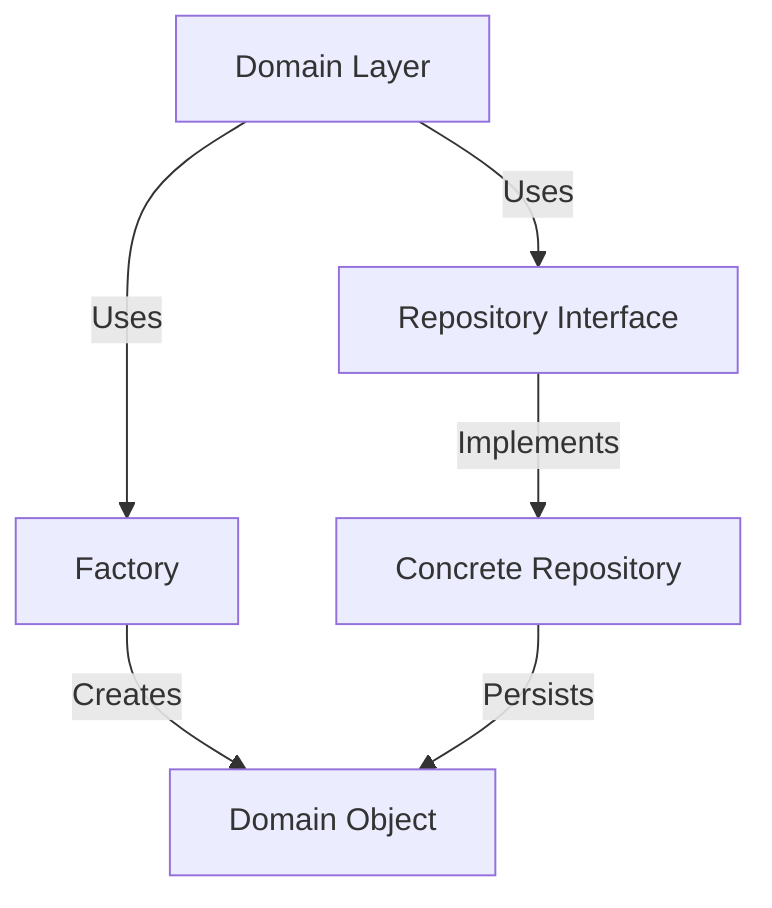

---

linkTitle: "13.5 Repositories and Factories in Clojure"
title: "Repositories and Factories in Clojure: Managing Storage and Object Creation in Domain-Driven Design"
description: "Explore the role of repositories and factories in Clojure for managing storage and retrieval of aggregates, and encapsulating object creation logic within Domain-Driven Design."
categories:
- Software Design
- Domain-Driven Design
- Clojure Patterns
tags:
- Repositories
- Factories
- Clojure
- Domain-Driven Design
- Design Patterns
date: 2024-10-25
type: docs
nav_weight: 1350000
canonical: "https://softwarepatternslexicon.com/patterns-clojure/13/5"
license: "© 2024 Tokenizer Inc. CC BY-NC-SA 4.0"
---

## 13.5 Repositories and Factories in Clojure

In the realm of Domain-Driven Design (DDD), repositories and factories play crucial roles in managing the lifecycle of domain objects. Repositories abstract the data layer, providing a clean interface for storage and retrieval of aggregates, while factories encapsulate the logic of object creation, ensuring that domain objects are instantiated correctly and consistently. This article delves into how these patterns can be effectively implemented in Clojure, leveraging its functional programming paradigms and powerful abstractions.

### Introduction to Repositories and Factories

**Repositories** serve as a bridge between the domain and data mapping layers, abstracting the complexities of data access and persistence. They provide a collection-like interface for accessing domain objects, allowing the domain logic to remain agnostic of the underlying data storage mechanisms.

**Factories**, on the other hand, are responsible for creating instances of domain objects. They encapsulate the instantiation logic, ensuring that objects are created in a consistent state, often incorporating complex initialization processes.

### Implementing Repositories in Clojure

In Clojure, repositories can be implemented using protocols or multimethods, which provide polymorphic dispatch based on the type of the aggregate or the operation being performed.

#### Using Protocols for Repository Interfaces

Clojure protocols offer a way to define a set of operations that can be implemented by different types. Here's how you can define a repository protocol for managing a simple `User` aggregate:

```clojure
(defprotocol UserRepository
  (find-user [this id])
  (save-user [this user])
  (delete-user [this id]))
```

This protocol defines three operations: `find-user`, `save-user`, and `delete-user`. Implementations of this protocol can vary depending on the storage mechanism, such as in-memory, database, or even a remote service.

#### Implementing a Repository with Multimethods

Multimethods provide another approach, allowing dispatch based on arbitrary criteria. This can be useful when you need more flexibility in your repository logic:

```clojure
(defmulti user-repo (fn [action & _] action))

(defmethod user-repo :find [action id]
  ;; Implementation for finding a user
  )

(defmethod user-repo :save [action user]
  ;; Implementation for saving a user
  )

(defmethod user-repo :delete [action id]
  ;; Implementation for deleting a user
  )
```

### Encapsulating Object Creation with Factories

Factories in Clojure can be implemented using higher-order functions or macros, providing a flexible way to encapsulate object creation logic.

#### Higher-Order Functions as Factories

Higher-order functions can be used to create factory functions that encapsulate the creation logic of domain objects:

```clojure
(defn user-factory [name email]
  {:id (java.util.UUID/randomUUID)
   :name name
   :email email
   :created-at (java.time.Instant/now)})
```

This factory function generates a new `User` map with a unique ID and timestamp, ensuring that each user is created with the necessary attributes.

#### Using Macros for Factory Creation

Macros can also be employed to create more complex factory logic, especially when dealing with DSLs or repetitive patterns:

```clojure
(defmacro defentity [name & fields]
  `(defn ~(symbol (str name "-factory")) [~@fields]
     (merge {:id (java.util.UUID/randomUUID)
             :created-at (java.time.Instant/now)}
            (zipmap '~fields [~@fields]))))

(defentity user name email)
```

This macro defines a factory function for any entity, automatically adding an ID and creation timestamp.

### Separation of Concerns

A key principle in DDD is the separation of concerns between domain logic and data persistence. Repositories and factories help achieve this by isolating the persistence logic from the domain model. This separation ensures that domain objects remain focused on business logic, while repositories handle data access and factories manage object creation.

### Visualizing Repositories and Factories

To better understand the interaction between repositories, factories, and domain objects, consider the following diagram:



This diagram illustrates how the domain layer interacts with repositories and factories, maintaining a clear separation between concerns.

### Advantages and Disadvantages

**Advantages:**
- **Abstraction:** Repositories abstract data access, allowing for easy swapping of storage mechanisms.
- **Consistency:** Factories ensure consistent object creation, reducing errors related to improper initialization.
- **Separation of Concerns:** Keeps domain logic clean and focused on business rules.

**Disadvantages:**
- **Complexity:** Introducing repositories and factories can add complexity, especially in simple applications.
- **Overhead:** May introduce additional layers of abstraction that are unnecessary for straightforward use cases.

### Best Practices

- **Define Clear Interfaces:** Use protocols or multimethods to define clear interfaces for repositories.
- **Encapsulate Creation Logic:** Use factories to encapsulate complex creation logic, ensuring domain objects are always in a valid state.
- **Focus on Domain Logic:** Keep domain objects free from persistence concerns, focusing on business rules and logic.

### Conclusion

Repositories and factories are powerful patterns in Domain-Driven Design, providing a structured approach to managing data access and object creation. By leveraging Clojure's functional programming capabilities, these patterns can be implemented in a clean and efficient manner, promoting maintainability and scalability in your applications.

## Quiz Time!



### What is the primary role of a repository in Domain-Driven Design?

- [x] To abstract the data layer and provide a clean interface for storage and retrieval of aggregates.
- [ ] To encapsulate the logic of object creation.
- [ ] To manage the lifecycle of domain events.
- [ ] To define the business rules of the domain.

> **Explanation:** Repositories abstract the data layer, providing a clean interface for accessing and manipulating aggregates without exposing the underlying storage details.


### How can Clojure protocols be used in implementing repositories?

- [x] By defining a set of operations that can be implemented by different types.
- [ ] By encapsulating object creation logic.
- [ ] By managing state changes in a controlled manner.
- [ ] By providing a centralized registry for service instances.

> **Explanation:** Clojure protocols allow you to define a set of operations that can be implemented by various types, making them suitable for defining repository interfaces.


### What is a key benefit of using factories in object creation?

- [x] They ensure consistent object creation, reducing errors related to improper initialization.
- [ ] They provide a centralized registry for service instances.
- [ ] They manage the lifecycle of domain events.
- [ ] They abstract the data layer and provide a clean interface for storage.

> **Explanation:** Factories encapsulate the logic of object creation, ensuring that objects are instantiated consistently and correctly.


### Which Clojure feature allows for polymorphic dispatch based on arbitrary criteria?

- [ ] Protocols
- [x] Multimethods
- [ ] Macros
- [ ] Atoms

> **Explanation:** Multimethods in Clojure allow for polymorphic dispatch based on arbitrary criteria, providing flexibility in implementing repository logic.


### What is the purpose of the `defentity` macro example provided in the article?

- [x] To define a factory function for any entity, automatically adding an ID and creation timestamp.
- [ ] To manage the lifecycle of domain events.
- [ ] To abstract the data layer and provide a clean interface for storage.
- [ ] To encapsulate the logic of object creation.

> **Explanation:** The `defentity` macro creates a factory function for any entity, ensuring consistent creation with an ID and timestamp.


### What is a disadvantage of using repositories and factories?

- [x] They can add complexity, especially in simple applications.
- [ ] They ensure consistent object creation.
- [ ] They abstract the data layer.
- [ ] They promote separation of concerns.

> **Explanation:** While repositories and factories provide many benefits, they can introduce complexity, particularly in simpler applications where such abstraction might be unnecessary.


### How do repositories and factories promote separation of concerns?

- [x] By isolating persistence logic from domain logic, allowing domain objects to focus on business rules.
- [ ] By managing the lifecycle of domain events.
- [ ] By providing a centralized registry for service instances.
- [ ] By encapsulating the logic of object creation.

> **Explanation:** Repositories and factories separate persistence and creation logic from domain logic, ensuring that domain objects remain focused on business rules.


### What is the role of a factory in Domain-Driven Design?

- [ ] To abstract the data layer and provide a clean interface for storage.
- [x] To encapsulate the logic of object creation, ensuring consistent instantiation.
- [ ] To manage the lifecycle of domain events.
- [ ] To define the business rules of the domain.

> **Explanation:** Factories encapsulate the logic of object creation, ensuring that domain objects are instantiated consistently and correctly.


### Which of the following is a best practice when implementing repositories in Clojure?

- [x] Define clear interfaces using protocols or multimethods.
- [ ] Use factories to encapsulate complex creation logic.
- [ ] Focus on domain logic and keep domain objects free from persistence concerns.
- [ ] Use macros to create more complex factory logic.

> **Explanation:** Defining clear interfaces using protocols or multimethods is a best practice for implementing repositories, ensuring consistent and flexible data access.


### True or False: Repositories and factories are only useful in large, complex applications.

- [ ] True
- [x] False

> **Explanation:** While repositories and factories are particularly beneficial in large, complex applications, they can also provide structure and consistency in smaller projects, depending on the requirements.


