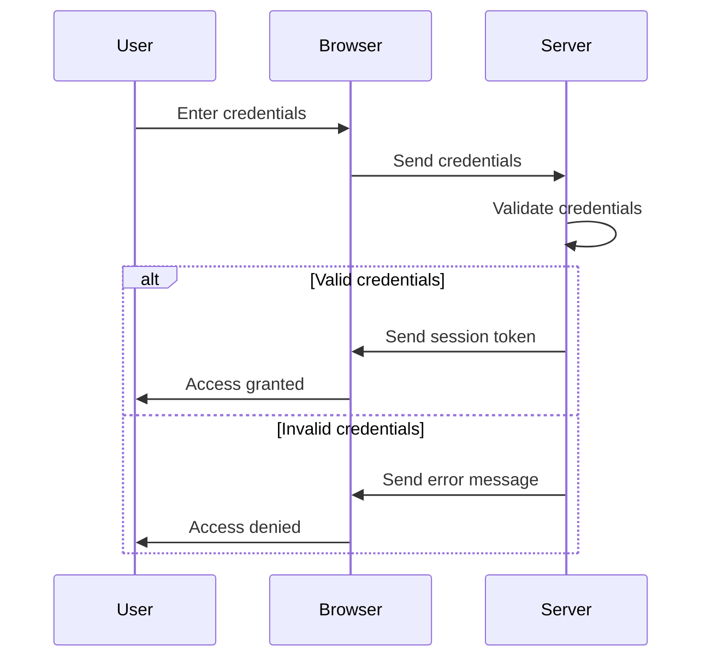

## 13.5. Authentication and Authorization with Friend and Buddy

In the realm of web development, ensuring that users are who they claim to be (authentication) and that they have the appropriate permissions to access resources (authorization) are critical components. In Clojure, libraries such as [Friend](https://github.com/cemerick/friend) and [Buddy](https://funcool.github.io/buddy-auth/latest/) provide robust solutions for implementing these security features. This section will guide you through the concepts, comparisons, and implementations of authentication and authorization using these libraries.

### Understanding Authentication and Authorization

**Authentication** is the process of verifying the identity of a user or system. Common methods include:

- **Form-based Authentication**: Users provide credentials via a form.
- **Token-based Authentication**: Users receive a token after initial authentication, which is used for subsequent requests.
- **OAuth**: A protocol for token-based authentication and authorization, allowing third-party services to exchange information without exposing user credentials.

**Authorization**, on the other hand, determines what an authenticated user is allowed to do. This often involves:

- **Role-Based Access Control (RBAC)**: Users are assigned roles, and permissions are granted based on these roles.
- **Attribute-Based Access Control (ABAC)**: Access is granted based on attributes and policies.

### Comparing Friend and Buddy

Both Friend and Buddy are popular libraries in the Clojure ecosystem for handling authentication and authorization, but they have different strengths and use cases.

#### Friend

Friend is a comprehensive library that provides:

- **Pluggable Authentication**: Supports various authentication workflows, including form-based and OAuth.
- **Authorization**: Offers role-based access control.
- **Ease of Integration**: Designed to work seamlessly with Ring, a Clojure web application library.

#### Buddy

Buddy is a more modern library that focuses on:

- **Token-Based Authentication**: Strong support for JWT (JSON Web Tokens) and session management.
- **Security Features**: Includes cryptographic functions and utilities for secure password storage.
- **Flexibility**: Provides a modular approach, allowing developers to pick and choose components as needed.

### Implementing Authentication with Friend

Let's start by implementing a simple form-based authentication using Friend.

```clojure
(ns myapp.core
  (:require [ring.adapter.jetty :refer [run-jetty]]
            [ring.middleware.defaults :refer [wrap-defaults site-defaults]]
            [cemerick.friend :as friend]
            [cemerick.friend.credentials :as creds]
            [cemerick.friend.workflows :as workflows]))

;; Define a simple user database
(def users {"user1" {:username "user1"
                     :password (creds/hash-bcrypt "password")
                     :roles #{::user}}})

;; Define a simple handler
(defn handler [request]
  {:status 200
   :headers {"Content-Type" "text/html"}
   :body "Welcome to the secure area!"})

;; Wrap the handler with Friend's authentication middleware
(def app
  (-> handler
      (friend/authenticate {:credential-fn (partial creds/bcrypt-credential-fn users)
                            :workflows [(workflows/interactive-form)]})
      (wrap-defaults site-defaults)))

;; Start the server
(defn -main []
  (run-jetty app {:port 3000}))
```

In this example, we define a simple user database with bcrypt-hashed passwords and wrap our handler with Friend's authentication middleware. The `interactive-form` workflow handles form-based login.

### Implementing Authentication with Buddy

Now, let's implement token-based authentication using Buddy.

```clojure
(ns myapp.core
  (:require [ring.adapter.jetty :refer [run-jetty]]
            [ring.middleware.defaults :refer [wrap-defaults site-defaults]]
            [buddy.auth :refer [authenticated?]]
            [buddy.auth.backends.token :refer [jws-backend]]
            [buddy.auth.middleware :refer [wrap-authentication]]
            [buddy.sign.jwt :as jwt]))

;; Define a secret key for signing tokens
(def secret "mysecretkey")

;; Define a simple handler
(defn handler [request]
  (if (authenticated? request)
    {:status 200
     :headers {"Content-Type" "text/html"}
     :body "Welcome to the secure area!"}
    {:status 401
     :headers {"Content-Type" "text/html"}
     :body "Unauthorized"}))

;; Define the authentication backend
(def backend (jws-backend {:secret secret}))

;; Wrap the handler with Buddy's authentication middleware
(def app
  (-> handler
      (wrap-authentication backend)
      (wrap-defaults site-defaults)))

;; Start the server
(defn -main []
  (run-jetty app {:port 3000}))
```

In this example, we use Buddy's `jws-backend` for token-based authentication. The `authenticated?` function checks if the request contains a valid token.

### Authorization Strategies

#### Role-Based Access Control (RBAC)

Both Friend and Buddy support RBAC, allowing you to define roles and permissions.

**Friend Example:**

```clojure
(friend/authenticate {:credential-fn (partial creds/bcrypt-credential-fn users)
                      :workflows [(workflows/interactive-form)]
                      :authorization-fn (fn [identity]
                                          (contains? (:roles identity) ::admin))})
```

**Buddy Example:**

```clojure
(defn admin-handler [request]
  (if (some #{:admin} (:roles request))
    {:status 200 :body "Admin area"}
    {:status 403 :body "Forbidden"}))
```

### Best Practices for Securing Web Applications

1. **Use Strong Password Hashing**: Always hash passwords using strong algorithms like bcrypt.
2. **Implement HTTPS**: Ensure all data is transmitted securely using HTTPS.
3. **Validate Input**: Protect against injection attacks by validating and sanitizing user input.
4. **Use Secure Tokens**: For token-based authentication, use secure, signed tokens like JWT.
5. **Limit Session Lifetimes**: Implement session expiration and renewal strategies.
6. **Regularly Update Dependencies**: Keep libraries and dependencies up to date to mitigate vulnerabilities.

### Session Management and Storing Credentials Securely

- **Session Management**: Use secure cookies and consider session storage mechanisms that prevent session hijacking.
- **Storing Credentials**: Never store plain-text passwords. Use environment variables or secure vaults for sensitive information.

### Visualizing Authentication Flow



This diagram illustrates the typical flow of form-based authentication, where the user submits credentials, the server validates them, and a session token is issued upon successful authentication.

### Try It Yourself

Experiment with the provided code examples by:

- Modifying the user database to include additional users and roles.
- Implementing additional authentication workflows, such as OAuth.
- Enhancing the authorization logic to include more complex role hierarchies.

### References and Links

- [Friend](https://github.com/cemerick/friend)
- [Buddy Authentication](https://funcool.github.io/buddy-auth/latest/)
- [Ring](https://github.com/ring-clojure/ring)
- [Clojure Documentation](https://clojure.org/reference/documentation)

### Knowledge Check

- What are the differences between authentication and authorization?
- How does Friend handle form-based authentication?
- What are the benefits of using token-based authentication with Buddy?
- How can you implement role-based access control in Clojure?
- What are some best practices for securing web applications?

### Embrace the Journey

Remember, mastering authentication and authorization is a journey. As you progress, you'll build more secure and robust web applications. Keep experimenting, stay curious, and enjoy the journey!

## **Ready to Test Your Knowledge?**



### What is the primary purpose of authentication?

- [x] Verifying the identity of a user or system
- [ ] Determining what resources a user can access
- [ ] Encrypting data
- [ ] Managing user sessions

> **Explanation:** Authentication is the process of verifying the identity of a user or system.

### Which library provides strong support for token-based authentication in Clojure?

- [ ] Friend
- [x] Buddy
- [ ] Ring
- [ ] Compojure

> **Explanation:** Buddy provides strong support for token-based authentication, including JWT.

### What is a common method for storing user passwords securely?

- [ ] Plain text
- [x] Hashing with bcrypt
- [ ] Encoding with Base64
- [ ] Storing in cookies

> **Explanation:** Hashing passwords with bcrypt is a secure method for storing user passwords.

### How does Friend handle form-based authentication?

- [x] Using interactive-form workflows
- [ ] Using JWT tokens
- [ ] Through OAuth only
- [ ] By storing passwords in cookies

> **Explanation:** Friend handles form-based authentication using interactive-form workflows.

### What is a key feature of role-based access control (RBAC)?

- [x] Assigning permissions based on user roles
- [ ] Encrypting user data
- [ ] Using tokens for authentication
- [ ] Storing user sessions in cookies

> **Explanation:** RBAC assigns permissions based on user roles, allowing for structured access control.

### What is a best practice for securing web applications?

- [x] Implementing HTTPS
- [ ] Using plain text passwords
- [ ] Storing tokens in local storage
- [ ] Ignoring input validation

> **Explanation:** Implementing HTTPS ensures secure data transmission, which is a best practice for web security.

### Which library is designed to work seamlessly with Ring?

- [x] Friend
- [ ] Buddy
- [ ] ClojureScript
- [ ] Leiningen

> **Explanation:** Friend is designed to work seamlessly with Ring, a Clojure web application library.

### What is the purpose of the `authenticated?` function in Buddy?

- [x] To check if a request contains a valid token
- [ ] To hash user passwords
- [ ] To encrypt data
- [ ] To manage user sessions

> **Explanation:** The `authenticated?` function in Buddy checks if a request contains a valid token.

### What is the benefit of using JWT for authentication?

- [x] Stateless authentication
- [ ] Requires server-side session storage
- [ ] Increases server load
- [ ] Requires plain text passwords

> **Explanation:** JWT allows for stateless authentication, reducing the need for server-side session storage.

### True or False: Authorization is the process of verifying user identity.

- [ ] True
- [x] False

> **Explanation:** Authorization is the process of determining what resources an authenticated user can access, not verifying identity.


