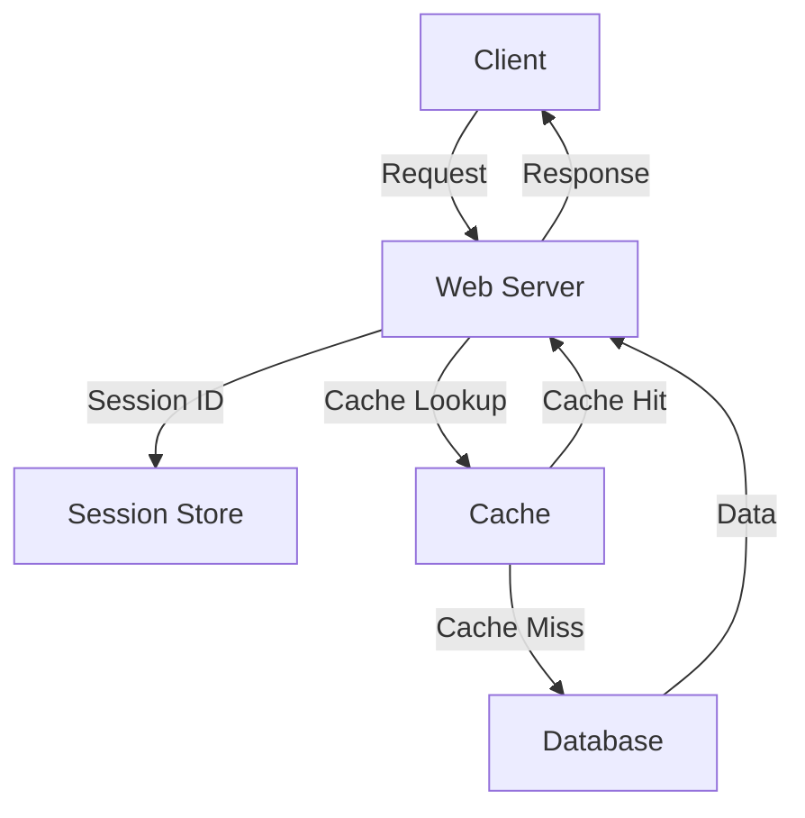

## 13.6. Managing State in Web Applications

In the realm of web development, managing state is a crucial aspect that can significantly impact the performance, scalability, and user experience of an application. Clojure, with its functional programming paradigm and immutable data structures, offers unique approaches to handling state in web applications. In this section, we will explore various strategies for managing state, including session management, caching, and handling user data, while emphasizing best practices for scalability and consistency.

### Understanding the Stateless Nature of HTTP

The Hypertext Transfer Protocol (HTTP) is inherently stateless, meaning each request from a client to a server is independent and does not retain any information about previous interactions. This statelessness simplifies the protocol and makes it scalable, but it also poses challenges for maintaining state across multiple requests.

#### Implications of Statelessness

- **Session Management**: Without built-in state management, developers must implement mechanisms to track user sessions across requests.
- **Data Persistence**: Any data that needs to persist between requests must be stored externally, such as in databases or in-memory stores.
- **Scalability**: Statelessness allows for easy scaling of web applications, as any server can handle any request without needing to share state information.

### Methods for Maintaining User Sessions

To manage user sessions in a stateless environment, developers commonly use cookies and tokens. These methods allow the server to recognize returning users and maintain a continuous session.

#### Cookies

Cookies are small pieces of data stored on the client's browser and sent with each HTTP request to the server. They can be used to store session identifiers, which the server can use to retrieve session data.

```clojure
(ns myapp.session
  (:require [ring.middleware.cookies :refer [wrap-cookies]]))

(defn handler [request]
  (let [session-id (get-in request [:cookies "session-id"])]
    ;; Retrieve session data using session-id
    ))

(def app
  (wrap-cookies handler))
```

#### Tokens

Tokens, such as JSON Web Tokens (JWT), are another popular method for session management. They are self-contained and can include user information and expiration times.

```clojure
(ns myapp.auth
  (:require [buddy.sign.jwt :as jwt]))

(def secret "my-secret-key")

(defn generate-token [user-id]
  (jwt/sign {:user-id user-id} secret))

(defn verify-token [token]
  (jwt/unsign token secret))
```

### Server-Side vs. Client-Side State Management

State management can occur on the server side, client side, or a combination of both. Each approach has its advantages and trade-offs.

#### Server-Side State Management

In server-side state management, the server maintains the state, often in a database or in-memory store. This approach centralizes state management and can simplify client logic.

- **Advantages**: Centralized control, easier to secure, and can handle complex state.
- **Disadvantages**: Increased server load and potential bottlenecks.

```clojure
(ns myapp.state
  (:require [clojure.java.jdbc :as jdbc]))

(def db-spec {:dbtype "h2" :dbname "test"})

(defn save-state [user-id state]
  (jdbc/insert! db-spec :user_state {:user_id user-id :state state}))

(defn get-state [user-id]
  (jdbc/query db-spec ["SELECT state FROM user_state WHERE user_id = ?" user-id]))
```

#### Client-Side State Management

Client-side state management involves storing state information on the client, often using local storage or cookies. This reduces server load but can complicate client logic.

- **Advantages**: Reduced server load, faster response times.
- **Disadvantages**: Increased complexity on the client side, potential security risks.

```javascript
// Storing state in local storage
localStorage.setItem('userState', JSON.stringify(state));

// Retrieving state from local storage
const state = JSON.parse(localStorage.getItem('userState'));
```

### Caching Strategies for Performance Improvement

Caching is a powerful technique to improve the performance of web applications by storing frequently accessed data in a fast-access storage layer.

#### In-Memory Caching

In-memory caching stores data in RAM, providing fast access times. Libraries like Caffeine can be used for in-memory caching in Clojure applications.

```clojure
(ns myapp.cache
  (:require [com.github.ben-manes.caffeine.cache :as cache]))

(def my-cache (cache/build-cache {:maximum-size 1000}))

(defn get-from-cache [key]
  (cache/get my-cache key))

(defn put-in-cache [key value]
  (cache/put my-cache key value))
```

#### Distributed Caching

Distributed caching involves using external systems like Redis or Memcached to store cached data. This approach is suitable for applications with multiple servers.

```clojure
(ns myapp.redis
  (:require [carmine :as redis]))

(def conn {:pool {} :spec {:host "localhost" :port 6379}})

(defn get-from-redis [key]
  (redis/wcar conn (redis/get key)))

(defn put-in-redis [key value]
  (redis/wcar conn (redis/set key value)))
```

### Storing State in Databases or In-Memory Stores

For persistent state management, databases and in-memory stores are commonly used. Each has its own use cases and trade-offs.

#### Databases

Databases provide durable storage for state data and are suitable for applications requiring complex queries and transactions.

- **Relational Databases**: Use SQL for structured data and complex relationships.
- **NoSQL Databases**: Use for unstructured or semi-structured data and scalability.

```clojure
(ns myapp.db
  (:require [clojure.java.jdbc :as jdbc]))

(def db-spec {:dbtype "postgresql" :dbname "mydb"})

(defn save-user [user]
  (jdbc/insert! db-spec :users user))

(defn get-user [user-id]
  (jdbc/query db-spec ["SELECT * FROM users WHERE id = ?" user-id]))
```

#### In-Memory Stores

In-memory stores like Redis provide fast access to state data and are suitable for caching and session management.

```clojure
(ns myapp.redis-session
  (:require [carmine :as redis]))

(def conn {:pool {} :spec {:host "localhost" :port 6379}})

(defn save-session [session-id data]
  (redis/wcar conn (redis/set session-id data)))

(defn get-session [session-id]
  (redis/wcar conn (redis/get session-id)))
```

### Best Practices for Scalability and Consistency

When managing state in web applications, it's important to follow best practices to ensure scalability and consistency.

- **Use Stateless Services**: Design services to be stateless whenever possible, using external systems for state management.
- **Implement Caching**: Use caching to reduce load on databases and improve response times.
- **Choose the Right Storage**: Select the appropriate storage solution based on data access patterns and scalability requirements.
- **Ensure Consistency**: Use transactions and locking mechanisms to maintain data consistency.
- **Monitor and Optimize**: Continuously monitor application performance and optimize state management strategies.

### Visualizing State Management in Web Applications

Below is a diagram illustrating the flow of state management in a typical web application using Clojure.



**Diagram Description**: This flowchart represents a typical state management process in a web application. The client sends a request to the web server, which checks the session store for session data. The server also performs a cache lookup to retrieve data. If the data is not in the cache, it queries the database. The server then sends the response back to the client.

### Try It Yourself

Experiment with the code examples provided in this section. Try modifying the session management logic to use JWTs instead of cookies, or implement a caching layer using Redis. Observe how these changes affect the performance and scalability of your application.

### References and Further Reading

- [MDN Web Docs: HTTP Cookies](https://developer.mozilla.org/en-US/docs/Web/HTTP/Cookies)
- [Redis Documentation](https://redis.io/documentation)
- [Clojure Documentation](https://clojure.org/reference/documentation)

### Knowledge Check

- What are the implications of HTTP being stateless?
- How can cookies and tokens be used for session management?
- What are the advantages and disadvantages of server-side and client-side state management?
- How does caching improve the performance of web applications?
- What are the best practices for managing state in scalable web applications?

### Embrace the Journey

Remember, managing state in web applications is a journey of continuous learning and improvement. As you explore different strategies and tools, you'll gain a deeper understanding of how to build robust and scalable applications. Keep experimenting, stay curious, and enjoy the journey!

## **Ready to Test Your Knowledge?**



### What is the primary challenge of managing state in web applications due to HTTP's nature?

- [x] HTTP is stateless, requiring external mechanisms for state management.
- [ ] HTTP is slow, necessitating performance optimizations.
- [ ] HTTP is insecure, requiring encryption.
- [ ] HTTP is complex, making it hard to implement.

> **Explanation:** HTTP is inherently stateless, meaning each request is independent, necessitating external mechanisms to manage state across requests.

### Which method is commonly used for client-side state management?

- [ ] Using server-side databases.
- [x] Using local storage or cookies.
- [ ] Using server-side caching.
- [ ] Using in-memory databases.

> **Explanation:** Client-side state management often involves using local storage or cookies to store state information on the client.

### What is a key advantage of server-side state management?

- [x] Centralized control and easier security management.
- [ ] Reduced server load.
- [ ] Faster response times.
- [ ] Simplified client logic.

> **Explanation:** Server-side state management centralizes control and can simplify security management by keeping sensitive data on the server.

### Which of the following is a distributed caching solution?

- [ ] Local storage.
- [ ] Caffeine.
- [x] Redis.
- [ ] JWT.

> **Explanation:** Redis is a distributed caching solution that can be used to store cached data across multiple servers.

### What is a disadvantage of client-side state management?

- [ ] Increased server load.
- [x] Potential security risks and increased client complexity.
- [ ] Centralized control.
- [ ] Easier to secure.

> **Explanation:** Client-side state management can lead to potential security risks and increased complexity on the client side.

### Which of the following is a best practice for scalable state management?

- [x] Use stateless services and external systems for state management.
- [ ] Store all state in local storage.
- [ ] Avoid using caching.
- [ ] Use only server-side state management.

> **Explanation:** Using stateless services and external systems for state management is a best practice for scalability.

### How does caching improve web application performance?

- [ ] By increasing server load.
- [x] By reducing load on databases and improving response times.
- [ ] By making HTTP requests stateless.
- [ ] By storing all data on the client.

> **Explanation:** Caching reduces load on databases and improves response times by storing frequently accessed data in a fast-access storage layer.

### What is a common use case for in-memory stores like Redis?

- [ ] Long-term data storage.
- [x] Fast access to session data and caching.
- [ ] Complex queries and transactions.
- [ ] Storing large files.

> **Explanation:** In-memory stores like Redis are used for fast access to session data and caching, providing quick data retrieval.

### Which of the following is a method for maintaining user sessions?

- [ ] Using server-side rendering.
- [x] Using cookies and tokens.
- [ ] Using only client-side storage.
- [ ] Using only server-side databases.

> **Explanation:** Cookies and tokens are commonly used methods for maintaining user sessions in a stateless environment.

### True or False: Stateless services are easier to scale than stateful services.

- [x] True
- [ ] False

> **Explanation:** Stateless services are easier to scale because they do not require sharing state information between servers, allowing any server to handle any request.




