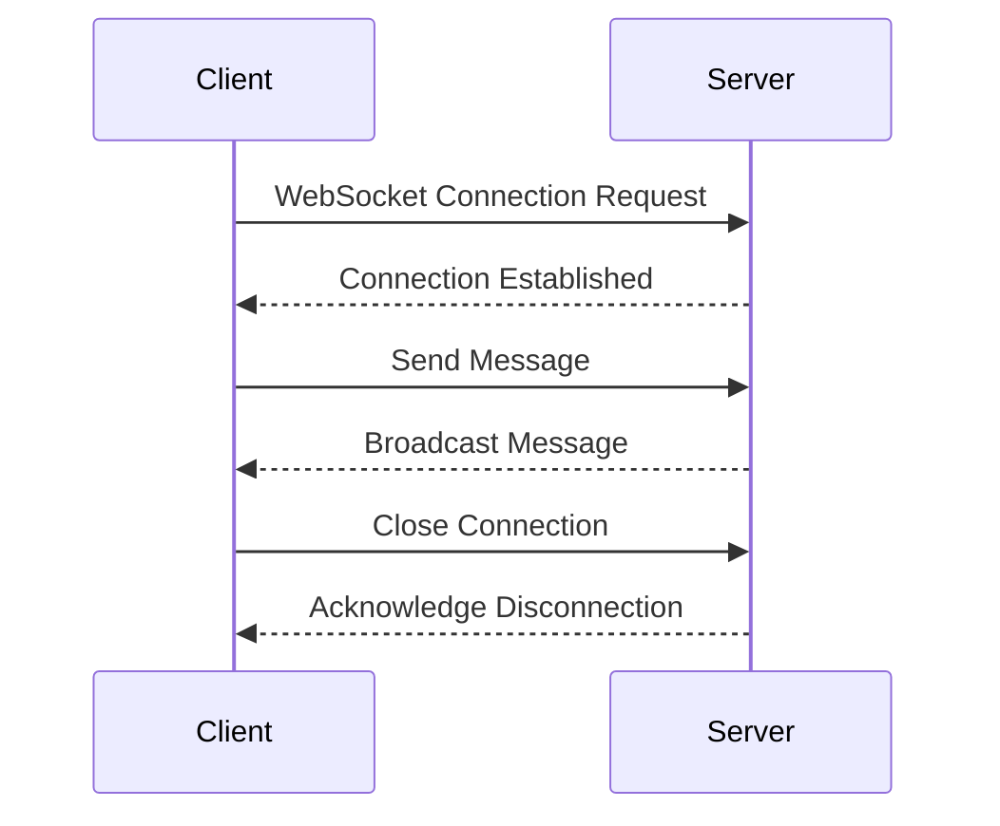

## 13.7. WebSockets and Real-Time Communication with Sente

Real-time communication is a cornerstone of modern web applications, enabling dynamic interactions such as chat applications, live notifications, and collaborative tools. In this section, we will explore how to implement real-time communication using WebSockets in Clojure, with a focus on the Sente library.

### Understanding WebSockets

WebSockets provide a full-duplex communication channel over a single, long-lived connection. Unlike HTTP, which follows a request-response model, WebSockets allow for bidirectional communication, meaning both the client and server can send messages independently.

#### Key Features of WebSockets

- **Persistent Connection**: Once established, the connection remains open, reducing the overhead of repeated handshakes.
- **Low Latency**: Ideal for applications requiring real-time updates due to minimal latency.
- **Bidirectional Communication**: Both client and server can push messages at any time.

### Introducing the Sente Library

Sente is a Clojure/ClojureScript library that simplifies WebSocket communication by providing an abstraction over WebSockets and other transport mechanisms. It is designed to work seamlessly with Clojure's ecosystem, making it a popular choice for real-time applications.

#### Capabilities of Sente

- **Transport Agnostic**: Supports WebSockets, AJAX long-polling, and other fallback mechanisms.
- **Event Handling**: Provides a robust event system for handling messages.
- **Session Management**: Manages user sessions and connections efficiently.
- **Broadcasting**: Allows easy broadcasting of messages to multiple clients.

### Setting Up a WebSocket Server with Sente

Let's dive into setting up a WebSocket server using Sente. We'll start by creating a basic server that can handle connections and broadcast messages.

#### Step 1: Add Dependencies

First, include the necessary dependencies in your `project.clj` or `deps.edn` file:

```clojure
;; project.clj
:dependencies [[org.clojure/clojure "1.10.3"]
               [com.taoensso/sente "1.16.0"]
               [ring/ring-core "1.9.0"]
               [ring/ring-jetty-adapter "1.9.0"]]
```

#### Step 2: Initialize the Server

Create a new namespace for your server and initialize Sente:

```clojure
(ns myapp.server
  (:require [taoensso.sente :as sente]
            [ring.adapter.jetty :refer [run-jetty]]
            [ring.middleware.defaults :refer [wrap-defaults site-defaults]]))

(defn start-server []
  (let [{:keys [ch-recv send-fn connected-uids]}
        (sente/make-channel-socket-server! (sente/get-sch-adapter)
                                           {:packer :edn})]
    (def ch-chsk ch-recv)
    (def chsk-send! send-fn)
    (def connected-uids connected-uids)
    (run-jetty (wrap-defaults #'app-routes site-defaults) {:port 3000})))

(defn app-routes [request]
  ;; Define your routes and handlers here
  )
```

#### Step 3: Handle Events

Define event handlers to process incoming messages and manage connections:

```clojure
(defmulti event-msg-handler :id)

(defmethod event-msg-handler :default
  [{:keys [event]}]
  (println "Unhandled event:" event))

(defmethod event-msg-handler :chsk/recv
  [{:keys [event]}]
  (println "Received message:" event))

(defmethod event-msg-handler :chsk/handshake
  [{:keys [event]}]
  (println "Handshake completed:" event))

(defmethod event-msg-handler :chsk/state
  [{:keys [event]}]
  (println "Connection state changed:" event))
```

### Setting Up a WebSocket Client with Sente

Now, let's set up a client to connect to our server and send messages.

#### Step 1: Add Client Dependencies

Ensure your client-side project includes Sente and ClojureScript:

```clojure
;; project.clj
:dependencies [[org.clojure/clojurescript "1.10.773"]
               [com.taoensso/sente "1.16.0"]]
```

#### Step 2: Initialize the Client

Create a new namespace for your client and initialize Sente:

```clojure
(ns myapp.client
  (:require [taoensso.sente :as sente]
            [reagent.core :as reagent]))

(defn init-client []
  (let [{:keys [chsk ch-recv send-fn]}
        (sente/make-channel-socket-client! "/chsk" {:type :auto})]
    (def chsk chsk)
    (def ch-chsk ch-recv)
    (def chsk-send! send-fn)))

(defn send-message [msg]
  (chsk-send! [:myapp/message msg]))
```

#### Step 3: Handle Client Events

Define event handlers to process messages from the server:

```clojure
(defmulti event-msg-handler :id)

(defmethod event-msg-handler :default
  [{:keys [event]}]
  (println "Unhandled event:" event))

(defmethod event-msg-handler :myapp/message
  [{:keys [event]}]
  (println "Received message from server:" event))
```

### Broadcasting Messages

Broadcasting messages to multiple clients is a common requirement in real-time applications. Sente makes this straightforward with its `connected-uids` feature.

```clojure
(defn broadcast-message [msg]
  (doseq [uid (:any @connected-uids)]
    (chsk-send! uid [:myapp/broadcast msg])))
```

### Handling Disconnections and Reconnects

Handling disconnections gracefully is crucial for maintaining a robust application. Sente provides state change events to manage connection states.

```clojure
(defmethod event-msg-handler :chsk/state
  [{:keys [event]}]
  (let [[_ new-state] event]
    (println "Connection state changed:" new-state)
    (when (= new-state :open)
      (println "Reconnected!"))))
```

### Use Cases for WebSockets and Sente

WebSockets are ideal for applications requiring real-time updates. Here are some common use cases:

- **Chat Applications**: Enable users to send and receive messages instantly.
- **Live Notifications**: Push updates to users as they happen.
- **Collaborative Tools**: Allow multiple users to interact with shared data in real-time.

### Scalability Considerations

When building real-time applications, scalability is a key concern. Consider the following strategies:

- **Load Balancing**: Distribute connections across multiple servers.
- **Horizontal Scaling**: Add more servers to handle increased load.
- **Connection Management**: Monitor and manage active connections to prevent overload.

### Handling Disconnections

Disconnections can occur due to network issues or server overload. Implement reconnection logic to handle such scenarios gracefully.

```clojure
(defmethod event-msg-handler :chsk/state
  [{:keys [event]}]
  (let [[_ new-state] event]
    (case new-state
      :open (println "Connected")
      :closed (println "Disconnected, attempting to reconnect...")
      :reconnecting (println "Reconnecting..."))))
```

### Conclusion

WebSockets and the Sente library provide powerful tools for building real-time web applications in Clojure. By leveraging these technologies, you can create interactive and dynamic user experiences that respond instantly to user actions.

Remember, this is just the beginning. As you progress, you'll build more complex and interactive applications. Keep experimenting, stay curious, and enjoy the journey!

### Try It Yourself

Experiment with the code examples provided. Try modifying the event handlers to implement custom logic or add new features such as user authentication or message history.

### Visualizing WebSocket Communication



### External Links

- [Sente GitHub Repository](https://github.com/ptaoussanis/sente)

## **Ready to Test Your Knowledge?**



### What is the primary advantage of using WebSockets over HTTP for real-time communication?

- [x] Bidirectional communication
- [ ] Lower latency
- [ ] Simpler protocol
- [ ] Better security

> **Explanation:** WebSockets allow for bidirectional communication, enabling both the client and server to send messages independently.

### Which library is commonly used in Clojure for WebSocket communication?

- [x] Sente
- [ ] Ring
- [ ] Compojure
- [ ] Aleph

> **Explanation:** Sente is a popular library in Clojure for handling WebSocket communication.

### What function in Sente is used to create a WebSocket server?

- [x] `make-channel-socket-server!`
- [ ] `run-jetty`
- [ ] `wrap-defaults`
- [ ] `make-channel-socket-client!`

> **Explanation:** `make-channel-socket-server!` is used to create a WebSocket server in Sente.

### How does Sente handle different transport mechanisms?

- [x] It is transport agnostic
- [ ] It only supports WebSockets
- [ ] It requires manual configuration
- [ ] It uses AJAX polling by default

> **Explanation:** Sente is transport agnostic, supporting WebSockets, AJAX long-polling, and other mechanisms.

### What is the purpose of the `connected-uids` feature in Sente?

- [x] To manage and track connected users
- [ ] To send messages to a single user
- [ ] To handle disconnections
- [ ] To initialize the server

> **Explanation:** `connected-uids` is used to manage and track connected users for broadcasting messages.

### Which method is used to send messages from the client to the server in Sente?

- [x] `chsk-send!`
- [ ] `chsk-recv!`
- [ ] `send-fn`
- [ ] `recv-fn`

> **Explanation:** `chsk-send!` is used to send messages from the client to the server in Sente.

### What event type in Sente indicates a change in connection state?

- [x] `:chsk/state`
- [ ] `:chsk/recv`
- [ ] `:chsk/handshake`
- [ ] `:chsk/disconnect`

> **Explanation:** `:chsk/state` indicates a change in connection state in Sente.

### What is a common use case for WebSockets in web applications?

- [x] Chat applications
- [ ] Static content delivery
- [ ] File uploads
- [ ] Image rendering

> **Explanation:** WebSockets are commonly used in chat applications for real-time message delivery.

### How can you handle disconnections in a Sente-based application?

- [x] Implement reconnection logic
- [ ] Ignore disconnections
- [ ] Use HTTP fallback
- [ ] Increase server timeout

> **Explanation:** Implementing reconnection logic helps handle disconnections gracefully in a Sente-based application.

### True or False: Sente can only be used with ClojureScript on the client side.

- [ ] True
- [x] False

> **Explanation:** Sente can be used with both Clojure and ClojureScript, providing flexibility for client-side implementations.


