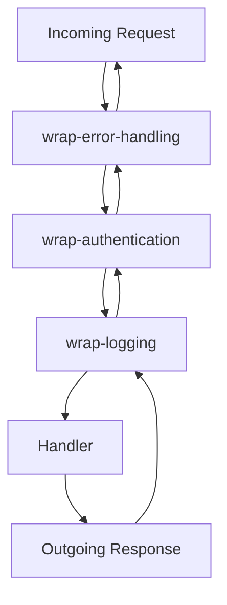

## 13.8. Middleware Patterns

Middleware is a crucial concept in Clojure web development, particularly within the Ring architecture. It allows developers to handle cross-cutting concerns such as logging, authentication, and error handling in a modular and reusable way. In this section, we will explore what middleware is, how it fits into the Ring architecture, and how to effectively use and compose middleware in Clojure web applications.

### Understanding Middleware in Clojure

Middleware in Clojure is a higher-order function that takes a handler function and returns a new handler function. This new handler can modify the request, the response, or both. Middleware is used to encapsulate common functionality that can be applied to multiple endpoints in a web application.

#### The Role of Middleware in the Ring Architecture

Ring is a Clojure web application library that provides a simple and flexible way to handle HTTP requests and responses. It is based on a simple protocol where a handler is a function that takes a request map and returns a response map. Middleware fits into this architecture by wrapping handlers to add additional behavior.

```clojure
(defn wrap-logging [handler]
  (fn [request]
    (println "Request received:" request)
    (let [response (handler request)]
      (println "Response sent:" response)
      response)))
```

In this example, `wrap-logging` is a middleware function that logs the request and response. It takes a handler as an argument and returns a new handler that includes logging functionality.

### Common Middleware Functions

Middleware functions are used to handle various cross-cutting concerns. Here are some common examples:

#### Logging

Logging middleware records information about incoming requests and outgoing responses. This can be useful for debugging and monitoring.

```clojure
(defn wrap-logging [handler]
  (fn [request]
    (println "Request received:" request)
    (let [response (handler request)]
      (println "Response sent:" response)
      response)))
```

#### Authentication

Authentication middleware checks if a user is authenticated before allowing access to certain endpoints. This is crucial for securing web applications.

```clojure
(defn wrap-authentication [handler]
  (fn [request]
    (if (authenticated? request)
      (handler request)
      {:status 401 :body "Unauthorized"})))
```

#### Error Handling

Error handling middleware catches exceptions and returns a user-friendly error message. This prevents the application from crashing and provides a better user experience.

```clojure
(defn wrap-error-handling [handler]
  (fn [request]
    (try
      (handler request)
      (catch Exception e
        {:status 500 :body "Internal Server Error"}))))
```

### Composing Middleware

Middleware can be composed to create a stack of functionality. The order in which middleware is applied is important, as it determines how requests and responses are processed.

#### Ordering Considerations

When composing middleware, consider the order of execution. For example, authentication should generally occur before logging to avoid logging sensitive information.

```clojure
(def app
  (-> handler
      wrap-error-handling
      wrap-authentication
      wrap-logging))
```

In this composition, `wrap-error-handling` is applied first, followed by `wrap-authentication`, and finally `wrap-logging`.

### Creating Custom Middleware

Creating custom middleware involves writing a function that takes a handler and returns a new handler. This allows you to encapsulate specific functionality that can be reused across different parts of your application.

#### Example: Rate Limiting Middleware

Rate limiting middleware restricts the number of requests a client can make in a given time period. This can help prevent abuse and ensure fair usage.

```clojure
(defn wrap-rate-limiting [handler]
  (let [request-count (atom {})]
    (fn [request]
      (let [ip (:remote-addr request)
            count (get @request-count ip 0)]
        (if (< count 100)
          (do
            (swap! request-count update ip (fnil inc 0))
            (handler request))
          {:status 429 :body "Too Many Requests"})))))
```

### Best Practices for Middleware

To maintain clean and modular code, follow these best practices when working with middleware:

- **Keep Middleware Focused**: Each middleware function should handle a single concern. This makes it easier to understand and reuse.
- **Document Middleware**: Clearly document what each middleware does and any side effects it may have.
- **Test Middleware**: Write tests for your middleware to ensure it behaves as expected.
- **Consider Performance**: Be mindful of the performance impact of middleware, especially if it involves I/O operations or complex computations.

### Visualizing Middleware Flow

To better understand how middleware works, let's visualize the flow of a request through a stack of middleware.



In this diagram, the request flows through each middleware function before reaching the handler. The response then flows back through the middleware in reverse order.

### Try It Yourself

Experiment with the provided middleware examples by modifying them to suit your needs. For instance, try adding a timestamp to the logging middleware or implementing a more sophisticated authentication mechanism.

### References and Further Reading

- [Ring GitHub Repository](https://github.com/ring-clojure/ring)
- [Clojure Web Development with Ring](https://clojure.org/guides/weird_web)
- [Middleware in Clojure](https://clojure.org/guides/middleware)

### Knowledge Check

To reinforce your understanding of middleware patterns in Clojure, try answering the following questions.

## **Ready to Test Your Knowledge?**



### What is the primary role of middleware in Clojure web applications?

- [x] To handle cross-cutting concerns like logging and authentication
- [ ] To define the main application logic
- [ ] To manage database connections
- [ ] To render HTML templates

> **Explanation:** Middleware is used to handle cross-cutting concerns such as logging, authentication, and error handling in a modular way.

### How does middleware fit into the Ring architecture?

- [x] It wraps handlers to add additional behavior
- [ ] It replaces the main handler function
- [ ] It is used to define routes
- [ ] It manages HTTP sessions

> **Explanation:** Middleware in Ring wraps handlers to add additional behavior, allowing for modular and reusable code.

### Which of the following is a common use case for middleware?

- [x] Authentication
- [ ] Database migrations
- [ ] HTML rendering
- [ ] CSS styling

> **Explanation:** Authentication is a common use case for middleware, as it involves checking user credentials before allowing access to certain endpoints.

### What is an important consideration when composing middleware?

- [x] The order of execution
- [ ] The color of the code editor
- [ ] The size of the request payload
- [ ] The version of the Clojure compiler

> **Explanation:** The order of execution is important when composing middleware, as it determines how requests and responses are processed.

### How can you create custom middleware in Clojure?

- [x] By writing a function that takes a handler and returns a new handler
- [ ] By modifying the Ring core library
- [ ] By using a third-party library
- [ ] By editing the HTTP request headers

> **Explanation:** Custom middleware is created by writing a function that takes a handler and returns a new handler, encapsulating specific functionality.

### What is a best practice for maintaining clean middleware code?

- [x] Keep middleware focused on a single concern
- [ ] Use global variables for state management
- [ ] Avoid using comments
- [ ] Write middleware in a single file

> **Explanation:** Keeping middleware focused on a single concern makes it easier to understand and reuse.

### Which middleware function is responsible for handling errors?

- [x] wrap-error-handling
- [ ] wrap-authentication
- [ ] wrap-logging
- [ ] wrap-rate-limiting

> **Explanation:** The `wrap-error-handling` middleware function is responsible for catching exceptions and returning user-friendly error messages.

### What is the purpose of the `wrap-logging` middleware?

- [x] To log incoming requests and outgoing responses
- [ ] To authenticate users
- [ ] To handle errors
- [ ] To limit the rate of requests

> **Explanation:** The `wrap-logging` middleware logs information about incoming requests and outgoing responses for debugging and monitoring purposes.

### True or False: Middleware can modify both the request and the response.

- [x] True
- [ ] False

> **Explanation:** Middleware can modify both the request and the response, allowing for flexible handling of cross-cutting concerns.

### Which diagram best represents the flow of a request through middleware?

- [x] A linear flow from incoming request to handler and back
- [ ] A circular flow with no clear start or end
- [ ] A tree structure with multiple branches
- [ ] A random scatter of nodes

> **Explanation:** The flow of a request through middleware is linear, moving from the incoming request through each middleware function to the handler and back.



Remember, mastering middleware patterns in Clojure is just the beginning. As you continue to build more complex web applications, you'll find new ways to leverage middleware for clean, modular, and efficient code. Keep experimenting, stay curious, and enjoy the journey!
