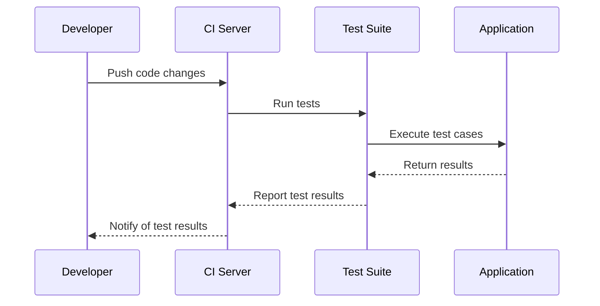

## 13.9. Testing Web Applications

In the realm of web development, testing is not just a best practice—it's an essential component of delivering robust, reliable, and maintainable applications. As we delve into the world of testing web applications in Clojure, we'll explore various strategies, frameworks, and best practices that can help ensure your web applications are up to the task.

### The Importance of Testing in Web Development

Testing in web development serves multiple purposes. It helps catch bugs early, ensures that new features don't break existing functionality, and provides a safety net for refactoring code. Moreover, testing can improve code quality and maintainability, making it easier for teams to collaborate and for new developers to onboard.

### Testing Frameworks in Clojure

Clojure offers several powerful testing frameworks that cater to different testing needs. Let's explore some of the most popular ones:

#### `clojure.test`

`clojure.test` is the built-in testing framework in Clojure, providing a straightforward way to write unit tests. It is simple, yet powerful enough to cover most testing scenarios.

```clojure
(ns myapp.core-test
  (:require [clojure.test :refer :all]
            [myapp.core :refer :all]))

(deftest test-addition
  (testing "Addition function"
    (is (= 4 (add 2 2)))))
```

In this example, we define a test namespace and use `deftest` to create a test case for an `add` function. The `testing` macro allows us to describe the purpose of the test, and `is` asserts that the expression evaluates to true.

#### [Midje](https://github.com/marick/Midje)

Midje is a popular alternative to `clojure.test`, offering a more expressive syntax and additional features like fact-driven development.

```clojure
(ns myapp.core-test
  (:require [midje.sweet :refer :all]
            [myapp.core :refer :all]))

(fact "Addition should work"
  (add 2 2) => 4)
```

Midje's `fact` macro provides a concise way to express expectations, making tests more readable and easier to understand.

#### [Expectations](https://github.com/clojure-expectations/expectations)

Expectations is another testing framework that focuses on simplicity and readability, using a syntax that emphasizes expected outcomes.

```clojure
(ns myapp.core-test
  (:require [expectations :refer :all]
            [myapp.core :refer :all]))

(expect 4 (add 2 2))
```

The `expect` macro in Expectations allows you to specify the expected result directly, making tests clear and concise.

### Testing Handlers, Routes, and Middleware

In web applications, testing handlers, routes, and middleware is crucial to ensure that your application behaves as expected. Let's explore how to test these components effectively.

#### Testing Handlers

Handlers are the core of your web application, processing requests and returning responses. Testing handlers involves verifying that they return the correct response for a given request.

```clojure
(ns myapp.handler-test
  (:require [clojure.test :refer :all]
            [ring.mock.request :as mock]
            [myapp.handler :refer :all]))

(deftest test-home-handler
  (let [response (home-handler (mock/request :get "/"))]
    (is (= 200 (:status response)))
    (is (= "Welcome to my app!" (:body response)))))
```

In this example, we use `ring.mock.request` to create a mock request and test the `home-handler` function. We assert that the response status is 200 and the body contains the expected message.

#### Testing Routes

Testing routes involves ensuring that requests are correctly routed to the appropriate handlers. This can be done by testing the routing logic directly or by testing the handlers for each route.

```clojure
(deftest test-routes
  (let [response (app (mock/request :get "/"))]
    (is (= 200 (:status response)))
    (is (= "Welcome to my app!" (:body response)))))
```

Here, we test the entire application by sending a request to the root URL and verifying the response.

#### Testing Middleware

Middleware functions wrap handlers to provide additional functionality, such as authentication or logging. Testing middleware involves verifying that it correctly modifies the request or response.

```clojure
(deftest test-logging-middleware
  (let [handler (wrap-logging identity)
        response (handler (mock/request :get "/"))]
    (is (= 200 (:status response)))))
```

In this example, we test a logging middleware by wrapping an identity handler and verifying that the response status is unaffected.

### Mocking HTTP Requests and Dependencies

Mocking is a technique used to isolate the code under test by replacing dependencies with mock objects. This is particularly useful in web applications, where external services or databases may not be available during testing.

#### Mocking HTTP Requests

Mocking HTTP requests allows you to test how your application handles different responses from external services.

```clojure
(ns myapp.external-test
  (:require [clojure.test :refer :all]
            [clj-http.client :as client]
            [myapp.external :refer :all]))

(deftest test-external-api
  (with-redefs [client/get (fn [_] {:status 200 :body "Success"})]
    (is (= "Success" (fetch-data)))))
```

In this example, we use `with-redefs` to mock the `client/get` function, simulating a successful response from an external API.

#### Mocking Dependencies

Mocking dependencies involves replacing functions or components with mock implementations to test specific scenarios.

```clojure
(deftest test-dependency
  (with-redefs [dependency-fn (fn [_] "mocked response")]
    (is (= "mocked response" (function-under-test)))))
```

Here, we mock a dependency function to return a specific response, allowing us to test the behavior of `function-under-test`.

### Continuous Integration and Automated Testing

Continuous integration (CI) is a practice where code changes are automatically tested and integrated into the main codebase. Automated testing is a key component of CI, ensuring that tests are run consistently and reliably.

#### Setting Up Continuous Integration

To set up CI for your Clojure web application, you'll need a CI server like Jenkins, Travis CI, or GitHub Actions. These tools can automatically run your tests whenever code is pushed to the repository.

```yaml
# .github/workflows/ci.yml
name: CI

on: [push, pull_request]

jobs:
  build:
    runs-on: ubuntu-latest
    steps:
    - uses: actions/checkout@v2
    - name: Set up JDK 11
      uses: actions/setup-java@v1
      with:
        java-version: 11
    - name: Run tests
      run: lein test
```

This GitHub Actions workflow runs tests on every push or pull request, ensuring that your code is always tested.

#### Best Practices for Automated Testing

- **Run tests frequently**: Ensure that tests are run on every code change to catch issues early.
- **Keep tests fast**: Fast tests encourage frequent testing and quick feedback.
- **Use a consistent environment**: Ensure that tests run in a consistent environment to avoid flaky tests.
- **Monitor test results**: Regularly review test results to identify and fix failing tests promptly.

### Try It Yourself

Experiment with the provided code examples by modifying them to test different scenarios. For instance, try adding more test cases for different routes or mocking different HTTP responses to see how your application handles them.

### Visualizing Testing Workflows

To better understand the testing workflow, let's visualize the process of testing a web application using a sequence diagram.



This diagram illustrates the flow of testing in a CI environment, from code changes to test execution and result notification.

### References and Links

- [Midje](https://github.com/marick/Midje)
- [Expectations](https://github.com/clojure-expectations/expectations)

### Knowledge Check

Let's reinforce what we've learned with some questions and exercises.

- **What are the benefits of testing web applications?**
- **How can you test a handler in a Clojure web application?**
- **What is the purpose of mocking in testing?**
- **How can continuous integration improve the testing process?**

### Embrace the Journey

Remember, testing is a journey, not a destination. As you continue to develop your web applications, keep refining your testing strategies and exploring new tools and techniques. Stay curious, keep experimenting, and enjoy the process of building reliable and robust web applications.

## **Ready to Test Your Knowledge?**



### What is the primary purpose of testing web applications?

- [x] To catch bugs early and ensure new features don't break existing functionality
- [ ] To make the code more complex
- [ ] To slow down the development process
- [ ] To avoid writing documentation

> **Explanation:** Testing helps catch bugs early, ensures new features don't break existing functionality, and improves code quality.

### Which Clojure testing framework is built-in and provides a straightforward way to write unit tests?

- [x] clojure.test
- [ ] Midje
- [ ] Expectations
- [ ] JUnit

> **Explanation:** `clojure.test` is the built-in testing framework in Clojure, offering a straightforward way to write unit tests.

### How does Midje differ from clojure.test?

- [x] Midje offers a more expressive syntax and additional features like fact-driven development
- [ ] Midje is slower than clojure.test
- [ ] Midje is only for integration testing
- [ ] Midje does not support mocking

> **Explanation:** Midje provides a more expressive syntax and additional features, making it a popular alternative to `clojure.test`.

### What is the purpose of mocking HTTP requests in testing?

- [x] To simulate different responses from external services
- [ ] To increase the complexity of tests
- [ ] To avoid writing real HTTP requests
- [ ] To slow down the testing process

> **Explanation:** Mocking HTTP requests allows you to simulate different responses from external services, helping to test how your application handles them.

### What is a key benefit of continuous integration in testing?

- [x] It ensures tests are run consistently and reliably on every code change
- [ ] It makes tests run slower
- [ ] It increases the complexity of the codebase
- [ ] It eliminates the need for manual testing

> **Explanation:** Continuous integration ensures that tests are run consistently and reliably on every code change, catching issues early.

### Which tool can be used to mock HTTP requests in Clojure?

- [x] ring.mock.request
- [ ] clj-http.client
- [ ] leiningen
- [ ] core.async

> **Explanation:** `ring.mock.request` is used to create mock HTTP requests for testing purposes in Clojure.

### What is the purpose of the `with-redefs` macro in Clojure testing?

- [x] To temporarily redefine functions for testing purposes
- [ ] To permanently change function definitions
- [ ] To remove functions from the namespace
- [ ] To slow down the execution of tests

> **Explanation:** `with-redefs` temporarily redefines functions for testing purposes, allowing you to mock dependencies.

### How can you test middleware in a Clojure web application?

- [x] By wrapping an identity handler and verifying the response
- [ ] By writing integration tests only
- [ ] By avoiding middleware in tests
- [ ] By using only unit tests

> **Explanation:** Middleware can be tested by wrapping an identity handler and verifying that it correctly modifies the request or response.

### What is a common practice to ensure tests are run in a consistent environment?

- [x] Use a CI server like Jenkins or GitHub Actions
- [ ] Run tests manually on different machines
- [ ] Avoid using version control
- [ ] Write tests in different programming languages

> **Explanation:** Using a CI server ensures that tests are run in a consistent environment, avoiding flaky tests.

### True or False: Automated testing eliminates the need for manual testing.

- [ ] True
- [x] False

> **Explanation:** While automated testing is crucial, manual testing is still necessary for exploratory testing and catching issues that automated tests might miss.


