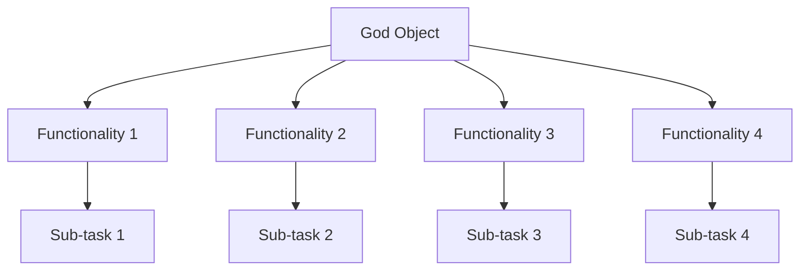

## 14.1 God Object in Clojure

### Introduction

In software design, a "God Object" is an anti-pattern where a single object or module accumulates excessive responsibilities, leading to a tightly coupled and complex system. This anti-pattern can manifest in Clojure as a monolithic namespace or function that handles multiple unrelated tasks. Understanding and avoiding the God Object is crucial for maintaining modularity, readability, and ease of maintenance in your Clojure applications.

### Understanding the God Object Anti-Pattern

A God Object centralizes too much functionality, making the system difficult to manage and extend. This anti-pattern violates the Single Responsibility Principle (SRP), which states that a module or class should have one, and only one, reason to change. In Clojure, this can occur when a single namespace or function is responsible for diverse operations, leading to:

- **Tight Coupling:** Changes in one part of the system can have unforeseen impacts on other parts.
- **Reduced Modularity:** Difficulties in isolating and reusing components.
- **Complex Testing and Debugging:** Increased effort in testing and identifying bugs due to intertwined functionalities.

### Identifying a God Object in Clojure

In Clojure, a God Object might appear as:

- A large namespace with numerous functions handling unrelated tasks.
- A single function performing multiple operations, such as data validation, processing, and reporting.

### Avoiding the God Object Anti-Pattern

#### 1. Avoid Monolithic Namespaces

Break down large namespaces into smaller, focused ones based on functionality. This promotes separation of concerns and enhances code readability.

```clojure
;; Instead of one large namespace:
(ns myapp.core)

;; Use multiple namespaces based on functionality:
(ns myapp.user-management)
(ns myapp.payment-processing)
(ns myapp.reporting)
```

#### 2. Apply the Single Responsibility Principle

Ensure each function or module has one clear purpose. This reduces complexity and makes the code easier to understand and maintain.

**Example of Refactoring:**

```clojure
;; Overly complex function:
(defn process-order [order]
  (validate-order order)
  (calculate-discounts order)
  (process-payment order)
  (update-inventory order)
  (send-confirmation-email order))

;; Refactored into smaller functions:
(defn process-order [order]
  (when (validate-order order)
    (-> order
        calculate-discounts
        process-payment
        update-inventory
        send-confirmation-email)))
```

#### 3. Utilize Modular Design

Create independent modules that can be developed and tested separately. This approach enhances maintainability and allows for easier updates and extensions.

#### 4. Leverage Protocols and Multimethods

Use protocols to define behavior that can be implemented by different data types, promoting polymorphism and flexibility.

```clojure
(defprotocol PaymentProcessor
  (process-payment [this order]))

(defrecord CreditCardProcessor []
  PaymentProcessor
  (process-payment [this order]
    ;; Credit card processing logic
    ))

(defrecord PayPalProcessor []
  PaymentProcessor
  (process-payment [this order]
    ;; PayPal processing logic
    ))
```

#### 5. Promote Code Reuse

Extract common functionality into utility functions or libraries. This reduces duplication and enhances consistency across the codebase.

#### 6. Regularly Refactor and Review Code

Continuously assess code complexity and refactor when necessary. Regular code reviews can help identify potential God Objects and other anti-patterns early.

### Visualizing the God Object Problem

To better understand the impact of a God Object, consider the following conceptual diagram:



In this diagram, the God Object (A) is responsible for multiple functionalities (B, C, D, E), each with its own sub-tasks. This centralization leads to a complex and tightly coupled system.

### Advantages and Disadvantages

#### Advantages of Avoiding God Objects

- **Improved Modularity:** Easier to isolate and manage individual components.
- **Enhanced Maintainability:** Simplifies updates and reduces the risk of introducing bugs.
- **Better Testability:** Facilitates unit testing by reducing dependencies.

#### Disadvantages of God Objects

- **Increased Complexity:** Difficult to understand and modify.
- **High Coupling:** Changes in one area can affect unrelated parts of the system.
- **Poor Scalability:** Challenging to extend or adapt to new requirements.

### Best Practices

- **Adhere to SRP:** Ensure each module or function has a single responsibility.
- **Modularize Code:** Break down large components into smaller, manageable pieces.
- **Use Protocols and Multimethods:** Promote flexibility and polymorphism.
- **Regular Refactoring:** Continuously improve code structure and reduce complexity.

### Conclusion

Avoiding the God Object anti-pattern is essential for creating maintainable and scalable Clojure applications. By adhering to the Single Responsibility Principle, leveraging modular design, and utilizing Clojure's powerful abstractions like protocols and multimethods, developers can ensure their code remains clean, efficient, and easy to manage.

## Quiz Time!



### What is a "God Object" in software design?

- [x] An object that centralizes too much functionality, making the system overly complex and tightly coupled.
- [ ] An object that is highly optimized for performance.
- [ ] An object that is used as a singleton throughout the application.
- [ ] An object that is responsible for user authentication.

> **Explanation:** A God Object is an anti-pattern where a single object or module accumulates excessive responsibilities, leading to a tightly coupled and complex system.

### How can the God Object anti-pattern manifest in Clojure?

- [x] As a single namespace or function handling multiple unrelated responsibilities.
- [ ] As a function that uses recursion.
- [ ] As a namespace that imports too many libraries.
- [ ] As a function that uses too many arguments.

> **Explanation:** In Clojure, a God Object can appear as a monolithic namespace or function responsible for diverse operations.

### Which principle is violated by the God Object anti-pattern?

- [x] Single Responsibility Principle
- [ ] Open/Closed Principle
- [ ] Liskov Substitution Principle
- [ ] Interface Segregation Principle

> **Explanation:** The God Object anti-pattern violates the Single Responsibility Principle, which states that a module or class should have one, and only one, reason to change.

### What is a recommended strategy to avoid the God Object anti-pattern in Clojure?

- [x] Break down large namespaces into smaller, focused ones.
- [ ] Use global variables to manage state.
- [ ] Consolidate all functionality into a single namespace.
- [ ] Use macros to combine multiple functions into one.

> **Explanation:** Breaking down large namespaces into smaller, focused ones promotes separation of concerns and enhances code readability.

### How can protocols and multimethods help avoid the God Object anti-pattern?

- [x] By defining behavior that can be implemented by different data types, promoting polymorphism and flexibility.
- [ ] By allowing functions to be defined globally.
- [ ] By enabling the use of mutable state.
- [ ] By enforcing strict type checking.

> **Explanation:** Protocols and multimethods allow for polymorphism and flexibility, helping to distribute responsibilities across different data types.

### What is a disadvantage of having a God Object in your codebase?

- [x] Increased complexity and tight coupling.
- [ ] Improved performance and scalability.
- [ ] Enhanced readability and maintainability.
- [ ] Simplified testing and debugging.

> **Explanation:** A God Object increases complexity and tight coupling, making the system difficult to manage and extend.

### Why is it important to promote code reuse when avoiding the God Object anti-pattern?

- [x] To reduce duplication and enhance consistency across the codebase.
- [ ] To increase the number of functions in a namespace.
- [ ] To consolidate all logic into a single function.
- [ ] To ensure all code is written in a single file.

> **Explanation:** Promoting code reuse reduces duplication and enhances consistency, making the codebase easier to maintain.

### What is a benefit of regularly refactoring code to avoid the God Object anti-pattern?

- [x] It helps identify potential God Objects and other anti-patterns early.
- [ ] It increases the complexity of the codebase.
- [ ] It consolidates all functionality into a single module.
- [ ] It reduces the number of tests needed.

> **Explanation:** Regular refactoring helps identify and address potential God Objects and other anti-patterns, improving code quality.

### Which of the following is NOT a characteristic of a God Object?

- [x] It is highly modular and easy to test.
- [ ] It centralizes too much functionality.
- [ ] It leads to tight coupling.
- [ ] It makes the system overly complex.

> **Explanation:** A God Object is not highly modular or easy to test; it centralizes too much functionality, leading to tight coupling and complexity.

### True or False: A God Object can improve the scalability of a system.

- [ ] True
- [x] False

> **Explanation:** A God Object does not improve scalability; it makes the system difficult to extend or adapt to new requirements.


