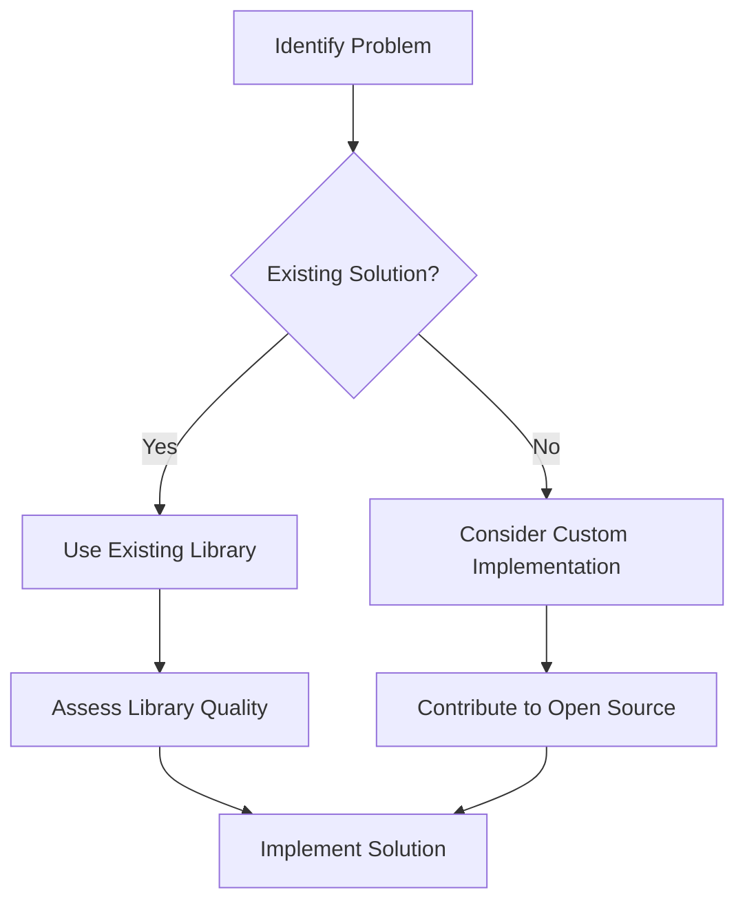

## 14.10 Reinventing the Wheel in Clojure

In the world of software development, "reinventing the wheel" refers to the unnecessary duplication of existing solutions. This anti-pattern can lead to wasted time, effort, and often results in suboptimal implementations. In the Clojure ecosystem, where a plethora of libraries and tools are available, avoiding this pitfall is crucial for efficient and effective development.

### Introduction

Reinventing the wheel is a common anti-pattern where developers create solutions for problems that have already been solved. In Clojure, this can manifest as writing custom code for tasks that existing libraries handle more efficiently. This section explores the importance of leveraging existing solutions and provides strategies to avoid this anti-pattern.

### Detailed Explanation

#### The Cost of Reinventing the Wheel

Re-creating existing solutions can consume unnecessary time and resources. It often leads to:

- **Suboptimal Implementations:** Custom solutions may lack the robustness and optimization of well-established libraries.
- **Increased Maintenance:** Maintaining custom code can be more challenging than relying on community-supported libraries.
- **Missed Opportunities:** By not using existing tools, developers miss out on community support, updates, and improvements.

#### The Rich Clojure Ecosystem

Clojure offers a wide range of libraries and tools that cater to various needs, from data processing to web development. Utilizing these resources can significantly accelerate development and improve code quality.

### Instructions for Avoiding Reinventing the Wheel

#### Research Existing Solutions

Before implementing a solution, it's essential to research existing libraries or functions. For example, if you need to parse JSON, consider using the `Cheshire` library:

```clojure
;; Need JSON parsing? Use Cheshire:
(require '[cheshire.core :as json])

(json/parse-string "{\"key\":\"value\"}")
```

#### Assess Library Quality

When choosing a library, consider factors such as:

- **Maintenance Status:** Is the library actively maintained?
- **Community Adoption:** Is it widely used and trusted by the community?
- **Documentation:** Is there comprehensive documentation available?

#### Contribute to Open-source Projects

If existing libraries lack certain functionality, consider contributing to open-source projects. This not only improves the library but also benefits the community.

#### Encourage Code Reuse

Promote code reuse within your organization or team by sharing common code and creating internal libraries for frequently used functionalities.

#### Stay Informed

Keep up with the latest developments in the Clojure community by following forums, blogs, and updates. This helps you learn about new tools and libraries that can enhance your projects.

#### Balance Customization and Standardization

While customization can be necessary, it's important to balance it with standardization. Prefer standard approaches and customize solutions only when absolutely necessary.

### Visual Aids

#### Conceptual Diagram: Avoiding Reinventing the Wheel



### Code Examples

Here's an example of using the `clojure.java.jdbc` library for database interactions instead of writing custom SQL handling code:

```clojure
(require '[clojure.java.jdbc :as jdbc])

(def db-spec {:dbtype "h2" :dbname "test"})

;; Using existing library for database operations
(jdbc/with-db-connection [conn db-spec]
  (jdbc/query conn ["SELECT * FROM users"]))
```

### Use Cases

- **Data Processing:** Use libraries like `core.async` for asynchronous processing instead of building custom concurrency models.
- **Web Development:** Leverage frameworks like `Luminus` for rapid web application development.

### Advantages and Disadvantages

#### Advantages

- **Efficiency:** Saves time and effort by using pre-built solutions.
- **Reliability:** Established libraries are often more reliable and tested.
- **Community Support:** Access to community support and updates.

#### Disadvantages

- **Dependency Management:** Relying on external libraries can introduce dependency management challenges.
- **Learning Curve:** Some libraries may have a steep learning curve.

### Best Practices

- **Evaluate Libraries Thoroughly:** Before adopting a library, evaluate its suitability for your project.
- **Contribute Back:** When you improve a library, consider contributing back to the community.
- **Document Decisions:** Keep a record of why certain libraries were chosen to aid future decision-making.

### Comparisons

- **Custom vs. Library Solutions:** Custom solutions offer more control but at the cost of increased maintenance and potential inefficiencies.
- **Standardization vs. Customization:** Standardization promotes consistency, while customization allows for tailored solutions.

### Conclusion

Avoiding the reinvention of the wheel in Clojure involves leveraging the rich ecosystem of libraries and tools available. By doing so, developers can save time, improve code quality, and benefit from community support. Embrace existing solutions, contribute to open-source projects, and stay informed to maximize the efficiency and effectiveness of your Clojure projects.

## Quiz Time!



### What is the main disadvantage of reinventing the wheel in software development?

- [x] It leads to suboptimal implementations.
- [ ] It encourages code reuse.
- [ ] It improves community support.
- [ ] It reduces maintenance efforts.

> **Explanation:** Reinventing the wheel often results in suboptimal implementations compared to established solutions.

### Which Clojure library is recommended for JSON parsing?

- [x] Cheshire
- [ ] Ring
- [ ] Luminus
- [ ] core.async

> **Explanation:** Cheshire is a popular Clojure library for JSON parsing.

### What should you consider when assessing a library's quality?

- [x] Maintenance status
- [x] Community adoption
- [x] Documentation
- [ ] Number of contributors

> **Explanation:** Maintenance status, community adoption, and documentation are key factors in assessing a library's quality.

### How can you contribute to the Clojure community?

- [x] Improve existing libraries
- [ ] Avoid using open-source projects
- [ ] Reinvent existing solutions
- [ ] Keep solutions private

> **Explanation:** Contributing improvements to existing libraries benefits both the library and the community.

### Why is it important to stay informed about the Clojure community?

- [x] To learn about new tools and libraries
- [ ] To avoid using libraries
- [ ] To focus solely on custom solutions
- [ ] To reduce dependency management

> **Explanation:** Staying informed helps developers learn about new tools and libraries that can enhance their projects.

### What is a potential disadvantage of relying on external libraries?

- [x] Dependency management challenges
- [ ] Increased maintenance
- [ ] Lack of community support
- [ ] Reduced efficiency

> **Explanation:** Relying on external libraries can introduce dependency management challenges.

### What is the benefit of using established libraries?

- [x] Reliability
- [x] Community support
- [ ] Increased maintenance
- [ ] Reduced efficiency

> **Explanation:** Established libraries are often more reliable and have community support.

### What is a key advantage of code reuse?

- [x] Saves time and effort
- [ ] Increases maintenance
- [ ] Reduces reliability
- [ ] Discourages community support

> **Explanation:** Code reuse saves time and effort by using pre-built solutions.

### What should you do if an existing library lacks certain functionality?

- [x] Consider contributing to the library
- [ ] Avoid using the library
- [ ] Reinvent the solution
- [ ] Keep the solution private

> **Explanation:** Contributing to the library can improve its functionality and benefit the community.

### True or False: Custom solutions are always better than library solutions.

- [ ] True
- [x] False

> **Explanation:** Library solutions are often more efficient and reliable than custom solutions.


