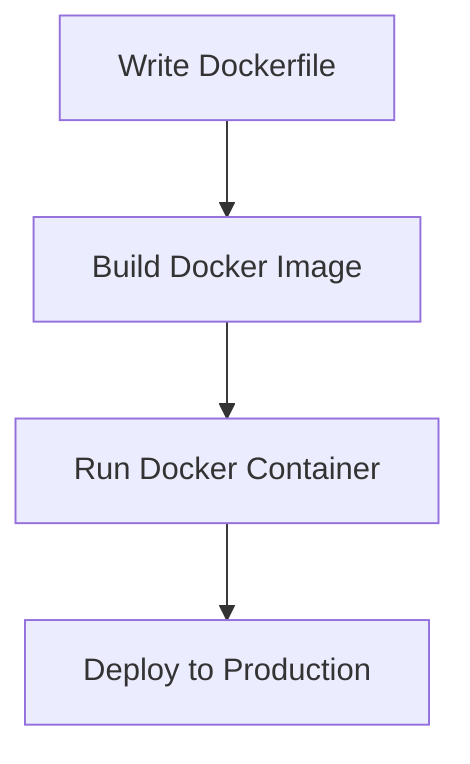
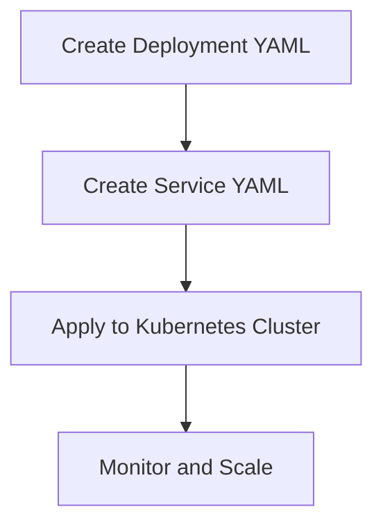
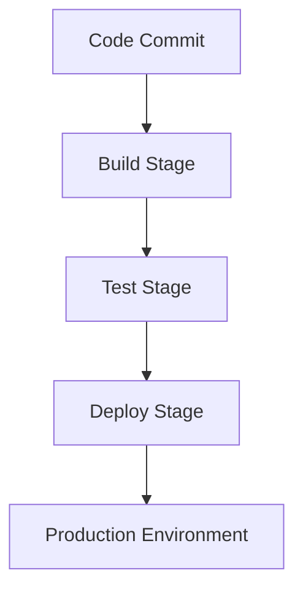

## 14.10. Deploying Clojure Microservices

Deploying Clojure microservices efficiently and reliably is crucial for modern software development. In this section, we will explore various deployment strategies, focusing on automation, scalability, and reliability. We will discuss containerization using Docker, orchestration with Kubernetes, setting up continuous deployment pipelines, and configuration management. Additionally, we will cover advanced deployment strategies such as canary deployments and blue-green deployments.

### Introduction to Microservices Deployment

Microservices architecture involves deploying multiple small, independent services that work together to form a complete application. This architecture provides several benefits, including improved scalability, flexibility, and maintainability. However, deploying microservices can be complex, requiring careful planning and execution.

### Containerization with Docker

Docker is a popular containerization platform that allows developers to package applications and their dependencies into lightweight, portable containers. Containers provide a consistent environment for running applications, making them ideal for deploying microservices.

#### Setting Up Docker for Clojure Microservices

To deploy a Clojure microservice using Docker, follow these steps:

1. **Create a Dockerfile**: A Dockerfile is a script that contains instructions for building a Docker image. Here's an example Dockerfile for a Clojure microservice:

    ```dockerfile
    # Use the official Clojure image as the base image
    FROM clojure:latest

    # Set the working directory
    WORKDIR /app

    # Copy the project files into the container
    COPY . .

    # Install dependencies and build the project
    RUN lein uberjar

    # Expose the application port
    EXPOSE 3000

    # Define the command to run the application
    CMD ["java", "-jar", "target/uberjar/my-service.jar"]
    ```

2. **Build the Docker Image**: Use the following command to build the Docker image:

    ```bash
    docker build -t my-clojure-service .
    ```

3. **Run the Docker Container**: Use the following command to run the Docker container:

    ```bash
    docker run -p 3000:3000 my-clojure-service
    ```

#### Benefits of Using Docker

- **Consistency**: Docker ensures that your application runs the same way in development, testing, and production environments.
- **Isolation**: Containers isolate applications from each other, preventing conflicts.
- **Portability**: Docker containers can run on any platform that supports Docker, making it easy to move applications between environments.

### Orchestration with Kubernetes

Kubernetes is a powerful orchestration tool that automates the deployment, scaling, and management of containerized applications. It is widely used for managing microservices in production environments.

#### Setting Up Kubernetes for Clojure Microservices

1. **Create a Kubernetes Deployment**: A Deployment manages a set of identical pods, ensuring that the desired number of replicas are running. Here's an example Kubernetes Deployment for a Clojure microservice:

    ```yaml
    apiVersion: apps/v1
    kind: Deployment
    metadata:
      name: my-clojure-service
    spec:
      replicas: 3
      selector:
        matchLabels:
          app: my-clojure-service
      template:
        metadata:
          labels:
            app: my-clojure-service
        spec:
          containers:
          - name: my-clojure-service
            image: my-clojure-service:latest
            ports:
            - containerPort: 3000
    ```

2. **Create a Kubernetes Service**: A Service exposes your application to the network, allowing it to receive traffic. Here's an example Kubernetes Service:

    ```yaml
    apiVersion: v1
    kind: Service
    metadata:
      name: my-clojure-service
    spec:
      selector:
        app: my-clojure-service
      ports:
      - protocol: TCP
        port: 80
        targetPort: 3000
      type: LoadBalancer
    ```

3. **Deploy to Kubernetes**: Use the following command to deploy your application to Kubernetes:

    ```bash
    kubectl apply -f deployment.yaml
    kubectl apply -f service.yaml
    ```

#### Benefits of Using Kubernetes

- **Scalability**: Kubernetes can automatically scale your application based on demand.
- **Reliability**: Kubernetes ensures that your application is always running, automatically restarting failed pods.
- **Flexibility**: Kubernetes supports rolling updates, allowing you to deploy new versions of your application without downtime.

### Continuous Deployment Pipelines

Continuous deployment (CD) is a practice that automates the deployment of code changes to production environments. It ensures that new features and bug fixes are delivered to users quickly and reliably.

#### Setting Up a Continuous Deployment Pipeline

1. **Version Control**: Use a version control system like Git to manage your codebase.

2. **Build Automation**: Use a build automation tool like Jenkins or GitLab CI/CD to automate the build process.

3. **Automated Testing**: Integrate automated testing into your pipeline to ensure that code changes do not introduce bugs.

4. **Deployment Automation**: Use tools like Ansible or Terraform to automate the deployment process.

5. **Monitoring and Logging**: Set up monitoring and logging to track the performance and health of your application.

#### Example Continuous Deployment Pipeline

Here's an example of a simple continuous deployment pipeline using GitLab CI/CD:

```yaml
stages:
  - build
  - test
  - deploy

build:
  stage: build
  script:
    - lein uberjar
  artifacts:
    paths:
      - target/uberjar/my-service.jar

test:
  stage: test
  script:
    - lein test

deploy:
  stage: deploy
  script:
    - docker build -t my-clojure-service .
    - docker push my-clojure-service
    - kubectl apply -f deployment.yaml
    - kubectl apply -f service.yaml
  only:
    - master
```

### Configuration Management

Configuration management is essential for managing the configuration of your microservices across different environments. It ensures that your application behaves consistently, regardless of where it is deployed.

#### Best Practices for Configuration Management

- **Environment Variables**: Use environment variables to manage configuration settings. This allows you to change configuration without modifying code.

- **Configuration Files**: Store configuration settings in external files, and load them at runtime.

- **Secrets Management**: Use a secrets management tool like HashiCorp Vault to securely store sensitive information like API keys and passwords.

### Advanced Deployment Strategies

Advanced deployment strategies like canary deployments and blue-green deployments can help you deploy new versions of your application with minimal risk.

#### Canary Deployments

Canary deployments involve deploying a new version of your application to a small subset of users before rolling it out to the entire user base. This allows you to test the new version in a real-world environment and catch any issues before they affect all users.

#### Blue-Green Deployments

Blue-green deployments involve maintaining two identical environments: one for the current version (blue) and one for the new version (green). When the new version is ready, you switch traffic from the blue environment to the green environment. This allows for zero-downtime deployments and easy rollbacks if issues arise.

### Visualizing Deployment Strategies

To better understand the deployment strategies discussed, let's visualize them using Mermaid.js diagrams.

#### Docker Containerization Process



#### Kubernetes Deployment Process



#### Continuous Deployment Pipeline



### Knowledge Check

To reinforce your understanding of deploying Clojure microservices, consider the following questions:

- What are the benefits of using Docker for deploying microservices?
- How does Kubernetes help in managing microservices in production?
- What are the key components of a continuous deployment pipeline?
- How can configuration management improve the reliability of your microservices?
- What are the advantages of using canary deployments and blue-green deployments?

### Conclusion

Deploying Clojure microservices requires careful planning and execution to ensure automation, scalability, and reliability. By leveraging tools like Docker, Kubernetes, and continuous deployment pipelines, you can streamline the deployment process and deliver new features to users quickly and reliably. Remember, this is just the beginning. As you progress, you'll build more complex and interactive microservices. Keep experimenting, stay curious, and enjoy the journey!

## **Ready to Test Your Knowledge?**



### What is the primary benefit of using Docker for microservices?

- [x] Consistency across environments
- [ ] Increased memory usage
- [ ] Reduced code complexity
- [ ] Faster execution time

> **Explanation:** Docker provides a consistent environment for running applications, ensuring that they behave the same way in development, testing, and production environments.

### Which tool is commonly used for orchestrating containerized applications?

- [x] Kubernetes
- [ ] Jenkins
- [ ] Git
- [ ] Ansible

> **Explanation:** Kubernetes is a powerful orchestration tool that automates the deployment, scaling, and management of containerized applications.

### What is a key component of a continuous deployment pipeline?

- [x] Automated testing
- [ ] Manual code review
- [ ] Static configuration
- [ ] Hardcoded secrets

> **Explanation:** Automated testing is crucial in a continuous deployment pipeline to ensure that code changes do not introduce bugs.

### How can configuration management improve microservices reliability?

- [x] By ensuring consistent behavior across environments
- [ ] By increasing code complexity
- [ ] By reducing deployment frequency
- [ ] By hardcoding configuration settings

> **Explanation:** Configuration management ensures that your application behaves consistently, regardless of where it is deployed.

### What is a benefit of canary deployments?

- [x] Testing new versions in a real-world environment
- [ ] Immediate rollback of changes
- [ ] Increased deployment speed
- [ ] Reduced resource usage

> **Explanation:** Canary deployments allow you to test a new version of your application with a small subset of users before rolling it out to the entire user base.

### What does a blue-green deployment strategy involve?

- [x] Maintaining two identical environments
- [ ] Deploying to a single environment
- [ ] Using only blue servers
- [ ] Immediate rollback of changes

> **Explanation:** Blue-green deployments involve maintaining two identical environments, allowing for zero-downtime deployments and easy rollbacks.

### Which tool is used for securely storing sensitive information?

- [x] HashiCorp Vault
- [ ] Docker
- [ ] Kubernetes
- [ ] GitLab CI/CD

> **Explanation:** HashiCorp Vault is a secrets management tool used to securely store sensitive information like API keys and passwords.

### What is the role of a Kubernetes Service?

- [x] Exposing the application to the network
- [ ] Building Docker images
- [ ] Running automated tests
- [ ] Managing code versions

> **Explanation:** A Kubernetes Service exposes your application to the network, allowing it to receive traffic.

### How does Kubernetes ensure application reliability?

- [x] By automatically restarting failed pods
- [ ] By reducing resource usage
- [ ] By increasing deployment speed
- [ ] By hardcoding configuration settings

> **Explanation:** Kubernetes ensures application reliability by automatically restarting failed pods, ensuring that your application is always running.

### True or False: Continuous deployment pipelines eliminate the need for manual testing.

- [ ] True
- [x] False

> **Explanation:** While continuous deployment pipelines automate many aspects of the deployment process, manual testing is still important for ensuring the quality of complex applications.


