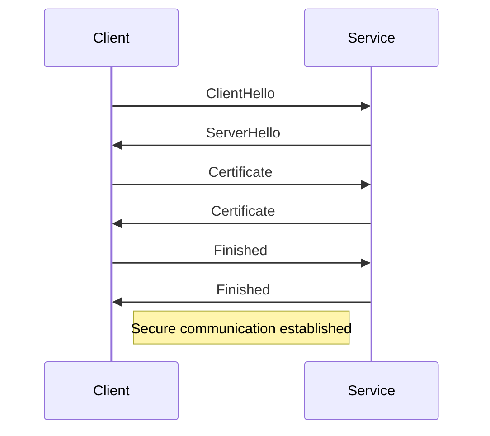

## 14.11. Security Considerations in Microservices

As we delve into the world of microservices, security becomes a paramount concern. The distributed nature of microservices architecture introduces unique security challenges that must be addressed to protect sensitive data and ensure the integrity of applications. In this section, we will explore various security considerations specific to microservices, including authentication, authorization, secure communication, and compliance with security standards.

### Introduction to Microservices Security

Microservices architecture involves breaking down a monolithic application into smaller, independent services that communicate over a network. This approach offers numerous benefits, such as improved scalability and flexibility, but it also introduces new security challenges. Each service must be secured individually, and the communication between services must be protected from potential threats.

### Authentication and Authorization

Authentication and authorization are critical components of microservices security. Authentication verifies the identity of a user or service, while authorization determines what resources or actions the authenticated entity is allowed to access.

#### Token-Based Authentication with JWT

One popular method for implementing authentication in microservices is through token-based authentication using JSON Web Tokens (JWT). JWTs are compact, URL-safe tokens that can be used to securely transmit information between parties. They consist of three parts: a header, a payload, and a signature.

```clojure
;; Example of generating a JWT in Clojure
(require '[buddy.sign.jwt :as jwt])

(def secret "your-256-bit-secret")

(defn generate-token [user-id]
  (jwt/sign {:user-id user-id} secret {:alg :hs256}))

(defn verify-token [token]
  (try
    (jwt/unsign token secret {:alg :hs256})
    (catch Exception e
      (println "Invalid token"))))
```

In this example, we use the `buddy.sign.jwt` library to generate and verify JWTs. The `generate-token` function creates a token with a user ID, and the `verify-token` function checks the validity of a token.

#### Implementing Mutual TLS

Mutual TLS (mTLS) is a security protocol that ensures both the client and server authenticate each other using certificates. This is particularly useful in microservices environments where services need to communicate securely.



The diagram above illustrates the mutual TLS handshake process, where both the client and service exchange certificates to establish a secure communication channel.

### Securing Inter-Service Communication

In a microservices architecture, services often need to communicate with each other over a network. Securing this communication is crucial to prevent unauthorized access and data breaches.

#### API Gateway

An API gateway acts as a single entry point for all client requests to the microservices. It provides a layer of security by handling authentication, authorization, and request routing.

```mermaid
graph TD;
    Client-->API_Gateway;
    API_Gateway-->Service1;
    API_Gateway-->Service2;
    API_Gateway-->Service3;
    Note right of API_Gateway: Handles authentication and routing
```

The diagram shows how an API gateway routes client requests to the appropriate services while managing security concerns.

#### Strategies for Secure Communication

- **Encryption**: Use TLS to encrypt data in transit between services.
- **Service Mesh**: Implement a service mesh like Istio to manage secure communication and traffic policies.
- **Network Segmentation**: Isolate services in different network segments to limit access and reduce the attack surface.

### Managing Secrets and Credentials

Proper management of secrets and credentials is essential to maintaining the security of microservices. Secrets include API keys, passwords, and certificates that must be protected from unauthorized access.

#### Best Practices for Secret Management

- **Environment Variables**: Store secrets in environment variables instead of hardcoding them in the source code.
- **Secret Management Tools**: Use tools like HashiCorp Vault or AWS Secrets Manager to securely store and manage secrets.
- **Access Control**: Implement strict access controls to limit who can access secrets.

### Compliance with Security Standards

Ensuring compliance with security standards and regulations is a critical aspect of microservices security. This involves adhering to industry best practices and conducting regular security audits.

#### Security Standards and Audits

- **OWASP**: Follow the OWASP Top Ten guidelines to protect against common vulnerabilities.
- **Regular Audits**: Conduct regular security audits to identify and address potential security issues.
- **Compliance Frameworks**: Adhere to compliance frameworks such as GDPR, HIPAA, or PCI DSS, depending on your industry.

### Conclusion

Securing microservices requires a comprehensive approach that addresses authentication, authorization, secure communication, and compliance. By implementing best practices and leveraging tools like JWT, mutual TLS, and API gateways, you can protect your microservices architecture from potential threats.

### Try It Yourself

Experiment with the provided code examples to understand how JWT and mutual TLS can be implemented in a Clojure-based microservices environment. Modify the code to include additional claims in the JWT or configure mutual TLS with different certificate authorities.

### Knowledge Check

- What are the key components of a JWT?
- How does mutual TLS enhance security in microservices?
- What role does an API gateway play in securing microservices?
- Why is it important to manage secrets and credentials securely?
- What are some common security standards to consider in microservices?

### Ready to Test Your Knowledge?



### What is the primary purpose of JWT in microservices?

- [x] To securely transmit information between parties
- [ ] To encrypt data at rest
- [ ] To manage service discovery
- [ ] To handle load balancing

> **Explanation:** JWTs are used to securely transmit information between parties, often for authentication purposes.

### How does mutual TLS differ from standard TLS?

- [x] Both client and server authenticate each other
- [ ] Only the server is authenticated
- [ ] Only the client is authenticated
- [ ] No authentication is involved

> **Explanation:** Mutual TLS involves both the client and server authenticating each other using certificates.

### What is the role of an API gateway in microservices?

- [x] It acts as a single entry point for client requests
- [ ] It stores all microservices data
- [ ] It handles database transactions
- [ ] It manages user sessions

> **Explanation:** An API gateway acts as a single entry point for client requests, handling authentication, authorization, and routing.

### Which tool can be used for managing secrets in microservices?

- [x] HashiCorp Vault
- [ ] Docker
- [ ] Kubernetes
- [ ] Jenkins

> **Explanation:** HashiCorp Vault is a tool used for securely storing and managing secrets.

### What is a common security standard to follow in microservices?

- [x] OWASP Top Ten
- [ ] ISO 9001
- [ ] Six Sigma
- [ ] Agile Manifesto

> **Explanation:** The OWASP Top Ten provides guidelines for protecting against common security vulnerabilities.

### Why is encryption important in inter-service communication?

- [x] To protect data in transit
- [ ] To speed up data processing
- [ ] To reduce storage costs
- [ ] To simplify service discovery

> **Explanation:** Encryption is used to protect data in transit between services, ensuring confidentiality and integrity.

### What is a benefit of using a service mesh in microservices?

- [x] It manages secure communication and traffic policies
- [ ] It stores all application logs
- [ ] It handles user authentication
- [ ] It provides a user interface

> **Explanation:** A service mesh manages secure communication and traffic policies between services.

### What is the purpose of conducting regular security audits?

- [x] To identify and address potential security issues
- [ ] To increase application performance
- [ ] To reduce development costs
- [ ] To simplify code deployment

> **Explanation:** Regular security audits help identify and address potential security issues in the application.

### What is a key consideration when managing secrets in microservices?

- [x] Implementing strict access controls
- [ ] Storing secrets in source code
- [ ] Using secrets for logging
- [ ] Sharing secrets with all team members

> **Explanation:** Implementing strict access controls is crucial to ensure that only authorized personnel can access secrets.

### True or False: An API gateway can handle both authentication and authorization.

- [x] True
- [ ] False

> **Explanation:** An API gateway can handle both authentication and authorization, acting as a central point for managing security concerns.



Remember, securing microservices is an ongoing process that requires vigilance and adaptation to new threats. Keep experimenting, stay curious, and enjoy the journey of building secure and robust microservices applications!
