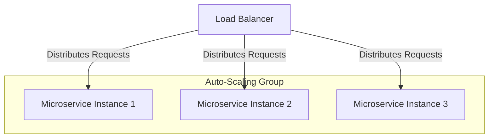

## 14.12. Scaling Microservices

Scaling microservices is a critical aspect of modern software architecture, enabling applications to handle increased loads efficiently. In this section, we will explore the principles of scaling applications, discuss load balancing and auto-scaling groups, provide examples of configuring scaling policies, and highlight considerations for stateful versus stateless services. We will also emphasize the role of metrics in making informed scaling decisions.

### Principles of Scaling Applications

Scaling an application involves increasing its capacity to handle more requests or data. There are two primary types of scaling:

1. **Horizontal Scaling (Scaling Out/In):** This involves adding more instances of a service to distribute the load. It is often preferred for its flexibility and cost-effectiveness.

2. **Vertical Scaling (Scaling Up/Down):** This involves increasing the resources (CPU, RAM) of an existing instance. While simpler, it has limitations and can lead to downtime.

#### Horizontal Scaling

Horizontal scaling is the process of adding more instances of a service to handle increased load. This approach is particularly effective for stateless services, where each instance can operate independently without sharing state.

**Advantages:**
- **Fault Tolerance:** If one instance fails, others can continue to serve requests.
- **Cost-Effective:** You can add or remove instances based on demand.
- **Flexibility:** Easily adjust the number of instances to match load.

**Challenges:**
- **State Management:** Requires careful handling of state, often using external storage or databases.
- **Load Balancing:** Needs a mechanism to distribute requests evenly across instances.

#### Vertical Scaling

Vertical scaling involves increasing the resources of an existing instance. This can be useful for stateful services that are difficult to distribute across multiple instances.

**Advantages:**
- **Simplicity:** Easier to implement as it involves upgrading existing hardware.
- **Compatibility:** Works well with legacy applications that are not designed for distributed environments.

**Challenges:**
- **Resource Limits:** There is a physical limit to how much you can scale a single instance.
- **Downtime:** Often requires restarting the service, leading to potential downtime.

### Load Balancing

Load balancing is a crucial component of scaling microservices. It ensures that incoming requests are distributed evenly across available instances, preventing any single instance from becoming a bottleneck.

#### Types of Load Balancers

1. **Hardware Load Balancers:** Physical devices that distribute traffic. They offer high performance but can be expensive.

2. **Software Load Balancers:** Applications that run on standard hardware. Examples include Nginx and HAProxy.

3. **Cloud Load Balancers:** Managed services provided by cloud platforms, such as AWS Elastic Load Balancer or Google Cloud Load Balancing.

#### Configuring Load Balancers

When configuring load balancers, consider the following:

- **Health Checks:** Ensure that the load balancer can detect and route traffic away from unhealthy instances.
- **Session Persistence:** Decide whether to maintain session state across requests (sticky sessions) or use stateless designs.
- **SSL Termination:** Offload SSL processing to the load balancer to reduce the load on application instances.

### Auto-Scaling Groups

Auto-scaling groups automatically adjust the number of running instances based on predefined policies. This ensures that your application can handle varying loads efficiently.

#### Configuring Auto-Scaling Policies

1. **Define Metrics:** Use metrics such as CPU utilization, memory usage, or request count to trigger scaling actions.

2. **Set Thresholds:** Determine the thresholds at which scaling should occur. For example, scale out when CPU usage exceeds 70%.

3. **Cooldown Periods:** Set cooldown periods to prevent rapid scaling actions that can lead to instability.

4. **Scaling Limits:** Define minimum and maximum instance counts to control resource usage and costs.

### Stateful vs. Stateless Services

The approach to scaling can differ significantly between stateful and stateless services.

#### Stateless Services

Stateless services do not retain any client-specific information between requests. This makes them ideal candidates for horizontal scaling.

**Considerations:**
- **Session Management:** Use external storage (e.g., Redis, databases) for session data.
- **Idempotency:** Ensure that repeated requests have the same effect as a single request.

#### Stateful Services

Stateful services maintain client-specific information, making them more challenging to scale horizontally.

**Considerations:**
- **Data Consistency:** Use distributed databases or data replication to maintain consistency.
- **Session Affinity:** Use sticky sessions or other mechanisms to route requests to the correct instance.

### The Role of Metrics in Scaling Decisions

Metrics play a vital role in making informed scaling decisions. By monitoring key performance indicators (KPIs), you can ensure that your application scales efficiently and cost-effectively.

#### Key Metrics to Monitor

1. **CPU and Memory Usage:** High usage may indicate the need for more instances or resources.
2. **Request Latency:** Increased latency can signal that instances are overloaded.
3. **Error Rates:** A spike in errors may indicate issues with specific instances or the need for more capacity.
4. **Throughput:** Monitor the number of requests processed over time to understand load patterns.

#### Using Metrics for Auto-Scaling

- **Threshold-Based Scaling:** Trigger scaling actions based on predefined thresholds for metrics like CPU usage.
- **Predictive Scaling:** Use machine learning models to predict future load and scale accordingly.
- **Scheduled Scaling:** Adjust instance counts based on known traffic patterns, such as peak hours.

### Code Example: Configuring Auto-Scaling in Clojure

Let's explore a simple example of configuring auto-scaling for a Clojure-based microservice using AWS.

```clojure
(ns myapp.autoscaling
  (:require [amazonica.aws.autoscaling :as autoscaling]))

(defn create-auto-scaling-group []
  (autoscaling/create-auto-scaling-group
    {:auto-scaling-group-name "myapp-asg"
     :launch-configuration-name "myapp-launch-config"
     :min-size 2
     :max-size 10
     :desired-capacity 4
     :availability-zones ["us-west-2a" "us-west-2b"]
     :health-check-type "EC2"
     :health-check-grace-period 300}))

(defn configure-scaling-policies []
  (autoscaling/put-scaling-policy
    {:auto-scaling-group-name "myapp-asg"
     :policy-name "scale-out"
     :scaling-adjustment 1
     :adjustment-type "ChangeInCapacity"
     :cooldown 300})

  (autoscaling/put-scaling-policy
    {:auto-scaling-group-name "myapp-asg"
     :policy-name "scale-in"
     :scaling-adjustment -1
     :adjustment-type "ChangeInCapacity"
     :cooldown 300}))
```

In this example, we define an auto-scaling group with a minimum of 2 instances and a maximum of 10. We also configure scaling policies to adjust the number of instances based on demand.

### Visualizing Microservice Scaling

To better understand the scaling process, let's visualize the architecture of a horizontally scaled microservice using a load balancer and auto-scaling group.



**Diagram Description:** This diagram illustrates a load balancer distributing requests across multiple instances of a microservice within an auto-scaling group. The auto-scaling group dynamically adjusts the number of instances based on load.

### Considerations for Scaling Microservices

When scaling microservices, consider the following best practices:

- **Design for Failure:** Assume that instances can fail and design your system to handle such failures gracefully.
- **Use Caching:** Implement caching strategies to reduce load on services and improve response times.
- **Optimize Database Access:** Use connection pooling and optimize queries to reduce database load.
- **Monitor Continuously:** Regularly monitor metrics to identify potential issues and optimize scaling policies.

### Try It Yourself

Experiment with the provided code example by modifying the scaling policies and observing the effects. Try adjusting the thresholds and cooldown periods to see how they impact the scaling behavior.

### Conclusion

Scaling microservices effectively requires a deep understanding of both the architecture and the operational environment. By leveraging horizontal and vertical scaling techniques, load balancing, auto-scaling groups, and metrics, you can ensure that your microservices architecture is robust, efficient, and capable of handling varying loads.

Remember, this is just the beginning. As you progress, you'll build more complex and scalable systems. Keep experimenting, stay curious, and enjoy the journey!

## **Ready to Test Your Knowledge?**



### What is the primary advantage of horizontal scaling?

- [x] It allows for fault tolerance and flexibility.
- [ ] It is simpler to implement than vertical scaling.
- [ ] It requires less hardware.
- [ ] It eliminates the need for load balancing.

> **Explanation:** Horizontal scaling allows for fault tolerance and flexibility by adding more instances, which can handle failures and adjust to varying loads.

### Which type of load balancer is managed by cloud platforms?

- [ ] Hardware Load Balancer
- [ ] Software Load Balancer
- [x] Cloud Load Balancer
- [ ] Manual Load Balancer

> **Explanation:** Cloud load balancers are managed services provided by cloud platforms like AWS and Google Cloud.

### What is a key consideration when scaling stateful services?

- [ ] Use of sticky sessions
- [x] Data consistency
- [ ] Avoiding load balancers
- [ ] Using only vertical scaling

> **Explanation:** Data consistency is crucial for stateful services to ensure that client-specific information is maintained across instances.

### What metric is commonly used to trigger auto-scaling actions?

- [ ] Disk Space Usage
- [x] CPU Usage
- [ ] Network Bandwidth
- [ ] Number of Users

> **Explanation:** CPU usage is a common metric used to trigger auto-scaling actions as it reflects the load on the instances.

### What is the purpose of a cooldown period in auto-scaling?

- [x] To prevent rapid scaling actions
- [ ] To increase scaling speed
- [ ] To reduce costs
- [ ] To eliminate the need for load balancing

> **Explanation:** Cooldown periods prevent rapid scaling actions that can lead to instability by allowing time for the system to stabilize.

### Which scaling technique is preferred for stateless services?

- [x] Horizontal Scaling
- [ ] Vertical Scaling
- [ ] Manual Scaling
- [ ] No Scaling

> **Explanation:** Horizontal scaling is preferred for stateless services as they can easily distribute load across multiple instances.

### What is a common challenge of vertical scaling?

- [ ] Complexity
- [x] Resource Limits
- [ ] Cost
- [ ] Load Balancing

> **Explanation:** Vertical scaling faces resource limits as there is a physical limit to how much you can scale a single instance.

### What role do metrics play in scaling decisions?

- [x] They provide data to make informed decisions.
- [ ] They eliminate the need for load balancers.
- [ ] They reduce the cost of scaling.
- [ ] They simplify the scaling process.

> **Explanation:** Metrics provide data to make informed scaling decisions, ensuring that scaling actions are based on actual performance indicators.

### Which of the following is NOT a type of load balancer?

- [ ] Hardware Load Balancer
- [ ] Software Load Balancer
- [ ] Cloud Load Balancer
- [x] Network Load Balancer

> **Explanation:** Network Load Balancer is a specific type of load balancer, but not a general category like hardware, software, or cloud load balancers.

### True or False: Stateless services are more challenging to scale horizontally than stateful services.

- [ ] True
- [x] False

> **Explanation:** Stateless services are easier to scale horizontally because they do not retain client-specific information, allowing them to distribute load across multiple instances more effectively.


