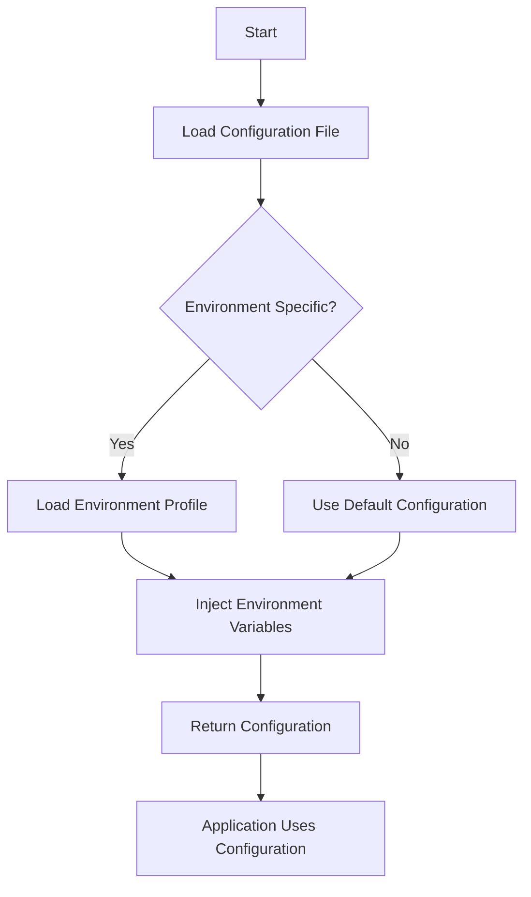

## 14.14. Configuration Management with Aero

In the world of microservices, managing configurations effectively is crucial for maintaining flexibility, security, and scalability. As applications grow in complexity, the need for a robust configuration management system becomes evident. This is where [Aero](https://github.com/juxt/aero) comes into play, offering a powerful solution for handling configurations in Clojure applications.

### Challenges of Configuration Management in Microservices

Microservices architecture introduces several challenges in configuration management:

- **Decentralization**: Each microservice may have its own configuration needs, leading to potential inconsistencies.
- **Environment-Specific Configurations**: Different environments (development, testing, production) require different configurations.
- **Security**: Sensitive information such as API keys and database credentials must be handled securely.
- **Scalability**: As the number of services grows, managing configurations manually becomes impractical.
- **Version Control**: Keeping track of configuration changes across multiple services and environments can be cumbersome.

### Introducing Aero

Aero is a Clojure library designed to address these challenges by providing a flexible and extensible way to manage configurations. It allows you to define configurations in a declarative manner, supporting features like parameterization, environment-specific settings, and secure handling of secrets.

#### Key Features of Aero

- **Declarative Configuration**: Define configurations using a simple and expressive syntax.
- **Environment-Specific Configurations**: Easily switch configurations based on the environment.
- **Parameterization**: Use placeholders and expressions to dynamically generate configuration values.
- **Secure Secrets Management**: Integrate secrets and environment variables securely.
- **Extensibility**: Customize and extend Aero to fit your specific needs.

### Getting Started with Aero

To start using Aero, add it to your project dependencies:

```clojure
;; Add Aero to your project.clj or deps.edn
:dependencies [[aero "1.1.6"]]
```

#### Basic Configuration Example

Let's create a basic configuration file using Aero:

```edn
;; config.edn
{:db {:host "localhost"
      :port 5432
      :user "admin"
      :password #env "DB_PASSWORD"}}
```

In this example, the `#env` tag is used to inject environment variables, allowing you to keep sensitive information like passwords out of your configuration files.

### Parameterizing Configurations per Environment

Aero makes it easy to define configurations for different environments. You can use the `:profiles` key to specify environment-specific settings:

```edn
;; config.edn
{:profiles {:dev  {:db {:host "localhost"}}
            :prod {:db {:host "prod-db-server"}}}
 :db {:port 5432
      :user "admin"
      :password #env "DB_PASSWORD"}}
```

To load the configuration for a specific environment, use the `aero.core/read-config` function:

```clojure
(require '[aero.core :refer [read-config]])

(def config (read-config "config.edn" {:profile :dev}))

(println (:db config))
```

### Secure Integration of Secrets and Environment Variables

Handling secrets securely is a critical aspect of configuration management. Aero provides a straightforward way to integrate secrets using environment variables or external secret management systems.

#### Using Environment Variables

Environment variables are a common way to manage secrets. Aero's `#env` tag allows you to reference environment variables directly in your configuration files:

```edn
;; config.edn
{:api-key #env "API_KEY"}
```

#### External Secrets Management

For more advanced use cases, consider integrating with external secret management systems like HashiCorp Vault or AWS Secrets Manager. Aero can be extended to fetch secrets from these systems, ensuring that sensitive information is never stored in plain text.

### Best Practices for Managing Configurations

Managing configurations effectively requires following best practices to ensure security, maintainability, and scalability.

#### Version Control

- **Store Configuration Files in Version Control**: Keep your configuration files in version control to track changes and facilitate collaboration.
- **Use Environment-Specific Branches**: Consider using branches or separate files for different environments to isolate changes.

#### Security

- **Avoid Hardcoding Secrets**: Never hardcode sensitive information in your configuration files. Use environment variables or external secret management systems.
- **Limit Access**: Restrict access to configuration files and secrets to only those who need it.

#### Maintainability

- **Use Descriptive Names**: Use clear and descriptive names for configuration keys to make them easily understandable.
- **Document Configurations**: Provide documentation for your configuration files to help others understand their purpose and usage.

### Integrating Aero with Code Repositories

Integrating Aero with your code repository involves organizing your configuration files and ensuring they are easily accessible and maintainable.

#### Organizing Configuration Files

- **Use a Consistent Directory Structure**: Place all configuration files in a dedicated directory, such as `config/`, to keep them organized.
- **Separate Environment-Specific Configurations**: Use separate files or directories for different environments to avoid confusion.

#### Automating Configuration Management

- **Use CI/CD Pipelines**: Automate the deployment of configurations using CI/CD pipelines to ensure consistency across environments.
- **Validate Configurations**: Implement validation checks to catch errors in configuration files before deployment.

### Visualizing Configuration Management with Aero

To better understand how Aero manages configurations, let's visualize the process using a flowchart:



**Figure 1**: This flowchart illustrates the process of loading and using configurations with Aero, highlighting the steps involved in handling environment-specific settings and injecting environment variables.

### Try It Yourself

Experiment with Aero by modifying the example configuration files and observing how changes affect the loaded configuration. Try adding new environment profiles or integrating with an external secret management system.

### Conclusion

Aero provides a powerful and flexible solution for managing configurations in Clojure microservices. By following best practices and leveraging Aero's features, you can ensure that your configurations are secure, maintainable, and scalable. Remember, effective configuration management is key to the success of any microservices architecture.

## **Ready to Test Your Knowledge?**



### What is a primary challenge of configuration management in microservices?

- [x] Decentralization
- [ ] Centralization
- [ ] Lack of scalability
- [ ] Overhead costs

> **Explanation:** Decentralization is a primary challenge because each microservice may have its own configuration needs, leading to potential inconsistencies.

### What is Aero primarily used for in Clojure applications?

- [x] Managing configurations
- [ ] Handling database connections
- [ ] Logging
- [ ] Testing

> **Explanation:** Aero is a library designed to manage configurations in Clojure applications.

### How does Aero handle environment-specific configurations?

- [x] Using the `:profiles` key
- [ ] By hardcoding values
- [ ] Through command-line arguments
- [ ] With separate configuration files

> **Explanation:** Aero uses the `:profiles` key to define configurations for different environments.

### Which Aero feature allows the use of environment variables in configurations?

- [x] `#env` tag
- [ ] `#profile` tag
- [ ] `#config` tag
- [ ] `#secret` tag

> **Explanation:** The `#env` tag in Aero allows the use of environment variables in configurations.

### What is a best practice for storing configuration files?

- [x] Store them in version control
- [ ] Keep them on local machines
- [ ] Share them via email
- [ ] Use cloud storage without access control

> **Explanation:** Storing configuration files in version control helps track changes and facilitates collaboration.

### What should you avoid when managing secrets in configuration files?

- [x] Hardcoding secrets
- [ ] Using environment variables
- [ ] External secret management
- [ ] Encrypting secrets

> **Explanation:** Hardcoding secrets is a security risk and should be avoided.

### What is a benefit of using Aero for configuration management?

- [x] Flexibility and extensibility
- [ ] Increased complexity
- [ ] Reduced security
- [ ] Manual configuration updates

> **Explanation:** Aero provides flexibility and extensibility in managing configurations.

### How can you automate configuration management in a CI/CD pipeline?

- [x] By deploying configurations automatically
- [ ] By manually updating configurations
- [ ] By using email notifications
- [ ] By ignoring configuration changes

> **Explanation:** Automating configuration deployment in a CI/CD pipeline ensures consistency across environments.

### What is a key consideration when organizing configuration files?

- [x] Use a consistent directory structure
- [ ] Randomly place files
- [ ] Use a single file for all environments
- [ ] Avoid documentation

> **Explanation:** A consistent directory structure helps keep configuration files organized and maintainable.

### True or False: Aero can integrate with external secret management systems.

- [x] True
- [ ] False

> **Explanation:** Aero can be extended to integrate with external secret management systems for secure handling of secrets.


