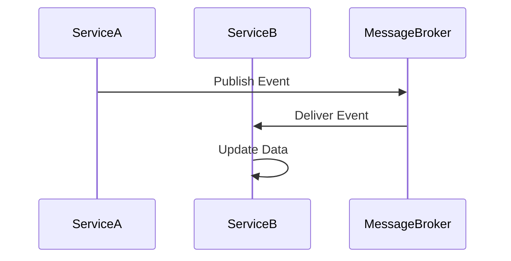

## 14.15. Data Management in Microservices

In the realm of microservices, data management is a critical aspect that can significantly impact the scalability, reliability, and performance of your applications. Unlike monolithic architectures, where data is typically centralized, microservices encourage a decentralized approach to data management. This section delves into the strategies and patterns for managing data in a microservices architecture, focusing on consistency, replication, and storage.

### Decentralized Data Management

Decentralized data management is a core principle of microservices architecture. Each microservice is responsible for its own data, which promotes autonomy and scalability. This approach allows services to evolve independently without being tightly coupled to a central database.

#### Key Concepts

- **Service-Specific Databases**: Each microservice has its own database, which can be of different types (SQL, NoSQL, etc.) depending on the service's requirements.
- **Data Ownership**: Services own their data and are responsible for its integrity and consistency.
- **Loose Coupling**: By decentralizing data, services are loosely coupled, reducing the risk of cascading failures.

#### Benefits

- **Scalability**: Services can scale independently, optimizing resources based on specific needs.
- **Resilience**: Failures in one service do not directly affect others.
- **Flexibility**: Different services can use the most appropriate database technology for their needs.

### Patterns for Data Synchronization and Replication

In a decentralized architecture, data synchronization and replication are crucial for maintaining consistency across services. Here are some common patterns:

#### Event Sourcing

Event sourcing involves capturing all changes to an application's state as a sequence of events. This pattern is particularly useful for maintaining a reliable audit trail and reconstructing past states.

```clojure
(defn apply-event [state event]
  ;; Apply an event to the current state
  (case (:type event)
    :user-created (assoc state :user (:data event))
    :user-updated (merge state (:data event))
    state))

(defn replay-events [events]
  ;; Replay a sequence of events to build the current state
  (reduce apply-event {} events))

;; Example usage
(def events [{:type :user-created :data {:id 1 :name "Alice"}}
             {:type :user-updated :data {:name "Alice Smith"}}])

(replay-events events)
```

#### Command Query Responsibility Segregation (CQRS)

CQRS separates the read and write operations, allowing for optimized data handling. This pattern is beneficial when read and write operations have different performance requirements.

```clojure
(defn handle-command [command]
  ;; Process a command and return the result
  (case (:type command)
    :create-user (create-user (:data command))
    :update-user (update-user (:data command))
    nil))

(defn query-user [user-id]
  ;; Query user data
  (get-user-from-db user-id))
```

#### Event-Driven Data Propagation

Event-driven architecture is a natural fit for microservices, enabling asynchronous communication and data propagation. Services publish events when their data changes, and other services subscribe to these events to update their own data accordingly.

```clojure
(defn publish-event [event]
  ;; Publish an event to a message broker
  (send-to-broker event))

(defn subscribe-to-events [handler]
  ;; Subscribe to events and handle them
  (receive-from-broker handler))

;; Example usage
(subscribe-to-events (fn [event]
                       (println "Received event:" event)))
```

### Challenges with Transactions and Consistency Models

Managing transactions and consistency in a distributed system is inherently challenging. Traditional ACID (Atomicity, Consistency, Isolation, Durability) transactions are difficult to achieve across multiple services.

#### Consistency Models

- **Eventual Consistency**: Guarantees that, given enough time, all replicas will converge to the same state. This model is suitable for systems where immediate consistency is not critical.
- **Strong Consistency**: Ensures that all replicas see the same data at the same time. This model is more challenging to implement in a distributed system.

#### Strategies for Managing Transactions

- **Saga Pattern**: A saga is a sequence of local transactions where each transaction updates the data within a single service. If a transaction fails, compensating transactions are executed to undo the changes.
- **Two-Phase Commit (2PC)**: A distributed algorithm that ensures all participants in a transaction agree to commit or abort the transaction. While it provides strong consistency, it can be complex and slow.

### Designing Services with Data Independence

Designing services with data independence is crucial for maintaining the flexibility and scalability of a microservices architecture.

#### Best Practices

- **Define Clear Boundaries**: Clearly define the boundaries of each service and its data. Avoid sharing databases between services.
- **Use APIs for Data Access**: Services should access data through well-defined APIs rather than directly accessing each other's databases.
- **Implement Data Caching**: Use caching to reduce the load on services and improve performance.

### Visualizing Data Management in Microservices

To better understand the flow of data in a microservices architecture, let's visualize the interaction between services using a sequence diagram.



This diagram illustrates how Service A publishes an event to a message broker, which then delivers the event to Service B. Service B updates its data based on the event.

### Try It Yourself

To deepen your understanding of data management in microservices, try modifying the code examples provided. Experiment with different event types and data structures. Consider implementing a simple event-driven system using Clojure and a message broker like RabbitMQ or Kafka.

### References and Further Reading

- [Microservices Patterns: With examples in Java](https://www.amazon.com/Microservices-Patterns-examples-Chris-Richardson/dp/1617294543) by Chris Richardson
- [Building Microservices: Designing Fine-Grained Systems](https://www.amazon.com/Building-Microservices-Designing-Fine-Grained-Systems/dp/1491950358) by Sam Newman
- [Event-Driven Microservices](https://www.oreilly.com/library/view/event-driven-microservices/9781492057888/) by Hugh McKee

### Knowledge Check

To reinforce your understanding of data management in microservices, consider the following questions and exercises.

## **Ready to Test Your Knowledge?**



### What is a key benefit of decentralized data management in microservices?

- [x] Scalability and resilience
- [ ] Centralized control
- [ ] Reduced complexity
- [ ] Easier debugging

> **Explanation:** Decentralized data management allows services to scale independently and enhances resilience by isolating failures.

### Which pattern involves capturing all changes to an application's state as a sequence of events?

- [x] Event Sourcing
- [ ] CQRS
- [ ] Saga Pattern
- [ ] Two-Phase Commit

> **Explanation:** Event sourcing captures all changes as events, providing a reliable audit trail and enabling state reconstruction.

### What does CQRS stand for?

- [x] Command Query Responsibility Segregation
- [ ] Consistent Query Response System
- [ ] Command Queue Replication Service
- [ ] Centralized Query Resource System

> **Explanation:** CQRS stands for Command Query Responsibility Segregation, a pattern that separates read and write operations.

### What is a common challenge with transactions in microservices?

- [x] Achieving ACID properties across services
- [ ] Implementing eventual consistency
- [ ] Handling large data volumes
- [ ] Ensuring data independence

> **Explanation:** Achieving ACID properties across distributed services is challenging due to the lack of a central transaction manager.

### Which consistency model guarantees that all replicas see the same data at the same time?

- [x] Strong Consistency
- [ ] Eventual Consistency
- [ ] Weak Consistency
- [ ] Causal Consistency

> **Explanation:** Strong consistency ensures that all replicas have the same data simultaneously, which is difficult to achieve in distributed systems.

### What is the primary role of a message broker in an event-driven architecture?

- [x] Deliver events between services
- [ ] Store service data
- [ ] Manage service configurations
- [ ] Execute service logic

> **Explanation:** A message broker facilitates communication by delivering events between services in an event-driven architecture.

### Which pattern is used to manage distributed transactions in microservices?

- [x] Saga Pattern
- [ ] Event Sourcing
- [ ] CQRS
- [ ] Two-Phase Commit

> **Explanation:** The Saga Pattern manages distributed transactions by executing a sequence of local transactions with compensating actions for failures.

### What is a key consideration when designing services with data independence?

- [x] Define clear boundaries and use APIs for data access
- [ ] Share databases between services
- [ ] Use a single database for all services
- [ ] Avoid caching data

> **Explanation:** Defining clear boundaries and using APIs for data access ensures services remain independent and loosely coupled.

### True or False: Eventual consistency guarantees immediate consistency across all replicas.

- [ ] True
- [x] False

> **Explanation:** Eventual consistency does not guarantee immediate consistency; it ensures that replicas will eventually converge to the same state.

### Which pattern separates read and write operations to optimize data handling?

- [x] CQRS
- [ ] Event Sourcing
- [ ] Saga Pattern
- [ ] Two-Phase Commit

> **Explanation:** CQRS separates read and write operations, allowing for optimized data handling based on specific performance requirements.



Remember, mastering data management in microservices is an ongoing journey. Keep experimenting, stay curious, and enjoy the process of building robust, scalable systems!
