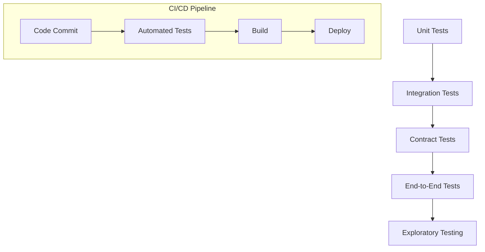

## 14.16. Testing Strategies for Microservices

In the world of microservices, testing becomes a critical component to ensure that each service functions correctly and integrates seamlessly with others. Given the distributed nature of microservices, traditional testing strategies need to be adapted to address the unique challenges they present. In this section, we will explore various testing strategies specific to microservices, including contract testing, integration testing, and end-to-end testing. We will also discuss the pyramid of tests, tools for mocking and stubbing services, and the importance of test automation and continuous testing.

### The Pyramid of Tests in Microservices

The testing pyramid is a concept that helps developers understand the different levels of testing and their importance. It is particularly relevant in the context of microservices, where multiple services interact with each other.

#### Levels of the Testing Pyramid

1. **Unit Tests**: These are the foundation of the pyramid. Unit tests focus on testing individual components or functions in isolation. They are fast, reliable, and provide immediate feedback to developers.

2. **Integration Tests**: These tests verify the interaction between different components or services. In a microservices architecture, integration tests ensure that services can communicate and work together as expected.

3. **Contract Tests**: Contract testing is crucial in microservices to ensure that services adhere to agreed-upon interfaces. This prevents breaking changes when services are updated.

4. **End-to-End Tests**: These tests simulate real user scenarios and validate the entire system's behavior. They are the most comprehensive but also the most complex and time-consuming.

5. **Exploratory Testing**: While not part of the pyramid, exploratory testing is essential for discovering unexpected issues and ensuring a high-quality user experience.

### Unit Testing in Microservices

Unit testing is the first line of defense in ensuring code quality. In microservices, unit tests should focus on individual service logic without external dependencies.

#### Example: Unit Testing a Clojure Function

```clojure
(ns myapp.core-test
  (:require [clojure.test :refer :all]
            [myapp.core :refer :all]))

(deftest test-addition
  (testing "Addition of two numbers"
    (is (= 4 (add 2 2)))
    (is (= 0 (add -1 1)))))
```

In this example, we define a simple unit test for an `add` function. Unit tests should be fast and cover as many edge cases as possible.

### Integration Testing in Microservices

Integration testing in microservices involves testing the interactions between services. This can be challenging due to the distributed nature of microservices.

#### Example: Integration Testing with Mocking

```clojure
(ns myapp.integration-test
  (:require [clojure.test :refer :all]
            [myapp.service-a :as service-a]
            [myapp.service-b :as service-b]
            [clj-http.client :as client]))

(deftest test-service-interaction
  (with-redefs [client/get (fn [_] {:status 200 :body "mock response"})]
    (is (= "mock response" (service-a/call-service-b)))))
```

In this example, we use `with-redefs` to mock the HTTP client used by `service-a` to call `service-b`. This allows us to test the interaction without relying on the actual service.

### Contract Testing in Microservices

Contract testing ensures that services adhere to a predefined contract, preventing breaking changes when services are updated.

#### Example: Contract Testing with Pact

Pact is a popular tool for contract testing in microservices. It allows you to define and verify contracts between services.

```clojure
(ns myapp.contract-test
  (:require [pact-clj.core :as pact]))

(defn provider-state []
  ;; Define provider state
  )

(defn verify-contract []
  (pact/verify {:provider "ServiceA"
                :consumer "ServiceB"
                :provider-state provider-state
                :pact-file "path/to/pact.json"}))
```

In this example, we use Pact to verify the contract between `ServiceA` and `ServiceB`. Contract testing helps ensure that services can evolve independently without breaking existing integrations.

### End-to-End Testing in Microservices

End-to-end testing simulates real user scenarios and validates the entire system's behavior. These tests are comprehensive but can be complex and time-consuming.

#### Example: End-to-End Testing with Selenium

Selenium is a popular tool for end-to-end testing of web applications. It allows you to automate browser interactions and validate user workflows.

```clojure
(ns myapp.e2e-test
  (:require [clj-webdriver.core :as wd]))

(defn test-login-flow []
  (let [driver (wd/new-driver {:browser :firefox})]
    (wd/to driver "http://myapp.com/login")
    (wd/input-text driver {:id "username"} "testuser")
    (wd/input-text driver {:id "password"} "password")
    (wd/click driver {:id "login-button"})
    (is (= "Welcome, testuser!" (wd/text driver {:id "welcome-message"})))
    (wd/quit driver)))
```

In this example, we use Selenium to automate a login flow in a web application. End-to-end tests should cover critical user journeys and ensure that the system behaves as expected.

### Challenges and Solutions in End-to-End Testing

End-to-end testing in microservices presents several challenges, including:

- **Complexity**: Testing the entire system can be complex due to the number of services involved.
- **Flakiness**: Tests can be flaky due to network issues or service dependencies.
- **Maintenance**: Keeping tests up-to-date with changing requirements can be challenging.

#### Solutions

- **Test Isolation**: Use test doubles or mocks to isolate services and reduce dependencies.
- **Retry Mechanisms**: Implement retry mechanisms to handle transient failures.
- **Continuous Testing**: Automate tests and integrate them into the CI/CD pipeline for continuous feedback.

### Test Automation and Continuous Testing

Test automation is crucial in microservices to ensure that tests are repeatable and provide quick feedback. Continuous testing involves integrating automated tests into the CI/CD pipeline to catch issues early.

#### Example: Automating Tests with Jenkins

Jenkins is a popular tool for automating tests and integrating them into the CI/CD pipeline.

```groovy
pipeline {
    agent any
    stages {
        stage('Build') {
            steps {
                sh 'lein test'
            }
        }
        stage('Test') {
            steps {
                sh 'lein test'
            }
        }
        stage('Deploy') {
            steps {
                sh 'lein deploy'
            }
        }
    }
}
```

In this example, we define a Jenkins pipeline that builds, tests, and deploys a Clojure application. Automating tests ensures that they are run consistently and provide quick feedback to developers.

### Visualizing Testing Strategies

To better understand the testing strategies for microservices, let's visualize the testing pyramid and the flow of tests in a CI/CD pipeline.



In this diagram, we see the testing pyramid with unit tests at the base and exploratory testing at the top. The CI/CD pipeline integrates automated tests to ensure continuous feedback and quality assurance.

### Key Takeaways

- **Testing Pyramid**: Use the testing pyramid to guide your testing strategy, focusing on unit tests and gradually moving up to end-to-end tests.
- **Contract Testing**: Implement contract testing to ensure service compatibility and prevent breaking changes.
- **Test Automation**: Automate tests and integrate them into the CI/CD pipeline for continuous feedback and quality assurance.
- **End-to-End Testing**: Address the challenges of end-to-end testing by isolating services, implementing retry mechanisms, and maintaining tests.

### Ready to Test Your Knowledge?



### What is the primary purpose of unit tests in microservices?

- [x] To test individual components or functions in isolation
- [ ] To test the interaction between services
- [ ] To simulate real user scenarios
- [ ] To ensure service compatibility

> **Explanation:** Unit tests focus on testing individual components or functions in isolation, providing fast and reliable feedback.

### Which tool is commonly used for contract testing in microservices?

- [ ] Selenium
- [x] Pact
- [ ] Jenkins
- [ ] JUnit

> **Explanation:** Pact is a popular tool for contract testing in microservices, allowing you to define and verify contracts between services.

### What is a common challenge in end-to-end testing of microservices?

- [ ] Lack of test automation
- [x] Complexity due to multiple services
- [ ] Insufficient unit tests
- [ ] Lack of CI/CD integration

> **Explanation:** End-to-end testing can be complex due to the number of services involved and their interactions.

### How can you address flaky tests in end-to-end testing?

- [ ] Increase test coverage
- [ ] Reduce the number of tests
- [x] Implement retry mechanisms
- [ ] Use more unit tests

> **Explanation:** Implementing retry mechanisms can help address flaky tests caused by transient failures.

### What is the role of the CI/CD pipeline in testing microservices?

- [ ] To replace manual testing
- [x] To automate tests and provide continuous feedback
- [ ] To eliminate the need for unit tests
- [ ] To deploy services without testing

> **Explanation:** The CI/CD pipeline automates tests and integrates them into the development process, providing continuous feedback and quality assurance.

### Which level of the testing pyramid focuses on testing service interactions?

- [ ] Unit Tests
- [x] Integration Tests
- [ ] Contract Tests
- [ ] End-to-End Tests

> **Explanation:** Integration tests focus on testing the interactions between different components or services.

### What is the benefit of contract testing in microservices?

- [ ] It reduces the need for unit tests
- [x] It ensures service compatibility and prevents breaking changes
- [ ] It simplifies end-to-end testing
- [ ] It eliminates the need for integration tests

> **Explanation:** Contract testing ensures that services adhere to agreed-upon interfaces, preventing breaking changes when services are updated.

### How can test automation benefit microservices testing?

- [ ] By reducing test coverage
- [x] By making tests repeatable and providing quick feedback
- [ ] By eliminating the need for manual testing
- [ ] By simplifying test maintenance

> **Explanation:** Test automation makes tests repeatable and provides quick feedback, ensuring consistent quality assurance.

### What is a key takeaway from the testing pyramid?

- [ ] Focus only on end-to-end tests
- [ ] Ignore unit tests
- [x] Use a balanced approach with more unit tests and fewer end-to-end tests
- [ ] Eliminate integration tests

> **Explanation:** The testing pyramid emphasizes a balanced approach, with more unit tests at the base and fewer end-to-end tests at the top.

### True or False: Exploratory testing is part of the testing pyramid.

- [ ] True
- [x] False

> **Explanation:** Exploratory testing is not part of the testing pyramid but is essential for discovering unexpected issues and ensuring a high-quality user experience.



Remember, testing is an ongoing process. As you continue to develop and evolve your microservices, keep refining your testing strategies to ensure robust and reliable systems. Happy testing!
