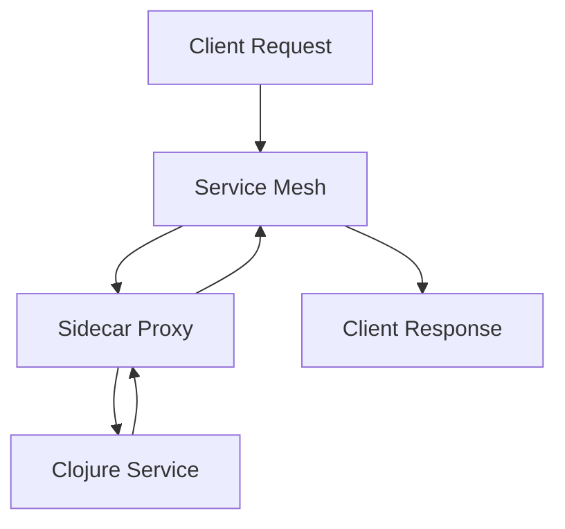

## 14.17. Sidecar Pattern and Service Mesh Integration

In the realm of microservices architecture, the Sidecar pattern and service mesh integration have emerged as pivotal components for managing complex service interactions. This section delves into the Sidecar pattern, its benefits, and how integrating service meshes like [Istio](https://istio.io/) can enhance your Clojure microservices with advanced networking features such as traffic management, security, and observability.

### Understanding the Sidecar Pattern

#### Design Pattern Name
**Sidecar Pattern**

#### Category
**Microservices Design Patterns**

#### Intent
The Sidecar pattern aims to augment a primary application with additional capabilities by deploying auxiliary components alongside it. These components, or "sidecars," handle cross-cutting concerns such as logging, monitoring, and networking without altering the main application code.

#### Key Participants
- **Primary Service**: The main application or microservice.
- **Sidecar**: An auxiliary service that runs alongside the primary service, providing additional functionalities.

#### Applicability
Use the Sidecar pattern when you need to:
- Decouple cross-cutting concerns from the main application logic.
- Enhance modularity and maintainability of microservices.
- Simplify the integration of third-party tools and services.

#### Benefits of the Sidecar Pattern
- **Separation of Concerns**: By offloading responsibilities to the sidecar, the primary service remains focused on its core functionality.
- **Reusability**: Sidecars can be reused across different services, promoting consistency and reducing duplication.
- **Scalability**: Sidecars can be independently scaled, allowing for flexible resource allocation.

### Integrating Service Meshes

#### What is a Service Mesh?
A service mesh is an infrastructure layer that manages service-to-service communication within a microservices architecture. It provides features like load balancing, service discovery, traffic management, and security, often without requiring changes to the application code.

#### Key Features of Service Meshes
- **Traffic Management**: Control the flow of traffic between services with features like routing, retries, and circuit breaking.
- **Security**: Implement security policies such as mutual TLS, authentication, and authorization.
- **Observability**: Gain insights into service interactions through metrics, logging, and tracing.

#### Service Mesh Integration with Istio
Istio is a popular open-source service mesh that provides a robust set of features for managing microservices. It uses the Sidecar pattern by deploying an Envoy proxy alongside each service instance.

#### Deploying Clojure Services with Istio
To deploy Clojure services with Istio, follow these steps:

1. **Install Istio**: Set up Istio on your Kubernetes cluster. Refer to the [Istio documentation](https://istio.io/latest/docs/setup/) for installation instructions.

2. **Configure Sidecar Injection**: Enable automatic sidecar injection for your Clojure services. This involves adding annotations to your Kubernetes deployment configurations.

   ```yaml
   apiVersion: apps/v1
   kind: Deployment
   metadata:
     name: clojure-service
     labels:
       app: clojure-service
     annotations:
       sidecar.istio.io/inject: "true"
   spec:
     replicas: 2
     selector:
       matchLabels:
         app: clojure-service
     template:
       metadata:
         labels:
           app: clojure-service
       spec:
         containers:
         - name: clojure-app
           image: clojure-app:latest
   ```

3. **Define Traffic Management Policies**: Use Istio's VirtualService and DestinationRule resources to manage traffic routing and load balancing.

   ```yaml
   apiVersion: networking.istio.io/v1alpha3
   kind: VirtualService
   metadata:
     name: clojure-service
   spec:
     hosts:
     - clojure-service
     http:
     - route:
       - destination:
           host: clojure-service
           subset: v1
   ```

4. **Implement Security Policies**: Configure mutual TLS and access control policies to secure service communication.

   ```yaml
   apiVersion: security.istio.io/v1beta1
   kind: PeerAuthentication
   metadata:
     name: default
   spec:
     mtls:
       mode: STRICT
   ```

5. **Enhance Observability**: Leverage Istio's telemetry features to monitor service interactions and performance.

   ```yaml
   apiVersion: telemetry.istio.io/v1alpha1
   kind: Telemetry
   metadata:
     name: clojure-service
   spec:
     metrics:
     - providers:
       - name: prometheus
   ```

### Configuration and Observability Enhancements

#### Configuration Management
Service meshes like Istio provide centralized configuration management, allowing you to define and apply policies across your microservices consistently. This reduces configuration drift and simplifies management.

#### Observability
With built-in observability features, Istio enables you to collect metrics, logs, and traces from your Clojure services. This data can be visualized using tools like Grafana and Jaeger, providing insights into service performance and helping diagnose issues.

### Considerations for Complexity and Overhead

While the Sidecar pattern and service mesh integration offer numerous benefits, they also introduce additional complexity and overhead. Consider the following:

- **Resource Consumption**: Sidecars consume additional CPU and memory resources, which can impact overall system performance.
- **Operational Complexity**: Managing a service mesh requires additional operational expertise and tooling.
- **Latency**: The introduction of sidecars can add latency to service communication, which may affect performance-sensitive applications.

### Clojure Unique Features

Clojure's functional programming paradigm and immutable data structures align well with the principles of microservices and service mesh architectures. The language's emphasis on simplicity and composability makes it an excellent choice for building robust and maintainable microservices.

### Differences and Similarities

The Sidecar pattern is often confused with the Ambassador and Adapter patterns. While all three involve auxiliary components, the Sidecar pattern specifically focuses on augmenting a single service instance, whereas the Ambassador pattern acts as a proxy for external communication, and the Adapter pattern modifies interfaces to make them compatible.

### Visualizing the Sidecar Pattern and Service Mesh Integration



**Figure 1**: This diagram illustrates the flow of a client request through a service mesh, with the sidecar proxy handling communication with the Clojure service.

### Try It Yourself

Experiment with deploying a simple Clojure service using Istio. Modify the traffic management policies to see how they affect service behavior. Try enabling and disabling mutual TLS to observe its impact on security.

### References and Links

- [Istio Documentation](https://istio.io/latest/docs/)
- [Kubernetes Documentation](https://kubernetes.io/docs/home/)
- [Envoy Proxy](https://www.envoyproxy.io/)

### Knowledge Check

To reinforce your understanding of the Sidecar pattern and service mesh integration, consider the following questions and exercises.

## **Ready to Test Your Knowledge?**



### What is the primary purpose of the Sidecar pattern?

- [x] To augment a primary application with additional capabilities.
- [ ] To replace the main application logic.
- [ ] To act as a standalone service.
- [ ] To manage database connections.

> **Explanation:** The Sidecar pattern is used to enhance a primary application by providing additional functionalities without altering the main application code.

### Which of the following is a key feature of a service mesh?

- [x] Traffic management
- [ ] Database optimization
- [ ] User authentication
- [ ] File storage

> **Explanation:** A service mesh provides traffic management, security, and observability features for microservices.

### How does Istio implement the Sidecar pattern?

- [x] By deploying an Envoy proxy alongside each service instance.
- [ ] By modifying the application code directly.
- [ ] By using a centralized server for all services.
- [ ] By integrating with the operating system.

> **Explanation:** Istio uses the Sidecar pattern by deploying an Envoy proxy alongside each service instance to manage communication.

### What is a potential drawback of using the Sidecar pattern?

- [x] Increased resource consumption
- [ ] Reduced security
- [ ] Simplified configuration
- [ ] Decreased latency

> **Explanation:** The Sidecar pattern can increase resource consumption due to the additional components running alongside the primary service.

### Which tool can be used to visualize metrics collected by Istio?

- [x] Grafana
- [ ] Docker
- [ ] Jenkins
- [ ] Git

> **Explanation:** Grafana is commonly used to visualize metrics collected by Istio.

### What is the role of a sidecar in a microservices architecture?

- [x] To handle cross-cutting concerns
- [ ] To replace the main service
- [ ] To manage user sessions
- [ ] To store application data

> **Explanation:** A sidecar handles cross-cutting concerns such as logging, monitoring, and networking.

### Which of the following is NOT a benefit of the Sidecar pattern?

- [ ] Separation of concerns
- [ ] Reusability
- [x] Increased latency
- [ ] Scalability

> **Explanation:** Increased latency is a potential drawback, not a benefit, of the Sidecar pattern.

### What is mutual TLS used for in a service mesh?

- [x] To secure service communication
- [ ] To enhance database performance
- [ ] To manage user authentication
- [ ] To optimize file storage

> **Explanation:** Mutual TLS is used to secure communication between services in a service mesh.

### Which pattern is often confused with the Sidecar pattern?

- [x] Ambassador pattern
- [ ] Singleton pattern
- [ ] Factory pattern
- [ ] Observer pattern

> **Explanation:** The Ambassador pattern is often confused with the Sidecar pattern, but they serve different purposes.

### True or False: The Sidecar pattern can be used to decouple cross-cutting concerns from the main application logic.

- [x] True
- [ ] False

> **Explanation:** True. The Sidecar pattern is designed to decouple cross-cutting concerns from the main application logic.



Remember, this is just the beginning. As you progress, you'll build more complex and interactive microservices architectures. Keep experimenting, stay curious, and enjoy the journey!

---
