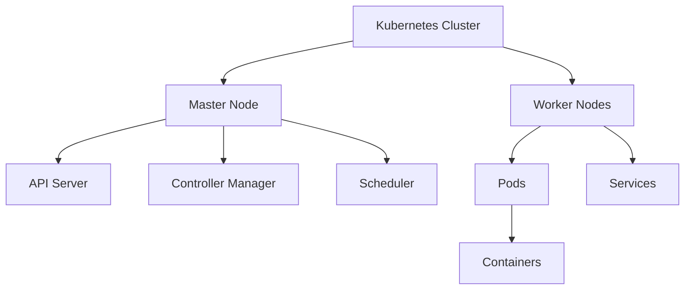

## 14.18. Containerization with Docker and Kubernetes

Containerization has revolutionized the way we develop, deploy, and manage applications. By encapsulating applications and their dependencies into containers, developers can ensure consistency across different environments. Docker and Kubernetes are two of the most popular tools in this domain, providing powerful solutions for containerization and orchestration, respectively. In this section, we will explore how to containerize Clojure microservices using Docker and manage them with Kubernetes for scalable and efficient deployments.

### Benefits of Containerization

Before diving into the technical details, let's discuss the benefits of containerization:

1. **Consistency Across Environments**: Containers ensure that your application runs the same way in development, testing, and production environments, eliminating the "it works on my machine" problem.

2. **Isolation**: Containers provide a lightweight form of virtualization, isolating applications from each other and the host system, which enhances security and stability.

3. **Scalability**: Containers can be easily scaled up or down to handle varying loads, making them ideal for microservices architectures.

4. **Portability**: Containers can run on any system that supports Docker, whether it's a developer's laptop, an on-premise server, or a cloud platform.

5. **Efficiency**: Containers share the host OS kernel, making them more resource-efficient compared to traditional virtual machines.

### Building Docker Images for Clojure Applications

Docker images are the blueprint for containers. They contain everything needed to run an application, including the code, runtime, libraries, and environment variables. Let's go through the steps to build a Docker image for a Clojure application.

#### Step 1: Create a Dockerfile

A Dockerfile is a text document that contains all the commands to assemble an image. Here's an example Dockerfile for a simple Clojure application:

```dockerfile
# Use the official Clojure image as the base
FROM clojure:openjdk-11-lein

# Set the working directory
WORKDIR /app

# Copy the project files
COPY . .

# Build the application
RUN lein uberjar

# Run the application
CMD ["java", "-jar", "target/uberjar/myapp.jar"]
```

**Explanation:**

- **FROM**: Specifies the base image. Here, we use the official Clojure image with OpenJDK 11 and Leiningen.
- **WORKDIR**: Sets the working directory inside the container.
- **COPY**: Copies the application files into the container.
- **RUN**: Executes commands inside the container. We use it to build the application with `lein uberjar`.
- **CMD**: Specifies the command to run the application.

#### Step 2: Build the Docker Image

To build the Docker image, navigate to the directory containing the Dockerfile and run the following command:

```bash
docker build -t my-clojure-app .
```

This command builds the image and tags it as `my-clojure-app`.

#### Step 3: Run the Docker Container

Once the image is built, you can run it as a container using:

```bash
docker run -p 8080:8080 my-clojure-app
```

This command maps port 8080 of the container to port 8080 on the host, allowing you to access the application via `http://localhost:8080`.

### Introducing Kubernetes Concepts

Kubernetes is an open-source platform designed to automate deploying, scaling, and operating application containers. It abstracts the underlying infrastructure and provides a unified API to manage containerized applications. Let's introduce some key Kubernetes concepts:

#### Pods

A Pod is the smallest deployable unit in Kubernetes. It represents a single instance of a running process in your cluster. Pods can contain one or more containers that share the same network namespace and storage.

#### Services

A Service in Kubernetes is an abstraction that defines a logical set of Pods and a policy to access them. Services enable communication between different parts of your application and can expose your application to the outside world.

#### Deployments

A Deployment provides declarative updates for Pods and ReplicaSets. It allows you to define the desired state of your application and manages the process of reaching that state, including scaling and rolling updates.

### Configuring Kubernetes Manifests for Clojure Services

To deploy a Clojure application on Kubernetes, you need to create YAML manifests that define the desired state of your application. Let's create a simple Kubernetes deployment and service for our Clojure application.

#### Deployment Manifest

```yaml
apiVersion: apps/v1
kind: Deployment
metadata:
  name: my-clojure-app
spec:
  replicas: 3
  selector:
    matchLabels:
      app: my-clojure-app
  template:
    metadata:
      labels:
        app: my-clojure-app
    spec:
      containers:
      - name: my-clojure-app
        image: my-clojure-app:latest
        ports:
        - containerPort: 8080
```

**Explanation:**

- **apiVersion**: Specifies the API version of the resource.
- **kind**: Defines the type of resource, in this case, a Deployment.
- **metadata**: Contains metadata about the resource, such as its name.
- **spec**: Defines the desired state of the resource.
- **replicas**: Specifies the number of Pod replicas.
- **selector**: Matches the Pods to manage.
- **template**: Defines the Pod template, including the container image and ports.

#### Service Manifest

```yaml
apiVersion: v1
kind: Service
metadata:
  name: my-clojure-app
spec:
  selector:
    app: my-clojure-app
  ports:
    - protocol: TCP
      port: 80
      targetPort: 8080
  type: LoadBalancer
```

**Explanation:**

- **kind**: Defines the type of resource, in this case, a Service.
- **selector**: Matches the Pods to expose.
- **ports**: Defines the ports for the service.
- **type**: Specifies the service type. `LoadBalancer` exposes the service externally.

### Deploying to Kubernetes

To deploy your Clojure application to Kubernetes, apply the manifests using the `kubectl` command-line tool:

```bash
kubectl apply -f deployment.yaml
kubectl apply -f service.yaml
```

These commands create the Deployment and Service resources in your Kubernetes cluster.

### Best Practices for Resource Management and Scaling

When deploying applications on Kubernetes, it's important to follow best practices for resource management and scaling:

1. **Resource Requests and Limits**: Define resource requests and limits for your containers to ensure they have enough CPU and memory to run efficiently.

2. **Horizontal Pod Autoscaling**: Use Horizontal Pod Autoscalers to automatically scale the number of Pods based on CPU utilization or other metrics.

3. **Rolling Updates**: Configure rolling updates to minimize downtime when deploying new versions of your application.

4. **Monitoring and Logging**: Implement monitoring and logging solutions to gain insights into your application's performance and troubleshoot issues.

5. **Security Best Practices**: Follow security best practices, such as running containers as non-root users and using network policies to control traffic.

### Visualizing Kubernetes Architecture

To better understand how Kubernetes manages containerized applications, let's visualize its architecture using a Mermaid.js diagram.



**Diagram Description**: This diagram illustrates the architecture of a Kubernetes cluster. The Master Node manages the cluster and consists of components like the API Server, Controller Manager, and Scheduler. Worker Nodes run the application Pods, which contain the containers. Services enable communication between Pods and external clients.

### Try It Yourself

To solidify your understanding, try modifying the Dockerfile and Kubernetes manifests to:

- Change the base image to a different version of Clojure.
- Add environment variables to the Dockerfile and pass them to the application.
- Update the Kubernetes Deployment to use a different number of replicas.
- Experiment with different service types, such as `NodePort` or `ClusterIP`.

### External Resources

For more information on Docker and Kubernetes, check out the following resources:

- [Docker](https://www.docker.com/)
- [Kubernetes](https://kubernetes.io/)

## **Ready to Test Your Knowledge?**



### What is the primary benefit of containerization?

- [x] Consistency across environments
- [ ] Increased memory usage
- [ ] Reduced security
- [ ] Slower deployment times

> **Explanation:** Containerization ensures that applications run consistently across different environments, eliminating the "it works on my machine" problem.

### Which command is used to build a Docker image?

- [x] docker build
- [ ] docker run
- [ ] docker create
- [ ] docker start

> **Explanation:** The `docker build` command is used to build a Docker image from a Dockerfile.

### What is a Pod in Kubernetes?

- [x] The smallest deployable unit in Kubernetes
- [ ] A collection of services
- [ ] A type of container
- [ ] A network protocol

> **Explanation:** A Pod is the smallest deployable unit in Kubernetes, representing a single instance of a running process.

### What does the `kubectl apply` command do?

- [x] Applies a configuration to a resource
- [ ] Deletes a resource
- [ ] Lists all resources
- [ ] Updates the Kubernetes version

> **Explanation:** The `kubectl apply` command is used to apply a configuration to a resource, creating or updating it.

### Which Kubernetes resource is used to expose Pods to external traffic?

- [x] Service
- [ ] Pod
- [ ] Deployment
- [ ] ReplicaSet

> **Explanation:** A Service in Kubernetes is used to expose Pods to external traffic.

### What is the purpose of a Deployment in Kubernetes?

- [x] To manage the desired state of Pods
- [ ] To expose Pods to external traffic
- [ ] To store application data
- [ ] To provide network policies

> **Explanation:** A Deployment manages the desired state of Pods, including scaling and rolling updates.

### Which Dockerfile instruction is used to specify the base image?

- [x] FROM
- [ ] RUN
- [ ] CMD
- [ ] COPY

> **Explanation:** The `FROM` instruction in a Dockerfile specifies the base image for the Docker image.

### What is the role of the Kubernetes API Server?

- [x] To serve the Kubernetes API
- [ ] To schedule Pods
- [ ] To manage network policies
- [ ] To store application data

> **Explanation:** The API Server serves the Kubernetes API and is a core component of the Kubernetes Master Node.

### How can you scale the number of Pods in a Deployment?

- [x] By updating the replicas field in the Deployment manifest
- [ ] By creating a new Service
- [ ] By deleting Pods manually
- [ ] By changing the base image

> **Explanation:** You can scale the number of Pods by updating the `replicas` field in the Deployment manifest.

### True or False: Containers in a Pod share the same network namespace.

- [x] True
- [ ] False

> **Explanation:** Containers in a Pod share the same network namespace, allowing them to communicate with each other using localhost.



Remember, this is just the beginning. As you progress, you'll build more complex and interactive applications using Docker and Kubernetes. Keep experimenting, stay curious, and enjoy the journey!
