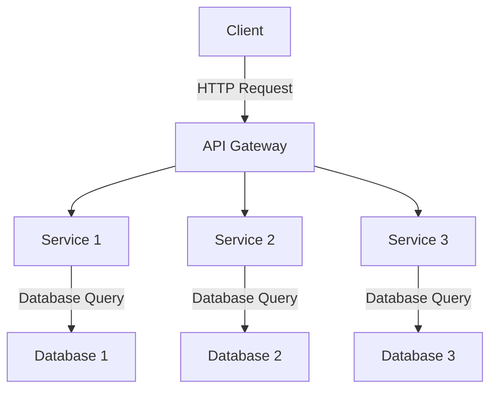

## 14.2. Designing Microservices with Clojure

Designing microservices with Clojure involves leveraging its functional programming paradigms, immutable data structures, and powerful concurrency models to create modular, scalable, and maintainable systems. In this section, we will explore the best practices and patterns for designing microservices, focusing on key aspects such as application decomposition, service boundaries, data storage, API design, and testing strategies.

### Introduction to Microservices Architecture

Microservices architecture is an approach to software development where applications are structured as a collection of loosely coupled services. Each service is self-contained, independently deployable, and designed to perform a specific business function. This architecture promotes modularity, scalability, and flexibility, making it ideal for modern software development.

#### Key Characteristics of Microservices

- **Modularity**: Each service is a separate module that can be developed, deployed, and scaled independently.
- **Scalability**: Services can be scaled independently based on demand, allowing for efficient resource utilization.
- **Resilience**: The failure of one service does not necessarily affect the entire system, enhancing overall system resilience.
- **Technology Agnostic**: Each service can be developed using different technologies, allowing teams to choose the best tools for the job.

### Decomposing Applications into Microservices

Decomposing a monolithic application into microservices involves identifying and defining the boundaries of each service. This process requires careful consideration of the application's domain, business processes, and data flow.

#### Guidelines for Decomposing Applications

1. **Identify Business Capabilities**: Break down the application into distinct business capabilities or domains. Each capability should represent a cohesive set of functionalities that can be encapsulated within a single service.

2. **Define Service Boundaries**: Determine the boundaries of each service based on business capabilities. Services should have clear and well-defined responsibilities, minimizing dependencies between them.

3. **Consider Data Ownership**: Each service should own its data, ensuring that data is not shared directly between services. This promotes data encapsulation and reduces coupling.

4. **Evaluate Communication Patterns**: Choose appropriate communication patterns (e.g., REST, messaging) based on the interaction requirements between services.

5. **Assess Scalability Needs**: Identify services that require independent scaling and design them to be stateless where possible.

### Defining Service Boundaries

Defining service boundaries is a critical step in designing microservices. It involves determining the scope and responsibilities of each service, ensuring that they align with business capabilities and domain boundaries.

#### Best Practices for Defining Service Boundaries

- **Single Responsibility Principle**: Each service should have a single responsibility, focusing on a specific business capability or domain.

- **Loose Coupling**: Services should be loosely coupled, minimizing dependencies and allowing for independent development and deployment.

- **High Cohesion**: Services should have high cohesion, meaning that their internal components are closely related and work together to achieve a common goal.

- **Data Encapsulation**: Each service should encapsulate its data, exposing only necessary data through well-defined APIs.

- **Domain-Driven Design (DDD)**: Use DDD principles to define service boundaries based on business domains and subdomains.

### Considerations for Data Storage and Data Ownership

Data storage and data ownership are crucial considerations in microservices architecture. Each service should manage its data independently, ensuring data consistency and integrity.

#### Data Storage Strategies

- **Database per Service**: Each service should have its own database, allowing for independent data management and scalability.

- **Polyglot Persistence**: Use different types of databases (e.g., SQL, NoSQL) based on the specific needs of each service.

- **Event Sourcing**: Capture all changes to the application state as a sequence of events, allowing for easy reconstruction of state and auditability.

- **CQRS (Command Query Responsibility Segregation)**: Separate the read and write operations, optimizing each for performance and scalability.

#### Data Ownership Principles

- **Service Data Ownership**: Each service should own its data, ensuring that it is responsible for managing and maintaining its data.

- **Data Consistency**: Use eventual consistency models where appropriate, allowing for flexibility and scalability.

- **Data Sharing**: Avoid direct data sharing between services. Use APIs or messaging to communicate and share data.

### Importance of API Design and Documentation

APIs are the primary means of communication between microservices. Designing robust and well-documented APIs is essential for ensuring seamless interaction and integration between services.

#### API Design Best Practices

- **Consistency**: Ensure consistent API design across services, following common standards and conventions.

- **Versioning**: Implement API versioning to manage changes and ensure backward compatibility.

- **Security**: Secure APIs using authentication and authorization mechanisms, such as OAuth2.

- **Error Handling**: Provide clear and consistent error messages, allowing clients to handle errors gracefully.

- **Documentation**: Document APIs thoroughly, using tools like Swagger or OpenAPI to generate interactive documentation.

### Testing Strategies and Continuous Integration

Testing and continuous integration are critical components of microservices development. They ensure that services are reliable, maintainable, and can be deployed independently.

#### Testing Strategies

- **Unit Testing**: Test individual components and functions within a service to ensure correctness.

- **Integration Testing**: Test interactions between services, ensuring that they work together as expected.

- **Contract Testing**: Validate that services adhere to their API contracts, preventing integration issues.

- **End-to-End Testing**: Test the entire system from end to end, simulating real-world scenarios.

#### Continuous Integration and Deployment

- **Automated Builds**: Use CI/CD tools to automate the build and deployment process, ensuring that changes are tested and deployed quickly.

- **Environment Consistency**: Maintain consistent environments across development, testing, and production to prevent deployment issues.

- **Monitoring and Logging**: Implement monitoring and logging to track service performance and identify issues early.

### Clojure-Specific Considerations

Clojure's functional programming paradigm and immutable data structures offer unique advantages for microservices development.

#### Leveraging Clojure's Features

- **Immutable Data Structures**: Use immutable data structures to simplify state management and reduce concurrency issues.

- **Functional Composition**: Leverage higher-order functions and function composition to build modular and reusable code.

- **Concurrency Models**: Utilize Clojure's concurrency primitives (e.g., atoms, refs, agents) to manage state and handle concurrent operations.

- **REPL-Driven Development**: Take advantage of Clojure's REPL for interactive development and rapid prototyping.

### Sample Code Snippet

Let's explore a simple example of a microservice in Clojure using the Ring and Compojure libraries for building web APIs.

```clojure
(ns my-microservice.core
  (:require [compojure.core :refer :all]
            [ring.adapter.jetty :refer [run-jetty]]
            [ring.middleware.json :refer [wrap-json-response wrap-json-body]]))

(defroutes app-routes
  (GET "/hello" [] (wrap-json-response {:message "Hello, World!"}))
  (POST "/echo" req (wrap-json-response (:body req))))

(def app
  (-> app-routes
      (wrap-json-body)))

(defn -main []
  (run-jetty app {:port 3000}))
```

In this example, we define a simple microservice with two endpoints: a GET endpoint that returns a greeting message and a POST endpoint that echoes the request body. The service is built using the Ring and Compojure libraries, which provide a simple and flexible way to define web APIs in Clojure.

### Visualizing Microservices Architecture

To better understand the microservices architecture, let's visualize a typical microservices system using a Mermaid.js diagram.



**Diagram Description**: This diagram illustrates a typical microservices architecture with an API Gateway that routes requests to different services. Each service interacts with its own database, ensuring data encapsulation and independence.

### Knowledge Check

- **What are the key characteristics of microservices architecture?**
- **How do you define service boundaries in a microservices architecture?**
- **What are the best practices for API design in microservices?**
- **How does Clojure's functional programming paradigm benefit microservices development?**

### Conclusion

Designing microservices with Clojure involves leveraging its unique features to create modular, scalable, and maintainable systems. By following best practices for application decomposition, service boundaries, data storage, API design, and testing, you can build robust microservices that meet the demands of modern software development.

Remember, this is just the beginning. As you progress, you'll build more complex and interactive systems. Keep experimenting, stay curious, and enjoy the journey!

## **Ready to Test Your Knowledge?**



### What is a key characteristic of microservices architecture?

- [x] Modularity
- [ ] Monolithic structure
- [ ] Tight coupling
- [ ] Single database

> **Explanation:** Microservices architecture is characterized by modularity, where each service is a separate module that can be developed, deployed, and scaled independently.

### How should service boundaries be defined in microservices?

- [x] Based on business capabilities
- [ ] By technology stack
- [ ] By team size
- [ ] By geographic location

> **Explanation:** Service boundaries should be defined based on business capabilities, ensuring that each service has a clear and well-defined responsibility.

### What is a best practice for API design in microservices?

- [x] Consistency
- [ ] Complexity
- [ ] Lack of documentation
- [ ] Inconsistent error handling

> **Explanation:** Consistency in API design is crucial for ensuring seamless interaction and integration between services.

### How does Clojure's functional programming paradigm benefit microservices development?

- [x] Simplifies state management
- [ ] Increases complexity
- [ ] Requires more resources
- [ ] Limits scalability

> **Explanation:** Clojure's functional programming paradigm simplifies state management through immutable data structures, reducing concurrency issues.

### What is the purpose of using an API Gateway in microservices architecture?

- [x] To route requests to different services
- [ ] To store data
- [ ] To manage databases
- [ ] To increase latency

> **Explanation:** An API Gateway routes requests to different services, acting as a single entry point for clients.

### What is a common data storage strategy in microservices?

- [x] Database per service
- [ ] Single shared database
- [ ] No database
- [ ] In-memory storage

> **Explanation:** A common data storage strategy in microservices is to have a database per service, allowing for independent data management and scalability.

### What is a benefit of using Clojure's REPL in microservices development?

- [x] Interactive development and rapid prototyping
- [ ] Slower development
- [ ] Increased complexity
- [ ] Limited testing

> **Explanation:** Clojure's REPL allows for interactive development and rapid prototyping, making it easier to test and iterate on code.

### What is a key consideration for data ownership in microservices?

- [x] Each service should own its data
- [ ] Data should be shared directly between services
- [ ] All data should be centralized
- [ ] Data ownership is not important

> **Explanation:** Each service should own its data, ensuring that it is responsible for managing and maintaining its data.

### What is the role of contract testing in microservices?

- [x] To validate that services adhere to their API contracts
- [ ] To test individual components
- [ ] To simulate real-world scenarios
- [ ] To manage databases

> **Explanation:** Contract testing validates that services adhere to their API contracts, preventing integration issues.

### True or False: Microservices architecture allows for independent scaling of services.

- [x] True
- [ ] False

> **Explanation:** Microservices architecture allows for independent scaling of services, enabling efficient resource utilization.


