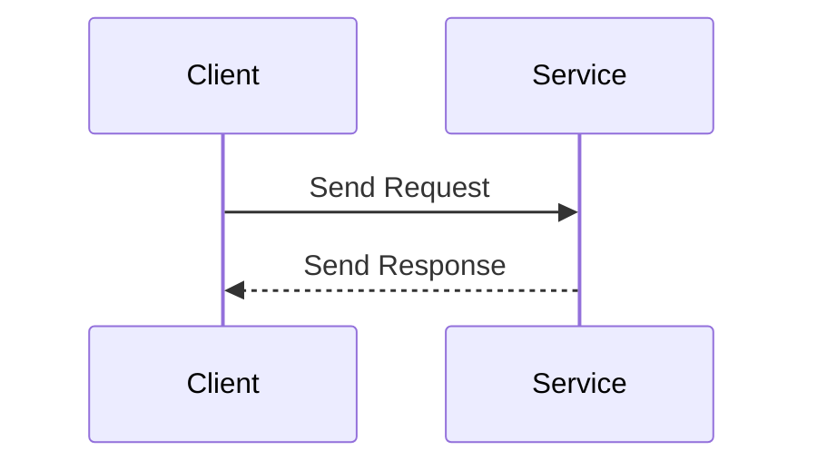
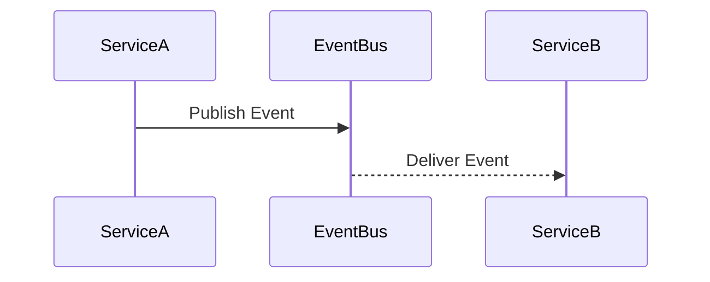

## 14.3. Communication Between Services

In the world of microservices, effective communication between services is crucial for building scalable and maintainable systems. Clojure, with its functional programming paradigm and rich ecosystem, provides several tools and libraries to facilitate both synchronous and asynchronous communication. In this section, we will explore various communication patterns, compare protocols like HTTP/REST, gRPC, and messaging systems, and provide practical examples using libraries such as [clj-http](https://github.com/dakrone/clj-http), [Sente](https://github.com/ptaoussanis/sente), and Kafka clients.

### Understanding Communication Patterns

Communication between services can be broadly categorized into two types: synchronous and asynchronous. Each has its own set of advantages and trade-offs, and the choice between them often depends on the specific requirements of your application.

#### Synchronous Communication

Synchronous communication involves a direct request/response interaction between services. This pattern is straightforward and easy to implement, making it a popular choice for many applications. However, it can introduce latency and reduce fault tolerance, as services are tightly coupled and dependent on each other's availability.

##### HTTP/REST

HTTP/REST is one of the most common protocols used for synchronous communication. It is simple, stateless, and widely supported, making it an excellent choice for many applications.

**Example using clj-http:**

```clojure
(ns myapp.http-client
  (:require [clj-http.client :as client]))

(defn fetch-data [url]
  ;; Perform a GET request to the specified URL
  (let [response (client/get url {:as :json})]
    ;; Return the parsed JSON response
    (:body response)))

;; Usage
(fetch-data "https://api.example.com/data")
```

In this example, we use the `clj-http` library to perform a GET request to an external service. The response is parsed as JSON and returned to the caller.

##### gRPC

gRPC is a high-performance, open-source RPC framework that uses HTTP/2 for transport. It supports multiple programming languages and provides features like bi-directional streaming and built-in authentication.

**Example using gRPC:**

```clojure
;; Assuming a gRPC service is defined and compiled using the protoc tool
(ns myapp.grpc-client
  (:require [grpc.core :as grpc]))

(defn fetch-data [client request]
  ;; Call the gRPC service with the provided request
  (grpc/call client :fetchData request))

;; Usage
(let [client (grpc/create-client "localhost:50051")]
  (fetch-data client {:id 123}))
```

In this example, we create a gRPC client and use it to call a remote service. The request and response are defined using Protocol Buffers, providing a strongly-typed interface.

#### Asynchronous Communication

Asynchronous communication decouples services, allowing them to operate independently and improving fault tolerance. This pattern is well-suited for event-driven architectures and systems that require high scalability.

##### Messaging Systems

Messaging systems like Kafka enable asynchronous communication by allowing services to publish and subscribe to messages. This pattern supports loose coupling and can handle high volumes of data.

**Example using Kafka:**

```clojure
(ns myapp.kafka-producer
  (:require [clj-kafka.producer :as producer]))

(defn send-message [topic message]
  ;; Send a message to the specified Kafka topic
  (producer/send {:topic topic :value message}))

;; Usage
(send-message "events" "Hello, Kafka!")
```

In this example, we use a Kafka producer to send messages to a topic. Consumers can subscribe to this topic and process messages asynchronously.

##### Sente

Sente is a Clojure/ClojureScript library for real-time web communication. It supports WebSockets and HTTP long-polling, making it suitable for building interactive applications.

**Example using Sente:**

```clojure
(ns myapp.sente-server
  (:require [taoensso.sente :as sente]))

(defn handle-message [msg]
  ;; Handle incoming messages
  (println "Received message:" msg))

(defn start-server []
  ;; Start a Sente server
  (let [server (sente/make-channel-socket-server! handle-message)]
    (sente/start-server! server)))

;; Usage
(start-server)
```

In this example, we set up a Sente server to handle real-time messages. Clients can connect to this server and send messages, which are processed asynchronously.

### Comparing Communication Protocols

When choosing a communication protocol, consider factors such as performance, scalability, and ease of use. Here's a comparison of some popular protocols:

| Protocol | Type       | Pros                                    | Cons                               |
|----------|------------|-----------------------------------------|------------------------------------|
| HTTP/REST| Synchronous| Simple, widely supported, stateless     | Latency, tight coupling            |
| gRPC     | Synchronous| High performance, bi-directional streaming| Complexity, requires Protocol Buffers|
| Kafka    | Asynchronous| Scalable, fault-tolerant, decoupled    | Requires setup, eventual consistency|
| Sente    | Asynchronous| Real-time, supports WebSockets         | Complexity, requires client support|

### Patterns for Inter-Service Communication

#### Request/Response

The request/response pattern is common in synchronous communication. It involves a client sending a request to a server and waiting for a response. This pattern is easy to implement but can lead to tight coupling and reduced fault tolerance.

#### Event-Driven

In an event-driven architecture, services communicate by publishing and subscribing to events. This pattern supports loose coupling and scalability, as services can operate independently and react to events asynchronously.

#### Choreography

Choreography involves services coordinating their actions through events, without a central orchestrator. This pattern is suitable for distributed systems where services need to collaborate without direct dependencies.

### Resilience and Fault Tolerance

In a microservices architecture, resilience and fault tolerance are critical. Services should be designed to handle failures gracefully and recover quickly. Here are some strategies to achieve this:

- **Circuit Breaker Pattern**: Prevents cascading failures by temporarily blocking requests to a failing service.
- **Retries and Backoff**: Automatically retries failed requests with exponential backoff to reduce load on the system.
- **Timeouts**: Set timeouts for requests to avoid waiting indefinitely for a response.
- **Bulkheads**: Isolate failures to prevent them from affecting the entire system.

### Try It Yourself

Experiment with the examples provided in this section. Modify the code to suit your needs and explore different communication patterns. For instance, try implementing a simple event-driven system using Kafka or Sente, and observe how services interact asynchronously.

### Visualizing Communication Patterns

To better understand the flow of communication between services, let's visualize some common patterns using Mermaid.js diagrams.

#### Request/Response Pattern



**Caption**: This diagram illustrates the request/response pattern, where a client sends a request to a service and waits for a response.

#### Event-Driven Pattern



**Caption**: This diagram shows the event-driven pattern, where Service A publishes an event to an event bus, and Service B subscribes to and processes the event.

### References and Links

For further reading and exploration, check out the following resources:

- [clj-http](https://github.com/dakrone/clj-http)
- [Sente](https://github.com/ptaoussanis/sente)
- [Kafka](https://kafka.apache.org/)

### Knowledge Check

To reinforce your understanding of inter-service communication patterns, try answering the following questions.

## **Ready to Test Your Knowledge?**



### Which communication pattern involves a direct request/response interaction between services?

- [x] Synchronous Communication
- [ ] Asynchronous Communication
- [ ] Event-Driven Communication
- [ ] Choreography

> **Explanation:** Synchronous communication involves a direct request/response interaction between services, where the client waits for a response from the server.

### What is a key advantage of using asynchronous communication?

- [x] Improved fault tolerance
- [ ] Tight coupling
- [ ] Increased latency
- [ ] Simplified implementation

> **Explanation:** Asynchronous communication improves fault tolerance by decoupling services, allowing them to operate independently and recover from failures.

### Which protocol is commonly used for synchronous communication in microservices?

- [x] HTTP/REST
- [ ] Kafka
- [ ] Sente
- [ ] WebSockets

> **Explanation:** HTTP/REST is a common protocol used for synchronous communication in microservices due to its simplicity and widespread support.

### What is a benefit of using gRPC over HTTP/REST?

- [x] High performance and bi-directional streaming
- [ ] Simplicity and ease of use
- [ ] Statelessness
- [ ] Requires no setup

> **Explanation:** gRPC offers high performance and supports bi-directional streaming, making it suitable for applications that require efficient communication.

### Which pattern involves services coordinating their actions through events without a central orchestrator?

- [x] Choreography
- [ ] Request/Response
- [ ] Event-Driven
- [ ] Synchronous

> **Explanation:** Choreography involves services coordinating their actions through events, allowing them to collaborate without direct dependencies.

### What is the purpose of the Circuit Breaker Pattern?

- [x] Prevent cascading failures
- [ ] Increase latency
- [ ] Simplify implementation
- [ ] Tighten coupling

> **Explanation:** The Circuit Breaker Pattern prevents cascading failures by temporarily blocking requests to a failing service, allowing the system to recover.

### Which library is used for real-time web communication in Clojure?

- [x] Sente
- [ ] clj-http
- [ ] Kafka
- [ ] gRPC

> **Explanation:** Sente is a Clojure/ClojureScript library used for real-time web communication, supporting WebSockets and HTTP long-polling.

### What is a trade-off of using synchronous communication?

- [x] Reduced fault tolerance
- [ ] Improved scalability
- [ ] Loose coupling
- [ ] Increased complexity

> **Explanation:** Synchronous communication can reduce fault tolerance due to tight coupling and dependency on the availability of other services.

### Which pattern is suitable for building interactive applications with real-time updates?

- [x] Event-Driven
- [ ] Request/Response
- [ ] Choreography
- [ ] Synchronous

> **Explanation:** The event-driven pattern is suitable for building interactive applications with real-time updates, as it allows services to react to events asynchronously.

### True or False: Asynchronous communication is always the best choice for microservices.

- [ ] True
- [x] False

> **Explanation:** While asynchronous communication offers benefits like improved fault tolerance and scalability, it is not always the best choice. The decision depends on the specific requirements and trade-offs of the application.



Remember, mastering inter-service communication is a journey. As you explore different patterns and protocols, you'll gain a deeper understanding of how to build robust and scalable microservices. Keep experimenting, stay curious, and enjoy the process!
