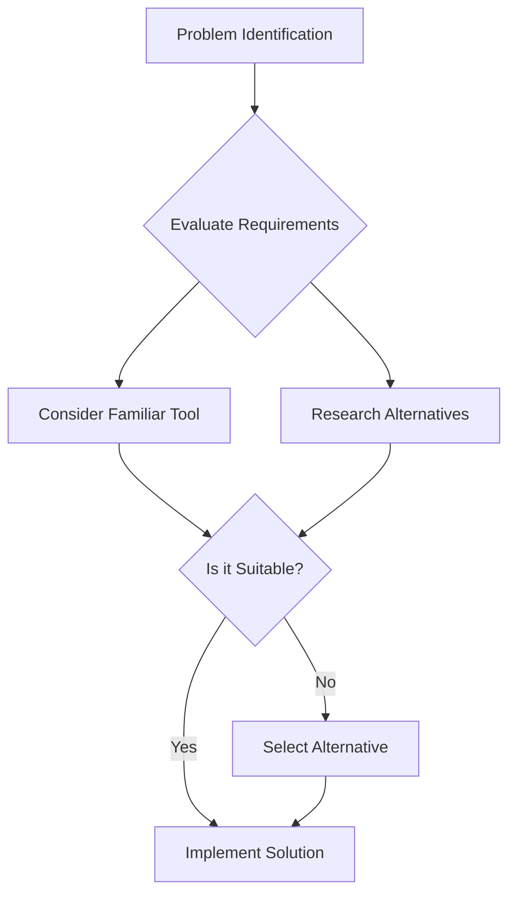

## 14.3 Golden Hammer in Clojure

### Introduction

The "Golden Hammer" anti-pattern is a common pitfall in software development where a developer becomes overly reliant on a familiar tool, technique, or pattern, applying it indiscriminately to all problems, regardless of its suitability. In the context of Clojure, this can manifest as an over-reliance on specific libraries, macros, or data structures, potentially leading to inefficient or inappropriate solutions.

### Detailed Explanation

The Golden Hammer anti-pattern stems from the comfort and familiarity a developer has with a particular tool or approach. While familiarity can lead to efficiency, it can also result in tunnel vision, where the developer fails to consider other, potentially more suitable solutions. This section explores how this anti-pattern can appear in Clojure development and offers strategies to avoid it.

#### Common Manifestations in Clojure

1. **Overuse of Specific Libraries:**
   - Relying heavily on a single library for tasks it wasn't designed to handle can lead to convoluted code and performance issues.

2. **Excessive Macro Usage:**
   - Macros are powerful but can lead to complex and hard-to-debug code if overused. They should be used judiciously, with a preference for functions when possible.

3. **Inappropriate Data Structure Selection:**
   - Choosing the wrong data structure for a task can result in inefficient operations. For example, using a list for indexed access instead of a vector.

4. **Ignoring New Language Features:**
   - Sticking to old patterns and ignoring new language features or libraries can prevent the adoption of more efficient or expressive solutions.

### Visualizing the Golden Hammer

To better understand the Golden Hammer anti-pattern, consider the following diagram illustrating the decision-making process when selecting tools and patterns:



### Code Examples

#### Inefficient Data Structure Choice

Consider the following example where a list is used for indexed access:

```clojure
;; Inefficient choice:
(def my-data (list 1 2 3)) ; Lists are not ideal for indexed access

;; Better choice:
(def my-data [1 2 3]) ; Vectors provide efficient indexed access
```

In this example, using a vector instead of a list improves performance for indexed access due to the vector's constant-time complexity for such operations.

### Best Practices to Avoid the Golden Hammer

1. **Evaluate Tools and Patterns Appropriately:**
   - Assess the specific requirements and constraints of a problem before choosing a solution. This ensures that the selected tool or pattern is the most appropriate for the task at hand.

2. **Expand Knowledge of Available Options:**
   - Stay updated with new libraries, patterns, and language features. This broadens the range of tools at your disposal and helps in selecting the most suitable one.

3. **Avoid Overusing Macros:**
   - Use macros only when necessary. Prefer functions for most tasks, as they are easier to understand and debug.

4. **Select Suitable Data Structures:**
   - Choose data structures based on access patterns and performance characteristics. For example, use vectors for indexed access and maps for key-value storage.

5. **Be Open to Learning New Approaches:**
   - Embrace different paradigms and techniques that may offer better solutions. This includes functional programming concepts, concurrency models, and more.

6. **Encourage Team Discussions:**
   - Collaborate with peers to explore diverse solutions and avoid tunnel vision. Team discussions can provide new perspectives and insights.

### Advantages and Disadvantages

#### Advantages of Avoiding the Golden Hammer

- **Improved Efficiency:** Selecting the right tool for the job can lead to more efficient and performant code.
- **Enhanced Flexibility:** Being open to different approaches allows for more adaptable and maintainable solutions.
- **Broader Skillset:** Exploring various tools and patterns enhances a developer's skillset and problem-solving abilities.

#### Disadvantages of the Golden Hammer

- **Inefficiency:** Using an inappropriate tool can lead to inefficient solutions.
- **Complexity:** Overusing complex tools like macros can make code harder to understand and maintain.
- **Stagnation:** Reliance on familiar tools can prevent learning and growth.

### Conclusion

The Golden Hammer anti-pattern is a reminder of the importance of flexibility and adaptability in software development. By evaluating tools and patterns appropriately, expanding knowledge, and encouraging team discussions, developers can avoid the pitfalls of this anti-pattern and create more efficient, maintainable, and adaptable solutions in Clojure.

## Quiz Time!



### What is the "Golden Hammer" anti-pattern?

- [x] Over-reliance on a familiar tool or pattern
- [ ] Using a new tool for every problem
- [ ] Avoiding the use of any patterns
- [ ] Relying on outdated technology

> **Explanation:** The "Golden Hammer" anti-pattern occurs when a developer uses a familiar tool or pattern for every problem, regardless of its suitability.

### How can the Golden Hammer manifest in Clojure?

- [x] Overuse of specific libraries
- [x] Excessive macro usage
- [ ] Avoiding the use of macros
- [ ] Using only new language features

> **Explanation:** In Clojure, the Golden Hammer can manifest as over-reliance on specific libraries or excessive use of macros.

### Why should macros be used judiciously in Clojure?

- [x] They can lead to complex and hard-to-debug code
- [ ] They are always slower than functions
- [ ] They are not supported in Clojure
- [ ] They are only for advanced users

> **Explanation:** Macros can make code complex and hard to debug if overused, so they should be used judiciously.

### What is a better choice for indexed access in Clojure?

- [ ] List
- [x] Vector
- [ ] Set
- [ ] Map

> **Explanation:** Vectors provide efficient indexed access due to their constant-time complexity for such operations.

### How can developers avoid the Golden Hammer anti-pattern?

- [x] Evaluate tools and patterns appropriately
- [x] Expand knowledge of available options
- [ ] Stick to one tool for all problems
- [ ] Avoid team discussions

> **Explanation:** Developers can avoid the Golden Hammer by evaluating tools and patterns appropriately and expanding their knowledge of available options.

### What is a disadvantage of the Golden Hammer?

- [x] Inefficiency
- [ ] Increased flexibility
- [ ] Broader skillset
- [ ] Enhanced performance

> **Explanation:** Using an inappropriate tool can lead to inefficient solutions, which is a disadvantage of the Golden Hammer.

### Why is it important to select suitable data structures in Clojure?

- [x] To optimize performance based on access patterns
- [ ] To ensure code compiles
- [ ] To avoid using functions
- [ ] To make code look complex

> **Explanation:** Selecting suitable data structures optimizes performance based on access patterns and operation complexity.

### What is an advantage of avoiding the Golden Hammer?

- [x] Improved efficiency
- [ ] Increased complexity
- [ ] Reliance on one tool
- [ ] Avoiding new approaches

> **Explanation:** Avoiding the Golden Hammer leads to improved efficiency by selecting the right tool for the job.

### How can team discussions help avoid the Golden Hammer?

- [x] By exploring diverse solutions and avoiding tunnel vision
- [ ] By enforcing one solution for all problems
- [ ] By avoiding the use of patterns
- [ ] By focusing only on familiar tools

> **Explanation:** Team discussions can provide new perspectives and insights, helping to explore diverse solutions and avoid tunnel vision.

### True or False: The Golden Hammer encourages the use of the most suitable tool for each problem.

- [ ] True
- [x] False

> **Explanation:** The Golden Hammer anti-pattern involves over-reliance on a familiar tool, not necessarily the most suitable one for each problem.


