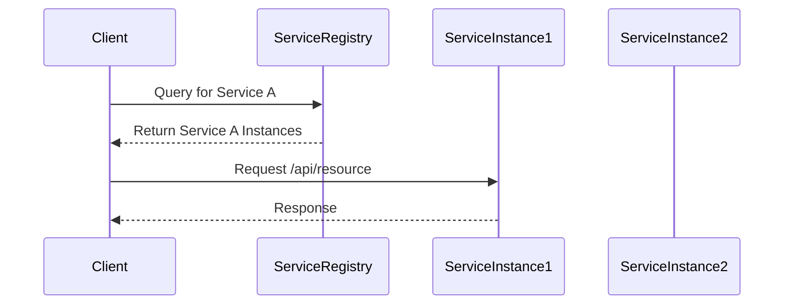

## 14.4. Service Discovery and Registration

In the world of microservices, where applications are composed of multiple, independently deployable services, service discovery and registration become crucial components. As services are dynamically scaled, moved, or updated, they need a reliable mechanism to find and communicate with each other. This section delves into the concepts, tools, and best practices for implementing service discovery and registration in a microservices architecture.

### The Need for Service Discovery

In traditional monolithic applications, components are tightly coupled and reside within the same process space, making communication straightforward. However, in a microservices architecture, services are distributed across different network locations, often running on multiple hosts or containers. This dynamic environment necessitates a robust mechanism for services to discover each other.

#### Key Challenges Addressed by Service Discovery

1. **Dynamic Environments**: Services can be added, removed, or relocated at any time, requiring a dynamic way to track their locations.
2. **Scalability**: As services scale up or down, their instances need to be registered and deregistered efficiently.
3. **Fault Tolerance**: Services must be able to handle failures gracefully, rerouting requests to healthy instances.
4. **Load Balancing**: Distributing requests evenly across service instances to optimize resource utilization.

### Tools for Service Discovery

Several tools have been developed to facilitate service discovery and registration in microservices architectures. Let's explore some of the most popular ones:

#### Consul

[Consul](https://www.consul.io/) is a widely used tool for service discovery, configuration, and segmentation. It provides a distributed, highly available service mesh that enables secure service-to-service communication.

- **Features**: 
  - Service discovery and health checking.
  - Key/value store for configuration.
  - Multi-datacenter support.
  - Service mesh capabilities with built-in support for service segmentation and encryption.

#### Etcd

[Etcd](https://etcd.io/) is a distributed key-value store that provides a reliable way to store data across a cluster of machines. It is often used for service discovery and configuration management.

- **Features**:
  - Strong consistency and high availability.
  - Simple and secure client communication.
  - Watch functionality to monitor changes in real-time.

#### Zookeeper

[Zookeeper](https://zookeeper.apache.org/) is a centralized service for maintaining configuration information, naming, providing distributed synchronization, and providing group services.

- **Features**:
  - Hierarchical namespace for organizing data.
  - Atomicity and sequential consistency.
  - Leader election and distributed locks.

### Service Registration and Discovery Patterns

Service discovery can be implemented using different patterns, primarily categorized into client-side and server-side discovery.

#### Client-Side Discovery

In client-side discovery, the client is responsible for determining the network locations of available service instances and load balancing requests across them.

- **Advantages**:
  - Simplicity: No need for an additional load balancer.
  - Flexibility: Clients can implement custom load balancing strategies.

- **Disadvantages**:
  - Complexity in client logic.
  - Tight coupling between clients and service registry.

**Example Code:**

```clojure
(ns service-discovery.client
  (:require [clj-http.client :as http]))

(defn discover-service [service-name]
  ;; Simulate a service registry lookup
  (let [service-instances {"service-a" ["http://localhost:8081" "http://localhost:8082"]
                           "service-b" ["http://localhost:8091" "http://localhost:8092"]}]
    (get service-instances service-name)))

(defn call-service [service-name endpoint]
  (let [instances (discover-service service-name)
        ;; Simple round-robin load balancing
        instance (first instances)]
    (http/get (str instance endpoint))))

;; Usage
(call-service "service-a" "/api/resource")
```

#### Server-Side Discovery

In server-side discovery, the client makes a request to a load balancer, which queries the service registry and forwards the request to an appropriate service instance.

- **Advantages**:
  - Simplifies client logic.
  - Centralized control over load balancing and routing.

- **Disadvantages**:
  - Additional infrastructure component (load balancer).
  - Potential single point of failure if not properly managed.

**Example Code:**

```clojure
(ns service-discovery.server
  (:require [ring.adapter.jetty :refer [run-jetty]]
            [compojure.core :refer [defroutes GET]]
            [clj-http.client :as http]))

(defn discover-service [service-name]
  ;; Simulate a service registry lookup
  (let [service-instances {"service-a" ["http://localhost:8081" "http://localhost:8082"]
                           "service-b" ["http://localhost:8091" "http://localhost:8092"]}]
    (get service-instances service-name)))

(defn load-balance [instances]
  ;; Simple round-robin load balancing
  (first instances))

(defroutes app-routes
  (GET "/api/resource" []
    (let [instances (discover-service "service-a")
          instance (load-balance instances)]
      (http/get (str instance "/api/resource")))))

(defn -main []
  (run-jetty app-routes {:port 8080}))
```

### Best Practices for Service Discovery

1. **Consistent Health Checks**: Regularly check the health of service instances to ensure the registry reflects only healthy services.
2. **Decentralized Registries**: Use decentralized service registries to avoid single points of failure.
3. **Graceful Deregistration**: Ensure services deregister themselves gracefully when shutting down to prevent stale entries.
4. **Security**: Secure communication between services and the registry to prevent unauthorized access or tampering.
5. **Monitoring and Logging**: Implement robust monitoring and logging to track service discovery operations and troubleshoot issues.

### Visualizing Service Discovery

To better understand the flow of service discovery, let's visualize the process using a sequence diagram.



**Diagram Explanation**: The client queries the service registry for available instances of "Service A". The registry returns a list of instances, and the client selects one to send a request.

### Conclusion

Service discovery and registration are foundational components of a microservices architecture, enabling services to communicate dynamically and reliably. By leveraging tools like Consul, Etcd, and Zookeeper, and implementing best practices, we can build robust and scalable systems. Remember, this is just the beginning. As you progress, you'll discover more advanced patterns and techniques to enhance your microservices architecture. Keep experimenting, stay curious, and enjoy the journey!

## **Ready to Test Your Knowledge?**



### What is the primary purpose of service discovery in microservices?

- [x] To enable services to find and communicate with each other dynamically
- [ ] To store configuration data for services
- [ ] To monitor the health of services
- [ ] To provide a user interface for managing services

> **Explanation:** Service discovery allows services to dynamically find and communicate with each other in a microservices architecture.

### Which tool is NOT commonly used for service discovery?

- [ ] Consul
- [ ] Etcd
- [ ] Zookeeper
- [x] Docker

> **Explanation:** Docker is a containerization platform, not a service discovery tool.

### In client-side discovery, who is responsible for determining the network locations of service instances?

- [x] The client
- [ ] The server
- [ ] The load balancer
- [ ] The service registry

> **Explanation:** In client-side discovery, the client determines the network locations of service instances.

### What is a disadvantage of server-side discovery?

- [ ] Simplifies client logic
- [x] Requires an additional infrastructure component
- [ ] Centralized control over load balancing
- [ ] Decentralized service registry

> **Explanation:** Server-side discovery requires an additional infrastructure component, such as a load balancer.

### Which of the following is a best practice for maintaining service registry consistency?

- [x] Regular health checks
- [ ] Using a single centralized registry
- [ ] Ignoring service failures
- [ ] Allowing services to register themselves

> **Explanation:** Regular health checks ensure that only healthy services are registered.

### What is the role of a load balancer in server-side discovery?

- [x] To query the service registry and forward requests to service instances
- [ ] To store configuration data
- [ ] To monitor service health
- [ ] To deregister unhealthy services

> **Explanation:** In server-side discovery, the load balancer queries the service registry and forwards requests to service instances.

### Which tool provides a distributed, highly available service mesh?

- [x] Consul
- [ ] Etcd
- [ ] Zookeeper
- [ ] Kubernetes

> **Explanation:** Consul provides a distributed, highly available service mesh for secure service-to-service communication.

### What is a key feature of Etcd?

- [x] Strong consistency and high availability
- [ ] Built-in service mesh capabilities
- [ ] Hierarchical namespace
- [ ] Leader election

> **Explanation:** Etcd is known for its strong consistency and high availability.

### True or False: In client-side discovery, the client implements custom load balancing strategies.

- [x] True
- [ ] False

> **Explanation:** In client-side discovery, the client can implement custom load balancing strategies.

### What is the primary advantage of decentralized service registries?

- [x] Avoids single points of failure
- [ ] Simplifies client logic
- [ ] Centralized control over services
- [ ] Provides a user interface for managing services

> **Explanation:** Decentralized service registries avoid single points of failure, enhancing system reliability.


