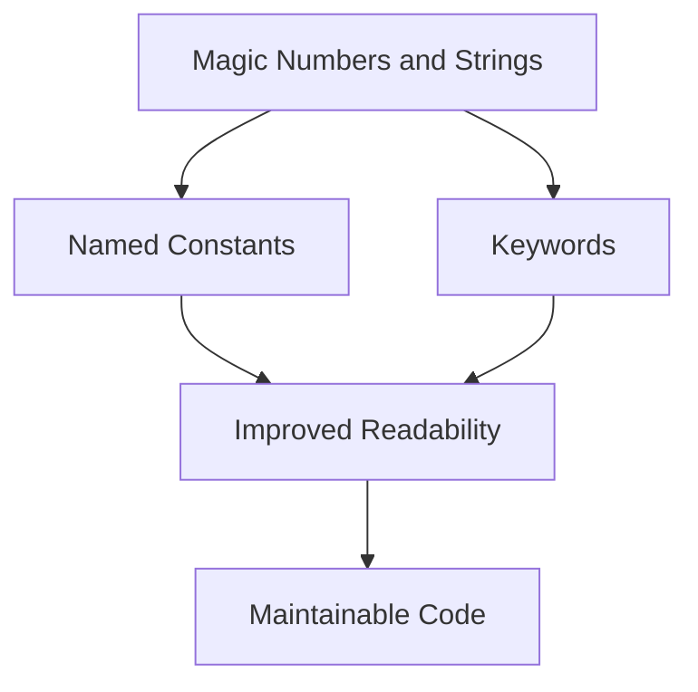

## 14.4 Magic Numbers and Strings in Clojure

In software development, magic numbers and strings refer to hard-coded literals that appear in code without explanation. These literals can make the code difficult to read, understand, and maintain. In Clojure, as in any programming language, avoiding magic numbers and strings is crucial for writing clean, maintainable, and scalable code. This section explores strategies to eliminate magic numbers and strings in Clojure, enhancing code clarity and reducing potential errors.

### Introduction

Magic numbers and strings are often used in code to represent fixed values or identifiers. However, their presence can obscure the code's intent and make it challenging to update or refactor. For instance, seeing a number like `3000` in the code doesn't immediately convey its purpose. Is it a timeout value, a delay, or something else? Similarly, string literals like `"active"` might represent a status, but without context, their meaning is ambiguous.

### Detailed Explanation

#### What are Magic Numbers and Strings?

- **Magic Numbers:** These are numeric literals embedded directly in the code without explanation. They can represent anything from configuration values to algorithm parameters.
- **Magic Strings:** These are string literals used directly in the code, often as identifiers or configuration keys.

#### Why Avoid Them?

1. **Lack of Clarity:** Magic numbers and strings do not convey meaning. A reader of the code must infer their purpose, which can lead to misunderstandings.
2. **Error-Prone:** If a magic number or string needs to change, it must be updated consistently across the codebase. Missing an update can introduce bugs.
3. **Maintainability:** Code with magic numbers and strings is harder to maintain and refactor, as the literals' meanings are not immediately clear.

### Best Practices for Avoiding Magic Numbers and Strings

#### Define Constants with Meaningful Names

Using `def` to create named constants is a straightforward way to replace magic numbers and strings. This practice improves readability and makes the code self-documenting.

```clojure
(def max-retries 5)
(def default-timeout 3000)
```

#### Use Keywords Instead of Strings for Identifiers

Keywords in Clojure are preferred over strings for identifiers due to their immutability and efficiency. They also provide a clear indication of their role as identifiers.

```clojure
;; Using strings:
{"status" "active"}

;; Using keywords:
{:status :active}
```

#### Group Related Constants

Organizing related constants into maps or namespaces helps manage them effectively and provides context.

```clojure
(def error-codes
  {:not-found 404
   :server-error 500})
```

#### Document the Purpose of Constants

Adding comments or docstrings to constants can provide additional context and clarify their purpose.

```clojure
(def ^{:doc "Maximum number of retry attempts for network requests"}
  max-retries 5)
```

#### Avoid Repetition of Literal Values

Instead of repeating literal values throughout the code, reference the defined constants. This practice ensures consistency and simplifies updates.

```clojure
(def default-timeout 3000)

(defn fetch-data []
  (Thread/sleep default-timeout)
  ;; Fetch data logic
  )
```

### Visual Aids

To illustrate the concept of replacing magic numbers and strings, consider the following diagram that shows the transformation of a code snippet from using magic literals to using named constants and keywords.



### Code Examples

#### Before: Using Magic Numbers and Strings

```clojure
(defn process-order [order]
  (if (= (:status order) "active")
    (do
      (println "Processing order...")
      (Thread/sleep 3000) ;; Magic number
      (println "Order processed"))
    (println "Order not active")))
```

#### After: Using Named Constants and Keywords

```clojure
(def active-status :active)
(def processing-delay 3000)

(defn process-order [order]
  (if (= (:status order) active-status)
    (do
      (println "Processing order...")
      (Thread/sleep processing-delay)
      (println "Order processed"))
    (println "Order not active")))
```

### Use Cases

1. **Configuration Management:** Use named constants for configuration values that may change, such as timeouts or limits.
2. **Status Indicators:** Replace string literals representing statuses or states with keywords.
3. **Error Codes:** Define error codes as constants to avoid magic numbers in error handling logic.

### Advantages and Disadvantages

#### Advantages

- **Improved Readability:** Code becomes easier to read and understand.
- **Easier Maintenance:** Changes to values are centralized, reducing the risk of errors.
- **Self-Documenting Code:** Named constants and keywords convey meaning without additional comments.

#### Disadvantages

- **Initial Overhead:** Defining constants and keywords requires initial effort, but this is outweighed by long-term benefits.

### Best Practices

- **Consistent Naming:** Use descriptive and consistent names for constants and keywords.
- **Centralized Definitions:** Keep constant definitions in a dedicated namespace or configuration file.
- **Regular Refactoring:** Periodically review code to identify and replace any remaining magic numbers or strings.

### Comparisons

Compared to using magic numbers and strings, named constants and keywords offer significant advantages in terms of readability and maintainability. While the initial setup may require more effort, the long-term benefits are substantial.

### Conclusion

Avoiding magic numbers and strings is a fundamental practice in writing clean and maintainable Clojure code. By using named constants and keywords, developers can create code that is not only easier to read but also simpler to maintain and less prone to errors. Embracing these practices leads to more robust and scalable applications.

## Quiz Time!



### What are magic numbers and strings?

- [x] Hard-coded literals without explanation
- [ ] Variables with unclear names
- [ ] Functions with side effects
- [ ] Immutable data structures

> **Explanation:** Magic numbers and strings are hard-coded literals that lack context or explanation, making code less readable and maintainable.

### Why should magic numbers and strings be avoided?

- [x] They make code less readable and maintainable
- [ ] They improve performance
- [ ] They enhance security
- [ ] They reduce code size

> **Explanation:** Magic numbers and strings obscure the code's intent and make it difficult to update or refactor, leading to potential errors.

### How can you replace magic numbers in Clojure?

- [x] Use named constants with `def`
- [ ] Use anonymous functions
- [ ] Use dynamic variables
- [ ] Use macros

> **Explanation:** Named constants defined with `def` provide clarity and make the code self-documenting.

### What is a benefit of using keywords instead of strings?

- [x] Keywords are immutable and efficient
- [ ] Keywords are mutable
- [ ] Keywords are slower to process
- [ ] Keywords require more memory

> **Explanation:** Keywords in Clojure are immutable and more efficient than strings, making them ideal for identifiers.

### How should related constants be organized?

- [x] In maps or namespaces
- [ ] In separate files
- [ ] In global variables
- [ ] In comments

> **Explanation:** Grouping related constants in maps or namespaces helps manage them effectively and provides context.

### What is a disadvantage of using magic numbers?

- [x] They can lead to errors if changes are needed
- [ ] They improve code readability
- [ ] They enhance maintainability
- [ ] They reduce code complexity

> **Explanation:** Magic numbers can lead to errors and make the code difficult to maintain if changes are required.

### What is an example of a magic string?

- [x] "active" used directly in code
- [ ] :active as a keyword
- [ ] A variable named `status`
- [ ] A function returning a string

> **Explanation:** A magic string is a string literal used directly in code without explanation, such as "active".

### How can the purpose of constants be documented?

- [x] Using comments or docstrings
- [ ] Using macros
- [ ] Using dynamic variables
- [ ] Using global variables

> **Explanation:** Comments or docstrings can provide additional context and clarify the purpose of constants.

### What is a common practice to avoid repetition of literal values?

- [x] Reference defined constants
- [ ] Use global variables
- [ ] Use dynamic variables
- [ ] Use macros

> **Explanation:** Referencing defined constants ensures consistency and simplifies updates across the codebase.

### True or False: Magic numbers and strings enhance code readability.

- [ ] True
- [x] False

> **Explanation:** Magic numbers and strings obscure the code's intent and reduce readability, making it harder to understand and maintain.


