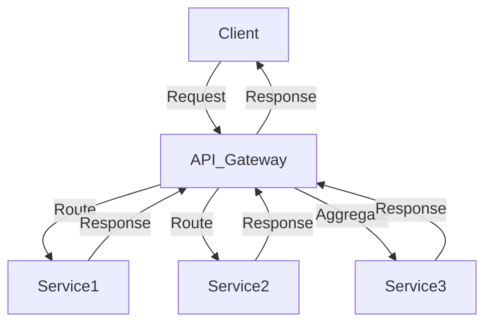

## 14.5. API Gateway Pattern

### Introduction to the API Gateway Pattern

The API Gateway pattern is a crucial architectural pattern in microservices design, acting as a single entry point for client requests. It serves as an intermediary between clients and the backend services, providing a unified interface to interact with multiple microservices. This pattern is particularly useful in managing the complexity that arises from having numerous microservices, each with its own API.

### Purpose of the API Gateway

The primary purposes of an API Gateway include:

- **Request Routing**: Directing client requests to the appropriate microservice based on the request path, headers, or other criteria.
- **Aggregation**: Combining responses from multiple microservices into a single response to reduce the number of client-server interactions.
- **Protocol Translation**: Converting between different protocols (e.g., HTTP to WebSocket) to accommodate various client needs.

### Key Participants

- **Client**: The entity making requests to the API Gateway.
- **API Gateway**: The intermediary that processes client requests, routes them to the appropriate services, and aggregates responses.
- **Microservices**: The backend services that handle specific business logic and data processing.

### Applicability

The API Gateway pattern is applicable when:

- You have multiple microservices that need to be accessed by clients.
- You want to reduce the complexity of client interactions with backend services.
- You need to implement cross-cutting concerns like authentication, logging, and rate limiting in a centralized manner.

### Implementing an API Gateway in Clojure

Clojure, with its rich ecosystem and functional programming paradigm, provides several tools and libraries to implement an API Gateway. One popular choice is using the [Pedestal](https://pedestal.io/) framework, which offers robust support for building web services.

#### Sample Code Snippet

Below is a simple example of an API Gateway using Pedestal in Clojure:

```clojure
(ns api-gateway.core
  (:require [io.pedestal.http :as http]
            [io.pedestal.http.route :as route]))

(defn home-page
  [request]
  {:status 200 :body "Welcome to the API Gateway"})

(defn route-request
  [request]
  (let [service (get-in request [:path-params :service])]
    (case service
      "service1" (call-service1 request)
      "service2" (call-service2 request)
      {:status 404 :body "Service not found"})))

(def routes
  (route/expand-routes
    #{["/" :get home-page]
      ["/api/:service" :get route-request]}))

(def service
  {:env :prod
   ::http/routes routes
   ::http/type :jetty
   ::http/port 8080})

(defn -main [& args]
  (http/start service))
```

In this example, the API Gateway listens for requests on the `/api/:service` endpoint and routes them to the appropriate service handler based on the `:service` path parameter.

### Design Considerations

When implementing an API Gateway, consider the following:

- **Scalability**: Ensure the gateway can handle a large number of concurrent requests. Consider using load balancing and horizontal scaling.
- **Security**: Implement authentication and authorization mechanisms to protect backend services. Use HTTPS to secure data in transit.
- **Performance**: Optimize the gateway for low latency and high throughput. Use caching to reduce load on backend services.

### Alternatives to the API Gateway Pattern

An alternative to the API Gateway pattern is the Backend for Frontend (BFF) pattern. In this approach, separate backends are created for each client type (e.g., web, mobile), allowing for more tailored and optimized interactions.

### Clojure Unique Features

Clojure's immutable data structures and functional programming model make it well-suited for building robust and maintainable API Gateways. The use of higher-order functions and macros can simplify request handling and routing logic.

### Differences and Similarities

The API Gateway pattern is often confused with the BFF pattern. While both provide a single entry point for clients, the BFF pattern focuses on creating client-specific backends, whereas the API Gateway pattern provides a unified interface for all clients.

### Visualizing the API Gateway Pattern



**Diagram Description**: This diagram illustrates the flow of requests and responses through an API Gateway. The client sends a request to the API Gateway, which routes it to the appropriate service(s). The responses are then aggregated and sent back to the client.

### Try It Yourself

Experiment with the provided code example by adding additional routes and services. Try implementing authentication or caching mechanisms to enhance the API Gateway's functionality.

### References and Links

- [Pedestal Framework](https://pedestal.io/)
- [Microservices Architecture on AWS](https://aws.amazon.com/microservices/)
- [API Gateway Pattern](https://microservices.io/patterns/apigateway.html)

### Knowledge Check

- What are the primary purposes of an API Gateway?
- How does the API Gateway pattern differ from the Backend for Frontend pattern?
- What are some considerations for implementing an API Gateway in Clojure?

### Embrace the Journey

Remember, mastering the API Gateway pattern is just one step in building scalable and maintainable microservices. Keep exploring and experimenting with different patterns and technologies to enhance your skills.

## **Ready to Test Your Knowledge?**



### What is the primary purpose of an API Gateway?

- [x] To provide a single entry point for client requests
- [ ] To directly interact with databases
- [ ] To replace all microservices
- [ ] To act as a client-side library

> **Explanation:** The API Gateway acts as a single entry point for client requests, routing them to the appropriate microservices.

### Which of the following is a key function of an API Gateway?

- [x] Request routing
- [ ] Database management
- [ ] Client-side rendering
- [ ] File storage

> **Explanation:** Request routing is a key function of an API Gateway, directing client requests to the appropriate microservices.

### What is a common alternative to the API Gateway pattern?

- [x] Backend for Frontend (BFF) pattern
- [ ] Monolithic architecture
- [ ] Client-side caching
- [ ] Direct database access

> **Explanation:** The Backend for Frontend (BFF) pattern is a common alternative to the API Gateway pattern, providing client-specific backends.

### In Clojure, which framework is commonly used to implement an API Gateway?

- [x] Pedestal
- [ ] Django
- [ ] Express.js
- [ ] Flask

> **Explanation:** Pedestal is a popular framework in Clojure for building web services, including API Gateways.

### What is a key consideration when implementing an API Gateway?

- [x] Scalability
- [ ] Direct database access
- [ ] Client-side rendering
- [ ] File storage

> **Explanation:** Scalability is a key consideration to ensure the API Gateway can handle a large number of concurrent requests.

### Which of the following is NOT a function of an API Gateway?

- [x] Direct database access
- [ ] Request routing
- [ ] Response aggregation
- [ ] Protocol translation

> **Explanation:** Direct database access is not a function of an API Gateway; it focuses on routing and aggregating requests and responses.

### How does the API Gateway pattern enhance security?

- [x] By centralizing authentication and authorization
- [ ] By storing client credentials
- [ ] By encrypting all data at rest
- [ ] By providing direct database access

> **Explanation:** The API Gateway enhances security by centralizing authentication and authorization, protecting backend services.

### What is a benefit of using Clojure for an API Gateway?

- [x] Immutable data structures
- [ ] Built-in database management
- [ ] Client-side rendering
- [ ] File storage

> **Explanation:** Clojure's immutable data structures contribute to building robust and maintainable API Gateways.

### True or False: The API Gateway pattern is only applicable to web applications.

- [ ] True
- [x] False

> **Explanation:** The API Gateway pattern can be applied to various types of applications, not just web applications.

### Which of the following is a key participant in the API Gateway pattern?

- [x] Client
- [ ] Database
- [ ] File system
- [ ] Operating system

> **Explanation:** The client is a key participant, as it makes requests to the API Gateway.


