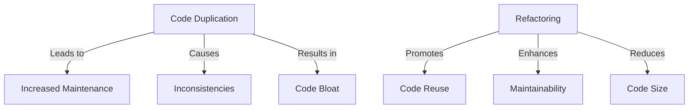

## 14.6 Copy-Paste Programming in Clojure

Copy-paste programming is a common anti-pattern that can lead to code duplication, increased maintenance costs, and potential inconsistencies. In this section, we will explore the implications of copy-paste programming in Clojure, discuss strategies to avoid it, and provide practical examples of how to refactor code to adhere to the DRY (Don't Repeat Yourself) principle.

### Introduction

Copy-paste programming occurs when developers duplicate code across different parts of an application. While it might seem like a quick solution, it often results in a codebase that is difficult to maintain and prone to errors. This anti-pattern violates the DRY principle, which advocates for reducing repetition in code to improve maintainability and scalability.

### Detailed Explanation

#### The Pitfalls of Copy-Paste Programming

- **Increased Maintenance Effort:** Duplicate code means that any change or bug fix needs to be applied in multiple places, increasing the likelihood of errors.
- **Inconsistencies:** As the code evolves, duplicated sections may diverge, leading to inconsistent behavior across the application.
- **Code Bloat:** Repeated code contributes to a larger codebase, making it harder to navigate and understand.

#### Identifying Duplicate Code

The first step in addressing copy-paste programming is identifying duplicate code. This can be done through:

- **Code Reviews:** Regular code reviews can help spot duplication early.
- **Static Analysis Tools:** Tools like `clj-kondo` can be configured to detect similar code patterns.

### Refactoring Strategies

#### Extract Common Logic into Functions

One of the most effective ways to eliminate duplicate code is by extracting common logic into reusable functions. This not only reduces duplication but also enhances code readability and testability.

```clojure
;; Duplicate code:
(defn calculate-tax [amount]
  (* amount 0.1))

(defn calculate-discount [amount]
  (* amount 0.1))

;; Refactored:
(defn calculate-percentage [amount rate]
  (* amount rate))

(defn calculate-tax [amount]
  (calculate-percentage amount 0.1))

(defn calculate-discount [amount]
  (calculate-percentage amount 0.1))
```

#### Use Higher-order Functions

Higher-order functions, which take other functions as arguments or return them as results, can be used to generalize behavior and reduce code repetition.

```clojure
(defn apply-operation [operation amount]
  (operation amount))

(defn tax-operation [amount]
  (* amount 0.1))

(defn discount-operation [amount]
  (* amount 0.1))

;; Usage
(apply-operation tax-operation 100)
(apply-operation discount-operation 100)
```

#### Leverage Macros for Repetitive Patterns

In cases where functions cannot encapsulate repetitive patterns, macros can be used to abstract code. Macros allow you to manipulate code as data, providing powerful metaprogramming capabilities.

```clojure
(defmacro with-logging [expr]
  `(do
     (println "Executing:" '~expr)
     ~expr))

;; Usage
(with-logging (calculate-tax 100))
```

#### Promote Code Sharing

Utilize libraries or modules to share common code across projects. This not only reduces duplication but also promotes consistency and reuse.

- **Clojure Libraries:** Consider creating a library for shared utilities and functions.
- **Modules:** Organize code into modules that can be reused across different parts of the application.

#### Refactor Regularly

Regular refactoring is crucial to maintaining a clean codebase. By continuously improving code and eliminating duplication, you ensure that the code remains maintainable and scalable.

### Visual Aids

#### Conceptual Diagram: Code Duplication vs. Refactoring



### Use Cases

- **Financial Calculations:** Extracting common percentage calculations into a function to avoid duplication across tax, discount, and interest calculations.
- **Logging:** Using macros to standardize logging across different modules without repeating code.
- **Data Processing Pipelines:** Employing higher-order functions to apply transformations consistently across datasets.

### Advantages and Disadvantages

#### Advantages

- **Improved Maintainability:** Easier to update and fix code when changes are centralized.
- **Consistency:** Ensures uniform behavior across the application.
- **Reduced Code Size:** A smaller codebase is easier to navigate and understand.

#### Disadvantages

- **Initial Refactoring Effort:** Refactoring existing code can require significant effort.
- **Over-Abstraction:** Excessive abstraction can lead to complex code that is difficult to understand.

### Best Practices

- **Adopt a DRY Mindset:** Always look for opportunities to reduce repetition.
- **Regular Code Reviews:** Encourage team members to identify and address duplication.
- **Use Tools:** Leverage static analysis tools to detect duplicate code patterns.

### Conclusion

Copy-paste programming is a detrimental practice that can lead to a host of issues in a codebase. By adhering to the DRY principle and employing strategies such as function extraction, higher-order functions, and macros, developers can create more maintainable and scalable Clojure applications. Regular refactoring and code reviews are essential practices to ensure that code remains clean and efficient.

## Quiz Time!



### What is the primary principle violated by copy-paste programming?

- [x] DRY (Don't Repeat Yourself)
- [ ] SOLID
- [ ] KISS (Keep It Simple, Stupid)
- [ ] YAGNI (You Aren't Gonna Need It)

> **Explanation:** Copy-paste programming violates the DRY principle, which emphasizes reducing repetition in code.

### Which of the following is NOT a consequence of copy-paste programming?

- [ ] Increased maintenance effort
- [ ] Inconsistencies
- [x] Improved performance
- [ ] Code bloat

> **Explanation:** Copy-paste programming does not improve performance; instead, it leads to increased maintenance, inconsistencies, and code bloat.

### What is a higher-order function?

- [x] A function that takes other functions as arguments or returns them as results
- [ ] A function that is called frequently
- [ ] A function that performs complex calculations
- [ ] A function that is defined at the top of a file

> **Explanation:** Higher-order functions are functions that can take other functions as arguments or return them as results, enabling more abstract and reusable code.

### How can macros help in reducing code duplication?

- [x] By abstracting repetitive code patterns that cannot be handled by functions
- [ ] By executing code faster
- [ ] By simplifying syntax
- [ ] By providing type safety

> **Explanation:** Macros can abstract repetitive code patterns, allowing for more concise and maintainable code.

### What is the benefit of using libraries or modules for code sharing?

- [x] Promotes consistency and reuse across projects
- [ ] Increases code complexity
- [ ] Reduces the need for documentation
- [ ] Enhances security

> **Explanation:** Libraries or modules allow for consistent and reusable code across different projects, reducing duplication and enhancing maintainability.

### Which tool can be used to detect similar code patterns in Clojure?

- [x] clj-kondo
- [ ] Leiningen
- [ ] Ring
- [ ] Pedestal

> **Explanation:** `clj-kondo` is a static analysis tool that can be configured to detect similar code patterns in Clojure.

### What is the main disadvantage of excessive abstraction?

- [x] It can lead to complex code that is difficult to understand
- [ ] It increases code duplication
- [ ] It reduces code readability
- [ ] It enhances performance

> **Explanation:** Excessive abstraction can make code complex and difficult to understand, which is a potential downside of over-abstraction.

### Why is regular refactoring important?

- [x] To continuously improve code and eliminate duplication
- [ ] To increase code size
- [ ] To add more features
- [ ] To reduce testing efforts

> **Explanation:** Regular refactoring helps improve code quality by eliminating duplication and enhancing maintainability.

### What is the role of code reviews in preventing copy-paste programming?

- [x] They help spot duplication early and encourage best practices
- [ ] They increase development time
- [ ] They reduce code quality
- [ ] They focus on performance optimization

> **Explanation:** Code reviews are crucial for identifying duplication early and promoting best practices, preventing copy-paste programming.

### True or False: Copy-paste programming can lead to code inconsistencies.

- [x] True
- [ ] False

> **Explanation:** True. Copy-paste programming can lead to inconsistencies as duplicated code sections may diverge over time.


