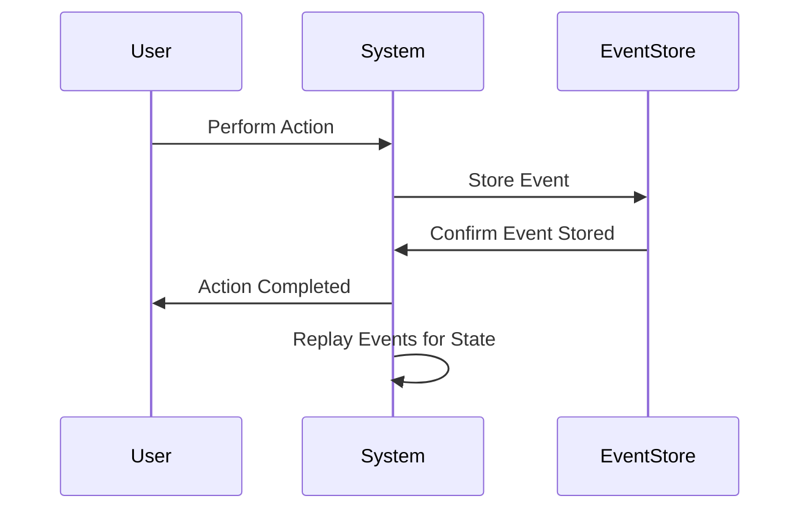
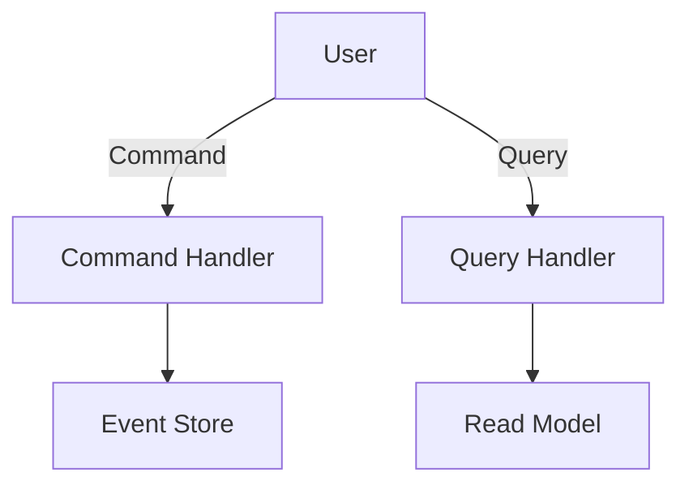

## 14.7. Event Sourcing and CQRS

In the realm of microservices, managing data and operations efficiently is crucial for building scalable and robust systems. Two powerful patterns that address these challenges are Event Sourcing and Command Query Responsibility Segregation (CQRS). In this section, we will delve into these patterns, explore their benefits, and demonstrate how to implement them using Clojure.

### Understanding Event Sourcing

**Event Sourcing** is a design pattern where state changes in a system are captured as a sequence of events. Instead of storing the current state of an entity, you store a log of state-changing events. This log can be replayed to reconstruct the current state at any point in time.

#### Benefits of Event Sourcing

- **Auditability**: Every change is recorded as an event, providing a complete audit trail.
- **Reproducibility**: The system's state can be reconstructed at any point by replaying events.
- **Flexibility**: New projections or views can be created by replaying events with different logic.
- **Scalability**: Events can be processed asynchronously, allowing for scalable architectures.

### Implementing Event Sourcing in Clojure

Let's explore how to implement Event Sourcing in Clojure using a simple example of a bank account.

```clojure
(ns bank-account.core)

(defrecord Event [type data timestamp])

(defn create-event [type data]
  (->Event type data (System/currentTimeMillis)))

(defn apply-event [state event]
  (case (:type event)
    :deposit (update state :balance + (:amount (:data event)))
    :withdraw (update state :balance - (:amount (:data event)))
    state))

(defn replay-events [events]
  (reduce apply-event {:balance 0} events))

;; Example usage
(def events [(create-event :deposit {:amount 100})
             (create-event :withdraw {:amount 50})])

(def current-state (replay-events events))
(println "Current State:" current-state)
```

In this example, we define an `Event` record and functions to create and apply events. The `replay-events` function reconstructs the current state by applying each event in sequence.

### Visualizing Event Sourcing



This diagram illustrates the flow of events in an Event Sourcing system. Actions performed by users are stored as events, which can be replayed to reconstruct the system's state.

### Understanding CQRS

**Command Query Responsibility Segregation (CQRS)** is a pattern that separates the responsibility of handling commands (write operations) from queries (read operations). This separation allows for optimized handling of reads and writes, often leading to improved performance and scalability.

#### Benefits of CQRS

- **Scalability**: Read and write operations can be scaled independently.
- **Performance**: Queries can be optimized separately from commands.
- **Flexibility**: Different models can be used for reading and writing, allowing for more tailored solutions.

### Implementing CQRS in Clojure

Let's implement a simple CQRS system in Clojure using the same bank account example.

```clojure
(ns bank-account.cqrs)

(defrecord Command [type data])
(defrecord Query [type data])

(defn handle-command [state command]
  (case (:type command)
    :deposit (create-event :deposit (:data command))
    :withdraw (create-event :withdraw (:data command))
    nil))

(defn handle-query [state query]
  (case (:type query)
    :balance (:balance state)
    nil))

;; Example usage
(def command (->Command :deposit {:amount 100}))
(def query (->Query :balance {}))

(def event (handle-command current-state command))
(def updated-state (apply-event current-state event))
(def balance (handle-query updated-state query))

(println "Balance:" balance)
```

In this example, we define `Command` and `Query` records and functions to handle them. Commands result in events, while queries return the current state.

### Visualizing CQRS



This diagram shows the separation of command and query handling in a CQRS system. Commands are processed by the command handler, resulting in events stored in the event store. Queries are processed by the query handler, which retrieves data from the read model.

### Considerations for Event Storage and Replay

When implementing Event Sourcing, consider the following:

- **Event Storage**: Choose a storage solution that supports efficient appending and retrieval of events. Options include databases like PostgreSQL or specialized event stores.
- **Event Replay**: Ensure that replaying events is efficient and can handle large volumes of data. Consider using snapshots to reduce replay time.
- **Event Versioning**: As your system evolves, events may change. Implement versioning to handle changes gracefully.

### Complexity and When to Apply These Patterns

Event Sourcing and CQRS introduce complexity, so consider the following before applying them:

- **Use Case Suitability**: These patterns are beneficial for systems with complex business logic, high scalability requirements, or auditability needs.
- **Team Expertise**: Ensure your team is familiar with the patterns and their implications.
- **Infrastructure**: Consider the infrastructure needed to support event storage and processing.

### Clojure Libraries for Event Sourcing and CQRS

Several libraries can assist in implementing these patterns in Clojure:

- **Datomic**: A database that supports immutable data and event sourcing.
- **Crux**: A bitemporal database that can be used for event sourcing.
- **Onyx**: A distributed computation system that can process events in real-time.

### Conclusion

Event Sourcing and CQRS are powerful patterns for managing data and operations in microservices. They offer benefits in scalability, auditability, and flexibility but come with added complexity. By leveraging Clojure's functional programming paradigm and supporting libraries, you can implement these patterns effectively.

### Try It Yourself

Experiment with the provided code examples by modifying the events and commands. Try adding new event types or queries to see how the system behaves.

## **Ready to Test Your Knowledge?**



### What is Event Sourcing?

- [x] A pattern where state changes are stored as a sequence of events.
- [ ] A pattern that separates read and write operations.
- [ ] A pattern for optimizing database queries.
- [ ] A pattern for managing user sessions.

> **Explanation:** Event Sourcing involves storing state changes as events, allowing for reconstruction of state by replaying these events.

### What is the main benefit of CQRS?

- [x] Scalability by separating read and write operations.
- [ ] Improved security by encrypting data.
- [ ] Faster network communication.
- [ ] Simplified user authentication.

> **Explanation:** CQRS separates read and write operations, allowing them to be scaled independently, which enhances scalability.

### In Event Sourcing, what is stored instead of the current state?

- [x] A log of state-changing events.
- [ ] The current state of the entity.
- [ ] A snapshot of the database.
- [ ] A list of active users.

> **Explanation:** Event Sourcing stores a log of events that can be replayed to reconstruct the current state.

### Which Clojure library is suitable for event sourcing?

- [x] Datomic
- [ ] Ring
- [ ] Reagent
- [ ] Pedestal

> **Explanation:** Datomic is a database that supports immutable data and event sourcing, making it suitable for this pattern.

### What is a key consideration when implementing Event Sourcing?

- [x] Efficient event storage and replay.
- [ ] Minimizing network latency.
- [ ] Reducing code complexity.
- [ ] Ensuring user-friendly interfaces.

> **Explanation:** Efficient storage and replay of events are crucial for the performance and scalability of an Event Sourcing system.

### How does CQRS improve performance?

- [x] By optimizing queries separately from commands.
- [ ] By reducing the number of database connections.
- [ ] By compressing data before storage.
- [ ] By caching user sessions.

> **Explanation:** CQRS allows queries to be optimized separately from commands, improving performance.

### What is a potential drawback of Event Sourcing?

- [x] Increased complexity in system design.
- [ ] Reduced data security.
- [ ] Slower read operations.
- [ ] Limited scalability.

> **Explanation:** Event Sourcing introduces complexity due to the need to manage and replay events.

### What is the role of a Command Handler in CQRS?

- [x] To process write operations and generate events.
- [ ] To handle read operations and return data.
- [ ] To manage user authentication.
- [ ] To optimize database queries.

> **Explanation:** The Command Handler processes write operations, resulting in events that are stored.

### What is the purpose of event versioning?

- [x] To handle changes in event structure over time.
- [ ] To compress events for storage.
- [ ] To encrypt events for security.
- [ ] To speed up event replay.

> **Explanation:** Event versioning allows for changes in event structure to be managed gracefully as the system evolves.

### True or False: Event Sourcing and CQRS are suitable for all types of applications.

- [ ] True
- [x] False

> **Explanation:** These patterns are best suited for systems with complex business logic, scalability needs, or auditability requirements, and may not be necessary for simpler applications.


