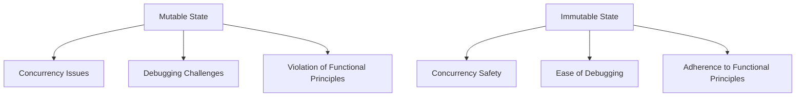

## 14.8 Overusing Mutable State in Clojure

In the realm of functional programming, Clojure stands out with its emphasis on immutability and pure functions. However, the temptation to overuse mutable state can undermine these principles, leading to code that is harder to maintain and debug. This section explores the challenges associated with mutable state in Clojure and provides strategies for embracing immutability to enhance code reliability and maintainability.

### Introduction

Mutable state refers to data that can be changed after it is created. While mutable state is a common concept in many programming languages, it can introduce significant challenges, particularly in concurrent environments. In Clojure, overreliance on mutable state can lead to bugs and unpredictable behavior, making it crucial to understand how to manage state effectively.

### Detailed Explanation

#### The Pitfalls of Mutable State

1. **Concurrency Issues:** Mutable state can lead to race conditions and data corruption when accessed by multiple threads simultaneously. This is particularly problematic in Clojure, which is designed to leverage concurrency.

2. **Debugging Challenges:** Mutable state makes it difficult to track changes and understand the flow of data, complicating debugging and maintenance efforts.

3. **Violation of Functional Principles:** Functional programming emphasizes immutability and referential transparency. Overusing mutable state contradicts these principles, reducing the benefits of functional programming.

#### Embracing Immutability

Clojure provides a rich set of immutable data structures, such as lists, vectors, maps, and sets, which are designed to be persistent and efficient. By defaulting to these structures, developers can avoid many of the pitfalls associated with mutable state.

```clojure
;; Example of immutable data structure
(def my-map {:a 1 :b 2 :c 3})

;; Adding a new key-value pair returns a new map
(def updated-map (assoc my-map :d 4))
```

### Visualizing Mutable vs. Immutable State

To better understand the differences between mutable and immutable state, consider the following diagram:



### Best Practices for Managing State

#### 1. Use Immutable Data Structures

Default to Clojure's persistent data structures to ensure that data remains unchanged unless explicitly modified. This approach enhances reliability and simplifies reasoning about code behavior.

#### 2. Limit the Scope of Mutable State

When mutable state is necessary, such as with atoms, refs, or agents, limit its scope to prevent unintended side effects. Localizing mutable state reduces the risk of concurrency issues and makes the code easier to understand.

```clojure
;; Limit scope of mutable state
(let [counter (atom 0)]
  ;; Use counter within this scope
  (swap! counter inc)
  @counter)
```

#### 3. Avoid Side Effects in Functions

Ensure that functions do not modify external state. Functions should be pure, meaning they return the same output for the same input and do not cause side effects.

```clojure
;; Pure function example
(defn add [x y]
  (+ x y))
```

#### 4. Adopt Pure Functional Programming Practices

Emphasize immutability and referential transparency in your code. This approach not only aligns with Clojure's design philosophy but also leads to more predictable and maintainable codebases.

#### 5. Utilize State Management Libraries

Leverage libraries like Mount or Component to manage state explicitly. These libraries provide structured ways to handle application state, making it easier to manage lifecycle and dependencies.

```clojure
;; Example using Mount
(ns my-app.core
  (:require [mount.core :as mount]))

(defstate my-state
  :start (initialize-state)
  :stop (cleanup-state))
```

#### 6. Document Mutable Constructs

Clearly indicate where and why mutable state is used in your codebase. Documentation helps other developers understand the rationale behind mutable constructs and reduces the likelihood of misuse.

### Advantages and Disadvantages

**Advantages of Immutability:**

- **Concurrency Safety:** Immutable data structures are inherently thread-safe, reducing the risk of race conditions.
- **Predictability:** Pure functions with immutable data are easier to reason about and test.
- **Ease of Debugging:** Immutable data simplifies tracking changes and understanding code flow.

**Disadvantages of Overusing Mutable State:**

- **Complexity:** Managing mutable state can lead to complex and error-prone code.
- **Maintenance Burden:** Mutable state increases the cognitive load required to understand and maintain code.

### Conclusion

In Clojure, embracing immutability and minimizing the use of mutable state is crucial for writing robust, maintainable, and concurrent-safe code. By leveraging Clojure's immutable data structures and adhering to functional programming principles, developers can avoid many common pitfalls associated with mutable state. Remember to document any necessary mutable constructs and use state management libraries to handle state explicitly.

## Quiz Time!



### What is a primary disadvantage of overusing mutable state in Clojure?

- [x] It can introduce bugs, especially in concurrent environments.
- [ ] It makes code run faster.
- [ ] It simplifies debugging.
- [ ] It enhances code readability.

> **Explanation:** Mutable state can lead to race conditions and data corruption, particularly in concurrent environments, making it a source of bugs.

### Which of the following is a benefit of using immutable data structures in Clojure?

- [x] Concurrency safety
- [ ] Increased complexity
- [ ] More side effects
- [ ] Slower performance

> **Explanation:** Immutable data structures are inherently thread-safe, reducing the risk of race conditions and making them suitable for concurrent programming.

### What is a pure function?

- [x] A function that returns the same output for the same input without side effects.
- [ ] A function that modifies global state.
- [ ] A function that relies on external data.
- [ ] A function that changes its behavior based on input.

> **Explanation:** Pure functions are deterministic and do not cause side effects, making them predictable and easier to test.

### Which Clojure library is mentioned for managing application state explicitly?

- [x] Mount
- [ ] React
- [ ] Redux
- [ ] Angular

> **Explanation:** Mount is a Clojure library that provides a structured way to manage application state and lifecycle.

### How can you limit the scope of mutable state in Clojure?

- [x] By localizing it within a `let` block.
- [ ] By using global variables.
- [ ] By avoiding the use of atoms.
- [ ] By using mutable data structures.

> **Explanation:** Localizing mutable state within a `let` block confines its scope, reducing the risk of unintended side effects.

### What is the primary focus of functional programming?

- [x] Emphasizing immutability and pure functions.
- [ ] Encouraging mutable state.
- [ ] Promoting side effects.
- [ ] Using global variables.

> **Explanation:** Functional programming focuses on immutability and pure functions to enhance code reliability and maintainability.

### Which of the following is NOT a characteristic of immutable data structures?

- [ ] Thread safety
- [ ] Predictability
- [x] Frequent side effects
- [ ] Ease of debugging

> **Explanation:** Immutable data structures do not cause side effects, making them predictable and easier to debug.

### What does referential transparency mean in functional programming?

- [x] Expressions can be replaced with their values without changing the program's behavior.
- [ ] Functions can modify external state.
- [ ] Variables can change over time.
- [ ] Code execution depends on external factors.

> **Explanation:** Referential transparency ensures that expressions are consistent and can be replaced with their values, enhancing predictability.

### Why is documenting mutable constructs important?

- [x] It helps other developers understand the rationale and reduces misuse.
- [ ] It increases code complexity.
- [ ] It makes code harder to read.
- [ ] It is unnecessary in functional programming.

> **Explanation:** Documenting mutable constructs clarifies their purpose and usage, aiding in code maintenance and reducing the likelihood of errors.

### True or False: Overusing mutable state aligns with Clojure's functional programming principles.

- [ ] True
- [x] False

> **Explanation:** Overusing mutable state contradicts Clojure's emphasis on immutability and functional programming principles.


