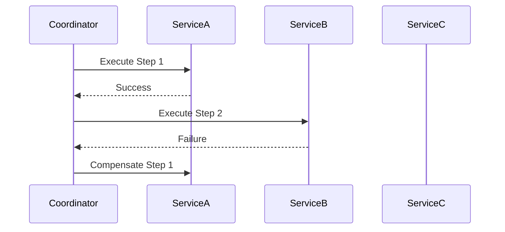
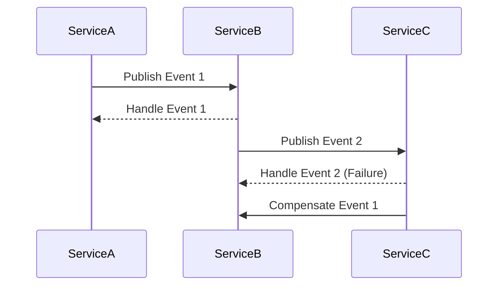

## 14.8. Saga Pattern for Distributed Transactions

In the realm of microservices, managing transactions that span multiple services is a complex challenge. Traditional database transactions are not feasible due to the distributed nature of microservices, where each service might have its own database. The Saga pattern emerges as a solution to manage distributed transactions without locking resources, ensuring data consistency across services.

### Understanding the Challenges of Distributed Transactions

Distributed systems introduce several challenges when it comes to maintaining data consistency:

- **Lack of a Global Transaction Manager**: In a distributed system, there is no single transaction manager that can ensure atomicity across multiple services.
- **Network Latency and Failures**: Communication between services over a network can be slow and unreliable, leading to potential inconsistencies.
- **Independent Data Stores**: Each microservice may have its own database, making it difficult to maintain a consistent state across the system.
- **Scalability Concerns**: Locking resources across services can lead to bottlenecks, affecting the scalability of the system.

### Introducing the Saga Pattern

The Saga pattern addresses these challenges by breaking down a distributed transaction into a series of smaller, manageable transactions, each handled by a single service. If a step in the transaction fails, the Saga pattern ensures that compensating actions are taken to undo the changes made by previous steps.

#### Key Concepts of the Saga Pattern

- **Saga**: A sequence of transactions that are coordinated to achieve a business goal.
- **Compensation**: Actions taken to undo the effects of a transaction if a failure occurs.
- **Orchestration**: A centralized approach where a coordinator manages the sequence of transactions.
- **Choreography**: A decentralized approach where each service knows what to do and when to do it, based on events.

### Implementing the Saga Pattern in Clojure

Clojure, with its functional programming paradigm and robust concurrency support, is well-suited for implementing the Saga pattern. Let's explore how we can implement both orchestration and choreography approaches in Clojure.

#### Orchestration Approach

In the orchestration approach, a central coordinator service manages the execution of the Saga. This service is responsible for invoking each step of the Saga and handling failures by triggering compensating actions.

```clojure
(ns saga.orchestration
  (:require [clojure.core.async :as async]))

(defn execute-step [step]
  ;; Simulate step execution
  (println "Executing step:" step)
  (if (= step :step2)
    (throw (Exception. "Step 2 failed"))
    (println "Step" step "completed successfully")))

(defn compensate-step [step]
  ;; Simulate compensation action
  (println "Compensating step:" step))

(defn orchestrate-saga [steps]
  (try
    (doseq [step steps]
      (execute-step step))
    (catch Exception e
      (println "Error occurred:" (.getMessage e))
      (doseq [step (reverse steps)]
        (compensate-step step)))))

;; Execute the saga
(orchestrate-saga [:step1 :step2 :step3])
```

In this example, the `orchestrate-saga` function manages the execution of each step. If a step fails, it triggers compensation actions for all previously completed steps.

#### Choreography Approach

In the choreography approach, each service is responsible for executing its part of the Saga and publishing events that trigger subsequent steps.

```clojure
(ns saga.choreography
  (:require [clojure.core.async :as async]))

(defn publish-event [event]
  ;; Simulate event publishing
  (println "Publishing event:" event))

(defn handle-event [event]
  ;; Simulate event handling
  (println "Handling event:" event)
  (case event
    :event1 (publish-event :event2)
    :event2 (throw (Exception. "Event 2 handling failed"))
    :event3 (println "Event 3 handled successfully")))

(defn start-saga []
  (try
    (handle-event :event1)
    (catch Exception e
      (println "Error occurred:" (.getMessage e))
      ;; Handle compensation logic here
      )))

;; Start the saga
(start-saga)
```

In this example, each service listens for events and decides what action to take next. If an error occurs, compensation logic can be implemented to handle the failure.

### Compensation Actions and Failure Handling

Compensation actions are crucial in the Saga pattern to ensure that the system can recover from failures. These actions should be idempotent, meaning they can be applied multiple times without changing the result beyond the initial application.

#### Designing Compensation Actions

- **Idempotency**: Ensure that compensation actions can be repeated without adverse effects.
- **Isolation**: Compensation should not interfere with other ongoing transactions.
- **Consistency**: Maintain data consistency across services after compensation.

### Orchestration vs. Choreography

Choosing between orchestration and choreography depends on the specific requirements of your system:

- **Orchestration**: Provides a clear, centralized control flow, making it easier to manage complex transactions. However, it introduces a single point of failure and can become a bottleneck.
- **Choreography**: Offers a more resilient and scalable approach, as each service operates independently. However, it can lead to complex event-driven architectures that are harder to manage.

### Visualizing the Saga Pattern

To better understand the flow of the Saga pattern, let's visualize the orchestration and choreography approaches using Mermaid.js diagrams.

#### Orchestration Diagram



*Diagram 1: Orchestration approach with a central coordinator managing the transaction flow.*

#### Choreography Diagram



*Diagram 2: Choreography approach with services communicating through events.*

### Clojure's Unique Features for Implementing Sagas

Clojure offers several features that make it an excellent choice for implementing the Saga pattern:

- **Immutability**: Ensures that data remains consistent across services, reducing the risk of race conditions.
- **Concurrency Primitives**: Atoms, refs, and agents provide robust tools for managing state changes in a concurrent environment.
- **Functional Programming**: Encourages the use of pure functions and immutable data, simplifying the design of compensation actions.

### Design Considerations

When implementing the Saga pattern, consider the following:

- **Error Handling**: Design robust error handling and compensation logic to ensure system reliability.
- **Scalability**: Choose the approach (orchestration vs. choreography) that best fits your scalability requirements.
- **Monitoring and Logging**: Implement comprehensive monitoring and logging to track the progress and status of Sagas.

### Differences and Similarities with Other Patterns

The Saga pattern is often compared to other patterns like the **Two-Phase Commit** and **Event Sourcing**:

- **Two-Phase Commit**: Ensures atomicity across distributed systems but can lead to performance bottlenecks.
- **Event Sourcing**: Focuses on capturing all changes as events, which can be replayed to reconstruct the system state.

### Try It Yourself

Experiment with the provided code examples by modifying the steps and events. Try implementing a new Saga with different compensation actions and observe how the system behaves under various failure scenarios.

### References and Further Reading

- [Microservices Patterns: With examples in Java](https://www.amazon.com/Microservices-Patterns-examples-Chris-Richardson/dp/1617294543) by Chris Richardson
- [Saga Pattern](https://microservices.io/patterns/data/saga.html) on Microservices.io
- [Clojure Core.Async](https://clojure.github.io/core.async/)

## **Ready to Test Your Knowledge?**



### What is the primary purpose of the Saga pattern in distributed systems?

- [x] To manage distributed transactions without locking resources
- [ ] To ensure atomicity across all services
- [ ] To provide a single point of failure
- [ ] To simplify database management

> **Explanation:** The Saga pattern is designed to manage distributed transactions across microservices without locking resources, ensuring data consistency.

### Which approach in the Saga pattern involves a central coordinator?

- [x] Orchestration
- [ ] Choreography
- [ ] Event Sourcing
- [ ] Two-Phase Commit

> **Explanation:** Orchestration involves a central coordinator that manages the sequence of transactions in the Saga pattern.

### What is a key advantage of the choreography approach?

- [x] Resilience and scalability
- [ ] Centralized control flow
- [ ] Simplicity in management
- [ ] Single point of failure

> **Explanation:** The choreography approach offers resilience and scalability as each service operates independently, reducing the risk of a single point of failure.

### What is a compensation action in the Saga pattern?

- [x] An action to undo the effects of a transaction step
- [ ] A step to execute a transaction
- [ ] A method to lock resources
- [ ] A way to simplify error handling

> **Explanation:** Compensation actions are taken to undo the effects of a transaction step if a failure occurs, ensuring data consistency.

### Which Clojure feature is beneficial for implementing the Saga pattern?

- [x] Immutability
- [ ] Mutable state
- [ ] Global transaction manager
- [ ] Synchronous communication

> **Explanation:** Immutability in Clojure ensures data consistency across services, making it beneficial for implementing the Saga pattern.

### What is a potential drawback of the orchestration approach?

- [x] Single point of failure
- [ ] Complexity in event-driven architecture
- [ ] Lack of centralized control
- [ ] Difficulty in managing compensation actions

> **Explanation:** The orchestration approach introduces a single point of failure as the central coordinator manages the transaction flow.

### How does the choreography approach handle transactions?

- [x] Through event-driven communication between services
- [ ] By using a central coordinator
- [ ] By locking resources
- [ ] By ensuring atomicity

> **Explanation:** The choreography approach handles transactions through event-driven communication, where each service knows what to do based on events.

### What is a key consideration when designing compensation actions?

- [x] Idempotency
- [ ] Complexity
- [ ] Synchronous execution
- [ ] Centralized management

> **Explanation:** Compensation actions should be idempotent, meaning they can be applied multiple times without changing the result beyond the initial application.

### Which pattern is often compared to the Saga pattern?

- [x] Two-Phase Commit
- [ ] Singleton
- [ ] Factory Method
- [ ] Observer

> **Explanation:** The Two-Phase Commit pattern is often compared to the Saga pattern as both deal with distributed transactions, but the Saga pattern avoids locking resources.

### True or False: The Saga pattern can be implemented using both orchestration and choreography approaches.

- [x] True
- [ ] False

> **Explanation:** The Saga pattern can be implemented using both orchestration and choreography approaches, each with its own advantages and trade-offs.



Remember, this is just the beginning. As you progress, you'll build more complex and interactive systems using the Saga pattern. Keep experimenting, stay curious, and enjoy the journey!
