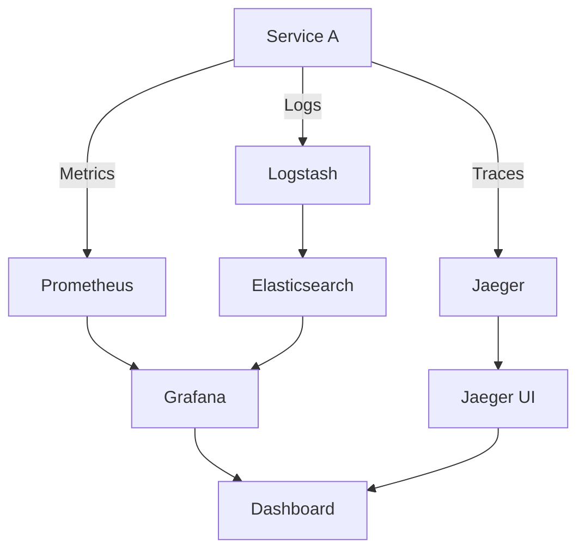

## 14.9. Logging, Monitoring, and Tracing

In the world of microservices, observability is a critical aspect that ensures the smooth operation and maintenance of distributed systems. Observability encompasses logging, monitoring, and tracing, which together provide insights into the system's behavior, performance, and health. This section delves into these concepts, focusing on how they can be effectively implemented in Clojure-based microservices using popular tools like Logstash, Prometheus, and Jaeger.

### Importance of Observability in Microservices

Microservices architecture involves multiple independent services that communicate over a network. This distributed nature makes it challenging to understand the system's overall state and diagnose issues. Observability addresses these challenges by providing:

- **Visibility**: Understanding the internal state of services through logs and metrics.
- **Traceability**: Following the flow of requests across services to identify bottlenecks and failures.
- **Alerting**: Notifying operators of issues before they impact users.

### Logging in Microservices

Logging is the foundation of observability. It involves recording events and data points that describe the system's behavior. Effective logging in microservices should be structured, centralized, and context-rich.

#### Structured Logging

Structured logging involves recording logs in a format that can be easily parsed and queried, such as JSON. This approach allows for more effective searching and analysis compared to traditional plain-text logs.

**Example: Structured Logging in Clojure**

```clojure
(ns myapp.logging
  (:require [clojure.tools.logging :as log]))

(defn log-event [event]
  (log/info (json/write-str {:timestamp (System/currentTimeMillis)
                             :event event
                             :service "my-service"
                             :correlation-id (generate-correlation-id)})))

(defn generate-correlation-id []
  ;; Generate a unique correlation ID for tracing requests
  (str (java.util.UUID/randomUUID)))

;; Usage
(log-event {:action "user-login" :user-id 123})
```

In this example, we use `clojure.tools.logging` for logging and `json/write-str` to format the log message as JSON. Each log entry includes a timestamp, event details, service name, and a correlation ID for tracing.

#### Centralized Logging with Logstash

Centralized logging involves aggregating logs from multiple services into a single location for analysis. Logstash, part of the Elastic Stack, is a popular tool for this purpose.

**Integrating Logstash with Clojure**

To send logs from a Clojure application to Logstash, you can use a logging library like Logback with a Logstash appender.

```xml
<!-- logback.xml -->
<configuration>
  <appender name="LOGSTASH" class="net.logstash.logback.appender.LogstashTcpSocketAppender">
    <destination>localhost:5044</destination>
    <encoder class="net.logstash.logback.encoder.LogstashEncoder"/>
  </appender>

  <root level="INFO">
    <appender-ref ref="LOGSTASH"/>
  </root>
</configuration>
```

This configuration sends logs to Logstash running on `localhost` at port `5044`. Ensure Logstash is configured to receive logs on this port.

### Monitoring with Prometheus

Monitoring involves collecting and analyzing metrics to understand the system's performance and health. Prometheus is a widely-used monitoring tool that collects metrics from services and stores them in a time-series database.

#### Setting Up Prometheus with Clojure

To expose metrics from a Clojure application, you can use the `io.prometheus.client` library to define and register metrics.

**Example: Exposing Metrics in Clojure**

```clojure
(ns myapp.metrics
  (:require [io.prometheus.client :as prom]))

(def request-counter (prom/counter "http_requests_total" "Total HTTP requests"))

(defn handle-request [request]
  (prom/inc request-counter)
  ;; Handle the request
  )

;; Expose metrics endpoint
(defn metrics-handler [request]
  {:status 200
   :headers {"Content-Type" "text/plain"}
   :body (prom/text-format (prom/registry))})
```

In this example, we define a counter metric `http_requests_total` to track the number of HTTP requests. The `metrics-handler` function exposes the metrics in a format that Prometheus can scrape.

#### Visualizing Metrics with Grafana

Prometheus integrates seamlessly with Grafana, a visualization tool that allows you to create dashboards for monitoring metrics. You can set up Grafana to query Prometheus and display metrics in real-time.

### Distributed Tracing with Jaeger

Tracing involves tracking the flow of requests through a system to understand dependencies and identify performance issues. Jaeger is a popular tool for distributed tracing.

#### Implementing Tracing in Clojure with Jaeger

To implement tracing in a Clojure application, you can use the `opentracing` library to instrument your code.

**Example: Tracing with Jaeger in Clojure**

```clojure
(ns myapp.tracing
  (:require [io.opentracing :as ot]
            [io.jaegertracing.Configuration :as jaeger]))

(def tracer (jaeger/initTracer "my-service"))

(defn traced-function [span]
  (ot/with-span [child-span (ot/start-span "child-operation" {:parent span})]
    ;; Perform operation
    ))

(defn handle-request [request]
  (ot/with-span [span (ot/start-span "handle-request")]
    (traced-function span)
    ;; Handle the request
    ))
```

In this example, we initialize a Jaeger tracer and use it to create spans for tracing operations. Each span represents a unit of work within a request.

### Best Practices for Logging, Monitoring, and Tracing

- **Use Correlation IDs**: Include a unique identifier in logs and traces to correlate events across services.
- **Alerting and Incident Response**: Set up alerts for critical metrics and establish a process for incident response.
- **Log Levels**: Use appropriate log levels (e.g., DEBUG, INFO, WARN, ERROR) to control the verbosity of logs.
- **Data Retention**: Define retention policies for logs and metrics to manage storage costs.
- **Security**: Ensure logs do not contain sensitive information and are transmitted securely.

### Visualizing Observability in Microservices

Below is a diagram illustrating the flow of observability data in a microservices architecture.



**Diagram Description**: This diagram shows how logs, metrics, and traces flow from a microservice (Service A) to observability tools (Logstash, Prometheus, Jaeger) and are visualized in dashboards (Grafana, Jaeger UI).

### Conclusion

Effective logging, monitoring, and tracing are essential for maintaining the health and performance of microservices. By leveraging tools like Logstash, Prometheus, and Jaeger, and following best practices, you can achieve comprehensive observability in your Clojure-based microservices.

### External Links

- [Logstash](https://www.elastic.co/logstash)
- [Prometheus](https://prometheus.io/)
- [Jaeger](https://www.jaegertracing.io/)

## **Ready to Test Your Knowledge?**



### What is the primary purpose of observability in microservices?

- [x] To provide visibility, traceability, and alerting
- [ ] To increase the number of microservices
- [ ] To reduce the complexity of microservices
- [ ] To eliminate the need for monitoring

> **Explanation:** Observability provides visibility into the internal state of services, traceability of requests, and alerting for issues.

### Which tool is used for centralized logging in the Elastic Stack?

- [x] Logstash
- [ ] Prometheus
- [ ] Jaeger
- [ ] Grafana

> **Explanation:** Logstash is part of the Elastic Stack and is used for centralized logging.

### What format is recommended for structured logging?

- [x] JSON
- [ ] XML
- [ ] CSV
- [ ] Plain text

> **Explanation:** JSON is recommended for structured logging as it is easily parsed and queried.

### Which library is used in Clojure for exposing metrics to Prometheus?

- [x] io.prometheus.client
- [ ] clojure.tools.logging
- [ ] io.opentracing
- [ ] net.logstash.logback

> **Explanation:** The `io.prometheus.client` library is used to define and register metrics for Prometheus.

### What is the purpose of a correlation ID in logging?

- [x] To correlate events across services
- [ ] To identify the log level
- [ ] To encrypt log messages
- [ ] To reduce log size

> **Explanation:** A correlation ID is used to correlate events across different services in a distributed system.

### Which tool is used for distributed tracing?

- [x] Jaeger
- [ ] Logstash
- [ ] Prometheus
- [ ] Grafana

> **Explanation:** Jaeger is a tool used for distributed tracing.

### What is a span in the context of tracing?

- [x] A unit of work within a request
- [ ] A type of log message
- [ ] A metric collected by Prometheus
- [ ] A visualization in Grafana

> **Explanation:** A span represents a unit of work within a request in the context of tracing.

### Which tool is used for visualizing metrics collected by Prometheus?

- [x] Grafana
- [ ] Logstash
- [ ] Jaeger
- [ ] Elasticsearch

> **Explanation:** Grafana is used for visualizing metrics collected by Prometheus.

### What is the role of Logback in logging?

- [x] It is a logging framework that can be configured to send logs to Logstash
- [ ] It is a tool for distributed tracing
- [ ] It is a database for storing metrics
- [ ] It is a visualization tool

> **Explanation:** Logback is a logging framework that can be configured to send logs to Logstash.

### True or False: Observability eliminates the need for incident response.

- [ ] True
- [x] False

> **Explanation:** Observability does not eliminate the need for incident response; it aids in identifying and responding to incidents.



Remember, this is just the beginning. As you progress, you'll build more complex and interactive microservices. Keep experimenting, stay curious, and enjoy the journey!
