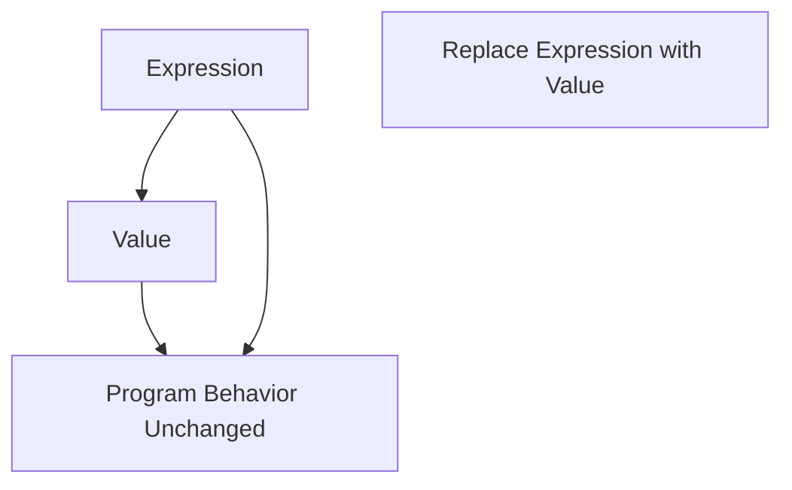

## 14.9 Ignoring Referential Transparency in Clojure

In the realm of functional programming, referential transparency is a cornerstone principle that significantly enhances code readability, maintainability, and testability. Ignoring this principle can lead to code that is difficult to reason about and prone to bugs. In this section, we will delve into the concept of referential transparency, its importance in Clojure, and best practices to ensure your code adheres to this principle.

### Introduction to Referential Transparency

Referential transparency refers to the property of expressions in a program that can be replaced with their corresponding values without altering the program's behavior. This concept is fundamental in functional programming, where functions are expected to be pure, meaning they consistently produce the same output for the same input and have no side effects.

#### Conceptual Diagram

To better understand referential transparency, consider the following diagram illustrating the concept:



In this diagram, an expression can be replaced by its value, and the program's behavior remains unchanged, demonstrating referential transparency.

### Importance of Referential Transparency

1. **Predictability:** Code that adheres to referential transparency is predictable, as functions behave consistently across different contexts.
2. **Simplicity:** Simplifies reasoning about code, as each function can be understood in isolation without considering external state.
3. **Testability:** Facilitates testing, as functions can be tested independently without requiring complex setup or teardown.
4. **Concurrency:** Enhances concurrency, as pure functions can be executed in parallel without concerns about shared state.

### Writing Pure Functions

A pure function is one that, given the same input, will always return the same output and does not cause any observable side effects. Here is a simple example of a pure function in Clojure:

```clojure
;; Pure function:
(defn add [a b]
  (+ a b))
```

This function is pure because it only depends on its input parameters and performs no side effects.

### Avoiding Side Effects

Side effects occur when a function interacts with the outside world, such as performing I/O operations or modifying global state. To maintain referential transparency, avoid side effects within your functions. Instead, isolate side effects at the boundaries of your system.

### Passing Dependencies as Parameters

Instead of accessing global state or services directly within functions, pass them as parameters. This approach not only maintains purity but also enhances flexibility and testability.

```clojure
;; Injecting dependency:
(defn fetch-data [http-client url]
  (http-client/get url))
```

By injecting the `http-client` dependency, the function remains pure and can be easily tested with different implementations of the client.

### Handling Time and Randomness

Time and randomness are inherently impure, as they produce different results on each invocation. To manage these aspects while maintaining referential transparency, pass them as arguments to your functions.

```clojure
;; Handling randomness:
(defn roll-dice [random-fn]
  (random-fn 1 6))
```

By passing a random function as an argument, you can control the randomness during testing.

### Testing Functions Independently

Referential transparency allows you to write reliable and straightforward tests. Since pure functions have no side effects, you can test them in isolation without complex setup.

```clojure
;; Test for the add function
(deftest test-add
  (is (= 5 (add 2 3))))
```

### Documenting Exceptions Clearly

In some cases, it may not be feasible to write a pure function. When this occurs, document the side effects clearly to inform other developers of the function's behavior.

### Advantages and Disadvantages

#### Advantages

- **Easier Debugging:** Pure functions simplify debugging, as you can focus on the function itself without worrying about external state.
- **Improved Reusability:** Functions that adhere to referential transparency are more reusable across different parts of the application.
- **Enhanced Composability:** Pure functions can be easily composed to build more complex operations.

#### Disadvantages

- **Initial Learning Curve:** Developers new to functional programming may find it challenging to adapt to the paradigm of pure functions.
- **Potential Overhead:** In some cases, maintaining purity may introduce additional complexity, such as passing dependencies explicitly.

### Best Practices

- **Embrace Immutability:** Use immutable data structures to prevent unintended state changes.
- **Leverage Clojure's Strengths:** Utilize Clojure's rich set of immutable data structures and functional programming constructs to write pure functions.
- **Isolate Side Effects:** Confine side effects to specific parts of your application, such as at the boundaries where your application interacts with external systems.

### Conclusion

Referential transparency is a powerful concept that, when embraced, can lead to more robust, maintainable, and testable code. By writing pure functions, avoiding side effects, and managing dependencies carefully, you can harness the full potential of Clojure's functional programming paradigm.

## Quiz Time!



### What is referential transparency?

- [x] An expression can be replaced with its value without changing the program's behavior.
- [ ] A function that always returns the same value regardless of input.
- [ ] A method of optimizing code for performance.
- [ ] A way to handle exceptions in functional programming.

> **Explanation:** Referential transparency means that an expression can be replaced with its value without changing the program's behavior, a key concept in functional programming.

### Why is referential transparency important?

- [x] It enhances code predictability and testability.
- [ ] It allows for faster execution of code.
- [ ] It reduces the need for documentation.
- [ ] It simplifies the user interface design.

> **Explanation:** Referential transparency enhances code predictability and testability by ensuring functions behave consistently and can be tested in isolation.

### Which of the following is a pure function?

- [x] `(defn add [a b] (+ a b))`
- [ ] `(defn print-message [msg] (println msg))`
- [ ] `(defn update-state [state] (swap! state inc))`
- [ ] `(defn read-file [path] (slurp path))`

> **Explanation:** The `add` function is pure because it only depends on its inputs and has no side effects.

### How can you handle randomness in a referentially transparent way?

- [x] Pass a random generator function as an argument.
- [ ] Use a global random seed.
- [ ] Generate random numbers inside the function.
- [ ] Avoid using randomness altogether.

> **Explanation:** By passing a random generator function as an argument, you can control randomness and maintain referential transparency.

### What should you do if a function cannot be pure?

- [x] Document its side effects clearly.
- [ ] Ignore the impurity and proceed.
- [ ] Rewrite the entire application to accommodate the function.
- [ ] Use global variables to manage state.

> **Explanation:** If a function cannot be pure, document its side effects clearly to inform other developers of its behavior.

### What is a common pitfall when ignoring referential transparency?

- [x] Code becomes harder to reason about and test.
- [ ] Code execution becomes slower.
- [ ] Code becomes more secure.
- [ ] Code becomes easier to write.

> **Explanation:** Ignoring referential transparency leads to code that is harder to reason about and test due to unpredictable behavior.

### How can dependencies be managed in pure functions?

- [x] Pass them as parameters to the function.
- [ ] Access them globally within the function.
- [ ] Hardcode them into the function.
- [ ] Use environment variables to manage them.

> **Explanation:** Passing dependencies as parameters maintains purity and enhances testability.

### Which of the following is NOT a benefit of referential transparency?

- [ ] Easier debugging
- [ ] Improved reusability
- [ ] Enhanced composability
- [x] Faster execution speed

> **Explanation:** While referential transparency offers many benefits, faster execution speed is not inherently one of them.

### What is a side effect in the context of functional programming?

- [x] Any interaction with the outside world, such as I/O operations or state mutation.
- [ ] A function that returns a value.
- [ ] A method of optimizing code.
- [ ] A way to handle exceptions.

> **Explanation:** A side effect is any interaction with the outside world, such as I/O operations or state mutation, which should be avoided in pure functions.

### True or False: Pure functions can be executed in parallel without concerns about shared state.

- [x] True
- [ ] False

> **Explanation:** True. Pure functions can be executed in parallel without concerns about shared state because they do not rely on or modify external state.


