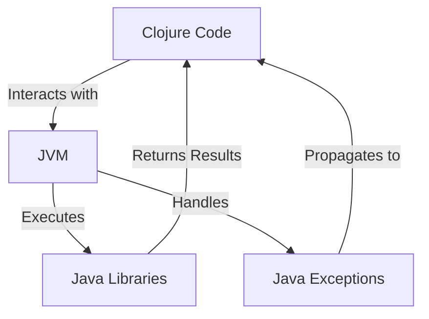

## 15.1. Interoperability with Java Libraries

Clojure's seamless interoperability with Java is one of its most powerful features, allowing developers to leverage the vast ecosystem of Java libraries. This capability enables Clojure applications to extend their functionality, enhance performance, and integrate with existing Java-based systems. In this section, we will explore how to effectively use Java libraries in Clojure, covering essential concepts, practical examples, and best practices.

### Understanding Clojure's Compatibility with the JVM

Clojure is a dynamic, functional programming language that runs on the Java Virtual Machine (JVM). This compatibility allows Clojure to interoperate with Java seamlessly, providing access to Java's extensive libraries and frameworks. The JVM serves as a bridge between Clojure and Java, enabling Clojure code to call Java methods, instantiate Java classes, and handle Java exceptions.

#### Key Benefits of JVM Compatibility

- **Access to Java Libraries**: Utilize a wide range of existing Java libraries for various functionalities, from data processing to web development.
- **Performance**: Leverage the JVM's performance optimizations and mature garbage collection mechanisms.
- **Integration**: Easily integrate Clojure applications with existing Java systems and infrastructure.

### Calling Java Methods and Using Java Classes

Clojure provides straightforward syntax for interacting with Java classes and methods. Let's explore how to call Java methods, instantiate classes, and work with Java objects in Clojure.

#### Instantiating Java Classes

To create an instance of a Java class in Clojure, use the `new` function or the `.` (dot) operator. Here's an example of creating a `StringBuilder` object:

```clojure
;; Using the new function
(def sb (new StringBuilder "Hello"))

;; Using the dot operator
(def sb (. StringBuilder "Hello"))
```

#### Calling Java Methods

You can call Java methods using the `.` (dot) operator. Here's how to append a string to the `StringBuilder` object:

```clojure
;; Append a string using the append method
(.append sb " World")

;; Convert to string using the toString method
(def result (.toString sb))
(println result) ;; Output: Hello World
```

#### Accessing Static Methods and Fields

Static methods and fields are accessed using the `/` (slash) operator. Here's an example of accessing the `Math` class's static methods:

```clojure
;; Call the static method Math/sqrt
(def sqrt-value (Math/sqrt 16))
(println sqrt-value) ;; Output: 4.0

;; Access the static field Math/PI
(def pi-value Math/PI)
(println pi-value) ;; Output: 3.141592653589793
```

### Handling Java Exceptions

Java exceptions can be caught and handled in Clojure using the `try`, `catch`, and `finally` constructs. Here's an example of handling a potential `NullPointerException`:

```clojure
(try
  ;; Attempt to call a method on a nil object
  (.toString nil)
  (catch NullPointerException e
    (println "Caught a NullPointerException"))
  (finally
    (println "Execution completed")))
```

### Type Conversions Between Clojure and Java

Clojure automatically handles many type conversions between Clojure and Java types. However, understanding these conversions can help avoid potential pitfalls.

#### Common Type Conversions

- **Clojure Collections to Java Collections**: Clojure's persistent collections can be converted to Java collections using the `into-array` or `vec` functions.
- **Java Collections to Clojure Collections**: Use the `seq` function to convert Java collections to Clojure sequences.

#### Example: Converting Between Collections

```clojure
;; Convert a Clojure vector to a Java array
(def java-array (into-array Integer [1 2 3 4]))

;; Convert a Java list to a Clojure sequence
(def java-list (java.util.ArrayList. [1 2 3 4]))
(def clojure-seq (seq java-list))
```

### Best Practices for Managing Dependencies

When integrating Java libraries into Clojure projects, managing dependencies effectively is crucial. Here are some best practices:

#### Use Dependency Management Tools

- **Leiningen**: A popular build automation tool for Clojure that simplifies dependency management.
- **deps.edn**: A configuration file used with the Clojure CLI tools for managing dependencies.

#### Specify Dependencies in Project Configuration

Include Java library dependencies in your project's configuration file. For example, in `project.clj` for Leiningen:

```clojure
(defproject my-clojure-project "0.1.0-SNAPSHOT"
  :dependencies [[org.clojure/clojure "1.10.3"]
                 [org.apache.commons/commons-lang3 "3.12.0"]])
```

### Encouraging the Use of Java Libraries

Java libraries can significantly extend the functionality of Clojure applications. Consider using Java libraries for:

- **Complex Algorithms**: Utilize well-tested Java libraries for complex algorithms and data structures.
- **Third-Party Integrations**: Leverage Java libraries for integrating with third-party services and APIs.
- **Performance Optimization**: Use Java libraries for performance-critical operations.

### Try It Yourself

Experiment with the following code examples to deepen your understanding of Java interoperability in Clojure:

1. **Modify the `StringBuilder` example** to include additional method calls, such as `reverse` or `insert`.
2. **Create a Clojure function** that accepts a Java `List` and returns a Clojure sequence.
3. **Handle a different Java exception** in a `try-catch` block, such as `ArrayIndexOutOfBoundsException`.

### Visualizing Clojure and Java Interoperability

Below is a diagram illustrating the interaction between Clojure and Java through the JVM:



**Diagram Description**: This flowchart visualizes how Clojure code interacts with Java libraries through the JVM, including exception handling and result propagation.

### References and Further Reading

- [Clojure Official Documentation](https://clojure.org/reference/java_interop)
- [Java Interoperability in Clojure](https://clojure.org/guides/java_interop)
- [Leiningen: Automate Clojure Projects](https://leiningen.org/)
- [Clojure CLI Tools and Deps.edn](https://clojure.org/guides/deps_and_cli)

### Knowledge Check

To reinforce your understanding, consider the following questions and exercises:

- **What are the benefits of Clojure's compatibility with the JVM?**
- **How do you call a static method from a Java class in Clojure?**
- **What is the purpose of the `try-catch` block in handling Java exceptions?**
- **Experiment with converting a Java `HashMap` to a Clojure map.**

### Embrace the Journey

Remember, mastering interoperability with Java libraries is just the beginning. As you continue exploring Clojure, you'll discover even more ways to enhance your applications by leveraging the power of Java. Keep experimenting, stay curious, and enjoy the journey!

## **Ready to Test Your Knowledge?**



### What is one of the key benefits of Clojure's compatibility with the JVM?

- [x] Access to Java libraries
- [ ] Easier syntax
- [ ] Faster compilation
- [ ] Built-in GUI support

> **Explanation:** Clojure's compatibility with the JVM allows developers to access a wide range of existing Java libraries, enhancing functionality and integration capabilities.

### How do you instantiate a Java class in Clojure?

- [x] Using the `new` function or the `.` operator
- [ ] Using the `create` function
- [ ] Using the `instantiate` keyword
- [ ] Using the `make` function

> **Explanation:** In Clojure, you can instantiate a Java class using the `new` function or the `.` (dot) operator.

### Which operator is used to call a static method in a Java class from Clojure?

- [x] `/` (slash) operator
- [ ] `.` (dot) operator
- [ ] `->` (threading) operator
- [ ] `:` (colon) operator

> **Explanation:** The `/` (slash) operator is used to call static methods and access static fields in Java classes from Clojure.

### How can you handle Java exceptions in Clojure?

- [x] Using `try`, `catch`, and `finally` constructs
- [ ] Using `if` and `else` statements
- [ ] Using `when` and `unless` macros
- [ ] Using `case` expressions

> **Explanation:** Java exceptions can be handled in Clojure using the `try`, `catch`, and `finally` constructs, similar to Java's exception handling mechanism.

### What function can convert a Java collection to a Clojure sequence?

- [x] `seq`
- [ ] `vec`
- [ ] `list`
- [ ] `array`

> **Explanation:** The `seq` function is used to convert Java collections into Clojure sequences, allowing for seamless interoperability.

### Which tool is commonly used for dependency management in Clojure projects?

- [x] Leiningen
- [ ] Maven
- [ ] Gradle
- [ ] Ant

> **Explanation:** Leiningen is a popular build automation tool for Clojure that simplifies dependency management and project configuration.

### What is a recommended practice when integrating Java libraries into Clojure projects?

- [x] Specify dependencies in the project's configuration file
- [ ] Avoid using Java libraries
- [ ] Manually download and include Java JAR files
- [ ] Use only open-source Java libraries

> **Explanation:** It is recommended to specify Java library dependencies in the project's configuration file, such as `project.clj` for Leiningen, to manage them effectively.

### What is the purpose of the `finally` block in exception handling?

- [x] To execute code after the `try` block, regardless of whether an exception occurred
- [ ] To catch exceptions
- [ ] To terminate the program
- [ ] To log errors

> **Explanation:** The `finally` block is used to execute code after the `try` block, regardless of whether an exception was thrown, ensuring that cleanup or finalization code runs.

### How can you convert a Clojure vector to a Java array?

- [x] Using the `into-array` function
- [ ] Using the `to-array` function
- [ ] Using the `array` function
- [ ] Using the `convert` function

> **Explanation:** The `into-array` function is used to convert a Clojure vector into a Java array, facilitating interoperability between the two languages.

### True or False: Clojure can only interact with Java libraries that are open-source.

- [ ] True
- [x] False

> **Explanation:** Clojure can interact with any Java library, regardless of whether it is open-source or proprietary, as long as it is compatible with the JVM.


