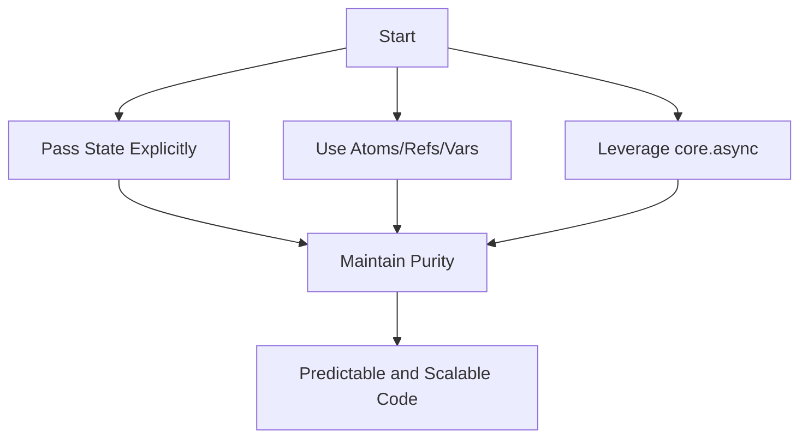

## 15.1 Thread-Specific Storage in Clojure

### Introduction

Thread-Specific Storage (TLS) is a programming pattern that allows data to be stored uniquely for each thread. While this concept can be useful in certain contexts, it is generally discouraged in Clojure due to the language's emphasis on immutability and functional programming. In this article, we will explore why TLS is considered obsolete in Clojure, discuss the issues it can introduce, and present modern alternatives that align with Clojure's design philosophy.

### Understanding Thread-Specific Storage

Thread-Specific Storage provides a mechanism to store data that is unique to a particular thread. This is typically achieved using constructs like Java's `ThreadLocal`, which allows each thread to have its own instance of a variable.

#### Example of Java ThreadLocal

```java
ThreadLocal<Integer> threadLocalValue = ThreadLocal.withInitial(() -> 1);

threadLocalValue.set(42);
System.out.println(threadLocalValue.get());
```

### Why Avoid Thread-Specific Storage in Clojure?

Clojure is a functional programming language that prioritizes immutability, purity, and referential transparency. Using TLS in Clojure can lead to several issues:

- **Loss of Purity:** TLS introduces hidden state, which can make functions impure and harder to reason about.
- **Referential Transparency Violation:** Functions relying on TLS may produce different results for the same inputs, violating referential transparency.
- **Concurrency Challenges:** Managing thread-local state can complicate concurrency, leading to potential bugs and race conditions.

### Modern Alternatives to Thread-Specific Storage

Clojure offers several modern alternatives for managing state that align with its functional programming principles:

#### 1. Passing State Explicitly

One of the simplest and most effective ways to manage state in Clojure is to pass it explicitly through function parameters. This approach maintains purity and makes the flow of data clear and predictable.

```clojure
(defn process-data [state data]
  ;; Use state here
  (assoc state :processed-data (map inc data)))

(let [initial-state {:processed-data []}
      data [1 2 3]]
  (process-data initial-state data))
```

#### 2. Using Atoms, Refs, and Vars

Clojure provides several concurrency primitives that can be used to manage state safely:

- **Atoms:** For uncoordinated, synchronous state changes.

  ```clojure
  (def global-state (atom {}))
  (swap! global-state assoc :key "value")
  ```

- **Refs:** For coordinated, synchronous state changes within transactions.

  ```clojure
  (def shared-state (ref {}))
  (dosync
    (alter shared-state assoc :key "value"))
  ```

- **Dynamic Vars with `binding`:** For thread-local-like behavior in controlled scopes.

  ```clojure
  (def ^:dynamic *context* nil)

  (defn do-something []
    (println "Context:" *context*))

  (binding [*context* {:user "Alice"}]
    (do-something))
  ```

#### 3. Leveraging `core.async`

`core.async` provides channels for managing state in concurrent code, ensuring safe communication between threads.

```clojure
(require '[clojure.core.async :as async])

(defn process-channel [ch]
  (async/go-loop []
    (when-let [value (async/<! ch)]
      (println "Processing:" value)
      (recur))))

(let [ch (async/chan)]
  (process-channel ch)
  (async/>!! ch "data"))
```

### Embracing Immutability and Pure Functions

By structuring code to avoid the need for thread-specific storage, developers can leverage Clojure's strengths in immutability and pure functions. This approach leads to more predictable, maintainable, and scalable code.

### Visualizing Alternatives

To better understand the transition from TLS to modern alternatives, consider the following diagram illustrating the flow of state management in Clojure:



### Advantages and Disadvantages

#### Advantages of Modern Alternatives

- **Purity and Transparency:** Functions remain pure, and data flow is explicit.
- **Concurrency Safety:** Concurrency primitives ensure safe state management.
- **Maintainability:** Code is easier to understand and maintain.

#### Disadvantages of Thread-Specific Storage

- **Hidden State:** Leads to impure functions and unpredictable behavior.
- **Concurrency Issues:** Complicates thread management and introduces potential bugs.
- **Obsolescence:** Does not align with modern functional programming practices.

### Best Practices

- **Avoid Java ThreadLocals:** Refrain from using `ThreadLocal` in Clojure.
- **Embrace Functional Principles:** Use immutable data structures and pure functions.
- **Utilize Clojure's Primitives:** Leverage atoms, refs, and vars for state management.
- **Adopt `core.async`:** Use channels for concurrent state management.

### Conclusion

Thread-Specific Storage is an obsolete pattern in Clojure, primarily due to its incompatibility with the language's functional programming paradigm. By adopting modern alternatives such as explicit state passing, concurrency primitives, and `core.async`, developers can write more robust, maintainable, and scalable Clojure applications.

## Quiz Time!



### What is Thread-Specific Storage (TLS)?

- [x] A mechanism to store data unique to a thread.
- [ ] A way to store data globally across all threads.
- [ ] A method to store data in a database.
- [ ] A technique for optimizing memory usage.

> **Explanation:** TLS allows data to be stored uniquely for each thread, providing thread-specific storage.

### Why is TLS discouraged in Clojure?

- [x] It violates immutability and functional programming principles.
- [ ] It is too complex to implement.
- [ ] It is not supported by the Clojure language.
- [ ] It is slower than other methods.

> **Explanation:** TLS introduces hidden state, which conflicts with Clojure's emphasis on immutability and purity.

### Which Clojure primitive is used for uncoordinated, synchronous state changes?

- [x] Atom
- [ ] Ref
- [ ] Var
- [ ] Channel

> **Explanation:** Atoms are used for uncoordinated, synchronous state changes in Clojure.

### How can you achieve thread-local-like behavior in Clojure?

- [x] Using dynamic vars with `binding`.
- [ ] Using Java's `ThreadLocal`.
- [ ] Using global variables.
- [ ] Using static variables.

> **Explanation:** Dynamic vars with `binding` provide controlled, thread-local-like behavior in Clojure.

### What is a benefit of passing state explicitly in functions?

- [x] It maintains purity and makes data flow explicit.
- [ ] It increases code complexity.
- [ ] It requires more memory.
- [ ] It slows down execution.

> **Explanation:** Passing state explicitly maintains function purity and makes data flow clear and predictable.

### Which Clojure library provides channels for managing state in concurrent code?

- [x] core.async
- [ ] clojure.java.io
- [ ] clojure.set
- [ ] clojure.string

> **Explanation:** `core.async` provides channels for managing state in concurrent code.

### What is a disadvantage of using TLS in Clojure?

- [x] It introduces hidden state and complicates concurrency.
- [ ] It is too fast for most applications.
- [ ] It is a new feature in Clojure.
- [ ] It simplifies state management.

> **Explanation:** TLS introduces hidden state, making concurrency management more complex and error-prone.

### Which of the following is NOT a Clojure concurrency primitive?

- [x] ThreadLocal
- [ ] Atom
- [ ] Ref
- [ ] Var

> **Explanation:** `ThreadLocal` is a Java construct, not a Clojure concurrency primitive.

### What does `core.async` primarily provide?

- [x] Channels for asynchronous communication.
- [ ] Functions for string manipulation.
- [ ] Tools for database access.
- [ ] Methods for file I/O.

> **Explanation:** `core.async` provides channels for asynchronous communication between threads.

### True or False: Using Java's `ThreadLocal` is recommended in Clojure.

- [ ] True
- [x] False

> **Explanation:** Using Java's `ThreadLocal` is discouraged in Clojure due to its conflict with functional programming principles.


