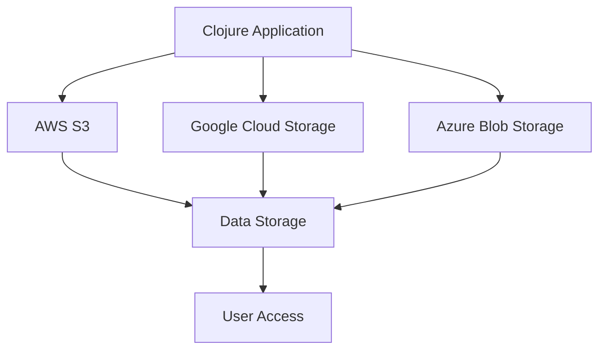

## 15.10. Integrating with Cloud Services (AWS, GCP, Azure)

In today's rapidly evolving technological landscape, cloud services have become indispensable for modern software development. They offer scalable, reliable, and cost-effective solutions for storage, computing, and a myriad of other infrastructure needs. In this section, we will explore how to integrate Clojure applications with major cloud service providers: Amazon Web Services (AWS), Google Cloud Platform (GCP), and Microsoft Azure. We will delve into the SDKs and libraries available for these platforms, demonstrate how to use popular services such as AWS S3, Google Cloud Storage, and Azure Blobs, and discuss best practices for authentication, configuration management, security, and cost optimization.

### Introduction to Cloud Integration

Cloud integration involves connecting various cloud-based systems and services to enable seamless data exchange and process automation. For Clojure developers, this means leveraging the power of cloud services to enhance application capabilities without the need for extensive infrastructure management. Let's begin by exploring the tools and libraries that make this integration possible.

### SDKs and Libraries for Cloud Integration

#### AWS Integration with Amazonica

Amazonica is a comprehensive Clojure library that provides idiomatic access to AWS services. It abstracts the AWS Java SDK, allowing developers to interact with AWS services using Clojure's functional programming paradigms.

- **Installation**: Add the following dependency to your `project.clj` or `deps.edn` file:

  ```clojure
  [amazonica "0.3.153"]
  ```

- **Example Usage**: Interacting with AWS S3

  ```clojure
  (ns myapp.aws
    (:require [amazonica.aws.s3 :as s3]))

  ;; Configure AWS credentials
  (s3/defcredential "your-access-key" "your-secret-key" "us-west-2")

  ;; List all buckets
  (defn list-buckets []
    (s3/list-buckets))

  ;; Upload a file to S3
  (defn upload-file [bucket-name file-path]
    (s3/put-object :bucket-name bucket-name
                   :key (clojure.java.io/file file-path)
                   :file file-path))
  ```

#### GCP Integration with Google Cloud Java Client Libraries

Google Cloud provides Java client libraries that can be used in Clojure applications to interact with GCP services. These libraries offer a robust way to access Google Cloud Storage, BigQuery, and other services.

- **Installation**: Add the necessary dependencies for the services you wish to use. For example, for Google Cloud Storage:

  ```clojure
  [com.google.cloud/google-cloud-storage "2.1.0"]
  ```

- **Example Usage**: Interacting with Google Cloud Storage

  ```clojure
  (ns myapp.gcp
    (:import [com.google.cloud.storage StorageOptions BlobId BlobInfo]))

  ;; Initialize the storage client
  (def storage (-> (StorageOptions/getDefaultInstance)
                   (.getService)))

  ;; Upload a file to Google Cloud Storage
  (defn upload-file [bucket-name file-path]
    (let [blob-id (BlobId/of bucket-name (clojure.java.io/file file-path))
          blob-info (BlobInfo/newBuilder blob-id)
          file-bytes (java.nio.file.Files/readAllBytes (java.nio.file.Paths/get file-path))]
      (.create storage blob-info file-bytes)))
  ```

#### Azure Integration with Azure Java SDK

The Azure Java SDK provides comprehensive support for interacting with Azure services. It allows Clojure applications to leverage Azure's cloud capabilities effectively.

- **Installation**: Add the necessary dependencies for the services you wish to use. For example, for Azure Blob Storage:

  ```clojure
  [com.azure/azure-storage-blob "12.10.0"]
  ```

- **Example Usage**: Interacting with Azure Blob Storage

  ```clojure
  (ns myapp.azure
    (:import [com.azure.storage.blob BlobServiceClientBuilder]))

  ;; Initialize the blob service client
  (def blob-service-client (-> (BlobServiceClientBuilder.)
                               (.connectionString "your-connection-string")
                               (.buildClient)))

  ;; Upload a file to Azure Blob Storage
  (defn upload-file [container-name file-path]
    (let [blob-client (.getBlobClient (.getBlobContainerClient blob-service-client container-name)
                                      (clojure.java.io/file file-path))]
      (.uploadFromFile blob-client file-path)))
  ```

### Authentication and Configuration Management

Authentication and configuration management are critical aspects of integrating with cloud services. Proper handling of credentials and configuration settings ensures secure and efficient access to cloud resources.

#### AWS Authentication

AWS provides several methods for authentication, including access keys, IAM roles, and AWS Single Sign-On (SSO). For local development, access keys are commonly used, while IAM roles are preferred for applications running on AWS infrastructure.

- **Best Practice**: Use IAM roles for applications running on AWS to avoid hardcoding credentials.

#### GCP Authentication

GCP uses service accounts for authentication. Service account keys can be downloaded and used to authenticate API requests.

- **Best Practice**: Store service account keys securely and use environment variables to load them in your application.

#### Azure Authentication

Azure supports various authentication methods, including service principals and managed identities. Service principals are commonly used for application authentication.

- **Best Practice**: Use Azure Key Vault to manage and access secrets securely.

### Best Practices for Security and Cost Optimization

Integrating with cloud services requires careful consideration of security and cost management. Here are some best practices to follow:

- **Security**:
  - Use environment variables or secret management tools to store sensitive information.
  - Implement least privilege access by granting only necessary permissions to cloud resources.
  - Regularly rotate credentials and monitor access logs for suspicious activity.

- **Cost Optimization**:
  - Use cost management tools provided by cloud providers to monitor and optimize resource usage.
  - Implement auto-scaling to adjust resources based on demand.
  - Take advantage of reserved instances or savings plans for predictable workloads.

### Benefits of Cloud Services for Scalability

Cloud services offer unparalleled scalability, allowing applications to handle varying loads efficiently. By leveraging cloud infrastructure, Clojure applications can scale horizontally and vertically to meet user demands.

- **Horizontal Scaling**: Add more instances of your application to distribute the load.
- **Vertical Scaling**: Increase the resources (CPU, memory) of existing instances to handle more load.

### Visualizing Cloud Integration Architecture

To better understand how Clojure applications integrate with cloud services, let's visualize a typical architecture using a flowchart.



**Diagram Description**: This flowchart illustrates a Clojure application interacting with AWS S3, Google Cloud Storage, and Azure Blob Storage for data storage. The data is then accessed by users through the application.

### Try It Yourself

To deepen your understanding of cloud integration with Clojure, try modifying the provided code examples to perform additional operations, such as listing files in a storage bucket or deleting a file. Experiment with different authentication methods and explore the documentation of the respective SDKs for more advanced features.

### External Links for Further Reading

- [Amazonica (AWS)](https://github.com/mcohen01/amazonica)
- [Google Cloud Java Client Libraries](https://cloud.google.com/java/docs/reference/libraries)
- [Azure Java SDK](https://azure.microsoft.com/en-us/develop/java/)

### Knowledge Check

Before moving on, let's test your understanding of integrating Clojure applications with cloud services. Answer the following questions to reinforce your learning.

## **Ready to Test Your Knowledge?**



### Which library is commonly used for AWS integration in Clojure?

- [x] Amazonica
- [ ] AWS SDK for Java
- [ ] Google Cloud Java Client Libraries
- [ ] Azure Java SDK

> **Explanation:** Amazonica is a Clojure library that provides idiomatic access to AWS services.

### What is the recommended authentication method for applications running on AWS infrastructure?

- [x] IAM roles
- [ ] Access keys
- [ ] Service account keys
- [ ] Managed identities

> **Explanation:** IAM roles are preferred for applications running on AWS infrastructure to avoid hardcoding credentials.

### How can you securely store service account keys for GCP?

- [x] Use environment variables
- [ ] Hardcode them in the application
- [ ] Store them in a public repository
- [ ] Use plain text files

> **Explanation:** Using environment variables is a secure way to store and access service account keys.

### What is a key benefit of using cloud services for scalability?

- [x] Horizontal and vertical scaling
- [ ] Fixed resource allocation
- [ ] Manual resource management
- [ ] Limited scalability

> **Explanation:** Cloud services offer both horizontal and vertical scaling, allowing applications to handle varying loads efficiently.

### Which Azure service is recommended for managing secrets securely?

- [x] Azure Key Vault
- [ ] Azure Blob Storage
- [ ] Azure Functions
- [ ] Azure App Service

> **Explanation:** Azure Key Vault is designed for managing and accessing secrets securely.

### What is a best practice for cost optimization in cloud services?

- [x] Implement auto-scaling
- [ ] Use fixed resource allocation
- [ ] Avoid monitoring resource usage
- [ ] Ignore cost management tools

> **Explanation:** Implementing auto-scaling helps optimize costs by adjusting resources based on demand.

### Which cloud provider uses service accounts for authentication?

- [x] Google Cloud Platform (GCP)
- [ ] Amazon Web Services (AWS)
- [ ] Microsoft Azure
- [ ] IBM Cloud

> **Explanation:** Google Cloud Platform uses service accounts for authentication.

### What is the purpose of the flowchart in the article?

- [x] To visualize cloud integration architecture
- [ ] To illustrate code execution flow
- [ ] To show user interface design
- [ ] To depict database schema

> **Explanation:** The flowchart visualizes how a Clojure application integrates with cloud services for data storage.

### Which method is NOT recommended for storing sensitive information?

- [x] Hardcoding in the application
- [ ] Using environment variables
- [ ] Secret management tools
- [ ] Azure Key Vault

> **Explanation:** Hardcoding sensitive information in the application is not recommended due to security risks.

### True or False: Cloud services offer limited scalability.

- [ ] True
- [x] False

> **Explanation:** Cloud services offer unparalleled scalability, allowing applications to handle varying loads efficiently.



Remember, integrating with cloud services is a powerful way to enhance your Clojure applications, providing scalability, reliability, and cost-effectiveness. Keep experimenting, stay curious, and enjoy the journey of cloud integration!
