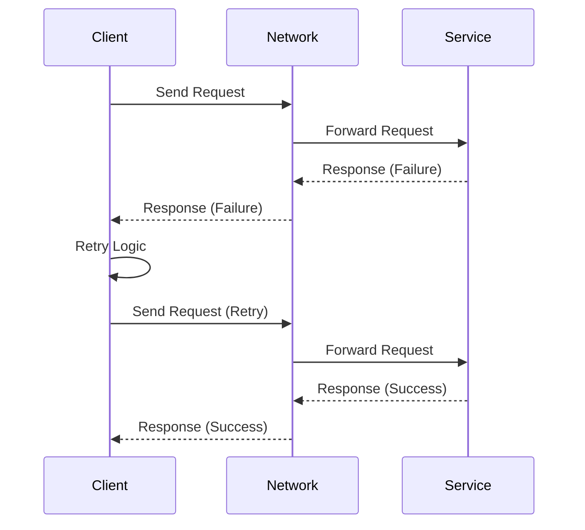

## 15.11. Handling Network Errors and Retries

In the world of distributed systems, network errors are inevitable. Whether it's a temporary glitch, a server overload, or a more persistent issue, handling these errors gracefully is crucial for building robust applications. In this section, we will explore techniques for managing network unreliability in Clojure, focusing on implementing retries, backoff strategies, circuit breaking, and the importance of idempotency. We'll also discuss the role of monitoring and logging in detecting and resolving network issues.

### Understanding Common Network Errors

Before diving into solutions, it's important to understand the types of network errors you might encounter:

- **Transient Failures**: These are temporary issues that often resolve themselves, such as a brief loss of connectivity or a server being momentarily overloaded.
- **Timeouts**: Occur when a request takes too long to complete, often due to network congestion or a slow server response.
- **Connection Refusals**: Happen when a server is not accepting connections, possibly due to being down or overloaded.
- **DNS Failures**: Result from issues in resolving domain names to IP addresses, which can be due to DNS server problems or misconfigurations.

### Implementing Retry Logic

Retrying failed requests is a common strategy for handling transient network errors. However, naive retries can lead to additional problems, such as overwhelming a struggling server. To implement effective retry logic, consider the following strategies:

#### Basic Retry Logic

A simple retry mechanism involves attempting a request multiple times before giving up. Here's a basic example in Clojure:

```clojure
(defn fetch-data [url]
  ;; Simulate a network request
  (try
    (let [response (http/get url)]
      (if (= 200 (:status response))
        (:body response)
        (throw (Exception. "Failed to fetch data"))))
    (catch Exception e
      (println "Error fetching data:" (.getMessage e))
      nil)))

(defn retry-fetch [url retries]
  (loop [attempt 1]
    (if (<= attempt retries)
      (let [result (fetch-data url)]
        (if result
          result
          (do
            (println "Retrying..." attempt)
            (recur (inc attempt)))))
      (println "Failed after" retries "attempts"))))

;; Usage
(retry-fetch "http://example.com" 3)
```

#### Exponential Backoff

Exponential backoff is a strategy where the delay between retries increases exponentially. This helps to reduce the load on the server and increases the chances of success. Here's how you can implement it:

```clojure
(defn exponential-backoff [base attempt]
  (* base (Math/pow 2 (dec attempt))))

(defn retry-fetch-with-backoff [url retries base-delay]
  (loop [attempt 1]
    (if (<= attempt retries)
      (let [result (fetch-data url)]
        (if result
          result
          (do
            (let [delay (exponential-backoff base-delay attempt)]
              (println "Retrying in" delay "ms...")
              (Thread/sleep delay)
              (recur (inc attempt))))))
      (println "Failed after" retries "attempts"))))

;; Usage
(retry-fetch-with-backoff "http://example.com" 3 1000)
```

### Circuit Breaking

Circuit breaking is a pattern used to prevent a system from repeatedly trying to execute an operation that's likely to fail. It acts as a fail-fast mechanism, allowing the system to recover more quickly and reducing the load on failing services.

#### Circuit Breaker Pattern

A circuit breaker can be in one of three states: **Closed**, **Open**, or **Half-Open**. When closed, requests are allowed through. If failures reach a certain threshold, the circuit breaker opens, blocking further requests. After a timeout, it transitions to half-open, allowing a limited number of test requests to determine if the issue has been resolved.

Here's a simple implementation of a circuit breaker in Clojure:

```clojure
(defn circuit-breaker [operation threshold timeout]
  (let [failure-count (atom 0)
        state (atom :closed)
        last-failure-time (atom nil)]
    (fn []
      (cond
        (= @state :open)
        (do
          (println "Circuit is open, skipping operation")
          nil)

        (= @state :half-open)
        (do
          (println "Circuit is half-open, testing operation")
          (try
            (let [result (operation)]
              (reset! failure-count 0)
              (reset! state :closed)
              result)
            (catch Exception e
              (swap! failure-count inc)
              (if (>= @failure-count threshold)
                (reset! state :open))
              nil)))

        :else
        (do
          (try
            (let [result (operation)]
              (reset! failure-count 0)
              result)
            (catch Exception e
              (swap! failure-count inc)
              (reset! last-failure-time (System/currentTimeMillis))
              (if (>= @failure-count threshold)
                (do
                  (reset! state :open)
                  (println "Circuit opened due to repeated failures")))
              nil)))))))

;; Usage
(defn unreliable-operation []
  (if (< (rand) 0.5)
    (throw (Exception. "Random failure"))
    "Success"))

(def breaker (circuit-breaker unreliable-operation 3 5000))

(dotimes [_ 10]
  (println "Operation result:" (breaker))
  (Thread/sleep 1000))
```

### Importance of Idempotency

Idempotency is a property of operations where performing the same operation multiple times has the same effect as performing it once. This is crucial for retry mechanisms, as it ensures that retries do not cause unintended side effects.

#### Ensuring Idempotency

To ensure idempotency, design your operations such that they can be safely repeated. For example, use unique identifiers for operations, and check if an operation has already been completed before executing it again.

### Monitoring and Logging

Effective monitoring and logging are essential for detecting and diagnosing network issues. They provide visibility into the system's behavior and help identify patterns that may indicate underlying problems.

#### Implementing Monitoring and Logging

Use libraries like [Timbre](https://github.com/ptaoussanis/timbre) for logging and [Metrics-Clojure](https://github.com/metrics-clojure/metrics-clojure) for monitoring. Here's an example of setting up basic logging:

```clojure
(require '[taoensso.timbre :as timbre])

(timbre/set-config! {:level :info})

(defn log-network-error [error]
  (timbre/error "Network error occurred:" error))

(defn monitored-fetch [url]
  (try
    (fetch-data url)
    (catch Exception e
      (log-network-error (.getMessage e))
      nil)))

;; Usage
(monitored-fetch "http://example.com")
```

### Libraries and Tools

Several libraries can help implement these patterns in Clojure:

- **[Retry](https://github.com/clj-commons/retry)**: A library for retrying operations with configurable backoff strategies.
- **[Circuit Breaker](https://github.com/ptaoussanis/circuit-breaker)**: A library for implementing circuit breakers in Clojure.
- **[Core.Async](https://clojure.github.io/core.async/)**: Useful for handling asynchronous operations and timeouts.

### Visualizing Network Error Handling

To better understand the flow of handling network errors and retries, let's visualize the process using a sequence diagram:



### Key Takeaways

- **Understand Network Errors**: Recognize the types of network errors and their causes.
- **Implement Retries Wisely**: Use retry logic with backoff strategies to handle transient failures.
- **Use Circuit Breakers**: Prevent overwhelming failing services by implementing circuit breakers.
- **Ensure Idempotency**: Design operations to be idempotent to safely handle retries.
- **Monitor and Log**: Implement monitoring and logging to detect and diagnose network issues.

### Try It Yourself

Experiment with the provided code examples by modifying the retry logic, backoff strategies, and circuit breaker thresholds. Observe how these changes affect the system's behavior under different network conditions.

### References and Further Reading

- [Clojure Retry Library](https://github.com/clj-commons/retry)
- [Circuit Breaker Pattern](https://martinfowler.com/bliki/CircuitBreaker.html)
- [Timbre Logging Library](https://github.com/ptaoussanis/timbre)
- [Metrics-Clojure](https://github.com/metrics-clojure/metrics-clojure)

## **Ready to Test Your Knowledge?**



### What is a common cause of transient network failures?

- [x] Temporary server overload
- [ ] Permanent server shutdown
- [ ] Incorrect URL
- [ ] Hardware failure

> **Explanation:** Transient network failures are often caused by temporary issues like server overloads, which typically resolve themselves.

### How does exponential backoff help in retry logic?

- [x] It increases the delay between retries exponentially.
- [ ] It decreases the delay between retries exponentially.
- [ ] It keeps the delay constant between retries.
- [ ] It retries immediately without delay.

> **Explanation:** Exponential backoff increases the delay between retries exponentially, reducing the load on the server and increasing the chances of success.

### What is the purpose of a circuit breaker in network error handling?

- [x] To prevent repeated execution of likely-to-fail operations
- [ ] To increase the number of retries
- [ ] To decrease the delay between retries
- [ ] To ensure idempotency

> **Explanation:** A circuit breaker prevents repeated execution of operations that are likely to fail, acting as a fail-fast mechanism.

### Why is idempotency important in network operations?

- [x] It ensures that retries do not cause unintended side effects.
- [ ] It increases the speed of network operations.
- [ ] It reduces the number of retries needed.
- [ ] It prevents network errors.

> **Explanation:** Idempotency ensures that performing the same operation multiple times has the same effect as performing it once, which is crucial for safe retries.

### Which library is useful for implementing retries with backoff strategies in Clojure?

- [x] Retry
- [ ] Timbre
- [ ] Core.Async
- [ ] Metrics-Clojure

> **Explanation:** The Retry library in Clojure is specifically designed for implementing retries with configurable backoff strategies.

### What is the role of monitoring in handling network errors?

- [x] To detect and diagnose network issues
- [ ] To increase the number of retries
- [ ] To decrease the delay between retries
- [ ] To ensure idempotency

> **Explanation:** Monitoring provides visibility into the system's behavior and helps identify patterns that may indicate underlying network issues.

### How can you ensure idempotency in network operations?

- [x] Use unique identifiers for operations and check if they have been completed.
- [ ] Increase the number of retries.
- [ ] Decrease the delay between retries.
- [ ] Use circuit breakers.

> **Explanation:** Ensuring idempotency involves designing operations such that they can be safely repeated, often by using unique identifiers and checking for completion.

### What is a potential downside of naive retry logic?

- [x] It can overwhelm a struggling server.
- [ ] It reduces the chances of success.
- [ ] It increases the delay between retries.
- [ ] It ensures idempotency.

> **Explanation:** Naive retry logic can overwhelm a struggling server by repeatedly sending requests without considering the server's state.

### Which state is not part of a circuit breaker's lifecycle?

- [x] Idle
- [ ] Closed
- [ ] Open
- [ ] Half-Open

> **Explanation:** The circuit breaker lifecycle includes Closed, Open, and Half-Open states, but not Idle.

### True or False: Logging is unnecessary for handling network errors.

- [ ] True
- [x] False

> **Explanation:** Logging is essential for handling network errors as it provides insights into the system's behavior and helps diagnose issues.


